Small RNA Seq - Practical 2
================
Anton Enright & Jack Monahan
'22 June, 2018'

-   [Differential Expression of smallRNA counts with DESeq2](#differential-expression-of-smallrna-counts-with-deseq2)
-   [Experiment Setup](#experiment-setup)
    -   [Preparation](#preparation)
-   [Mouse Analysis](#mouse-analysis)
    -   [Count Loading](#count-loading)
    -   [Count Preparation & Normalisation](#count-preparation-normalisation)
    -   [Post Normalisation QC](#post-normalisation-qc)
    -   [Initial Biological Analysis of the data](#initial-biological-analysis-of-the-data)
    -   [Statistical Analysis](#statistical-analysis)
    -   [Scatter Plot](#scatter-plot)
    -   [Result output to text file](#result-output-to-text-file)

Differential Expression of smallRNA counts with DESeq2
======================================================

First we should change directory to where the data is

``` r
setwd("~/Desktop/Course_Materials/smallrna")
```

Experiment Setup
================

All data were pre-processed using *minion* to identify and check adapters, *reaper* to trim adapter sequences followed by *tally* to deduplicate reads while maintaining depth information. Subsequent to this all reads passed through the *ChimiRa* pipeline against all miRBase (Release 22) precursor sequences for Mouse. Reads were summed across paired end sequences for the same read pair. Finally reads are loaded into R for final analysis.

This is the sample description file used for the analyses below.

| **Name** | **File**           | **Barcodes** | **3p\_ad**       |
|----------|--------------------|--------------|------------------|
| wt1      | A638S1.R1.fastq.gz | no\_barcode  | AGATCGGAAGAGCACA |
| wt2      | A638S2.R1.fastq.gz | no\_barcode  | AGATCGGAAGAGCACA |
| wt3      | A638S3.R1.fastq.gz | no\_barcode  | AGATCGGAAGAGCACA |
| mt1      | A638S4.R1.fastq.gz | no\_barcode  | AGATCGGAAGAGCACA |
| mt2      | A638S5.R1.fastq.gz | no\_barcode  | AGATCGGAAGAGCACA |
| mt3      | A638S6.R1.fastq.gz | no\_barcode  | AGATCGGAAGAGCACA |

Preparation
-----------

We first load the R/BioConductor libraries that we need.

``` r
library(RColorBrewer)
library(gplots)
library(DESeq2)
library(reshape2)
library(ggplot2)
hmcol = colorRampPalette(brewer.pal(9, "GnBu"))(100)
spectral <- colorRampPalette(rev(brewer.pal(11, "Spectral")), space="Lab")(100)
```

Mouse Analysis
==============

Count Loading
-------------

We can now load all the count data

``` r
mircounts <- read.table("mircounts.txt",header=TRUE,row.names=1)
mircounts=mircounts[-nrow(mircounts),]
```

As well as the pdata, which contains information on each sample.

``` r
pdata <- read.table("pdata.txt",header=TRUE,row.names=1)
colnames(mircounts)=rownames(pdata)
conds=as.factor(as.character(pdata$genotype))
```

Count Preparation & Normalisation
---------------------------------

We are now ready to create a DESeq object from the counts table.

``` r
#Lets Load the Counts First
coldata = as.data.frame(t(t(conds)))
rownames(coldata)=colnames(mircounts)
colnames(coldata)='treatment'
dds <- DESeqDataSetFromMatrix(countData = mircounts, colData = coldata, design = ~ treatment)
```

We are ready to normalise the data, but first we should look at the number of sequenced reads per sample. There are some stark differences across the samples.

``` r
cond_colours = c("#E41A1C","#377EB8")[as.factor(conds)]
names(cond_colours)=conds

group_colours = brewer.pal(length(rownames(pdata)),"Accent")[as.factor(rownames(pdata))]
names(group_colours)=rownames(pdata)

barplot(apply(mircounts,2,sum), las=2,col=cond_colours,main="Pre Normalised Counts",cex.names=0.4)
legend("topright",levels((conds)),cex=0.6,fill=cond_colours[levels(conds)])
```

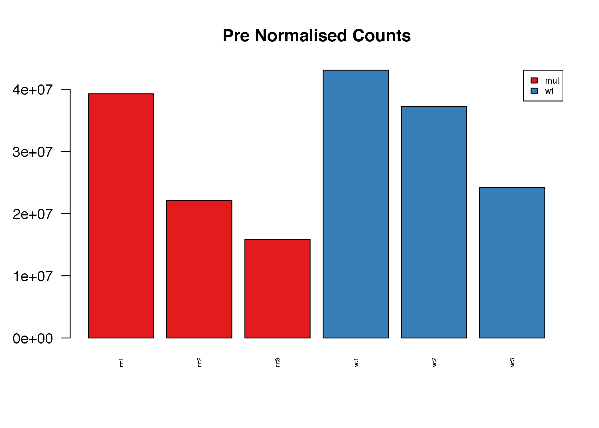

We will also estimate the negative binomial dispersion of the data.

``` r
dds <- estimateSizeFactors(dds)
dds <- estimateDispersions(dds)
```

               ## gene-wise dispersion estimates

               ## mean-dispersion relationship

               ## final dispersion estimates

``` r
plotDispEsts(dds)
```

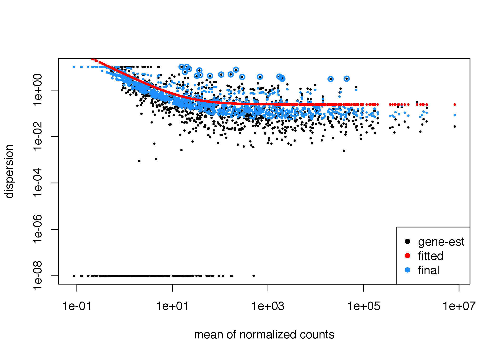

Post Normalisation QC
---------------------

Now we can normalise and plot the counts again. The data look much improved.

``` r
normcounts <- counts(dds, normalized=TRUE)
rawcounts=counts(dds,normalized=FALSE)
log2counts=log2(normcounts+1)


barplot(apply(normcounts,2,sum), las=2,col=cond_colours,main="Post-Normalised Counts",cex.names=0.4)
legend("topright",levels((conds)),cex=0.6,fill=cond_colours[levels(conds)])
```

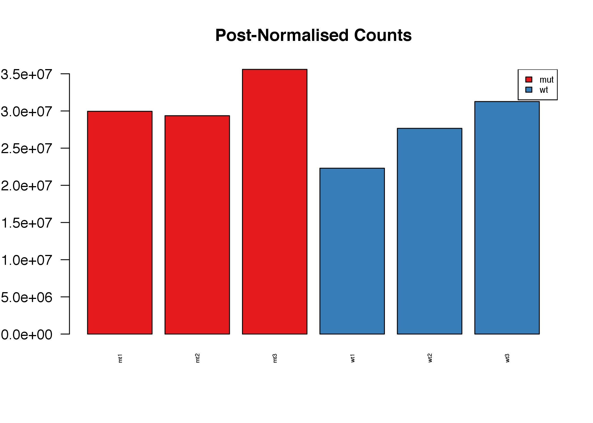

We will apply the Variance Stabilising Transformation (VST) it's better than log2 for counts.

``` r
vsd <- varianceStabilizingTransformation(dds)
vstcounts <- assay(vsd)
vstcounts <- vstcounts[order(apply(vstcounts,1,sum),decreasing =TRUE),]
```

As an additional QC step we can calculate the sample-to-sample Pearson correlations and plot them in a heatmap.

``` r
heatmap.2(cor(rawcounts),trace="none",col=hmcol,main="Sample to Sample Correlation (Raw Counts)",cexRow=0.5,cexCol=0.5,RowSideColors=cond_colours, margins=c(9,7))
```

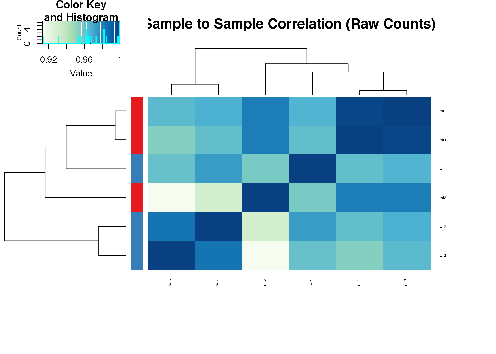

``` r
heatmap.2(cor(vstcounts),trace="none",col=hmcol,main="Sample to Sample Correlation (VST)",cexRow=0.5,cexCol=0.5,RowSideColors=cond_colours,margins=c(9,7))
```

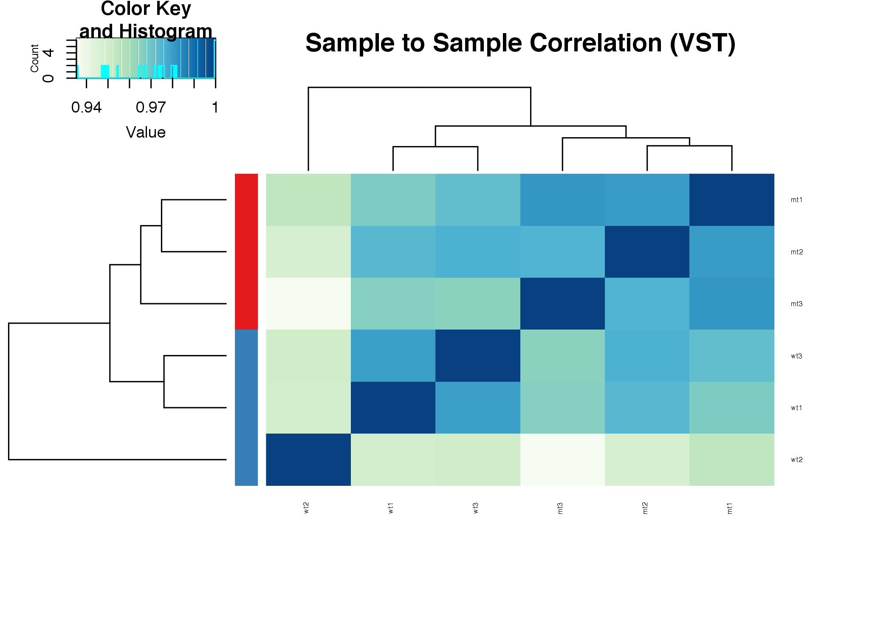

PCA of the first two Principal Components.

``` r
pca2=prcomp(t(vstcounts),center=TRUE)

plot(pca2$x, col=cond_colours,  pch=19, cex=2, main="Sample to Sample PCA (VST)")
text(pca2$x, as.vector(colnames(mircounts)), pos=3, cex=0.4)
```

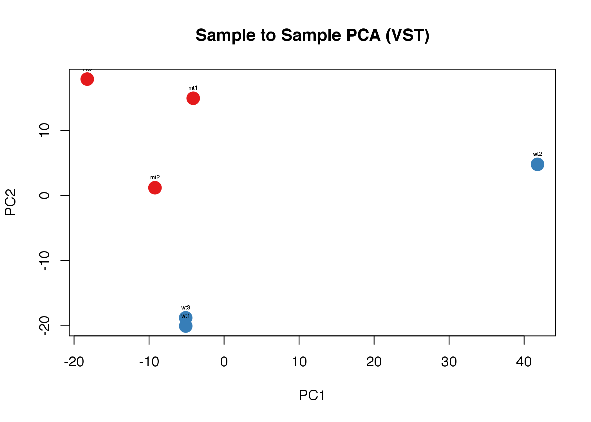

We see a nice separation between the wildtype and scrambled samples.

Let's now look at the other principal components

``` r
par(mfrow=c(1,3))
plot(pca2$x, col=cond_colours,  pch=19, cex=2, main="Sample to Sample PCA (VST)")
text(pca2$x, as.vector(colnames(mircounts)), pos=3, cex=0.4)
plot(pca2$x[,1],pca2$x[,3], col=cond_colours,  pch=19, cex=2, main="Sample to Sample PCA (VST)",ylab="PC3",xlab="PC1")
text(pca2$x[,1],pca2$x[,3], as.vector(colnames(mircounts)), pos=3, cex=0.4)
plot(pca2$x[,2],pca2$x[,3], col=cond_colours,  pch=19, cex=2, main="Sample to Sample PCA (VST)",ylab="PC3",xlab="PC2")
text(pca2$x[,2],pca2$x[,3], as.vector(colnames(mircounts)), pos=3, cex=0.4)
```

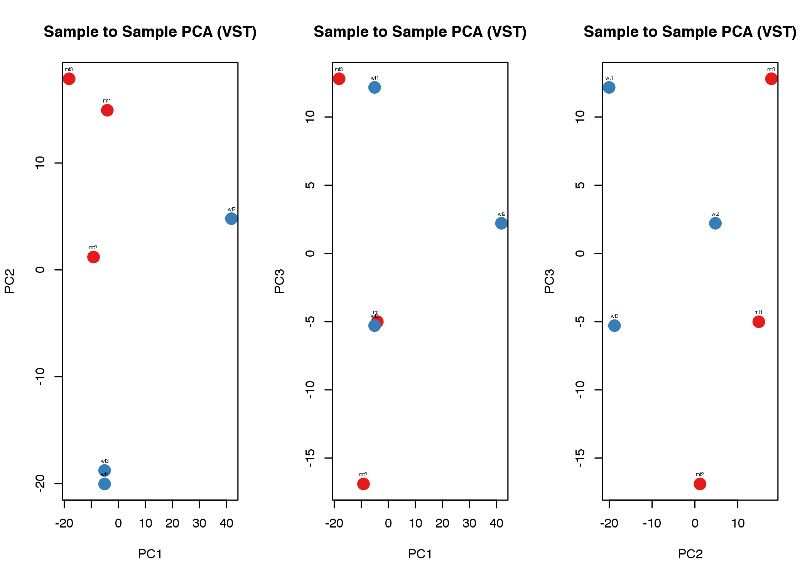

Initial Biological Analysis of the data
---------------------------------------

Here are the top10 microRNAs.

``` r
top10=apply(mircounts,1,sum)[1:10]
top10[11]=sum(apply(mircounts,1,sum)[11:nrow(mircounts)])
names(top10)[11]="other"
pie(top10,col=brewer.pal(11,"Set3"),main="Top10 microRNAs")
```


This is the expression of the top10 microRNAs sample to sample.

``` r
heatmap.2(vstcounts[names(top10)[1:10],],col=hmcol,trace="none",cexCol=0.4,cexRow=0.6,ColSideColors=cond_colours)
```

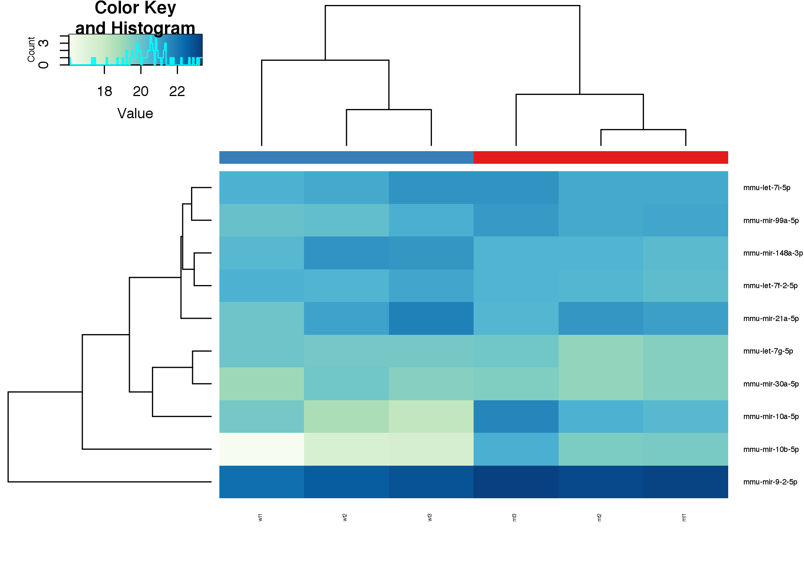

This is the expression of the miR-29 families of microRNAs sample to sample.

``` r
heatmap.2(vstcounts[rownames(mircounts)[grep("mir-29[a-z]",rownames(mircounts))],],col=hmcol,trace="none",cexCol=0.4,cexRow=0.6,ColSideColors=cond_colours)
```

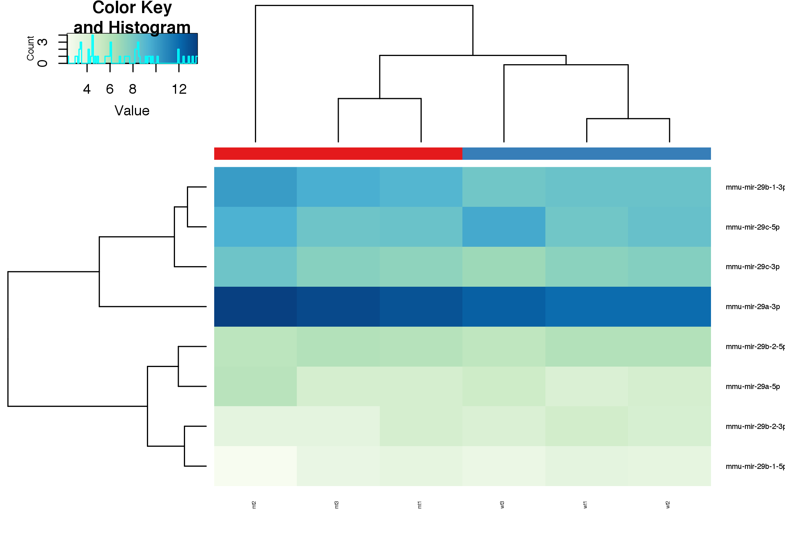

``` r
barplot(t(vstcounts[rownames(mircounts)[grep("mir-29[a-z]",rownames(mircounts))],]),beside=T,las=2,cex.names=0.5,col=cond_colours,main="miR-29 levels (VST)")
legend("topright",rownames(pdata),fill=cond_colours,cex=0.4)
```

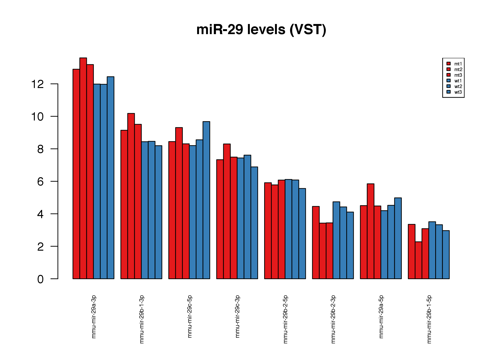

Statistical Analysis
--------------------

Run the statistical contrast on the count data

``` r
p_threshold=0.05
lfc_threshold=0.75

cds <- nbinomWaldTest(dds)

res=results(cds,contrast=c("treatment","wt","mut"))
res <- res[order(res$padj),]
res
```

               ## log2 fold change (MAP): treatment wt vs mut 
               ## Wald test p-value: treatment wt vs mut 
               ## DataFrame with 1471 rows and 6 columns
               ##                      baseMean log2FoldChange     lfcSE        stat
               ##                     <numeric>      <numeric> <numeric>   <numeric>
               ## mmu-mir-708-5p      370.21877      -3.880212 0.5208669   -7.449528
               ## mmu-mir-219-2-3p   2508.84257      -3.586149 0.6161118   -5.820615
               ## mmu-mir-204-5p      595.61606       3.605966 0.6224714    5.792982
               ## mmu-mir-219-2-5p     89.54399      -2.535594 0.4502091   -5.632036
               ## mmu-mir-10b-5p   632527.44731      -2.852560 0.5180408   -5.506439
               ## ...                       ...            ...       ...         ...
               ## mmu-mir-875-3p     0.12715984    -0.42370466  1.021558 -0.41476320
               ## mmu-mir-882-5p     0.22104968    -0.42370466  1.021558 -0.41476320
               ## mmu-mir-489-5p     0.08632002     0.05517826  1.021749  0.05400371
               ## mmu-mir-804-3p     0.21019972     0.26690316  1.024176  0.26060278
               ## mmu-mir-142-5p     0.12715984    -0.42370466  1.021558 -0.41476320
               ##                        pvalue         padj
               ##                     <numeric>    <numeric>
               ## mmu-mir-708-5p   9.367487e-14 8.814805e-11
               ## mmu-mir-219-2-3p 5.863146e-09 2.168921e-06
               ## mmu-mir-204-5p   6.914734e-09 2.168921e-06
               ## mmu-mir-219-2-5p 1.780944e-08 4.189672e-06
               ## mmu-mir-10b-5p   3.661657e-08 6.891239e-06
               ## ...                       ...          ...
               ## mmu-mir-875-3p      0.6783153           NA
               ## mmu-mir-882-5p      0.6783153           NA
               ## mmu-mir-489-5p      0.9569322           NA
               ## mmu-mir-804-3p      0.7943988           NA
               ## mmu-mir-142-5p      0.6783153           NA

``` r
sig = rownames(res[(abs(res$log2FoldChange) > lfc_threshold) & (res$padj < p_threshold) & !is.na(res$padj),])
```

Volcanoplots of Significant Hits

``` r
plot(res$log2FoldChange,-log(res$padj,10),ylab="-log10(Adjusted P)",xlab="Log2 FoldChange",main=paste("Volcano Plot","WT v Scr\nmir-29 in green\nsig. in red"),pch=19,cex=0.4)      
points(res[sig,"log2FoldChange"],-log(res[sig,"padj"],10),pch=19,cex=0.4,col="red")
text(res[sig[1:10],"log2FoldChange"],-log(res[sig[1:10],"padj"],10),pch=19,cex=0.4,pos=2,labels = rownames(res[sig[1:10],]))
points(res[rownames(mircounts)[grep("mir-29[a-z]",rownames(mircounts))],"log2FoldChange"],-log(res[rownames(mircounts)[grep("mir-29[a-z]",rownames(mircounts))],"padj"],10),pch=19,cex=0.6,col="green")
text(res[rownames(mircounts)[grep("mir-29[a-z]",rownames(mircounts))],"log2FoldChange"],-log(res[rownames(mircounts)[grep("mir-29[a-z]",rownames(mircounts))],"padj"],10),pch=19,cex=0.4,pos=2,labels =rownames(mircounts)[grep("mir-29[a-z]",rownames(mircounts))])
abline(h=-log10(p_threshold),lty=3)
abline(v=-lfc_threshold,lty=3)
abline(v=lfc_threshold,lty=3)   
```


Scatter Plot
------------

``` r
wt_median = apply(vstcounts[,pdata$genotype == "wt"],1,median)
mt_median = apply(vstcounts[,pdata$genotype == "mut"],1,median)
plot(wt_median,mt_median,cex=0.4,pch=19,col="darkblue")
points(wt_median[grep("mir-29[a-z]",rownames(vstcounts))],mt_median[grep("mir-29[a-z]",rownames(vstcounts))],cex=0.4,pch=19,col="green")
points(wt_median[sig],mt_median[sig],cex=1,col="red")
text(wt_median[grep("mir-29[a-z]",rownames(vstcounts))],mt_median[grep("mir-29[a-z]",rownames(vstcounts))],cex=0.4,pos=3,labels=rownames(vstcounts)[grep("mir-29[a-z]",rownames(vstcounts))])
abline(a=0,b=1,lty=2,col="red")
```

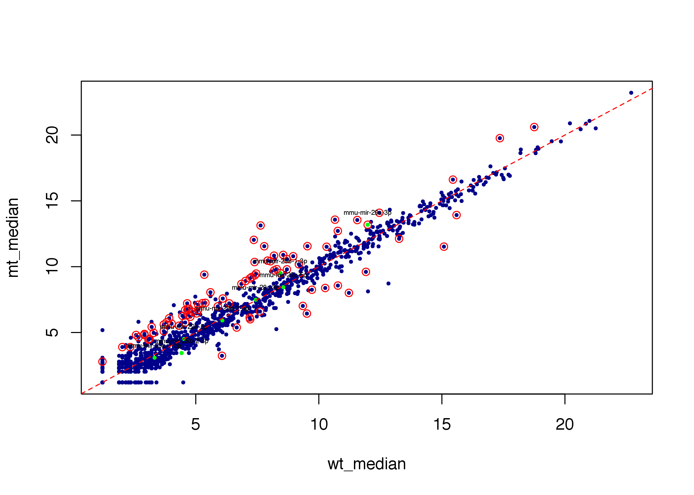

Heatmap of significant hits.

``` r
heatmap.2(vstcounts[sig,],trace="none",ColSideColors = cond_colours,col=hmcol,margins=c(5,5),cexRow=0.5,cexCol=0.6,labCol=paste(rownames(pdata),pdata$SampleName,sep="\n"),main="Significant Hits Heatmap (VST)")
```

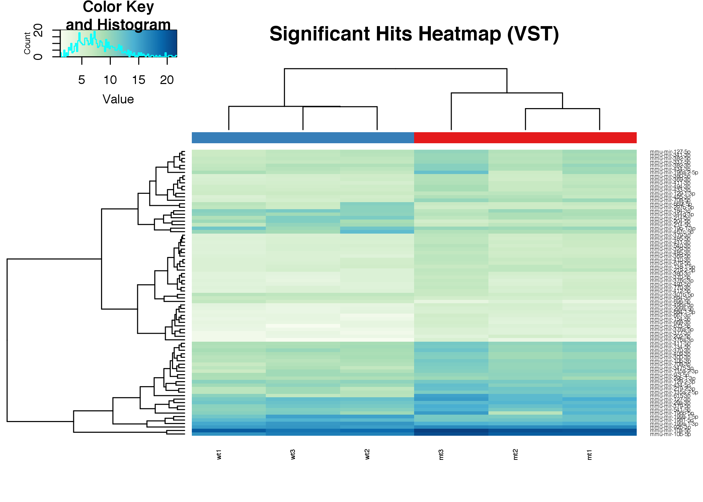

Result output to text file
--------------------------

Let's output the final results table with normalised expression values and stats listed

``` r
write.table(cbind(as.matrix(counts(dds,normalized=T)[rownames(res),]),as.matrix(res)),"mouse_results.txt",quote=F,sep="\t")
```
