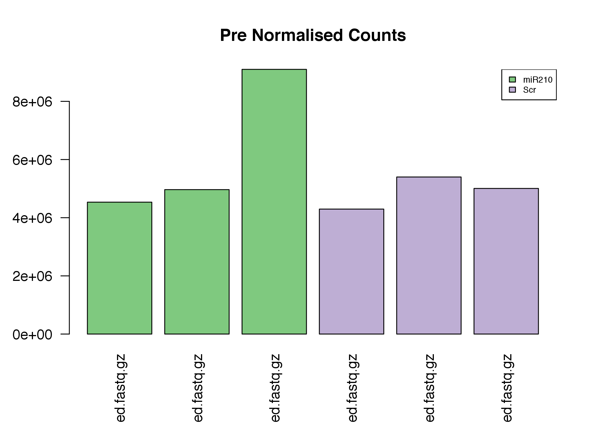
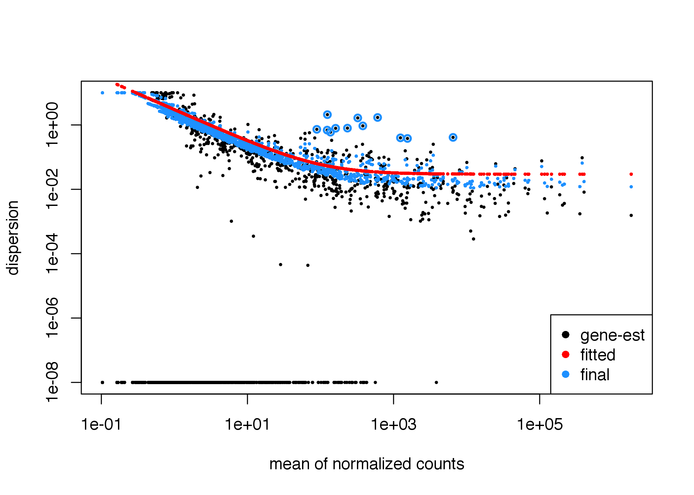
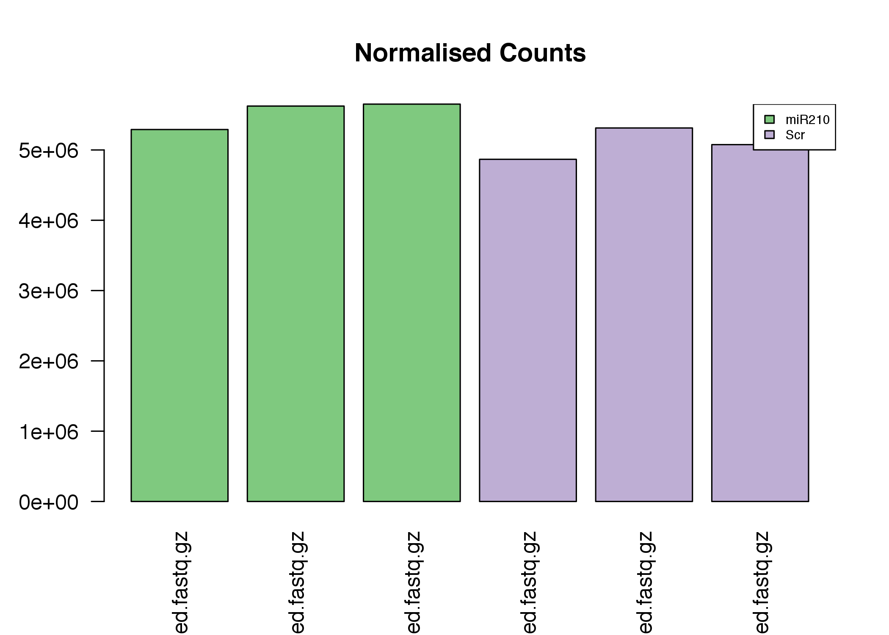
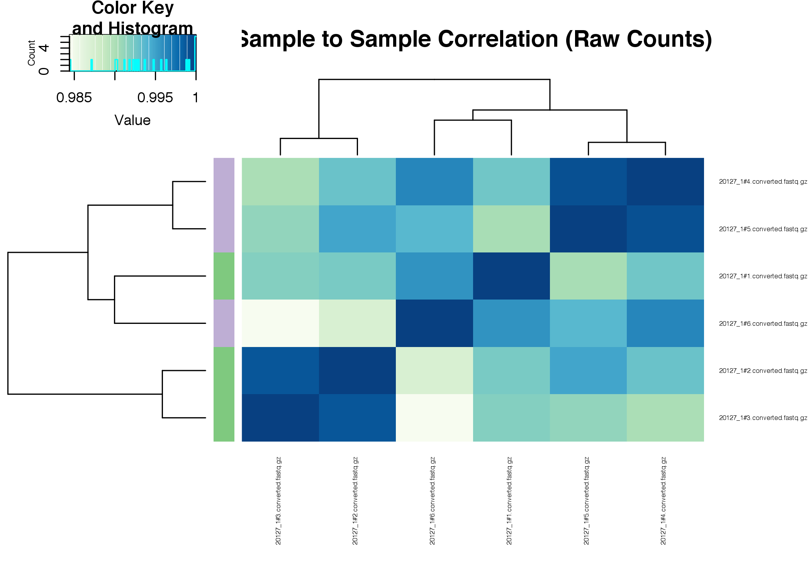
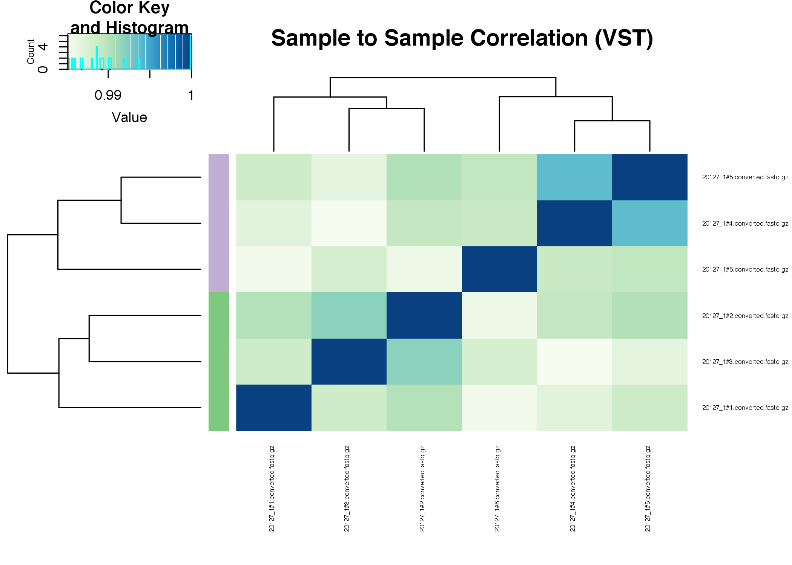
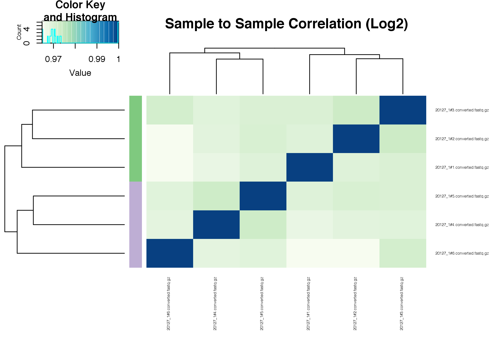
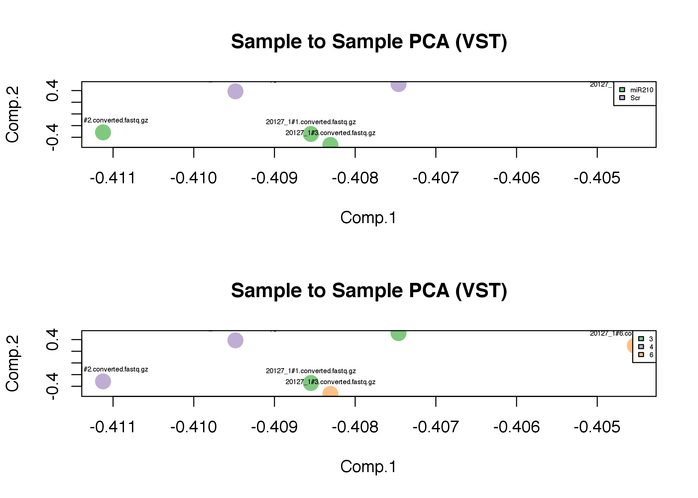
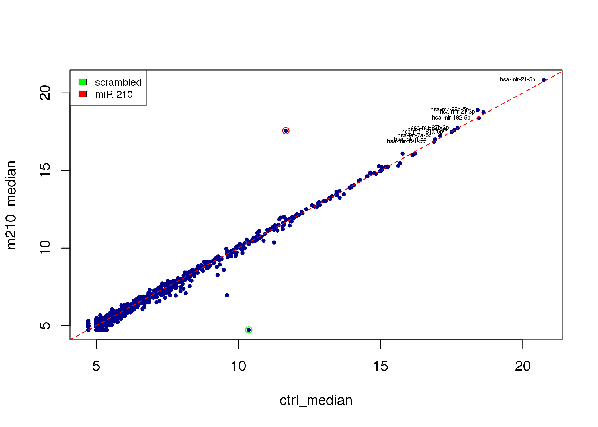
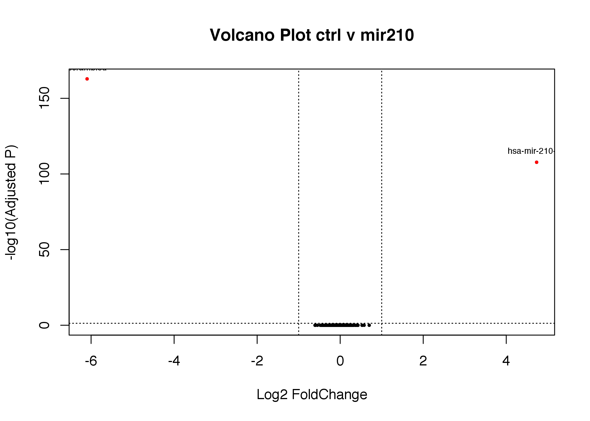
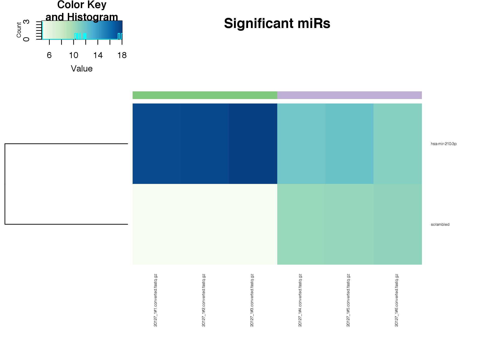

Small RNA Seq - miR-210 Practical
================
Jack Monahan, Anton Enright & Katy Brown

Feb 2018

-   [Analysis of an sRNA-Seq data for miR-210 over-expression](#analysis-of-an-srna-seq-data-for-mir-210-over-expression)
    -   [Experiment Overview](#experiment-overview)
    -   [Raw Data](#raw-data)
    -   [Count loading & Normalisation](#count-loading-normalisation)
    -   [Post Normalisation QC](#post-normalisation-qc)
    -   [Variance Stabilising the Counts](#variance-stabilising-the-counts)
    -   [Analysis of treatment effects](#analysis-of-treatment-effects)
    -   [Statistical Analysis - Differential Expression](#statistical-analysis---differential-expression)
    -   [Final Results](#final-results)

Analysis of an sRNA-Seq data for miR-210 over-expression
========================================================

Experiment Overview
-------------------

This set of sequencing data is from libraries prepared in a previous course. We have matched microRNA and mRNA samples from   MCF7 Human Breast Cancer Cells. The experiment here was to overexpress miR-210 to explore the effect on mRNAs. Control samples used a non-mouse microRNA from c.elegans (cel-miR-67) TCACAACCTCCTAGAAA

| filename                       | group | samplename | treatment | fullname          | 3p-ad               |
|--------------------------------|-------|------------|-----------|-------------------|---------------------|
| 20127\_1\#1.converted.fastq.gz | 3     | 3A         | miR210    | miRNA03\_MIR\_GR3 | TGGAATTCTCGGGTGCCAA |
| 20127\_1\#2.converted.fastq.gz | 4     | 4A         | miR210    | miRNA04\_MIR\_GR4 | TGGAATTCTCGGGTGCCAA |
| 20127\_1\#3.converted.fastq.gz | 6     | 3B         | miR210    | miRNA14\_MIR\_GR6 | TGGAATTCTCGGGTGCCAA |
| 20127\_1\#4.converted.fastq.gz | 3     | 7A         | Scr       | miRNA07\_SCR\_GR3 | TGGAATTCTCGGGTGCCAA |
| 20127\_1\#5.converted.fastq.gz | 4     | 8A         | Scr       | miRNA08\_SCR\_GR4 | TGGAATTCTCGGGTGCCAA |
| 20127\_1\#6.converted.fastq.gz | 6     | 6B         | Scr       | miRNA16\_SCR\_GR6 | TGGAATTCTCGGGTGCCAA |

Raw Data
--------

The data should be preinstalled. Otherwise download the [raw data](http://wwwdev.ebi.ac.uk/enright-srv/courses/rna_cambridge_2017/course_counts/data) and put the files in a directory called 'mir210_smallRNA' in your main course_data directory.

<br>
Launch RStudio

``` r
setwd('~/Desktop/Course_Materials/small_RNASeq')
library(RColorBrewer)
library(gplots)
library(DESeq2)
hmcol = colorRampPalette(brewer.pal(9, "GnBu"))(100)
```

We can now load the count data

``` r
mircounts <- read.table("mircounts.txt",header=TRUE,row.names=1)
```

As well as the pdata, which contains information on each sample.

``` r
pdata <- read.table("pdata.txt",header=TRUE,row.names=1,sep="\t")
colnames(mircounts)=rownames(pdata)

groups=as.factor(pdata$group)
conds=as.factor(pdata$treatment)
```

Count loading & Normalisation
-----------------------------

We are now ready to create a DESeq object from the counts table. We are only looking at one condition, tretment of the samples with estradiol. We use the design formula “~ treatment”. We are going to estimate coefficients for the treatment conditions (Scrambled Control versus miR210 Overexpression)

``` r
coldata = as.data.frame(t(t(conds)))
rownames(coldata)=colnames(mircounts)
colnames(coldata)='treatment'

dds <- DESeqDataSetFromMatrix(countData = mircounts, colData = coldata, design = ~ treatment)
```

We are ready to normalise the data, but first we should look at the number of sequenced reads per sample.

``` r
cond_colours = brewer.pal(length(unique(conds)),"Accent")[as.factor(conds)]
names(cond_colours)=conds

group_colours = brewer.pal(3,"Accent")[as.factor(pdata$group)]
names(group_colours)=pdata$group

barplot(apply(mircounts,2,sum), las=2,col=cond_colours,main="Pre Normalised Counts")
legend("topright",levels((conds)),cex=0.6,fill=cond_colours[levels(conds)])
```



We can also estimate the dispersion of the data.

``` r
dds <- estimateSizeFactors(dds)
dds <- estimateDispersions(dds)

plotDispEsts(dds)
```



Post Normalisation QC
---------------------

Now we can normalise and plot the counts again.

``` r
normcounts <- counts(dds, normalized=TRUE)
rawcounts=counts(dds,normalized=FALSE)
log2counts=log2(normcounts+1)


barplot(apply(normcounts,2,sum), las=2,col=cond_colours,main="Normalised Counts")

legend("topright",levels((conds)),cex=0.6,fill=cond_colours[levels(conds)])
```



Variance Stabilising the Counts
-------------------------------

We will use an alternative to straight log2 transformation, instead we will use the VST transformation from the DESeq2 package to do something similar to the log transformation but in a way that stabilises the variance for low counts.

``` r
vsd <- varianceStabilizingTransformation(dds)
vstcounts <- assay(vsd)
vstcounts <- vstcounts[order(apply(vstcounts,1,sum),decreasing =TRUE),]
```

As an additional QC step we can calculate the sample-to-sample Pearson correlations and plot them in a heatmap.

``` r
heatmap.2(cor(rawcounts),trace="none",col=hmcol,main="Sample to Sample Correlation (Raw Counts)",cexRow=0.5,cexCol=0.5,RowSideColors=cond_colours, margins=c(9,7))
```



``` r
heatmap.2(cor(vstcounts),trace="none",col=hmcol,main="Sample to Sample Correlation (VST)",cexRow=0.5,cexCol=0.5,RowSideColors=cond_colours, margins=c(9,7))
```



``` r
heatmap.2(cor(log2counts),trace="none",col=hmcol,main="Sample to Sample Correlation (Log2)",cexRow=0.5,cexCol=0.5,RowSideColors=cond_colours, margins=c(9,7))
```



We can also perform PCA to see if the miR-210 overexpression explains a significant fraction of the variance

``` r
pca <- princomp(vstcounts)


par(mfrow=c(2,1))
plot(pca$loadings, col=cond_colours,  pch=19, cex=2, main="Sample to Sample PCA (VST)")
text(pca$loadings, as.vector(colnames(mircounts)), pos=3, cex=0.4)
legend("topright",levels(conds),fill=cond_colours[levels(conds)],cex=0.4)

plot(pca$loadings, col=group_colours,  pch=19, cex=2, main="Sample to Sample PCA (VST)")
text(pca$loadings, as.vector(colnames(mircounts)), pos=3, cex=0.4)
legend("topright",levels(groups),fill=group_colours[levels(groups)],cex=0.4)
```



Analysis of treatment effects
-----------------------------

We can look at the differences between treatments.

``` r
m210_median = apply(vstcounts[,1:3],1,median)
ctrl_median= apply(vstcounts[,4:6],1,median)


plot(ctrl_median,m210_median,pch=19,cex=0.5,col="darkblue")
points(ctrl_median["hsa-mir-210-3p"],m210_median["hsa-mir-210-3p"],col="red")
points(ctrl_median["scrambled"],m210_median["scrambled"],col="green")
abline(a=0,b=1,lty=2,col="red",cex=0.5)
text(ctrl_median[1:10],m210_median[1:10],labels=names(ctrl_median[1:10]),cex=0.4,pos=2)
legend("topleft",c("scrambled","miR-210"),fill=c("green","red"),cex=0.7)
```



Statistical Analysis - Differential Expression
----------------------------------------------

The function nbinomWaldTest fits a negative binomial generalized linear model to each gene and then calculates the significance of the estimated coeffients. We contrast the control and the overexpressed miR210 samples.

``` r
p_threshold=0.05
lfc_threshold=1

cds <- nbinomWaldTest(dds)

res=results(cds,contrast=c("treatment","miR210","Scr"))
res <- res[order(res$padj),]
sig = rownames(res[(abs(res$log2FoldChange) > lfc_threshold) & (res$padj < p_threshold) & !is.na(res$padj),])

sig
```

               ## [1] "scrambled"      "hsa-mir-210-3p"

We can visualise the differentially expressed genes with a Volcano Plot, we’re plotting the log2 Fold-change of each gene (x-axis) against the -log10 of its p-value (y-axis).

``` r
plot(res$log2FoldChange,-log(res$padj,10),ylab="-log10(Adjusted P)",xlab="Log2 FoldChange",main=paste("Volcano Plot","ctrl v mir210"),pch=19,cex=0.4)      
text(res[sig,]$log2FoldChange,-log(res[sig,]$padj,10),labels=rownames(res[sig,]),pos=3,cex=0.6)
points(res[sig,"log2FoldChange"],-log(res[sig,"padj"],10),pch=19,cex=0.4,col="red")
abline(h=-log10(p_threshold),lty=3)
abline(v=-lfc_threshold,lty=3)
abline(v=lfc_threshold,lty=3) 
```



Final Results
-------------

Lets make a heatmap for the significant miRs so we can see their expression across replicates.

``` r
heatmap.2(vstcounts[sig,],trace="none",col=hmcol,main="Significant miRs",cexRow=0.5,cexCol=0.5,ColSideColors=cond_colours, margins=c(9,7),Colv=FALSE,dendrogram="row")
```



