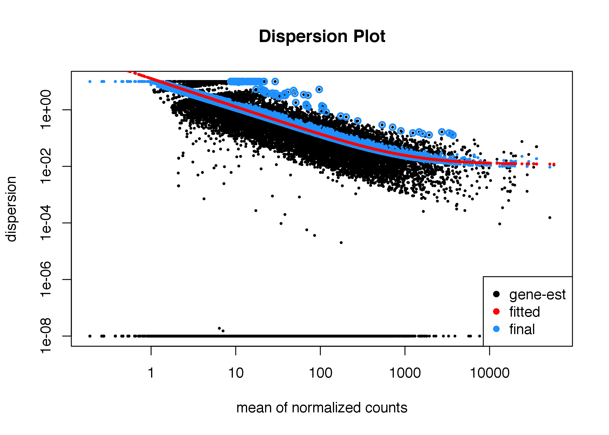
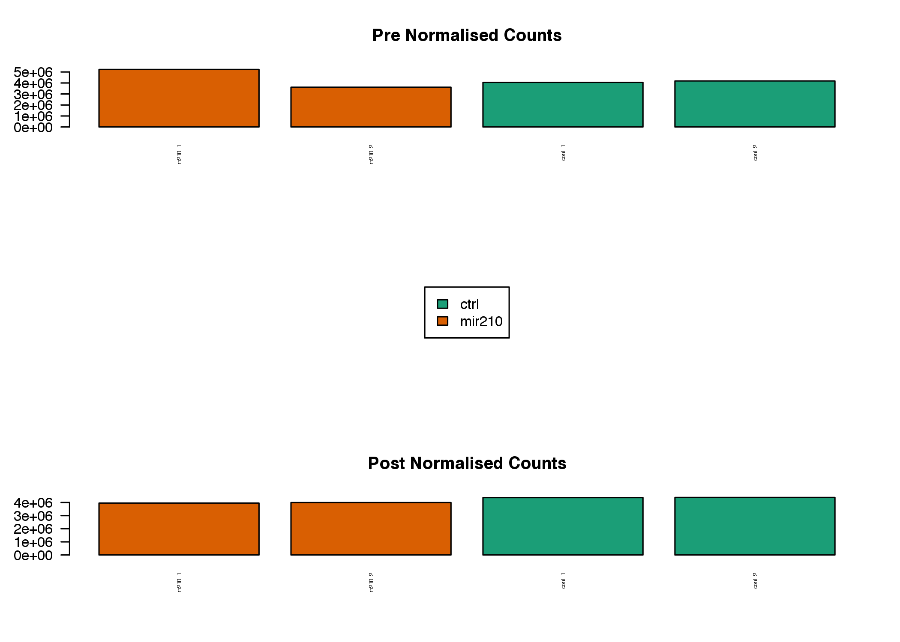
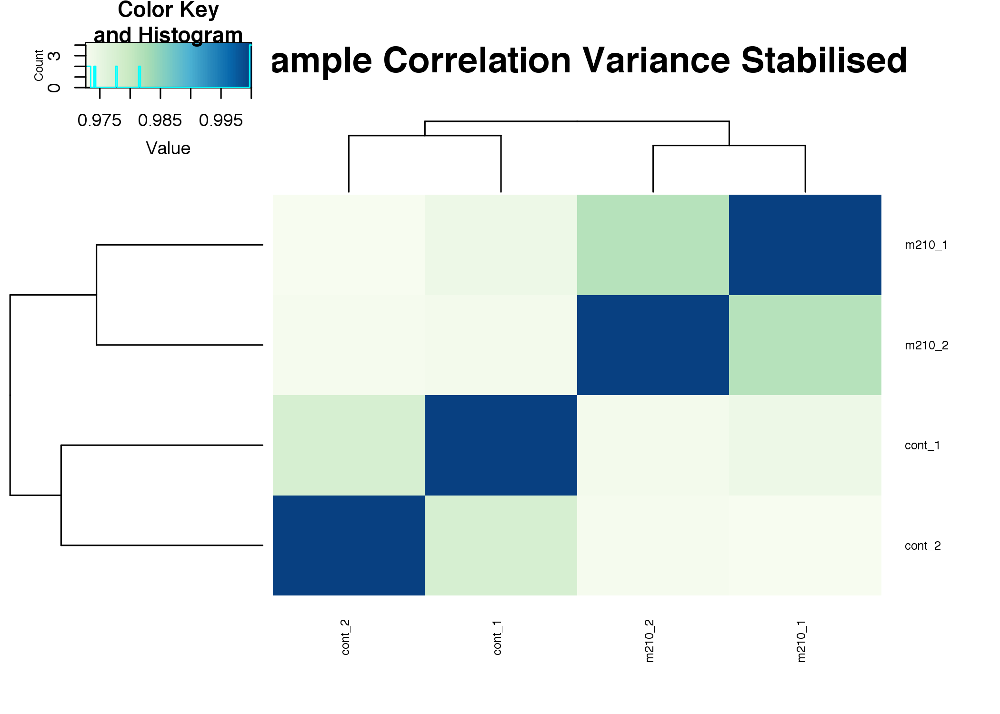
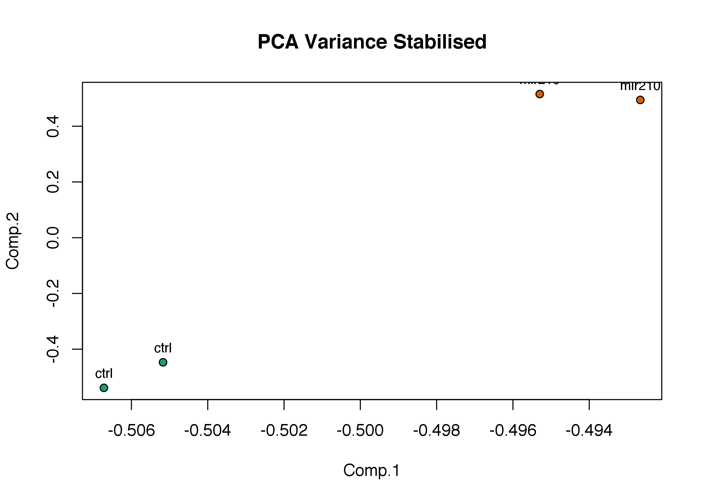
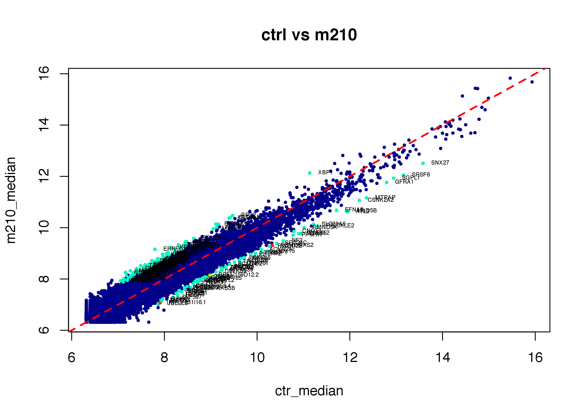
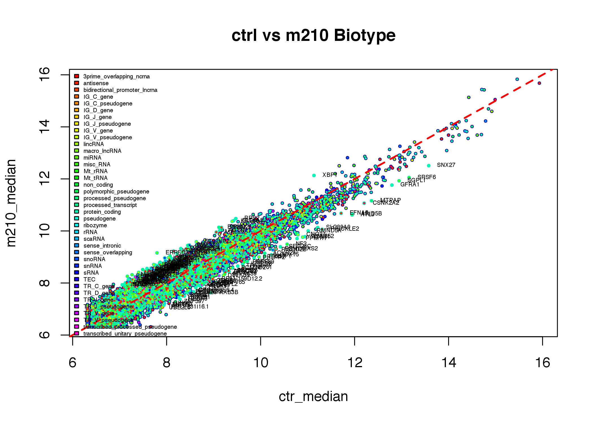
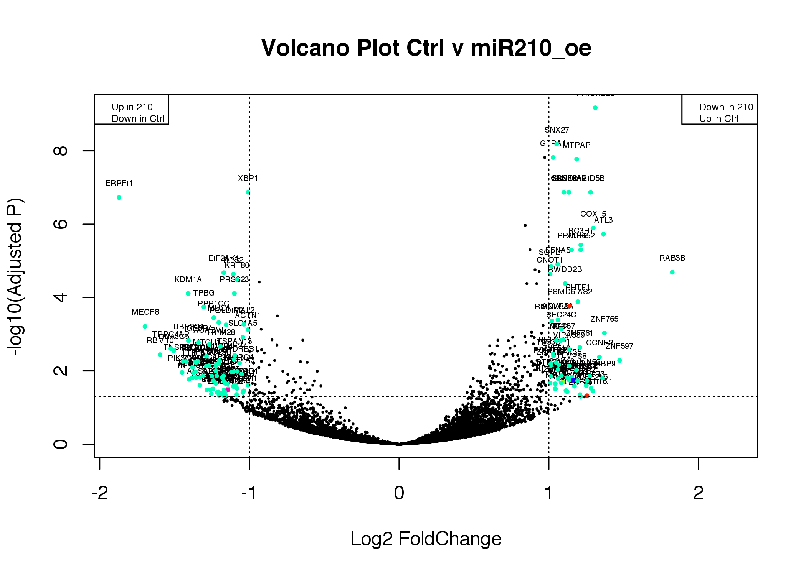
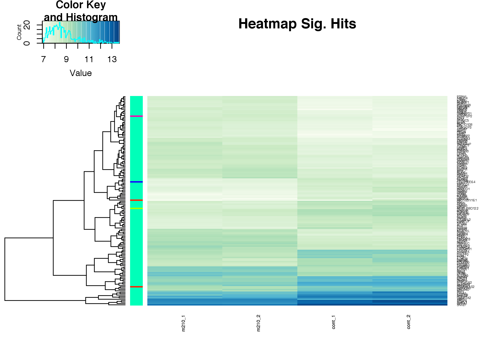

mRNA Seq - miR210 Practical
================
Anton Enright & Jack Monahan & Katy Brown
'Feb 2019'

-   [mRNA Analysis](#mrna-analysis)
    -   [Raw Data](#raw-data)
    -   [Experimental Design](#experimental-design)
    -   [Reading in Annotation and Count Data](#reading-in-annotation-and-count-data)
    -   [Data Normalisation](#data-normalisation)
    -   [Post-Normalisation QC](#post-normalisation-qc)
        -   [Stabilising the Variance (VST) instead of log2](#stabilising-the-variance-vst-instead-of-log2)
        -   [Sample to Sample Correlation](#sample-to-sample-correlation)
        -   [Sample to Sample PCA](#sample-to-sample-pca)
    -   [Statistical Analysis](#statistical-analysis)
        -   [Creating a list of Statistical Hits from the results Table](#creating-a-list-of-statistical-hits-from-the-results-table)
    -   [Analysis of Sample Median Data](#analysis-of-sample-median-data)
    -   [Post-Statistical QC](#post-statistical-qc)
        -   [Volcano Plot of Significance and Fold Change](#volcano-plot-of-significance-and-fold-change)
        -   [Heatmap of Signficant Hits](#heatmap-of-signficant-hits)
    -   [Output Final Results](#output-final-results)

mRNA Analysis
=============

Raw Data
--------

The raw data is [here](http://wwwdev.ebi.ac.uk/enright-srv/courses/rna_cambridge_2017/mrna_seq/data)

Experimental Design
-------------------

This experiment explores the effect of miR-210 Overexpression in MCF7 breast cancer cells (Human). 4 Lanes of mRNA-Seq data are used with 2 controls (overexpression of a C.elegans miR cel-mir-67) and 2 samples over-expressing miR-210.

This is the <em>pdata.txt</em> file:

| SampleName | fileName                                       | condition |
|------------|------------------------------------------------|-----------|
| m210\_1    | hisat.merged\_1\_16.fq.27197.bam.counts.merged | mir210    |
| m210\_2    | hisat.merged\_1\_24.fq.27197.bam.counts.merged | mir210    |
| cont\_1    | hisat.merged\_1\_32.fq.27197.bam.counts.merged | ctrl      |
| cont\_2    | hisat.merged\_1\_40.fq.27197.bam.counts.merged | ctrl      |

First we will load required modules and change to our working directory

``` r
setwd('~/Course_Materials/rnaseq/mrna')
library(DESeq2)
```

               ## Warning: package 'DESeq2' was built under R version 3.3.2

               ## Warning: package 'S4Vectors' was built under R version 3.3.3

               ## Warning: package 'IRanges' was built under R version 3.3.3

               ## Warning: package 'GenomicRanges' was built under R version 3.3.3

               ## Warning: package 'GenomeInfoDb' was built under R version 3.3.2

``` r
library(gplots)
library(RColorBrewer)
library(ggplot2)
library(Rtsne)
```

Let’s make a colour palette (100 colours) for nice heatmaps (Green to Blue)

``` r
hmcol = colorRampPalette(brewer.pal(9, 'GnBu'))(100)
```

Reading in Annotation and Count Data
------------------------------------

We’ll now read in the experimental design file (pdata.txt) and the a containing gene names (gene\_names.txt). We will also create a vector containing condition names for each sample. Finally, we will make a vector of colours that correspond to each condition for nicer plots later on. We’ll also make colours corresponding to each class (<em>biotype</em>) of gene.

``` r
pdata=read.table('pdata.txt',header=TRUE)

conds=as.vector(pdata$condition) 
names=read.table('gene_names.txt',header=FALSE,row.names=1)

condcols=brewer.pal(n = length(unique(conds))+2, name = 'Dark2')
names(condcols)=unique(conds)

typecols=rainbow(44)[names$V4]
names(typecols)=rownames(names)
```

Next we’ll read in the actual raw counts derived from HTSeq. The DESeq2 function has an option <em>DESeqDataSetFromHTSeqCount</em> that reads in counts from HTSeq output files. We just need to provide it with a directory and an appopropriate <em>pdata.txt</em> file.

``` r
ddsHTSeq = DESeqDataSetFromHTSeqCount(sampleTable = pdata, directory = '.', design= ~ condition)

# Restrict to protein coding and lincRNA ?
#ddsHTSeq=ddsHTSeq[(names[rownames(ddsHTSeq),'V4'] == protein_coding) | (names[rownames(ddsHTSeq),'V4'] == lincRNA),]

colData(ddsHTSeq)$condition = factor(colData(ddsHTSeq)$condition,levels=levels(pdata$condition))
```

Data Normalisation
------------------

``` r
# Data Normalisation
dds = estimateSizeFactors(ddsHTSeq)
# Data Dispersion
dds = estimateDispersions(dds)
```

               ## gene-wise dispersion estimates

               ## mean-dispersion relationship

               ## final dispersion estimates

``` r
# New Neg. Binomial test
dds = nbinomWaldTest(dds)

counts_table=counts(dds,normalized=TRUE)
```

Let’s look at the DESeq2 Dispersion plot to see how it looks.

``` r
plotDispEsts(dds,main='Dispersion Plot')
```



Post-Normalisation QC
---------------------

``` r
par(mfrow=c(3,1))
barplot(colSums(counts(dds, normalized=F)), col=condcols[as.factor(conds)], las=2,cex.names=0.4,main='Pre Normalised Counts')
plot(1, type='n', axes=F, xlab='', ylab='')
legend('center',levels(as.factor(conds)),fill=condcols)
barplot(colSums(counts(dds, normalized=T)), col=condcols[as.factor(conds)], las=2,cex.names=0.4,main='Post Normalised Counts')
```



### Stabilising the Variance (VST) instead of log2

Regularised log transformation and variance stabilising transformation, these function are usesful to visualise the data. See the DESeq2 manual for more information.

``` r
vsd = varianceStabilizingTransformation(dds)
vstMat = assay(vsd)
counts_table=data.frame(counts_table,vstMat)
```

### Sample to Sample Correlation

``` r
heatmap.2(cor(assay(vsd)),trace='none',main='Sample Correlation Variance Stabilised',col=hmcol,cexRow=0.6,cexCol=0.6)
```



### Sample to Sample PCA

``` r
pca = princomp(assay(vsd))
plot(pca$loadings, main='PCA Variance Stabilised', col='black', bg=condcols[pdata$condition],  pch=21, cex=1)
text(pca$loadings, conds, pos=3, cex=0.8)
```



Tsne Analysis
-------------
``` r
tsne <- Rtsne(t(assay(vsd)), perplexity = 1, check_duplicates = FALSE)
tsne.df <- data.frame(tsne.1 = tsne$Y[,1], tsne.2 = tsne$Y[,2])
ggplot(data = tsne.df, aes(tsne.1, tsne.2)) + 
  geom_point(size = 4, pch = 20, colour = condcols[pdata$condition]) +
  geom_text(size = 1.5, vjust=2, aes(label=pdata$SampleName)) +
  scale_alpha_discrete(range = c(0.5, 1)) +
  theme_minimal() +
  ylab("tSNE 1") +
  xlab("tSNE 2") 
```

Statistical Analysis
--------------------

Now we will perform the statistical tests. 1. Control vs miR-210 Overexpression

For the test we are looking for how many genes are significantly changed with an Absolute Log Fold Change of at least 1 and an Adjusted P-Value of less than 0.05. Lets see how many genes we find.

``` r
res = results(dds, contrast=c('condition', 'ctrl', 'mir210'))
res=res[order(res$padj),]

res
```

               ## log2 fold change (MAP): condition ctrl vs mir210 
               ## Wald test p-value: condition ctrl vs mir210 
               ## DataFrame with 60504 rows and 6 columns
               ##                  baseMean log2FoldChange     lfcSE      stat       pvalue
               ##                 <numeric>      <numeric> <numeric> <numeric>    <numeric>
               ## ENSG00000163637  1649.288      1.3101731 0.1758733  7.449527 9.367572e-14
               ## ENSG00000143376  8882.666      1.0529237 0.1494022  7.047578 1.820582e-12
               ## ENSG00000112308 19819.711      0.9725061 0.1418489  6.855931 7.084958e-12
               ## ENSG00000151892  5132.390      1.0296019 0.1507585  6.829479 8.522371e-12
               ## ENSG00000107951  3626.723      1.1855819 0.1748262  6.781491 1.189423e-11
               ## ...                   ...            ...       ...       ...          ...
               ## ENSG00000283117 0.0000000             NA        NA        NA           NA
               ## ENSG00000283118 0.0000000             NA        NA        NA           NA
               ## ENSG00000283122 0.2762513    -0.03270588 0.1333785 -0.245211    0.8062931
               ## ENSG00000283123 0.0000000             NA        NA        NA           NA
               ## ENSG00000283125 0.0000000             NA        NA        NA           NA
               ##                         padj
               ##                    <numeric>
               ## ENSG00000163637 6.668774e-10
               ## ENSG00000143376 6.480361e-09
               ## ENSG00000112308 1.516769e-08
               ## ENSG00000151892 1.516769e-08
               ## ENSG00000107951 1.693500e-08
               ## ...                      ...
               ## ENSG00000283117           NA
               ## ENSG00000283118           NA
               ## ENSG00000283122           NA
               ## ENSG00000283123           NA
               ## ENSG00000283125           NA

### Creating a list of Statistical Hits from the results Table

``` r
hits=(rownames(res[((res$padj <= 0.05) & (abs(res$log2FoldChange) >= 1) & (!is.na(res$padj))),]))
```

Analysis of Sample Median Data
------------------------------

Sometimes it is useful to compute the median of each sample so we can make some different plots (e.g. pairwise plots).

``` r
ctr_median=apply(vstMat[,3:4],1,median)
m210_median=apply(vstMat[,1:2],1,median)

plot(ctr_median,m210_median,pch=19,main=paste('ctrl vs m210'),col='darkblue',cex=0.4)
points(ctr_median[hits],m210_median[hits],pch=19,col=typecols[hits],cex=0.4)
text(ctr_median[hits],m210_median[hits],cex=0.4,pos=4,labels=names[hits,'V2'])
abline(a=0,b=1,lty=2,col='red',lwd=2,cex=0.4)
```



``` r
plot(ctr_median,m210_median,pch=19,main=paste('ctrl vs m210 Biotype'),col='darkblue',cex=0.4)
points(ctr_median[hits],m210_median[hits],pch=19,col=typecols[hits],cex=0.4)
points(ctr_median,m210_median,pch=19,col=typecols,cex=0.2)
text(ctr_median[hits],m210_median[hits],cex=0.4,pos=4,labels=names[hits,'V2'])
abline(a=0,b=1,lty=2,col='red',lwd=2,cex=0.4)
legend('topleft',levels(unique(names$V4)),cex=0.4,bty='n',fill=rainbow(44))
```



Post-Statistical QC
-------------------

Now we will construct a Volcano Plot to highlight each gene’s Significance versus its Fold Change. Genes which do not change much usually have poor P-Values so the plot has low significance around zero and hence looks like a <em>volcano</em>. Some genes may have high fold changes but poor significance, in these cases, usually the foldchanges observed do not replicate well from sample to sample.

### Volcano Plot of Significance and Fold Change

``` r
plot(res$log2FoldChange,-log(res$padj,10),ylab='-log10(Adjusted P)',xlab="Log2 FoldChange", main=paste('Volcano Plot Ctrl v miR210_oe'),pch=19,cex=0.2)      
text(res[hits,]$log2FoldChange,-log(res[hits,]$padj,10),labels=names[rownames(res[hits,]),'V2'],pos=3,cex=0.4)
points(res[hits,'log2FoldChange'],-log(res[hits,'padj'],10),pch=19,cex=0.4,col=typecols[hits])
legend('topleft',"Up in 210\nDown in Ctrl",cex=0.5)
legend('topright',"Down in 210\nUp in Ctrl",cex=0.5)
abline(h=-log10(0.05),lty=3)
abline(v=-1,lty=3)
abline(v=1,lty=3)
```



### Heatmap of Signficant Hits

We now compute a heatmap of the most significant hits.

``` r
heatmap.2(vstMat[hits,],trace='none',col=hmcol,labRow=names[hits,'V2'],cexRow=0.4,cexCol=0.6,las=2,Colv=FALSE,dendrogram='row',main='Heatmap Sig. Hits', RowSideColors = typecols[hits])
```



Output Final Results
--------------------

Let’s write the results out to a txt table file called <strong>FullCountsandStats.txt</strong>.

``` r
fullresults=merge(names,counts_table,by.x=0,by.y=0)
fullresults=merge(fullresults,as.matrix(res),by.x=1,by.y=0)
fullresults=fullresults[order(fullresults$log2FoldChange,decreasing=T),]
fullresults=fullresults[!is.na(fullresults$log2FoldChange),]
rownames(fullresults)=fullresults$Row.names

write.table(fullresults,"FullCountsandStats.txt",sep="\t",quote=F)
```
