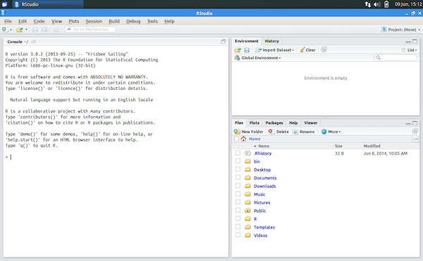

```{r setup, results='hide',message=F, warning=F, echo=F}
require(knitr)
opts_knit$set(root.dir = '/Users/aje/Desktop/Courses-and-Practicals/EMBO_Greece_2017/Intro_R')
opts_chunk$set(dev="png", 
               dev.args=list(type="cairo"),
               comment='           ##',
               dpi=300)
```

##About R
R is a free software environment for statistical computing. R is a free tool that you can download
and use on a variety of platforms and environments. The [R project](http://www.r-project.org) R Webpage is a good place to learn more about R.

In this session we will focus on learning the basics of R so that we will be able to use BioConductor
properly in the next session. R contains a vast collection of resources and tools many of which are beyond
the scope of this session.

##Getting Started
First load up RStudio, there should be a shortcut on your desktop. You should now see a window like this: 

This is the R terminal where we will type commands for both R and Bioconductor.

In this web page, sections like the following contain commands that you can copy and paste into the R terminal. The output you should expect to get from R will be presented like this (below).

```{r}
setwd("/Users/aje/Desktop/Courses-and-Practicals/EMBO_Greece_2017/Intro_R")
print("Hello Anton!")
```

To get help in R just type a question mark before the name of the command, for example, for the plot< function:

```{r}
?plot
```

Finally to quit R just type at the prompt:

```{}
quit()
```

##Assignment and Operations

Simple operations are easy to calculate in R, including multiplication,
division, addition, subtraction etc. Here are some examples results below commands:

```{r,results="hold"}
2+1

3-5

4*4

16/4

7.15 * sqrt(4)
```

To save one of these results, we can assign it to a variable, using the
"&lt;-" symbol. We can then use these variables in further operations.

```{r, results="hold"}
x <- 2+1

y <- 7.15 * sqrt(4)

x + y
```

One of R's benefits is that it can deal with many numbers at once. In order to tell R that we want to treat a series of numbers as one object, we can use the
c command to "combine" objects into a list.

```{r}
bubba <- c(1,2,3,4,10,59)
```

To see what numbers are stored in bubba we can just type "bubba":

```{r}
bubba
```


And now, we can perform operations on all of these numbers at once:

```{r,results="hold"}
bubba + 1

bubba * 10
```

We can also use the many functions available in R:

```{r,results="hold"}
sum(bubba)
mean(bubba)
max(bubba)
min(bubba)
sd(bubba)
range(bubba)
length(bubba)
```

If you don't know the proper command for a mathematical function you might want to use, you can either use the "Search help" option in the "Help" menu, or the "??" command:

```{}
??deviation
```

If you wish to work with only one of the numbers you can get access to it
using the variable and then square brackets indicating the position in the series:

```{r,results="hold"}
bubba[1]        # This accesses the first element of bubba

bubba[5]        # The Fifth Element, of bubba
```

Using the **c** command we can also store text (between quotes):

```{r}
names <- c("Tom", "Anton", "James")

names[2]
```

You now have a list of numbers and are ready to explore. In the
sections that follow we will examine the basic operations in R that
will allow you to do some of the analyses required in the next practical.

##Object types in R

These objects are simple lists, we will need later to use more complicated objects to store more complicated data.


##Questioning the numbers

With R, we can "ask" things of the numbers. For instance, we might want to know which of the stored in _bubba_ are larger than 2:

```{r,results="hold"}
bubba

bubba > 2
```


We get a list of TRUE / FALSE values (usually called _"Logical"_). They can be quite useful, as can be seen by the following two examples:


```{r,results="hold"}
sum(bubba > 2)

bubba[bubba > 2]
```

* What do these commands do?
* How would you print out the numbers in bubba that are smaller or larger than the
_mean_ of bubba?


##Basic Plotting and Graphing
Once your data is stored in a variable it is relatively easy to plot. To plot the values we just assigned simply type:

```{r}
plot(bubba)
```

You should have a plot like the one above

You could also try other types of plot such as:

```{r}
barplot(bubba)

pie(bubba)
```

You might also try playing with some example data on flowers (iris) that come with R. 

```{r}
flowerdata <- iris       # Reads in the included "iris" data and saves it as "flowerdata"
```

It is quite useful to find out what kind of object you have, and what kind of data it contains:

```{r}
class(flowerdata)
```

A "data.frame" is a table. The flowerdata data.frame contains information about flowers, which we can open in an external editor, or simply view inside R by typing "flowerdata".


```{}
edit(flowerdata)         # Opens an external editor
```


To quickly find out the size of the table, we can use ask for its dimensions:

```{r}
dim(flowerdata)          # returns the dimensions of an object
```

We now know that flowerdata contains 150 rows and 5 columns. We can use the square brackets to access subsets of the table. In order to access particular cells we need to specify the row number and then the column number separated by a comma.
By leaving out either the row or the column number we can gain access to
complete columns or rows.

```{r}
flowerdata[11,2]         # the element that is in row 11 and column 2

flowerdata[11,]          # row number 11

flowerdata[,2]            # column number 2
```

We can use different plots to look at the data:

```{r}
plot(flowerdata[,2])

hist(flowerdata[,2])

boxplot(flowerdata, col=rainbow(5))
```

In order to save some of these results as a PDF file, we can do the following:

```{}
pdf("flower_images.pdf")

boxplot(flowerdata, col=rainbow(5))

dev.off()
```

This will send any image that is produced after the <i>pdf</i> function into a file, closing that file when _dev.off()_ is called.


##Loading Data From a Text File</H3>

Lets load in some external data from a text file.

The file [genomes.txt]("./genomes.txt") should already be inside the course_material folder on your desktop. We can then load this file into R with the following:

```{r}
genomes <- read.table("genomes.txt", row.names=1, header=TRUE)
```

What does this file contain? Let us try out some more commands:

```{r}
dim(genomes)

colnames(genomes)

rownames(genomes)

head(genomes)

genomes["mouse",]

summary(genomes)
```

A data frame can be considered as a simple table. How do we add a new column? 
Lets make a column with average transcript lengths for all available genomes.
We can then plot the results with a simple barplot function.

```{r}
genomes$Average.transcript.length <- genomes$Transcripts.length/genomes$Transcripts

barplot(genomes$Average.transcript.length, names.arg=rownames(genomes), col="lightblue")
```

##Exercises

* Make pie charts of exon versus intron length in each species (shown below)
* Calculate length of an average human intron. 
* Which animal genomes have less than 20000 coding sequences?
* How many exons per gene are on average for each of the available species?


Lets make pie charts of exon vs intron total length for all genomes.

There are nine species, so we have to divide the plot into 9 parts.

```{r}
par(mfrow = c(3, 3))
for (species in rownames(genomes)) {
   print(species)
   pie(c(genomes[species,"Coding.length"],genomes[species,"UTR5.length"],genomes[species,"UTR3.length"]), main=species, labels=c("Coding","UTR5","UTR3"))
}
```

What percentage of genes has splice variants?

Use the function cor.test to test whether there is correlation between genome size and intron length. What happens when we eliminate the cat genome? (hint, use **"genomes[-1,]"** instead of **"genomes"**)

