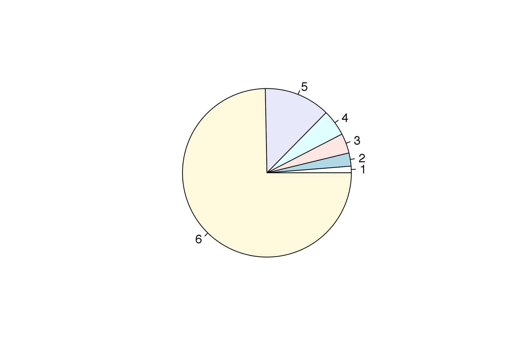
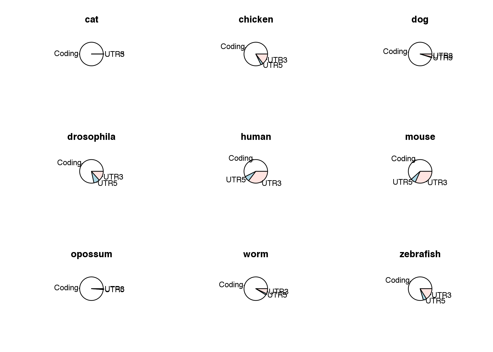

Introduction to R
================
Anton Enright & Dimitrios Vitsios
'13 June, 2017'

-   [About R](#about-r)
-   [Getting Started](#getting-started)
-   [Assignment and Operations](#assignment-and-operations)
-   [Object types in R](#object-types-in-r)
-   [Questioning the numbers](#questioning-the-numbers)
-   [Basic Plotting and Graphing](#basic-plotting-and-graphing)
-   [Exercises](#exercises)

About R
-------

R is a free software environment for statistical computing. R is a free tool that you can download and use on a variety of platforms and environments. The [R project](http://www.r-project.org) R Webpage is a good place to learn more about R.

In this session we will focus on learning the basics of R so that we will be able to use BioConductor properly in the next session. R contains a vast collection of resources and tools many of which are beyond the scope of this session.

Getting Started
---------------

First load up RStudio, there should be a shortcut on your desktop. You should now see a window like this: 

This is the R terminal where we will type commands for both R and Bioconductor.

In this web page, sections like the following contain commands that you can copy and paste into the R terminal. The output you should expect to get from R will be presented like this (below).

``` r
setwd("~/Desktop/course_data/intro/")
print("Hello Anton!")
```

               ## [1] "Hello Anton!"

To get help in R just type a question mark before the name of the command, for example, for the plot&lt; function:

``` r
?plot
```

Finally to quit R just type at the prompt:

    quit()

Assignment and Operations
-------------------------

Simple operations are easy to calculate in R, including multiplication, division, addition, subtraction etc. Here are some examples results below commands:

``` r
2+1

3-5

4*4

16/4

7.15 * sqrt(4)
```

               ## [1] 3
               ## [1] -2
               ## [1] 16
               ## [1] 4
               ## [1] 14.3

To save one of these results, we can assign it to a variable, using the "&lt;-" symbol. We can then use these variables in further operations.

``` r
x <- 2+1

y <- 7.15 * sqrt(4)

x + y
```

               ## [1] 17.3

One of R's benefits is that it can deal with many numbers at once. In order to tell R that we want to treat a series of numbers as one object, we can use the c command to "combine" objects into a list.

``` r
bubba <- c(1,2,3,4,10,59)
```

To see what numbers are stored in bubba we can just type "bubba":

``` r
bubba
```

               ## [1]  1  2  3  4 10 59

And now, we can perform operations on all of these numbers at once:

``` r
bubba + 1

bubba * 10
```

               ## [1]  2  3  4  5 11 60
               ## [1]  10  20  30  40 100 590

We can also use the many functions available in R:

``` r
sum(bubba)
mean(bubba)
max(bubba)
min(bubba)
sd(bubba)
range(bubba)
length(bubba)
```

               ## [1] 79
               ## [1] 13.16667
               ## [1] 59
               ## [1] 1
               ## [1] 22.67524
               ## [1]  1 59
               ## [1] 6

If you don't know the proper command for a mathematical function you might want to use, you can either use the "Search help" option in the "Help" menu, or the "??" command:

    ??deviation

If you wish to work with only one of the numbers you can get access to it using the variable and then square brackets indicating the position in the series:

``` r
bubba[1]        # This accesses the first element of bubba

bubba[5]        # The Fifth Element, of bubba
```

               ## [1] 1
               ## [1] 10

Using the **c** command we can also store text (between quotes):

``` r
names <- c("Tom", "Anton", "James")

names[2]
```

               ## [1] "Anton"

You now have a list of numbers and are ready to explore. In the sections that follow we will examine the basic operations in R that will allow you to do some of the analyses required in the next practical.

Object types in R
-----------------

These objects are simple lists, we will need later to use more complicated objects to store more complicated data.


Questioning the numbers
-----------------------

With R, we can "ask" things of the numbers. For instance, we might want to know which of the stored in *bubba* are larger than 2:

``` r
bubba

bubba > 2
```

               ## [1]  1  2  3  4 10 59
               ## [1] FALSE FALSE  TRUE  TRUE  TRUE  TRUE

We get a list of TRUE / FALSE values (usually called *"Logical"*). They can be quite useful, as can be seen by the following two examples:

``` r
sum(bubba > 2)

bubba[bubba > 2]
```

               ## [1] 4
               ## [1]  3  4 10 59

-   What do these commands do?
-   How would you print out the numbers in bubba that are smaller or larger than the *mean* of bubba?

Basic Plotting and Graphing
---------------------------

Once your data is stored in a variable it is relatively easy to plot. To plot the values we just assigned simply type:

``` r
plot(bubba)
```


You should have a plot like the one above

You could also try other types of plot such as:

``` r
barplot(bubba)
```


``` r
pie(bubba)
```



You might also try playing with some example data on flowers (iris) that come with R.

``` r
flowerdata <- iris       # Reads in the included "iris" data and saves it as "flowerdata"
```

It is quite useful to find out what kind of object you have, and what kind of data it contains:

``` r
class(flowerdata)
```

               ## [1] "data.frame"

A "data.frame" is a table. The flowerdata data.frame contains information about flowers, which we can open in an external editor, or simply view inside R by typing "flowerdata".

    edit(flowerdata)         # Opens an external editor

To quickly find out the size of the table, we can use ask for its dimensions:

``` r
dim(flowerdata)          # returns the dimensions of an object
```

               ## [1] 150   5

We now know that flowerdata contains 150 rows and 5 columns. We can use the square brackets to access subsets of the table. In order to access particular cells we need to specify the row number and then the column number separated by a comma. By leaving out either the row or the column number we can gain access to complete columns or rows.

``` r
flowerdata[11,2]         # the element that is in row 11 and column 2
```

               ## [1] 3.7

``` r
flowerdata[11,]          # row number 11
```

               ##    Sepal.Length Sepal.Width Petal.Length Petal.Width Species
               ## 11          5.4         3.7          1.5         0.2  setosa

``` r
flowerdata[,2]            # column number 2
```

               ##   [1] 3.5 3.0 3.2 3.1 3.6 3.9 3.4 3.4 2.9 3.1 3.7 3.4 3.0 3.0 4.0 4.4 3.9
               ##  [18] 3.5 3.8 3.8 3.4 3.7 3.6 3.3 3.4 3.0 3.4 3.5 3.4 3.2 3.1 3.4 4.1 4.2
               ##  [35] 3.1 3.2 3.5 3.6 3.0 3.4 3.5 2.3 3.2 3.5 3.8 3.0 3.8 3.2 3.7 3.3 3.2
               ##  [52] 3.2 3.1 2.3 2.8 2.8 3.3 2.4 2.9 2.7 2.0 3.0 2.2 2.9 2.9 3.1 3.0 2.7
               ##  [69] 2.2 2.5 3.2 2.8 2.5 2.8 2.9 3.0 2.8 3.0 2.9 2.6 2.4 2.4 2.7 2.7 3.0
               ##  [86] 3.4 3.1 2.3 3.0 2.5 2.6 3.0 2.6 2.3 2.7 3.0 2.9 2.9 2.5 2.8 3.3 2.7
               ## [103] 3.0 2.9 3.0 3.0 2.5 2.9 2.5 3.6 3.2 2.7 3.0 2.5 2.8 3.2 3.0 3.8 2.6
               ## [120] 2.2 3.2 2.8 2.8 2.7 3.3 3.2 2.8 3.0 2.8 3.0 2.8 3.8 2.8 2.8 2.6 3.0
               ## [137] 3.4 3.1 3.0 3.1 3.1 3.1 2.7 3.2 3.3 3.0 2.5 3.0 3.4 3.0

We can use different plots to look at the data:

``` r
plot(flowerdata[,2])
```


``` r
hist(flowerdata[,2])
```


``` r
boxplot(flowerdata, col=rainbow(5))
```


In order to save some of these results as a PDF file, we can do the following:

    pdf("flower_images.pdf")

    boxplot(flowerdata, col=rainbow(5))

    dev.off()

This will send any image that is produced after the <i>pdf</i> function into a file, closing that file when *dev.off()* is called.

\#\#Loading Data From a Text File
</H3>
Lets load in some external data from a text file.

The file [genomes.txt](genomes.txt) should already be inside the course\_material folder on your desktop. We can then load this file into R with the following:

``` r
genomes <- read.table("genomes.txt", row.names=1, header=TRUE)
```

What does this file contain? Let us try out some more commands:

``` r
dim(genomes)
```

               ## [1]  9 13

``` r
colnames(genomes)
```

               ##  [1] "Genome.length"      "Genes"              "Transcripts"       
               ##  [4] "Coding"             "Exons"              "Introns"           
               ##  [7] "Transcripts.length" "Coding.length"      "Exons.length"      
               ## [10] "Introns.length"     "UTR5.length"        "UTR3.length"       
               ## [13] "MultiTransGenes"

``` r
rownames(genomes)
```

               ## [1] "cat"        "chicken"    "dog"        "drosophila" "human"     
               ## [6] "mouse"      "opossum"    "worm"       "zebrafish"

``` r
head(genomes)
```

               ##            Genome.length Genes Transcripts Coding  Exons Introns
               ## cat           4055847588 18377       18377  15048 194384  176007
               ## chicken       1100480441 17858       17858  16736 164238  146380
               ## dog           2531673953 24045       24045  19305 201708  177663
               ## drosophila     168736537 15178       15178  14141  60048   44870
               ## human         3090081323 36953       36953  21359 231277  194324
               ## mouse         2716965481 31804       31804  23497 217952  186148
               ##            Transcripts.length Coding.length Exons.length Introns.length
               ## cat                  25726822      24621516     25726822      827552084
               ## chicken              29749958      24332411     29749958      376951972
               ## dog                  33990435      30675983     33990435      587007775
               ## drosophila           28857046      22370742     28857046       48449314
               ## human                65116403      33887121     65116403     1060714248
               ## mouse                59754111      34549583     59754111      873541323
               ##            UTR5.length UTR3.length MultiTransGenes
               ## cat                  0           0              NA
               ## chicken         905240     4349152            3901
               ## dog             246727     1310786            4524
               ## drosophila     2339329     3836127            3463
               ## human          4282528    20893311           11075
               ## mouse          3750716    17745067            8903

``` r
genomes["mouse",]
```

               ##       Genome.length Genes Transcripts Coding  Exons Introns
               ## mouse    2716965481 31804       31804  23497 217952  186148
               ##       Transcripts.length Coding.length Exons.length Introns.length
               ## mouse           59754111      34549583     59754111      873541323
               ##       UTR5.length UTR3.length MultiTransGenes
               ## mouse     3750716    17745067            8903

``` r
summary(genomes)
```

               ##  Genome.length           Genes        Transcripts        Coding     
               ##  Min.   :1.003e+08   Min.   :15178   Min.   :15178   Min.   :14141  
               ##  1st Qu.:1.100e+09   1st Qu.:18377   1st Qu.:18377   1st Qu.:16736  
               ##  Median :2.532e+09   Median :24045   Median :24045   Median :19466  
               ##  Mean   :2.095e+09   Mean   :24227   Mean   :24227   Mean   :19319  
               ##  3rd Qu.:3.090e+09   3rd Qu.:27928   3rd Qu.:27928   3rd Qu.:21359  
               ##  Max.   :4.056e+09   Max.   :36953   Max.   :36953   Max.   :24147  
               ##                                                                     
               ##      Exons           Introns       Transcripts.length Coding.length     
               ##  Min.   : 60048   Min.   : 44870   Min.   :25726822   Min.   :22370742  
               ##  1st Qu.:164238   1st Qu.:146380   1st Qu.:29018327   1st Qu.:24621516  
               ##  Median :194384   Median :176007   Median :31700945   Median :30462695  
               ##  Mean   :178314   Mean   :154086   Mean   :38555971   Mean   :28923326  
               ##  3rd Qu.:217952   3rd Qu.:186148   3rd Qu.:43089692   3rd Qu.:33887121  
               ##  Max.   :231277   Max.   :195807   Max.   :65116403   Max.   :34549583  
               ##                                                                         
               ##   Exons.length      Introns.length       UTR5.length     
               ##  Min.   :25726822   Min.   :3.213e+07   Min.   :      0  
               ##  1st Qu.:29018327   1st Qu.:3.770e+08   1st Qu.: 246727  
               ##  Median :31700945   Median :5.870e+08   Median : 905240  
               ##  Mean   :38555971   Mean   :5.824e+08   Mean   :1569940  
               ##  3rd Qu.:43089692   3rd Qu.:8.735e+08   3rd Qu.:2339329  
               ##  Max.   :65116403   Max.   :1.061e+09   Max.   :4282528  
               ##                                                          
               ##   UTR3.length       MultiTransGenes
               ##  Min.   :       0   Min.   : 3357  
               ##  1st Qu.: 1310786   1st Qu.: 3792  
               ##  Median : 3836127   Median : 4288  
               ##  Mean   : 6351649   Mean   : 5723  
               ##  3rd Qu.: 6916984   3rd Qu.: 7110  
               ##  Max.   :20893311   Max.   :11075  
               ##                     NA's   :1

A data frame can be considered as a simple table. How do we add a new column? Lets make a column with average transcript lengths for all available genomes. We can then plot the results with a simple barplot function.

``` r
genomes$Average.transcript.length <- genomes$Transcripts.length/genomes$Transcripts

barplot(genomes$Average.transcript.length, names.arg=rownames(genomes), col="lightblue")
```



Exercises
---------

-   Make pie charts of exon versus intron length in each species (shown below)
-   Calculate length of an average human intron.
-   Which animal genomes have less than 20000 coding sequences?
-   How many exons per gene are on average for each of the available species?

Lets make pie charts of exon vs intron total length for all genomes.

There are nine species, so we have to divide the plot into 9 parts.

``` r
par(mfrow = c(3, 3))
for (species in rownames(genomes)) {
   print(species)
   pie(c(genomes[species,"Coding.length"],genomes[species,"UTR5.length"],genomes[species,"UTR3.length"]), main=species, labels=c("Coding","UTR5","UTR3"))
}
```

               ## [1] "cat"

               ## [1] "chicken"

               ## [1] "dog"

               ## [1] "drosophila"

               ## [1] "human"

               ## [1] "mouse"

               ## [1] "opossum"

               ## [1] "worm"

               ## [1] "zebrafish"


What percentage of genes has splice variants?

Use the function cor.test to test whether there is correlation between genome size and intron length. What happens when we eliminate the cat genome? (hint, use **"genomes\[-1,\]"** instead of **"genomes"**)
