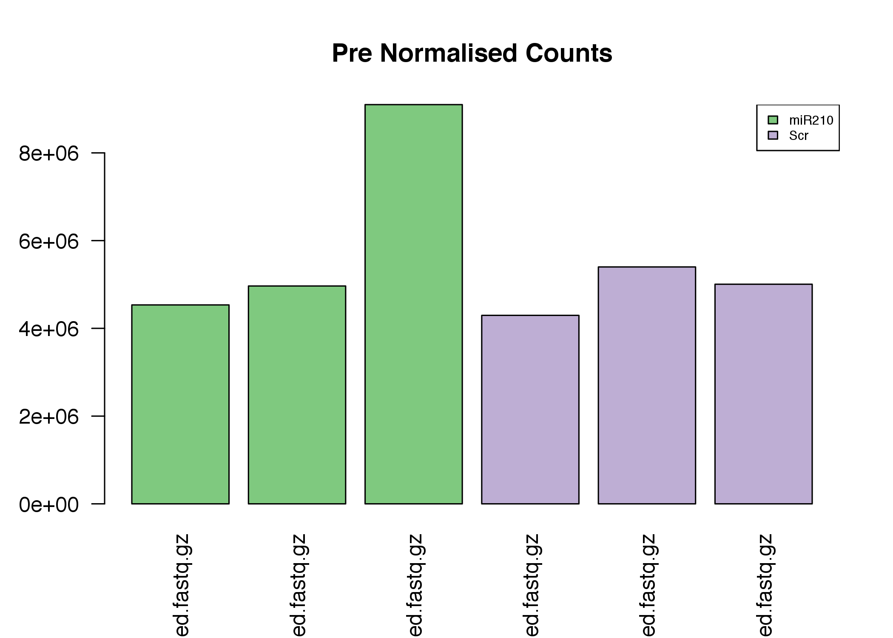
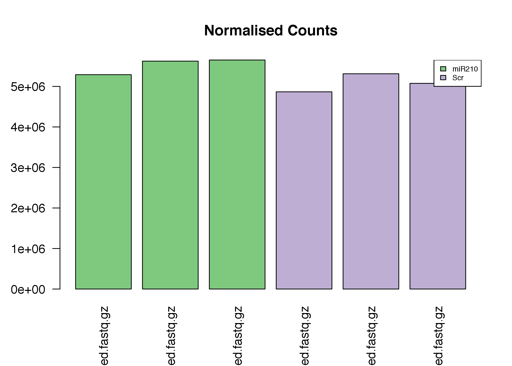
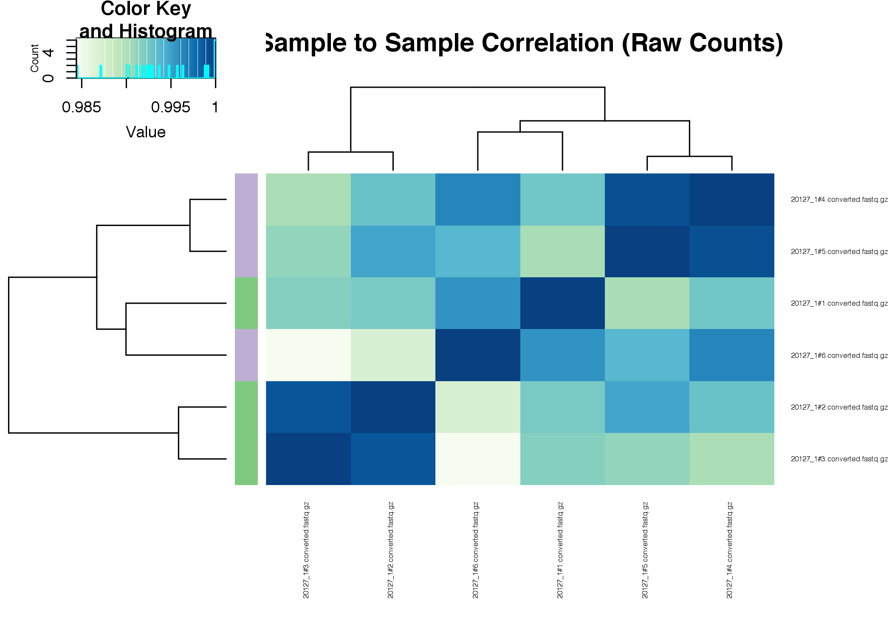
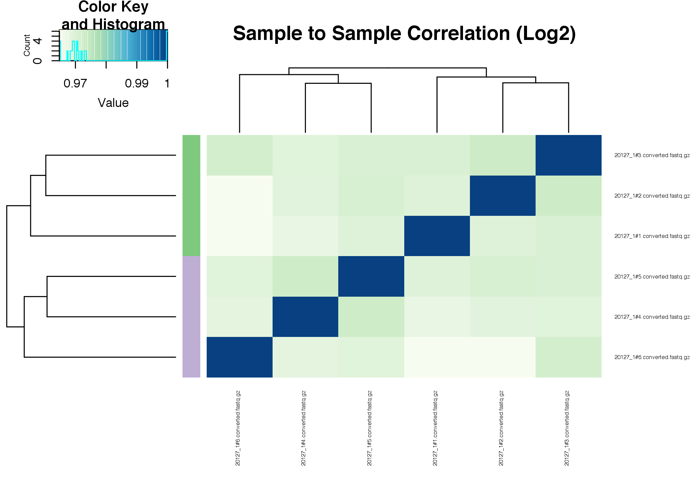
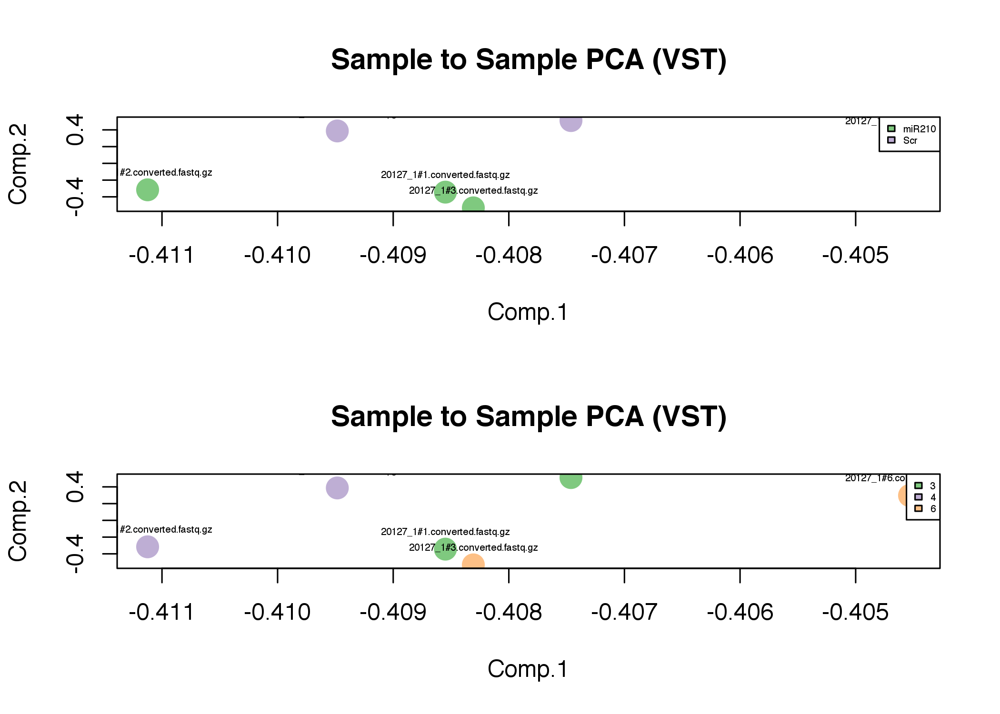
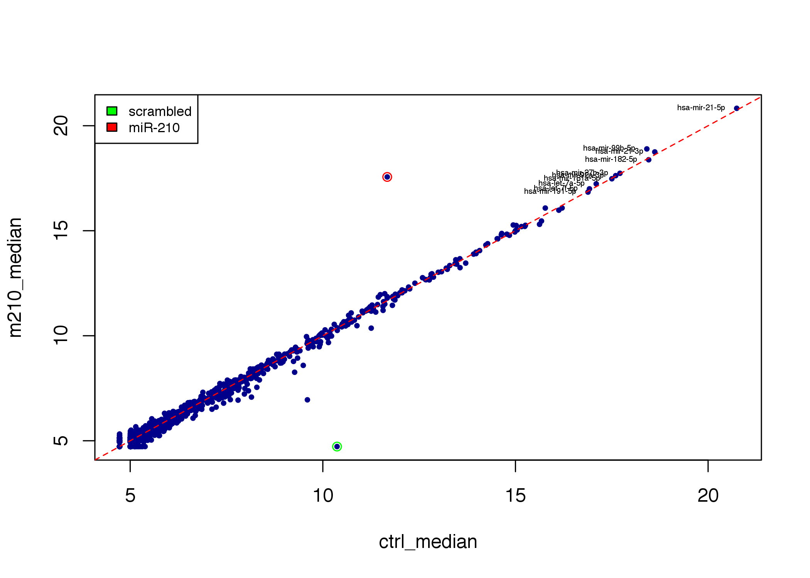
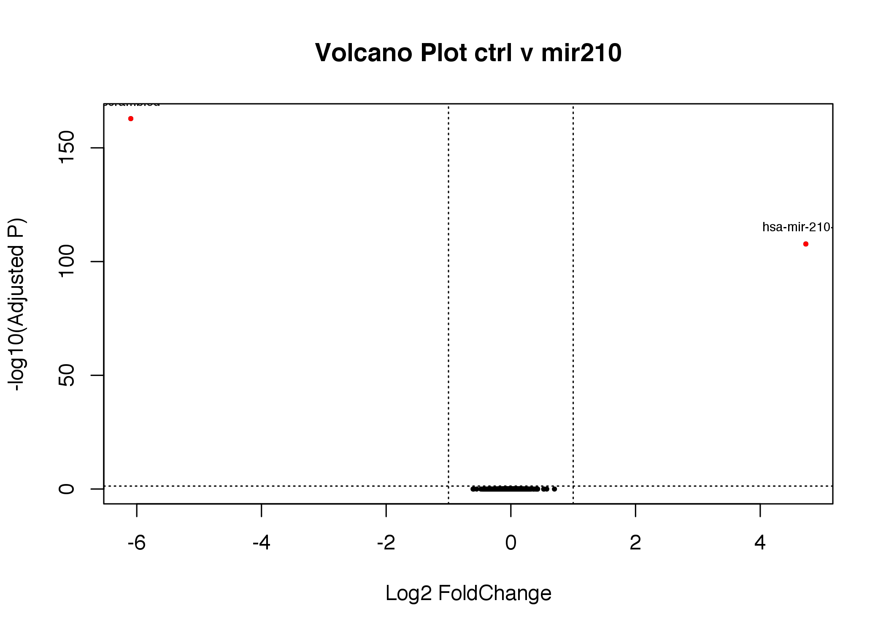

Analysis of HPV count data - Transcript level
================
Anton Enright
'12 June, 2017'

-   Analysis of course sRNA-Seq data
    -   Experiment Overview
    -   Raw Data
    -   Count loading & Normalisation
    -   Post Normalisation QC
    -   Variance Stabilising the Counts
    -   Analysis of treatment effects
    -   Statistical Analysis - Differential Expression
    -   Final Results

Analysis of course sRNA-Seq data
================================

Experiment Overview
-------------------

This set of sequencing data is from the libraries prepared by participants. We have matched microRNA and mRNA samples to sequence in Breast Cancer MCF7 Human Cells. The experiment here was to overexpress miR-210 to explore the effect on mRNAs. Control samples used a non mouse microRNA from c.elegans (cel-miR-67) TCACAACCTCCTAGAAA

| filename                       | group | samplename | treatment | fullname          | 3p-ad               |
|--------------------------------|-------|------------|-----------|-------------------|---------------------|
| 20127\_1\#1.converted.fastq.gz | 3     | 3A         | miR210    | miRNA03\_MIR\_GR3 | TGGAATTCTCGGGTGCCAA |
| 20127\_1\#2.converted.fastq.gz | 4     | 4A         | miR210    | miRNA04\_MIR\_GR4 | TGGAATTCTCGGGTGCCAA |
| 20127\_1\#3.converted.fastq.gz | 6     | 3B         | miR210    | miRNA14\_MIR\_GR6 | TGGAATTCTCGGGTGCCAA |
| 20127\_1\#4.converted.fastq.gz | 3     | 7A         | Scr       | miRNA07\_SCR\_GR3 | TGGAATTCTCGGGTGCCAA |
| 20127\_1\#5.converted.fastq.gz | 4     | 8A         | Scr       | miRNA08\_SCR\_GR4 | TGGAATTCTCGGGTGCCAA |
| 20127\_1\#6.converted.fastq.gz | 6     | 6B         | Scr       | miRNA16\_SCR\_GR6 | TGGAATTCTCGGGTGCCAA |

Raw Data
--------

The raw data is available [here](http://wwwdev.ebi.ac.uk/enright-srv/courses/rna_cambridge_2017/course_counts/data).

``` r
setwd('/Users/dvitsios/Desktop/EMBO_2017/Courses-and-Practicals/EMBO_Greece_2017/miR_210_Experiment/small_RNASeq/')
library(RColorBrewer)
library(gplots)
library(DESeq2)
hmcol = colorRampPalette(brewer.pal(9, "GnBu"))(100)
```

We can now load the count data

``` r
#setwd("/Users/dvitsios/Desktop/EMBO_2017/Courses-and-Practicals/EMBO_Greece_2017/miR_210_Experiment/small_RNASeq/data")
mircounts <- read.table("data/mircounts.txt",header=TRUE,row.names=1)
```

As well as the pdata, which contains information on each sample.

``` r
pdata <- read.table("data/pdata.txt",header=TRUE,row.names=1,sep="\t")
colnames(mircounts)=rownames(pdata)

groups=as.factor(pdata$group)
conds=as.factor(pdata$treatment)
```

Count loading & Normalisation
-----------------------------

We are now ready to create a DESeq object from the counts table. We are only looking at one condition, tretment of the samples with estradiol. We use the design formula “~ treatment”. We are going to estimate coefficients for the treatment conditions (Scrambled Control versus miR210 Overexpression)

``` r
coldata = as.data.frame(t(t(conds)))
rownames(coldata)=colnames(mircounts)
colnames(coldata)='treatment'

dds <- DESeqDataSetFromMatrix(countData = mircounts, colData = coldata, design = ~ treatment)
```

We are ready to normalise the data, but first we should look at the number of sequenced reads per sample.

``` r
cond_colours = brewer.pal(length(unique(conds)),"Accent")[as.factor(conds)]
```

    ## Warning in brewer.pal(length(unique(conds)), "Accent"): minimal value for n is 3, returning requested palette with 3 different levels

``` r
names(cond_colours)=conds

group_colours = brewer.pal(3,"Accent")[as.factor(pdata$group)]
names(group_colours)=pdata$group

barplot(apply(mircounts,2,sum), las=2,col=cond_colours,main="Pre Normalised Counts")
legend("topright",levels((conds)),cex=0.6,fill=cond_colours[levels(conds)])
```



We can also estimate the dispersion of the data.

``` r
dds <- estimateSizeFactors(dds)
dds <- estimateDispersions(dds)
```

    ## gene-wise dispersion estimates

    ## mean-dispersion relationship

    ## final dispersion estimates

``` r
plotDispEsts(dds)
```


Post Normalisation QC
---------------------

Now we can normalise and plot the counts again.

``` r
normcounts <- counts(dds, normalized=TRUE)
rawcounts=counts(dds,normalized=FALSE)
log2counts=log2(normcounts+1)


barplot(apply(normcounts,2,sum), las=2,col=cond_colours,main="Normalised Counts")

legend("topright",levels((conds)),cex=0.6,fill=cond_colours[levels(conds)])
```



Variance Stabilising the Counts
-------------------------------

We will use an alternative to straight log2 transformation, instead we will use the VST transformation from the DESeq2 package to do something similar to the log transformation but in a way that stabilises the variance for low counts.

``` r
vsd <- varianceStabilizingTransformation(dds)
vstcounts <- assay(vsd)
vstcounts <- vstcounts[order(apply(vstcounts,1,sum),decreasing =TRUE),]
```

As an additional QC step we can calculate the sample-to-sample Pearson correlations and plot them in a heatmap.

``` r
heatmap.2(cor(rawcounts),trace="none",col=hmcol,main="Sample to Sample Correlation (Raw Counts)",cexRow=0.5,cexCol=0.5,RowSideColors=cond_colours, margins=c(9,7))
```



``` r
heatmap.2(cor(vstcounts),trace="none",col=hmcol,main="Sample to Sample Correlation (VST)",cexRow=0.5,cexCol=0.5,RowSideColors=cond_colours, margins=c(9,7))
```


``` r
heatmap.2(cor(log2counts),trace="none",col=hmcol,main="Sample to Sample Correlation (Log2)",cexRow=0.5,cexCol=0.5,RowSideColors=cond_colours, margins=c(9,7))
```



We can also perform PCA to see if the miR-210 overexpression explains a significant fraction of the variance

``` r
pca <- princomp(vstcounts)


par(mfrow=c(2,1))
plot(pca$loadings, col=cond_colours,  pch=19, cex=2, main="Sample to Sample PCA (VST)")
text(pca$loadings, as.vector(colnames(mircounts)), pos=3, cex=0.4)
legend("topright",levels(conds),fill=cond_colours[levels(conds)],cex=0.4)

plot(pca$loadings, col=group_colours,  pch=19, cex=2, main="Sample to Sample PCA (VST)")
text(pca$loadings, as.vector(colnames(mircounts)), pos=3, cex=0.4)
legend("topright",levels(groups),fill=group_colours[levels(groups)],cex=0.4)
```



Analysis of treatment effects
-----------------------------

We can look at the differences between treatments.

``` r
m210_median = apply(vstcounts[,1:3],1,median)
ctrl_median= apply(vstcounts[,4:6],1,median)


plot(ctrl_median,m210_median,pch=19,cex=0.5,col="darkblue")
points(ctrl_median["hsa-mir-210-3p"],m210_median["hsa-mir-210-3p"],col="red")
points(ctrl_median["scrambled"],m210_median["scrambled"],col="green")
abline(a=0,b=1,lty=2,col="red",cex=0.5)
text(ctrl_median[1:10],m210_median[1:10],labels=names(ctrl_median[1:10]),cex=0.4,pos=2)
legend("topleft",c("scrambled","miR-210"),fill=c("green","red"),cex=0.7)
```



Statistical Analysis - Differential Expression
----------------------------------------------

The function nbinomWaldTest fits a negative binomial generalized linear model to each gene and then calculates the significance of the estimated coeffients. We contrast the control and the overexpressed miR210 samples.

``` r
p_threshold=0.05
lfc_threshold=1

cds <- nbinomWaldTest(dds)

res=results(cds,contrast=c("treatment","miR210","Scr"))
res <- res[order(res$padj),]
sig = rownames(res[(abs(res$log2FoldChange) > lfc_threshold) & (res$padj < p_threshold) & !is.na(res$padj),])

sig
```

    ## [1] "scrambled"      "hsa-mir-210-3p"

We can visualise the differentially expressed genes with a Volcano Plot, we’re plotting the log2 Fold-change of each gene (x-axis) against the -log10 of its p-value (y-axis).

``` r
plot(res$log2FoldChange,-log(res$padj,10),ylab="-log10(Adjusted P)",xlab="Log2 FoldChange",main=paste("Volcano Plot","ctrl v mir210"),pch=19,cex=0.4)      
text(res[sig,]$log2FoldChange,-log(res[sig,]$padj,10),labels=rownames(res[sig,]),pos=3,cex=0.6)
points(res[sig,"log2FoldChange"],-log(res[sig,"padj"],10),pch=19,cex=0.4,col="red")
abline(h=-log10(p_threshold),lty=3)
abline(v=-lfc_threshold,lty=3)
abline(v=lfc_threshold,lty=3) 
```



Final Results
-------------

Lets make a heatmap for the significant miRs so we can see their expression across replicates.

``` r
heatmap.2(vstcounts[sig,],trace="none",col=hmcol,main="Significant miRs",cexRow=0.5,cexCol=0.5,ColSideColors=cond_colours, margins=c(9,7),Colv=FALSE,dendrogram="row")
```


