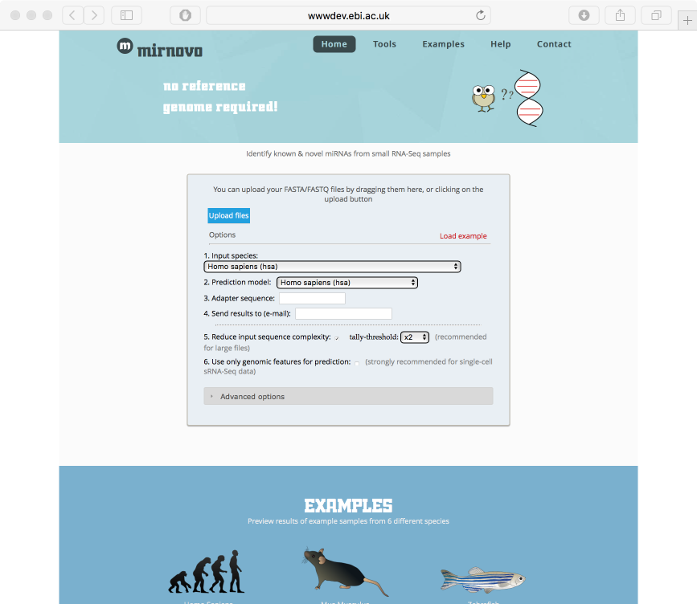

<!DOCTYPE HTML PUBLIC "-//W3C//DTD HTML 4.0 Transitional//EN">
<?php include ("../header_int.php"); ?>

<H1>Introduction to microRNA discovery</H1>

 

<H3>About mirNovo</H3>

MirNovo is a new tool for the prediction of microRNAs from sequencing data. This tool processes raw or tallied FASTA/FASTQ
reads from sequencing runs and looks at patterns of read distributions using machine learning. The tool does not require
a genome and can predict microRNAs either with or without genomic information available with high accuracy.

 
 
  

We will <a href="data">download</a> an example dataset to run through the miRNovo server.

  

The test web server is <a href="http://wwwdev.ebi.ac.uk/enright-dev/mirnovo/">here</a>. This website is still beta
and has not yet been published.

 

Here are some example predicted microRNAs and hairpins obtained

</body>
</html>
