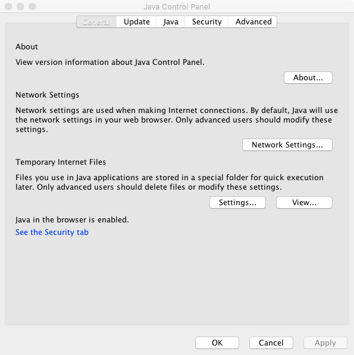
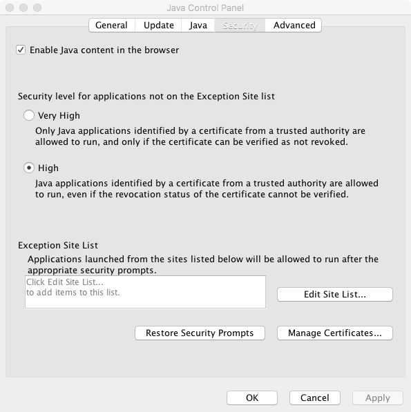
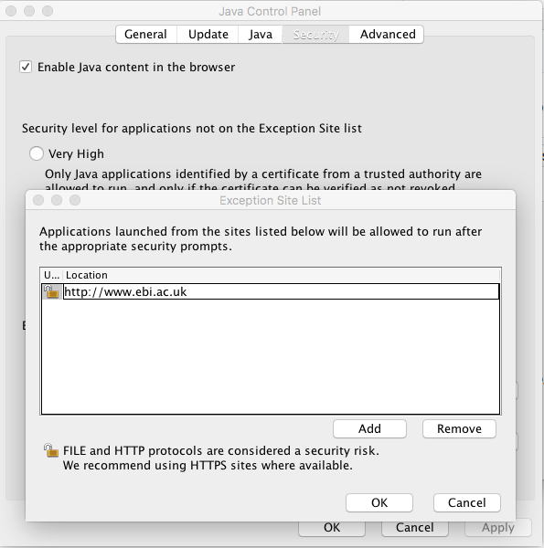
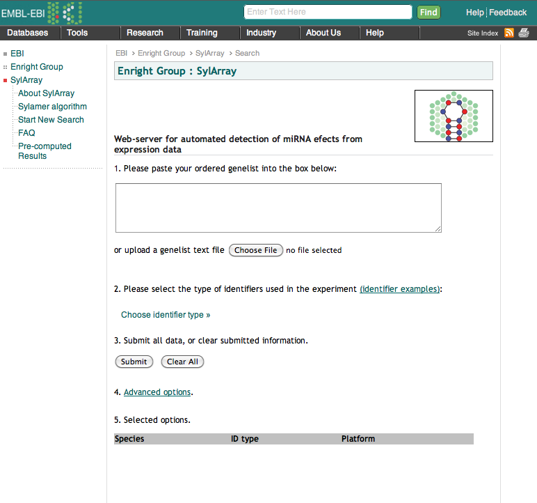
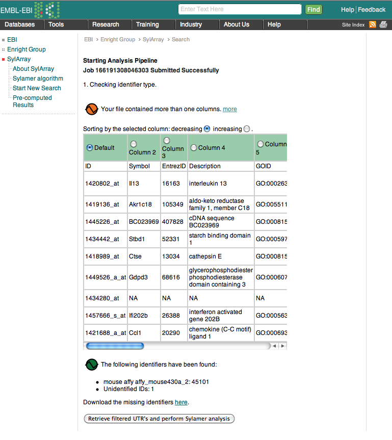
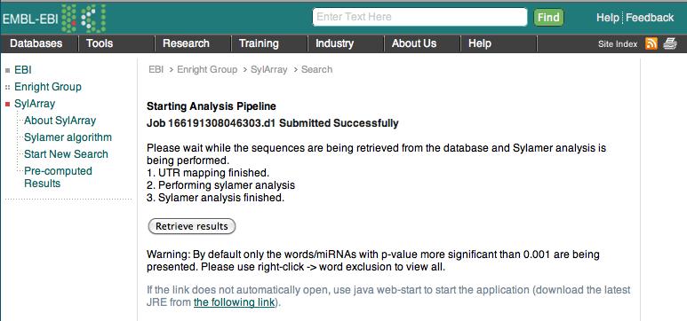
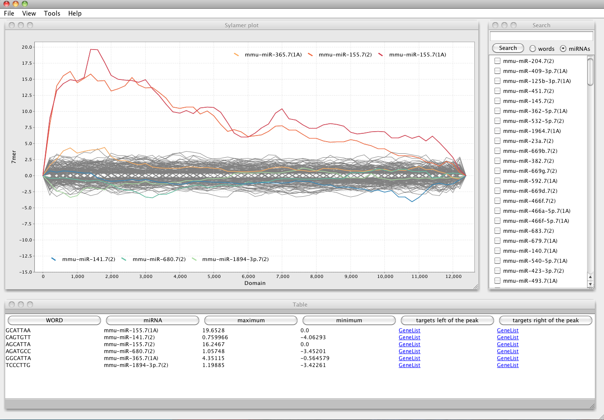

Sylamer Analysis for microRNA Target Detection
================
Jack Monahan, Yuvia Perez Rico and Jan Provaznik

12 September 2017


MicroRNA Target Analysis from Expression Data
---------------------------------------------

The Sylamer tool is widely used for analysis of miRNA effects from large-scale gene-expression data. However it requires the user to prepare both lists of genes which have changed in an experiment and also a set of annotated 3'UTR sequences within which to search for signals.

In order to simplify the process we have created a new tool called SylArray. This tool automates the entire process and simply requires the user to submit a list of sorted gene-iden tifiers or probe identifiers from a microarray experiment.

For a detailed description of the method, please see the [Sylamer](http://www.ncbi.nlm.nih.gov/sites/entrez?holding=&db=PubMed&cmd=search&term=18978784) and [SylArray](http://www.ncbi.nlm.nih.gov/sites/entrez?holding=&db=PubMed&cmd=search&term=20871108) papers.

We will use the genelist that we created from our previous differential expression analysis.

## Java Setup 
Before we start, we need to setup Java to allow us to run webstart applications.

Open a Terminal and type:
```
/BGA2017/Oracle_java/jre/jre1.8.0_131/bin/ControlPanel 
```

This opens the java control panel
<br><br>

***

Now go to the **Security** tab
<br><br>

***

Then click on **Edit Site List...**
<br><br>

Now add **http://www.ebi.ac.uk** and click **OK**

Make sure the security setting is set at: **High** and not _Very High_

## Analysis of a classic microRNA Knockout - miR-155 
This is a reanalysis of the first microRNA knockout mouse model, i.e. miR-150 in murine T-cells.

The data for this analysis is available [here](http://wwwdev.ebi.ac.uk/enright-srv/courses/rna_cambridge_2017/sylamer/full_results.txt)

## Sylarray Web-server for automated Sylamer analysis of miR-155 data
Lets go to the [SylArray Website](http://www.ebi.ac.uk/enright-srv/sylarray/)



## Basic Usage
This first page allows you to upload your own genelist to the server.

* Your data should be ordered according to fold-change or t-statistic.
* You can use many kinds of _IDs, gene symbols, Affy IDs, Illumina IDs, etc._
* This should be the full genelist including genes that didn't change, these are used as controls.
* Genelists shorter than 5,000 genes will not work well.


## Upload an Affymetrix Genelist (sorted on fold-change)
We will upload a genelist which we have created from our previous differential expression analysis of miR-155 knockout in mouse. The experiment was performend on the Affymetrix platform where T-cells from wildtype mice were compared to T-cells from mutant mice. 

The phenotype in this case was severe inflamation of lung and GI tract coupled with a failure to raise an effective immune response after stimulation. 

We want to determine whether it is likely that the gene knocked out, or its passenger miRNA is the cause of the phenotype. 

More Specifically, we want to know:
* Can we detect any miRNA signatures in the expression data
* If so, then what miRNA seems to be responsible
* How strong is the effect
* Which genes appear to be responsible
Lets go to the SylArray page and upload our genelist. 

Select the species, mouse, platform affy and identifier type:
**mouse >> affy >> affy_mouse430_2**



Once the genelist is loaded you will see a summary page describing how many of your identifiers the system could map to 3'UTR sequences. 



The final stage will download a file called webstart.jnlp, on some machines this will open automatically.
However on linux we need to launch it ourselves.

It should have downloaded to the Downloads folder:

```
cd ~/Downloads
 /BGA2017/Oracle_java/jre/jre1.8.0_131/bin/javaws webstart.jnlp 
```

## Data Analysis and Interpretation
We should now finally get the Sylamer output for our experiment


## Analyse the miR-210 Data

You should go and upload the sorted genelist we obtained from the mRNA sequencing experiment earlier.

The identifier types are:
**human >> ensembl >> ensembl_gene_id**

We will now see if the overexpression experiment has had any effect on global mRNA levels in the experiment.


