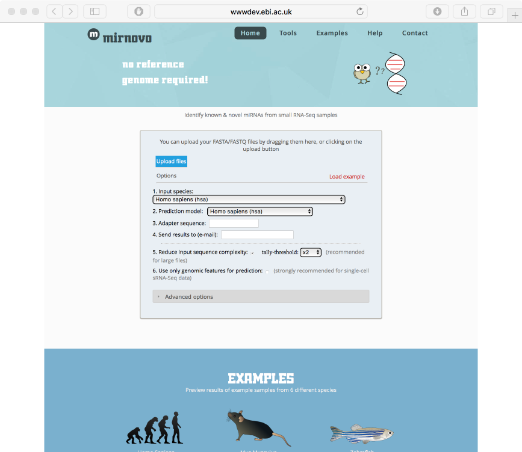
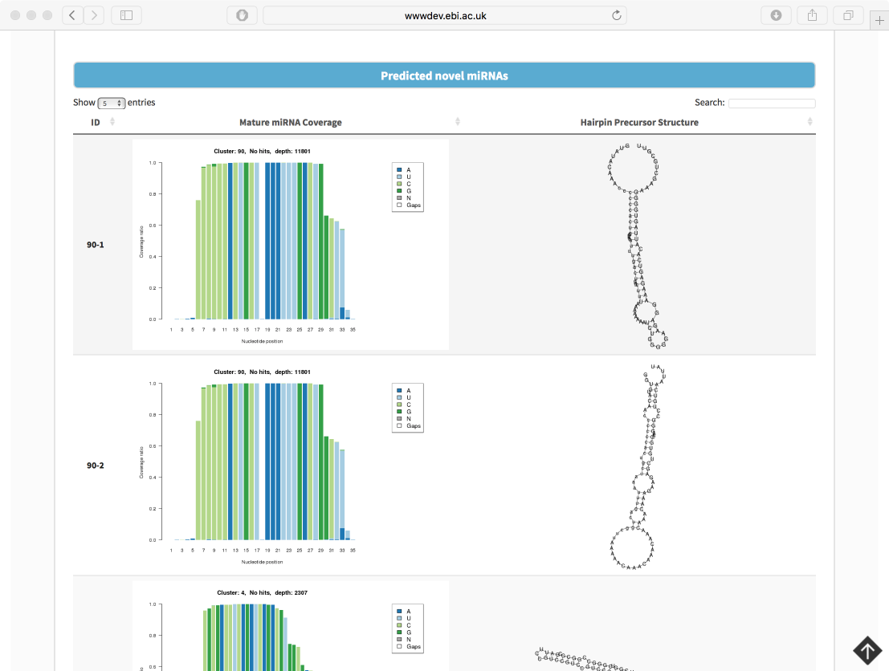

<!DOCTYPE HTML PUBLIC "-//W3C//DTD HTML 4.0 Transitional//EN">
<?php include ("../header_int.php"); ?>

<H1>Introduction to microRNA discovery</H1>

 

<H3>About mirNovo</H3>

MirNovo is a new tool for predicting miRNAs from sequencing data. This tool processes raw or tallied FASTA/FASTQ
reads and uses machine learning to look at the patterns of read distributions. This tool predicts miRNAs with high accuracy with or without genomic information.

 
 
  

We will <a href="data">download</a> an example dataset to run through the miRNovo server.

  

The web server is <a href="http://wwwdev.ebi.ac.uk/enright-dev/mirnovo/">here</a>. mirNovo will be published in Nucleic Acids Research later this month.

 

Here are some example predicted microRNAs and hairpins obtained

</body>
</html>
