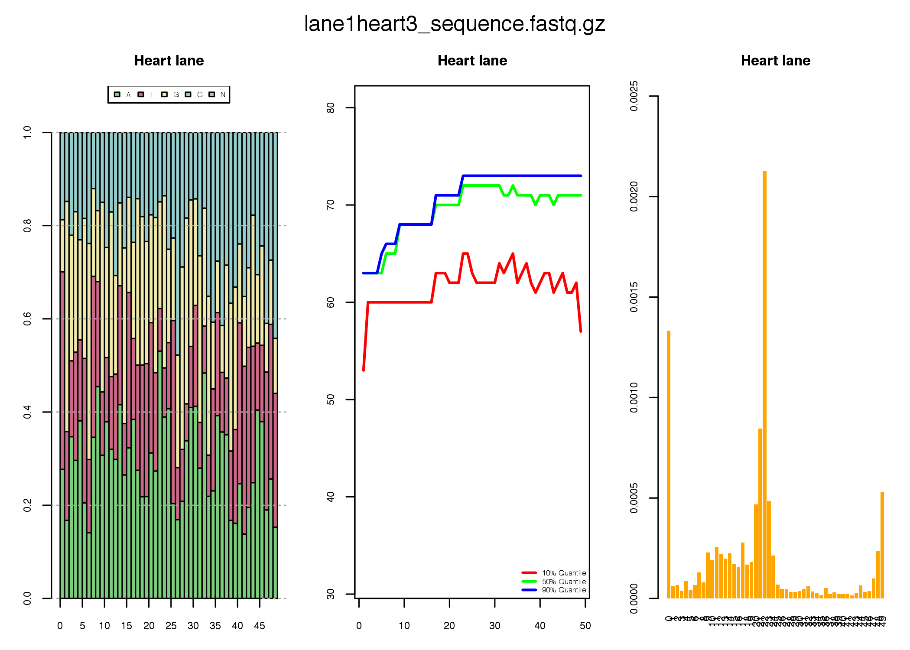

Small RNA Seq - Practical 1
================
Jack Monahan, Yuvia Perez Rico and Jan Provaznik

12 September, 2017

-   [Analysis of smallRNA Seq datasets](#analysis-of-smallrna-seq-datasets)
    -   [The Fastq file format](#the-fastq-file-format)
    -   [Adapter Stripping for smallRNAs using *Reaper*](#adapter-stripping-for-smallrnas-using-reaper)
    -   [SmallRNA Read Quality Control](#smallrna-read-quality-control)
    -   [Mapping Cleaned Reads to MicroRNAs](#mapping-cleaned-reads-to-micrornas)

Analysis of smallRNA Seq datasets
=================================

In this practical we will be taking 8 samples of Solexa Sequencing data from the course samples that were prepared for small-RNA sequencing from total RNA.

It is important for next-gen sequence analysis to know the exact architecture of your sequencing reads including the 5' sequencing adapters and the sequences of barcoding tags and which samples each refers to

For our course data, the read architecture is as follows:

| **5' adpt**          | genomic RNA                                | **3' adpt**         |
|----------------------|--------------------------------------------|---------------------|
| &lt;5p----------&gt; | **NNNNNNNNNNNNNNNNNNNNNNNNNNNNNNNNNNNNNN** | &lt;---------3p&gt; |

Since miRNAs are shorter than the average length of a Solexa read (35-80nt), we will usually sequence through a microRNA sequence into the 3' adapter sequence. This needs to be detected and cleaned from our reads before they can be mapped. Additionally, each sequence will need to be sorted according to which barcode is present at the 5' end of the read into appropriate sample files.

Usually small RNA sequencing results in millions of reads for processing. The vast majority of tools for dealing with this kind of data require large amounts of memory and significant computing resources. However, on this course we will be testing a new ultra-fast read processor from the Enright lab, called **Reaper** which will be available in BioConductor shortly.

------------------------------------------------------------------------

The Fastq file format
---------------------

Most sequencing results can be obtained in a format called *fastq*, reflecting that they are *fasta* files with *quality* scores. These files contain the actual nucleotide bases for every sequence as well as a quality score which reflects how sure we are that each base is actually the correct one.

The quality score is usually given by a *Phred* score, which is related logarithmically to the probability of making an error when base calling. The following table describes this:

| Phred score | Probability that the base is incorrect | Precision of the base |
|-------------|----------------------------------------|-----------------------|
| 10          | 1 in 10                                | 90 %                  |
| 20          | 1 in 100                               | 99 %                  |
| 30          | 1 in 1000                              | 99.9 %                |
| 40          | 1 in 10000                             | 99.99 %               |

Getting back to our fastq file, the first few lines look like this:

    @GAII06_0003:3:1:1040:19544#0/1
    CCAAAGTGCTGGAATCACAGGCGTGAGCTACCTCGCCTGGCCTGAATTATT
    +
    bb__Zbb^^^]Z_]]aT]`^TbbYb^_`T_cc`aac^Y\`b`\`L]_]\YX</tt> 

The first line is the identifier (starting with <*@*>), the second the sequence. The third is an extra spacer line (which sometimes also has the identifier repeated). The fourth are *ascii* encoded quality scores, where each *letter* represents a different number.

This is the standard *ascii* table that was used to encode these numbers:

           0 nul    1 soh    2 stx    3 etx    4 eot    5 enq    6 ack    7 bel
           8 bs     9 ht    10 nl    11 vt    12 np    13 cr    14 so    15 si
          16 dle   17 dc1   18 dc2   19 dc3   20 dc4   21 nak   22 syn   23 etb
          24 can   25 em    26 sub   27 esc   28 fs    29 gs    30 rs    31 us
          32 sp    33  !    34  "    35  #    36  $    37  %    38  &    39  '
          40  (    41  )    42  *    43  +    44  ,    45  -    46  .    47  /
          48  0    49  1    50  2    51  3    52  4    53  5    54  6    55  7
          56  8    57  9    58  :    59  ;    60  <    61  =    62  >    63  ?
          64  @    65  A    66  B    67  C    68  D    69  E    70  F    71  G
          72  H    73  I    74  J    75  K    76  L    77  M    78  N    79  O
          80  P    81  Q    82  R    83  S    84  T    85  U    86  V    87  W
          88  X    89  Y    90  Z    91  [    92  \    93  ]    94  ^    95  _
          96  `    97  a    98  b    99  c   100  d   101  e   102  f   103  g
         104  h   105  i   106  j   107  k   108  l   109  m   110  n   111  o
         112  p   113  q   114  r   115  s   116  t   117  u   118  v   119  w
         120  x   121  y   122  z 

From this table, we can see that the very frequent quality score "b" actually represents a numerical value of 98. One small detail: since the first 0-32 ascii codes represent strange things (e.g. bell, new line, backspace) we cannot use them for encoding. Thus, in order to encode real quality scores (0-40) we first need to shift the quality scores to avoid these strange characters. Unfortunately, there are two current standards, one which shifts the quality scores by adding 33, another by adding 64. The file we'll be using has been shifted by 64. This means that "b" actually represents the quality score of 34 (98 - 64).

Some *ascii* characters are unprintable so the entire table is shifted by 33 giving a final lookup table as follows, where each symbol represents a unique quality score.

         0      !        1      "        2      #        3      $        4      %        5      &        6      '
         7      (        8      )        9      *       10      +       11      ,       12      -       13      .       14      /
        15      0       16      1       17      2       18      3       19      4       20      5       21      6       22      7
        23      8       24      9       25      :       26      ;       27      <       28      =       29      >       30      ?
        31      @       32      A       33      B       34      C       35      D       36      E       37      F       38      G
        39      H       40      I       41      J       42      K       43      L       44      M       45      N       46      O
        47      P       48      Q       49      R       50      S       51      T       52      U       53      V       54      W
        55      X       56      Y       57      Z       58      [       59      \       60      ]       61      ^       62      _
        63      `       64      a       65      b       66      c       67      d       68      e       69      f       70      g
        71      h       72      i       73      j       74      k       75      l       76      m       77      n       78      o
        79      p       80      q       81      r       82      s       83      t       84      u       85      v       86      w
        87      x       88      y       89      z

------------------------------------------------------------------------

Adapter Stripping for smallRNAs using *Reaper*
----------------------------------------------

The module is available [here](../data/Reaper_1.5.tar.gz) If you want to install this in your own R at home.

Lets install the module manually. Please open up a new terminal window.

    cd /BGA2017/Course_material/June14

    /BGA2017/R-3.4.0/bin/R CMD INSTALL Reaper_1.5.tar.gz 

This will install the module into R manually.

    * installing to library \u2018/home/aje/R/x86_64-pc-linux-gnu-library/3.4\u2019
    * installing *source* package \u2018Reaper\u2019 ...
    ** libs
    gcc -std=gnu99 -I/BGA2017/R-3.4.0/lib64/R/include -DNDEBUG   -I/usr/local/include  -D_USE_KNETFILE -D_FILE_OFFSET_BITS=64 -DBUILD_R_BINDINGS -fpic  -g -O2  -c reaper.c -o reaper.o
    gcc -std=gnu99 -I/BGA2017/R-3.4.0/lib64/R/include -DNDEBUG   -I/usr/local/include  -D_USE_KNETFILE -D_FILE_OFFSET_BITS=64 -DBUILD_R_BINDINGS -fpic  -g -O2  -c sw.c -o sw.o
    gcc -std=gnu99 -I/BGA2017/R-3.4.0/lib64/R/include -DNDEBUG   -I/usr/local/include  -D_USE_KNETFILE -D_FILE_OFFSET_BITS=64 -DBUILD_R_BINDINGS -fpic  -g -O2  -c slib.c -o slib.o
    gcc -std=gnu99 -I/BGA2017/R-3.4.0/lib64/R/include -DNDEBUG   -I/usr/local/include  -D_USE_KNETFILE -D_FILE_OFFSET_BITS=64 -DBUILD_R_BINDINGS -fpic  -g -O2  -c table.c -o table.o
    gcc -std=gnu99 -I/BGA2017/R-3.4.0/lib64/R/include -DNDEBUG   -I/usr/local/include  -D_USE_KNETFILE -D_FILE_OFFSET_BITS=64 -DBUILD_R_BINDINGS -fpic  -g -O2  -c trint.c -o trint.o

The fastq files, pdata file and mircounts file are also [available](../data/) but preinstalled on these machines.

<br>
Launch RStudio and load libraries

``` r
library(Reaper)
library(gplots)
library(RColorBrewer)
```

Now we will set our working directory to where the solexa FASTQ files (zipped) are stored

``` r
setwd("~/Desktop/course_data/solexa")
list.files()
```

               ##   [1] "1.lane.clean.gz"                  "1.lane.clean.uniq.gz"            
               ##   [3] "1.lane.report.clean.len"          "1.lane.report.clean.nt"          
               ##   [5] "1.lane.report.input.nt"           "1.lane.report.input.q"           
               ##   [7] "1.lint.gz"                        "1.sumstat"                       
               ##   [9] "10.lane.clean.gz"                 "10.lane.clean.uniq.gz"           
               ##  [11] "10.lane.report.clean.len"         "10.lane.report.clean.nt"         
               ##  [13] "10.lane.report.input.nt"          "10.lane.report.input.q"          
               ##  [15] "10.lint.gz"                       "10.sumstat"                      
               ##  [17] "11.lane.clean.gz"                 "11.lane.clean.uniq.gz"           
               ##  [19] "11.lane.report.clean.len"         "11.lane.report.clean.nt"         
               ##  [21] "11.lane.report.input.nt"          "11.lane.report.input.q"          
               ##  [23] "11.lint.gz"                       "11.sumstat"                      
               ##  [25] "12.lane.clean.gz"                 "12.lane.clean.uniq.gz"           
               ##  [27] "12.lane.report.clean.len"         "12.lane.report.clean.nt"         
               ##  [29] "12.lane.report.input.nt"          "12.lane.report.input.q"          
               ##  [31] "12.lint.gz"                       "12.sumstat"                      
               ##  [33] "2.lane.clean.gz"                  "2.lane.clean.uniq.gz"            
               ##  [35] "2.lane.report.clean.len"          "2.lane.report.clean.nt"          
               ##  [37] "2.lane.report.input.nt"           "2.lane.report.input.q"           
               ##  [39] "2.lint.gz"                        "2.sumstat"                       
               ##  [41] "3.lane.clean.gz"                  "3.lane.clean.uniq.gz"            
               ##  [43] "3.lane.report.clean.len"          "3.lane.report.clean.nt"          
               ##  [45] "3.lane.report.input.nt"           "3.lane.report.input.q"           
               ##  [47] "3.lint.gz"                        "3.sumstat"                       
               ##  [49] "4.lane.clean.gz"                  "4.lane.clean.uniq.gz"            
               ##  [51] "4.lane.report.clean.len"          "4.lane.report.clean.nt"          
               ##  [53] "4.lane.report.input.nt"           "4.lane.report.input.q"           
               ##  [55] "4.lint.gz"                        "4.sumstat"                       
               ##  [57] "5.lane.clean.gz"                  "5.lane.clean.uniq.gz"            
               ##  [59] "5.lane.report.clean.len"          "5.lane.report.clean.nt"          
               ##  [61] "5.lane.report.input.nt"           "5.lane.report.input.q"           
               ##  [63] "5.lint.gz"                        "5.sumstat"                       
               ##  [65] "6.lane.clean.gz"                  "6.lane.clean.uniq.gz"            
               ##  [67] "6.lane.report.clean.len"          "6.lane.report.clean.nt"          
               ##  [69] "6.lane.report.input.nt"           "6.lane.report.input.q"           
               ##  [71] "6.lint.gz"                        "6.sumstat"                       
               ##  [73] "7.lane.clean.gz"                  "7.lane.clean.uniq.gz"            
               ##  [75] "7.lane.report.clean.len"          "7.lane.report.clean.nt"          
               ##  [77] "7.lane.report.input.nt"           "7.lane.report.input.q"           
               ##  [79] "7.lint.gz"                        "7.sumstat"                       
               ##  [81] "8.lane.clean.gz"                  "8.lane.clean.uniq.gz"            
               ##  [83] "8.lane.report.clean.len"          "8.lane.report.clean.nt"          
               ##  [85] "8.lane.report.input.nt"           "8.lane.report.input.q"           
               ##  [87] "8.lint.gz"                        "8.sumstat"                       
               ##  [89] "9.lane.clean.gz"                  "9.lane.clean.uniq.gz"            
               ##  [91] "9.lane.report.clean.len"          "9.lane.report.clean.nt"          
               ##  [93] "9.lane.report.input.nt"           "9.lane.report.input.q"           
               ##  [95] "9.lint.gz"                        "9.sumstat"                       
               ##  [97] "clean.sh"                         "lane1Brain2_sequence.fastq.gz"   
               ##  [99] "lane1Brain5_sequence.fastq.gz"    "lane1Brain6_sequence.fastq.gz"   
               ## [101] "lane1Heart1_sequence.fastq.gz"    "lane1Heart11_sequence.fastq.gz"  
               ## [103] "lane1heart3_sequence.fastq.gz"    "lane1Heart8_sequence.fastq.gz"   
               ## [105] "lane1Liver10_sequence.fastq.gz"   "lane1Liver12x2_sequence.fastq.gz"
               ## [107] "lane1Liver4_sequence.fastq.gz"    "lane1Liver7_sequence.fastq.gz"   
               ## [109] "lane1Liver9_sequence.fastq.gz"    "metadata1.txt"                   
               ## [111] "metadata10.txt"                   "metadata11.txt"                  
               ## [113] "metadata12.txt"                   "metadata2.txt"                   
               ## [115] "metadata3.txt"                    "metadata4.txt"                   
               ## [117] "metadata5.txt"                    "metadata6.txt"                   
               ## [119] "metadata7.txt"                    "metadata8.txt"                   
               ## [121] "metadata9.txt"                    "mircounts.txt"                   
               ## [123] "pdata.txt"                        "Reaper_1.5.tar.gz"               
               ## [125] "reaper.pdf"                       "reaperlog.txt"

Hopefully, you will see a compressed FASTQ txt file for each of the 4 lanes

It is important that we also load information for reaper that tells it the following:

-   Which FASTQ files are present.
-   Which Barcode sequences correspond to which sample names.
-   What 5' and 3' sequencing adapters were used in library generation.

You should see a sample table loaded into R:

``` r
pdata <- read.table("pdata.txt",header=TRUE,check.names=FALSE)
pdata
```

               ##                            filename                        3p-ad tabu
               ## 1     lane1Brain2_sequence.fastq.gz AGATCGGAAGAGCACACGTCTGAACTCC   NA
               ## 2     lane1Brain5_sequence.fastq.gz AGATCGGAAGAGCACACGTCTGAACTCC   NA
               ## 3     lane1Brain6_sequence.fastq.gz AGATCGGAAGAGCACACGTCTGAACTCC   NA
               ## 4    lane1Heart11_sequence.fastq.gz AGATCGGAAGAGCACACGTCTGAACTCC   NA
               ## 5     lane1Heart1_sequence.fastq.gz AGATCGGAAGAGCACACGTCTGAACTCC   NA
               ## 6     lane1heart3_sequence.fastq.gz AGATCGGAAGAGCACACGTCTGAACTCC   NA
               ## 7     lane1Heart8_sequence.fastq.gz AGATCGGAAGAGCACACGTCTGAACTCC   NA
               ## 8    lane1Liver10_sequence.fastq.gz AGATCGGAAGAGCACACGTCTGAACTCC   NA
               ## 9  lane1Liver12x2_sequence.fastq.gz AGATCGGAAGAGCACACGTCTGAACTCC   NA
               ## 10    lane1Liver4_sequence.fastq.gz AGATCGGAAGAGCACACGTCTGAACTCC   NA
               ## 11    lane1Liver7_sequence.fastq.gz AGATCGGAAGAGCACACGTCTGAACTCC   NA
               ## 12    lane1Liver9_sequence.fastq.gz AGATCGGAAGAGCACACGTCTGAACTCC   NA
               ##    samplename
               ## 1       Brain
               ## 2       Brain
               ## 3       Brain
               ## 4       Heart
               ## 5       Heart
               ## 6       Heart
               ## 7       Heart
               ## 8       Liver
               ## 9       Liver
               ## 10      Liver
               ## 11      Liver
               ## 12      Liver

Next we will start the Reaper algorithm. It will perform the following functions on all the lanes we have provided:

-   Splitting up reads according to provided barcodes
-   Detection of 3' or 5' adapter contamination using Smith-Waterman local alignment
-   Detection of low-complexity sequences, such as Poly-As or Poly-Ns
-   Quality score thresholding and trimming if required
-   Collapsing of reads according to depth in a summary FASTA result file per barcode per lane.
-   Generation of Quality Control plots for assessing sequencing quality

Reaper is started by passing it our samples table and telling it which "mode" to run in, in this case the mode is set to: **no-bc**.

``` r
# For the sake of time we'll only run on the first 100000 reads
reaper(pdata,"no-bc",c("do"="10000"));

# This is the command to do all reads
# reaper(pdata,"no-bc"); We comment it out here
```

Cleaning many millions of reads will take some time, the method processes around 2M-4M reads per minute.

    [1] "Starting Reaper for file: lane1Brain2_sequence.fastq.gz"
                              fastq                            geom 
    "lane1Brain2_sequence.fastq.gz"                         "no-bc" 
                               meta                        basename 
                    "metadata1.txt"                             "1" 
    Passing to reaper: dummy-internal --R -fastq lane1Brain2_sequence.fastq.gz -geom no-bc -meta metadata1.txt -basename 1

    ---
    mRpm   million reads per minute
    mNpm   million nucleotides per minute
    mCps   million alignment cells per second
    lint   total removed reads (per 10K), sum of columns to the left
    25K reads per dot, 1M reads per line  seconds  mr mRpm mNpm mCps {error qc  low  len  NNN tabu nobc cflr  cfl lint   OK} per 10K
    ........................................   26   1  2.4  115   59    0    0    0    0    0    0    0    0    0    0 10000

Reaper is designed to be fast and memory-efficient so it should run on any machine with 500MB of RAM or more. The time taken to complete the run depends on how fast the processors in your machine are.

Let's take a look at the Quality Control Metrics generated

``` r
reaperQC(pdata)
```



               ## [1] "Processing Reaper Results for: lane1Brain2_sequence.fastq.gz  lane"
               ## [1] "Processing Reaper Results for: lane1Brain5_sequence.fastq.gz  lane"
               ## [1] "Processing Reaper Results for: lane1Brain6_sequence.fastq.gz  lane"
               ## [1] "Processing Reaper Results for: lane1Heart1_sequence.fastq.gz  lane"
               ## [1] "Processing Reaper Results for: lane1Heart11_sequence.fastq.gz  lane"
               ## [1] "Processing Reaper Results for: lane1heart3_sequence.fastq.gz  lane"
               ## [1] "Processing Reaper Results for: lane1Heart8_sequence.fastq.gz  lane"
               ## [1] "Processing Reaper Results for: lane1Liver10_sequence.fastq.gz  lane"
               ## [1] "Processing Reaper Results for: lane1Liver12x2_sequence.fastq.gz  lane"
               ## [1] "Processing Reaper Results for: lane1Liver4_sequence.fastq.gz  lane"
               ## [1] "Processing Reaper Results for: lane1Liver7_sequence.fastq.gz  lane"
               ## [1] "Processing Reaper Results for: lane1Liver9_sequence.fastq.gz  lane"

SmallRNA Read Quality Control
-----------------------------

Lets also make a nice PDF of the results and explore the QC metrics for the data

``` r
pdf("reaper.pdf",width=12)
reaperQC(pdata)
dev.off()
```

               ## [1] "Processing Reaper Results for: lane1Brain2_sequence.fastq.gz  lane"
               ## [1] "Processing Reaper Results for: lane1Brain5_sequence.fastq.gz  lane"
               ## [1] "Processing Reaper Results for: lane1Brain6_sequence.fastq.gz  lane"
               ## [1] "Processing Reaper Results for: lane1Heart1_sequence.fastq.gz  lane"
               ## [1] "Processing Reaper Results for: lane1Heart11_sequence.fastq.gz  lane"
               ## [1] "Processing Reaper Results for: lane1heart3_sequence.fastq.gz  lane"
               ## [1] "Processing Reaper Results for: lane1Heart8_sequence.fastq.gz  lane"
               ## [1] "Processing Reaper Results for: lane1Liver10_sequence.fastq.gz  lane"
               ## [1] "Processing Reaper Results for: lane1Liver12x2_sequence.fastq.gz  lane"
               ## [1] "Processing Reaper Results for: lane1Liver4_sequence.fastq.gz  lane"
               ## [1] "Processing Reaper Results for: lane1Liver7_sequence.fastq.gz  lane"
               ## [1] "Processing Reaper Results for: lane1Liver9_sequence.fastq.gz  lane"
               ## png 
               ##   2

You should get one plot back for each lane processed.

Here is a list of files generated during the Reaper run

    10.lane.clean.gz
    10.lane.clean.uniq.gz
    10.lane.report.clean.len
    10.lane.report.clean.nt
    10.lane.report.input.nt
    10.lane.report.input.q
    10.lint.gz
    10.sumstat
    11.lane.clean.gz
    11.lane.clean.uniq.gz
    11.lane.report.clean.len
    11.lane.report.clean.nt
    11.lane.report.input.nt
    11.lane.report.input.q
    11.lint.gz
    11.sumstat
    12.lane.clean.gz
    12.lane.clean.uniq.gz
    12.lane.report.clean.len
    12.lane.report.clean.nt
    12.lane.report.input.nt
    12.lane.report.input.q
    12.lint.gz
    12.sumstat
    1.lane.clean.gz
    1.lane.clean.uniq.gz
    1.lane.report.clean.len
    1.lane.report.clean.nt
    1.lane.report.input.nt
    1.lane.report.input.q
    1.lint.gz
    1.sumstat
    2.lane.clean.gz
    2.lane.clean.uniq.gz
    2.lane.report.clean.len
    2.lane.report.clean.nt
    2.lane.report.input.nt
    2.lane.report.input.q
    2.lint.gz
    2.sumstat
    3.lane.clean.gz
    3.lane.clean.uniq.gz
    3.lane.report.clean.len
    3.lane.report.clean.nt
    3.lane.report.input.nt
    3.lane.report.input.q
    3.lint.gz
    3.sumstat
    4.lane.clean.gz
    4.lane.clean.uniq.gz
    4.lane.report.clean.len
    4.lane.report.clean.nt
    4.lane.report.input.nt
    4.lane.report.input.q
    4.lint.gz
    4.sumstat
    5.lane.clean.gz
    5.lane.clean.uniq.gz
    5.lane.report.clean.len
    5.lane.report.clean.nt
    5.lane.report.input.nt
    5.lane.report.input.q
    5.lint.gz
    5.sumstat
    6.lane.clean.gz
    6.lane.clean.uniq.gz
    6.lane.report.clean.len
    6.lane.report.clean.nt
    6.lane.report.input.nt
    6.lane.report.input.q
    6.lint.gz
    6.sumstat
    7.lane.clean.gz
    7.lane.clean.uniq.gz
    7.lane.report.clean.len
    7.lane.report.clean.nt
    7.lane.report.input.nt
    7.lane.report.input.q
    7.lint.gz
    7.sumstat
    8.lane.clean.gz
    8.lane.clean.uniq.gz
    8.lane.report.clean.len
    8.lane.report.clean.nt
    8.lane.report.input.nt
    8.lane.report.input.q
    8.lint.gz
    8.sumstat
    9.lane.clean.gz
    9.lane.clean.uniq.gz
    9.lane.report.clean.len
    9.lane.report.clean.nt
    9.lane.report.input.nt
    9.lane.report.input.q
    9.lint.gz
    9.sumstat

Mapping Cleaned Reads to MicroRNAs
----------------------------------

We will now use a web-utility to map cleaned and filtered reads against miRBase known mature miRNA sequences. This server will take each cleaned unique read and compare it to precursor sequences downloaded from miRBase. In the case of mismatches, a read will still be assigned if it has less than two mismatches assuming both sequences are each others best hit. The system supports compressed (GZ or ZIP) files as well as FASTQ text files.

Click [here](http://www.ebi.ac.uk/research/enright/software/chimira) to use Chimira.

For this web-server, choose each of the **.clean.uniq** fastq files that were produced by reaper. Make sure you choose **Human** as the reference species.

We now have raw counts of reads on microRNAs ready for QC and differential analysis.

More details on Chimira are available [here.](https://www.ncbi.nlm.nih.gov/pubmed/26093149)
This utility can also be used to identify epitranscriptomic modifications to miRNAs.
