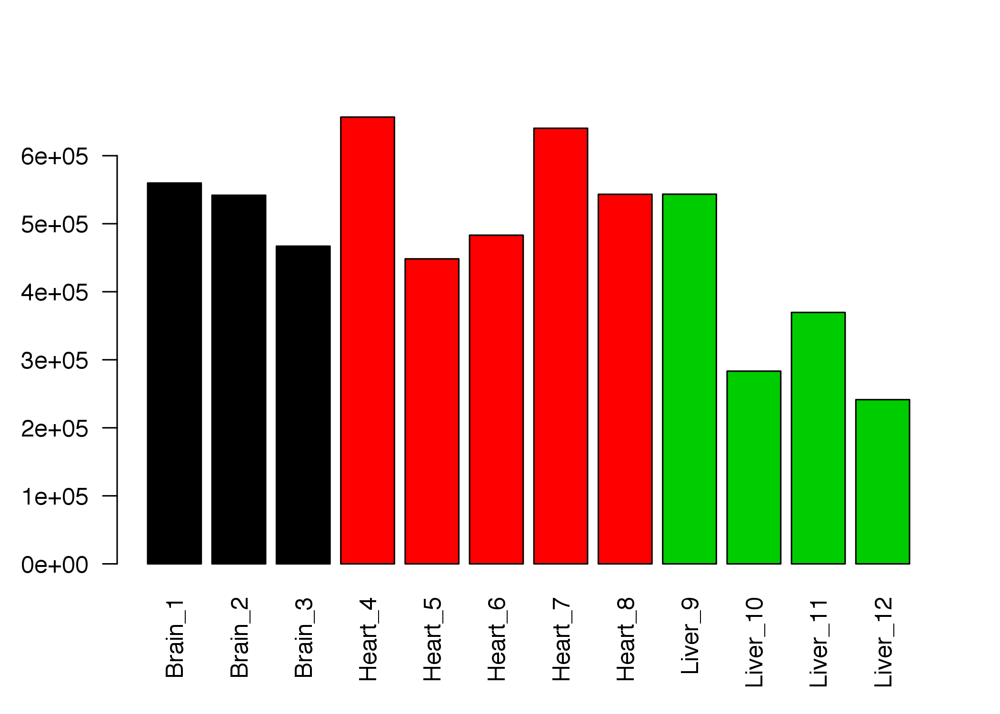
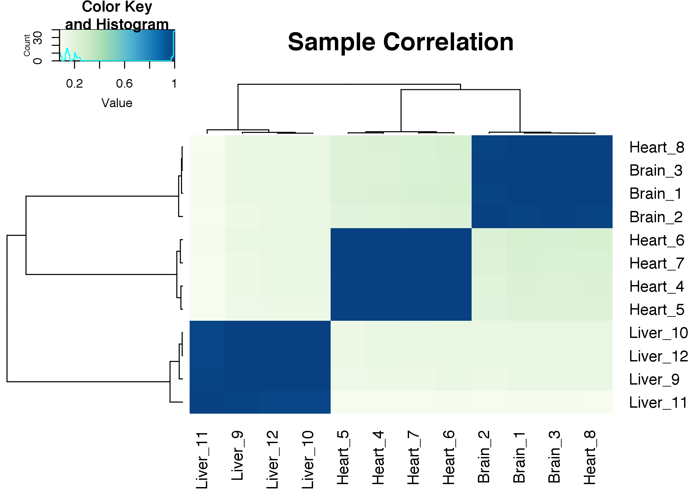
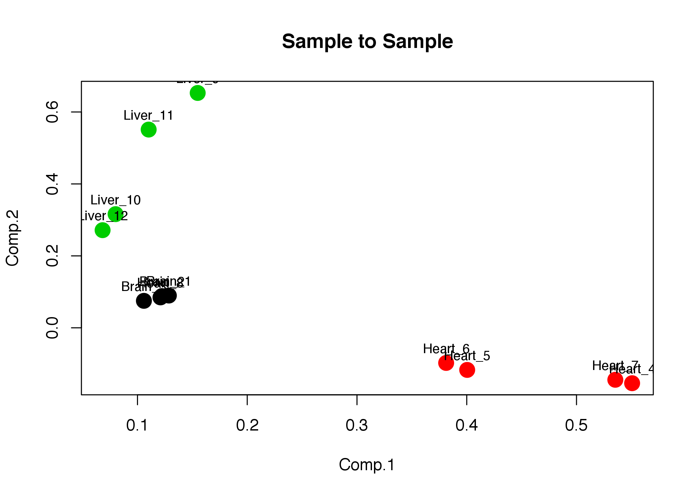
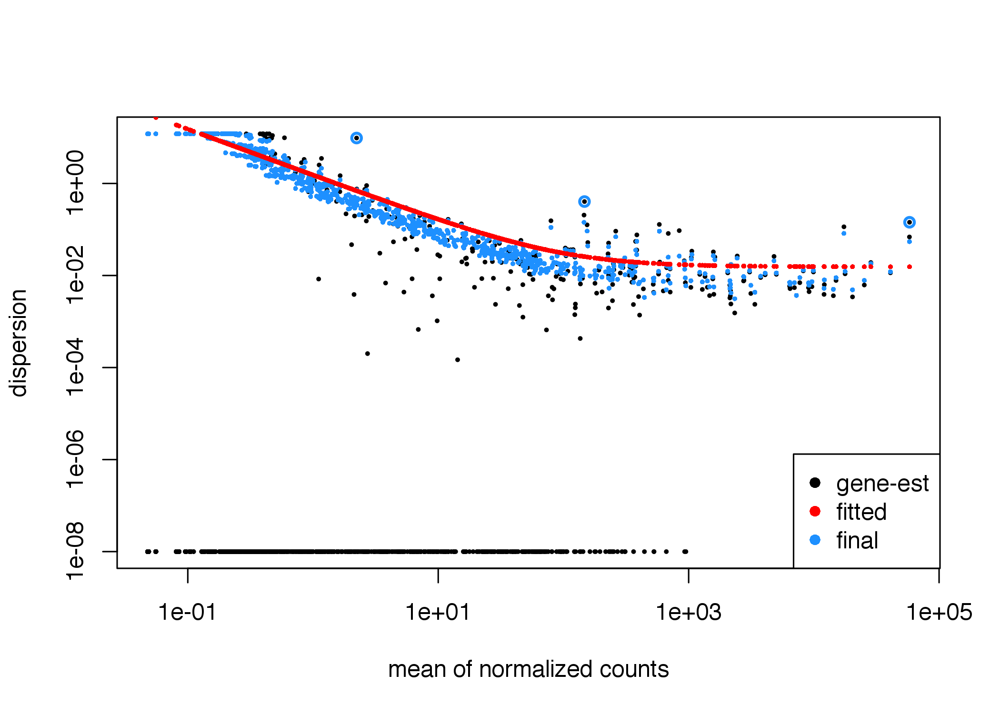
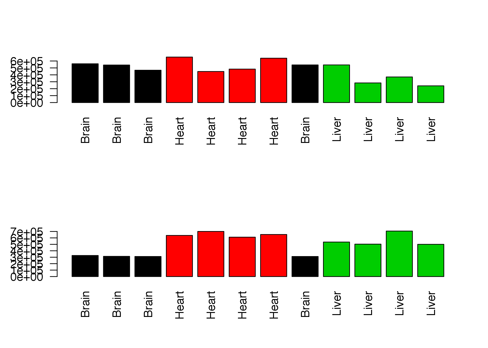
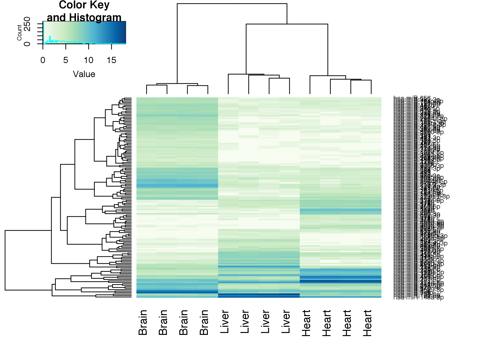
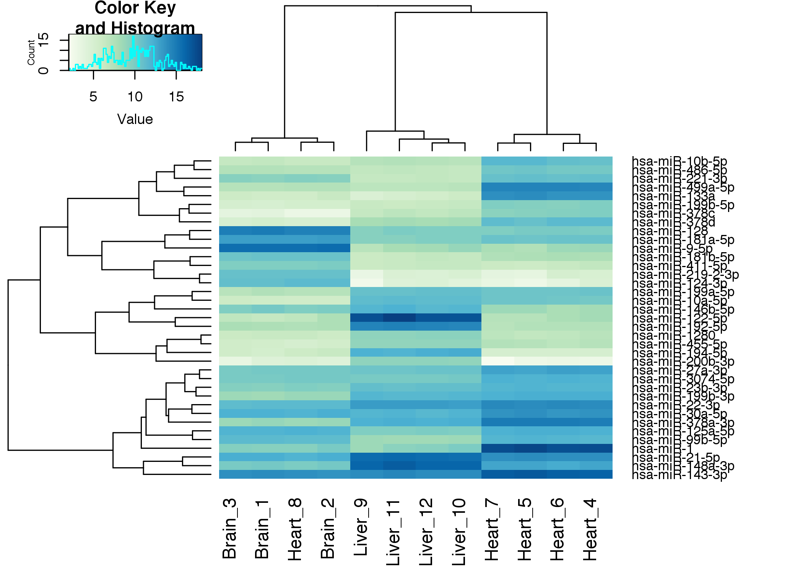

Small RNA Seq - Practical 2
================
Jack Monahan, Yuvia Perez Rico and Jan Provaznik

12 September, 2017

-   [Differential Expression of smallRNA counts with DESeq2](#differential-expression-of-smallrna-counts-with-deseq2)
-   [Initial count analysis](#initial-count-analysis)
    -   [Using DESeq to normalise the smallRNA count data](#using-deseq-to-normalise-the-smallrna-count-data)
    -   [Post Normalisation Analysis](#post-normalisation-analysis)
    -   [Analysis of Significant Hits across all samples](#analysis-of-significant-hits-across-all-samples)

Differential Expression of smallRNA counts with DESeq2
======================================================

First we should change directory to where the data is

``` r
setwd("~/Desktop/course_data/solexa")
```

If you need the raw data for this practical, it is available [here](http://wwwdev.ebi.ac.uk/enright-srv/courses/rna_cambridge_2017/miseqdeseq/data)

``` r
library("DESeq2")
library("gplots")
library("RColorBrewer")

# Make a color scheme for heatmaps
hmcol = colorRampPalette(brewer.pal(9, "GnBu"))(100)
```

We will load in the counts obtained from BLAST of cleaned reads against miRBase mature human sequences

``` r
mircounts <- read.table("mircounts.txt",header=TRUE,row.names=1)

# We want to remove the last line of the mircounts file
mircounts <- mircounts[-nrow(mircounts),]

# We need to tell R which samples were from which tissues
samplenames <- c("Brain", "Brain", "Brain", "Heart", "Heart", "Heart", "Heart", "Heart", "Liver", "Liver", "Liver", "Liver")
colnames(mircounts) = paste(samplenames, seq(1:12), sep="_")
head(mircounts)
```

               ##                 Brain_1 Brain_2 Brain_3 Heart_4 Heart_5 Heart_6 Heart_7
               ## hsa-miR-1          1167    1911    1190  179717  129698  114090  164659
               ## hsa-miR-122-5p      145     349     156     295      95     187     155
               ## hsa-miR-9-5p      86907   98965   74695     444     124     296     239
               ## hsa-miR-143-3p    27598   23711   21600   78973   66404   68549   96678
               ## hsa-miR-148a-3p    2079    2053    1646    6637    4126    4034    6276
               ## hsa-miR-21-5p      8279    8322    7029   14414    9933   11397   14733
               ##                 Heart_8 Liver_9 Liver_10 Liver_11 Liver_12
               ## hsa-miR-1          1253     375      554      345      348
               ## hsa-miR-122-5p      183  157280    73426   145594    63610
               ## hsa-miR-9-5p      84410     136      256      134      137
               ## hsa-miR-143-3p    24126   16411     8800    10078     7491
               ## hsa-miR-148a-3p    1697   73860    40933    52708    32330
               ## hsa-miR-21-5p      6732   58983    28787    32407    26526

Initial count analysis
======================

First, lets see the total numbers of counts obtained for each sample. We will use the **apply** function to quickly sweep across the table and compute the column sums.

``` r
barplot(apply(mircounts,2,sum),col=as.factor(samplenames),las=2)
```



Some of the samples look dramatically different to their replicates. We should investigate further by comparing samples to each other.

First we'll do a pairwise plot of the log2 counts between all samples

``` r
X11()
pairs(log2(mircounts+1),main="Pair-wise sample to sample counts")
```


Does anything look fishy about the data to you ?. Let's look at how the samples correlate with each other. Obviously replicates should be very highly correlated with a standard Pearson correlation test.

``` r
pca <- princomp(mircounts)
plot(pca$loadings, col=as.factor(samplenames),  pch=19, cex=2, main="Sample to Sample")
text(pca$loadings, as.vector(colnames(mircounts)), pos=3, cex=0.8)
```


``` r
heatmap.2(cor(mircounts),trace="none",col=hmcol,main="Sample Correlation")
```



Due to the sample-swap error we need to relabel the swapped samples

``` r
samplenames <- c("Brain", "Brain", "Brain", "Heart", "Heart", "Heart", "Heart", "Brain", "Liver", "Liver", "Liver" ,"Liver")
```

Let's double check things are now fixed

``` r
pca <- princomp(mircounts)
plot(pca$loadings, col=as.factor(samplenames),  pch=19, cex=2, main="Sample to Sample")
text(pca$loadings, as.vector(colnames(mircounts)), pos=3, cex=0.8)
```



Clearly we need to normalise the data to control for differences in global RNA levels across samples.

Using DESeq to normalise the smallRNA count data
------------------------------------------------

DESeq is a statistical tool for analysis of count-based data such as from RNAseq. Microarrays and similar platforms produce 'continuous' data measurements, e.g. flourescence associated with a probe. However for count data the variance of results increases dramatically as you get low counts. For example, once a gene is lowly enough expressed that you only find small numbers of reads mapping to it you get very high variance as it is impossible to have half a count. For this reason it is imperative that count based sequencing data be normalised and statistically assessed with tools that take this into account. Tools like DESeq apply negative binomial statistics and try to flatten the variance across low and high counts.

``` r
# First we tell DESeq which samples correspond to which tissues.
conds = data.frame(samplenames)
colnames(conds)="tissue"

# Now we build a DESeq Count dataset and normalize it.
cds <- DESeqDataSetFromMatrix(countData = mircounts, colData = conds, design = ~ tissue)
cds <- estimateSizeFactors(cds)
cds <- estimateDispersions(cds)
cds <- nbinomWaldTest(cds)
```

Now we will plot the dispersion information and fit.

``` r
plotDispEsts(cds)
```



Post Normalisation Analysis
---------------------------

Lets see what effect our normalisation had

``` r
par(mfrow=c(2,1))
prenorm=apply(mircounts,2,sum)
barplot(prenorm,col=as.factor(samplenames),las=2,names=samplenames)
postnorm=apply(counts(cds,normalized=TRUE),2,sum)
barplot(postnorm,col=as.factor(samplenames),las=2,names=samplenames)
```



Lets do another Principal components analysis on the normalised data

``` r
pca <- princomp(counts(cds,normalized=T))
plot(pca$loadings, col=as.factor(samplenames),  pch=19, cex=2, main="Sample to Sample PCA")
text(pca$loadings, as.vector(colnames(mircounts)), pos=3, cex=0.8)
```


Now we can use the negative-binomial test for each pairwise comparison of interest.

``` r
res1 =  results( cds, contrast=c("tissue","Brain", "Heart"))
res2 =  results( cds, contrast=c("tissue","Brain", "Liver"))
res3 =  results( cds, contrast=c("tissue","Heart", "Liver"))

# Sort each result on Adjusted P-Value
res1<-res1[order(res1$padj),]
res2<-res2[order(res2$padj),]
res3<-res3[order(res3$padj),]

# Look at the first comparison
head(res1,50)
```

               ## log2 fold change (MAP): tissue Brain vs Heart 
               ## Wald test p-value: tissue Brain vs Heart 
               ## DataFrame with 50 rows and 6 columns
               ##                   baseMean log2FoldChange      lfcSE      stat
               ##                  <numeric>      <numeric>  <numeric> <numeric>
               ## hsa-miR-128      9917.6289       4.716466 0.11809294  39.93859
               ## hsa-miR-378a-3p 12118.3791      -6.247371 0.09553713 -65.39207
               ## hsa-miR-499a-5p  7258.3710      -7.021495 0.07591700 -92.48910
               ## hsa-miR-133a     4807.4627      -7.940650 0.16459842 -48.24256
               ## hsa-miR-378d      928.9525      -6.269205 0.15571567 -40.26059
               ## ...                    ...            ...        ...       ...
               ## hsa-miR-136-3p   162.83485       3.245716  0.1623744  19.98908
               ## hsa-miR-452-5p    75.61569      -4.610875  0.2325850 -19.82447
               ## hsa-miR-9-3p     227.13253       6.624428  0.3393934  19.51844
               ## hsa-miR-30b-5p   711.24239      -2.521038  0.1292027 -19.51226
               ## hsa-miR-744-5p   252.02968       2.541499  0.1316901  19.29909
               ##                       pvalue         padj
               ##                    <numeric>    <numeric>
               ## hsa-miR-128                0            0
               ## hsa-miR-378a-3p            0            0
               ## hsa-miR-499a-5p            0            0
               ## hsa-miR-133a               0            0
               ## hsa-miR-378d               0            0
               ## ...                      ...          ...
               ## hsa-miR-136-3p  6.854389e-89 1.068391e-87
               ## hsa-miR-452-5p  1.830961e-87 2.793189e-86
               ## hsa-miR-9-3p    7.654455e-85 1.143384e-83
               ## hsa-miR-30b-5p  8.637456e-85 1.263889e-83
               ## hsa-miR-744-5p  5.466404e-83 7.838824e-82

    log2 fold change (MAP): tissue Brain vs Heart 
    Wald test p-value: tissue Brain vs Heart 
    DataFrame with 50 rows and 6 columns
                      baseMean log2FoldChange      lfcSE      stat       pvalue         padj
                     <numeric>      <numeric>  <numeric> <numeric>    <numeric>    <numeric>hsa-miR-128      9917.6289       4.716332 0.11968367  39.40664            0            0
    hsa-miR-378a-3p 12118.3791      -6.247263 0.09765315 -63.97401            0            0
    hsa-miR-499a-5p  7258.3710      -7.021408 0.07956721 -88.24500            0            0
    hsa-miR-133a     4807.4627      -7.940515 0.16499010 -48.12722            0            0
    hsa-miR-378d      928.9525      -6.269041 0.15687156 -39.96289            0            0
    ...                    ...            ...        ...       ...          ...          ...
    hsa-miR-136-3p    162.8349       3.245689 0.16159117  20.08581 9.821032e-90 1.603390e-88
    hsa-miR-9-3p      227.1325       6.624195 0.33683195  19.66617 4.203540e-86 6.716720e-85
    hsa-miR-27b-3p  20353.5151      -1.448201 0.07405947 -19.55457 3.771937e-85 5.901510e-84
    hsa-miR-30b-5p    711.2424      -2.521019 0.12998167 -19.39519 8.474115e-84 1.298788e-82
    hsa-miR-744-5p    252.0297       2.541474 0.13180332  19.28232 7.560116e-83 1.135529e-81

Lets make some volcanoplots of each comparison

``` r
par(mfrow=c(1,3))
plot(res1$log2FoldChange,-log(res1$padj,10),main="Volcano Plot Brain vs Heart")
text(res1[1:20,]$log2FoldChange,-log(res1[1:20,]$padj,10),labels=rownames(res1[1:20,]),cex=0.7,pos=1)
legend("topleft","Brain",cex=0.5)
legend("topright","Heart",cex=0.5)

plot(res2$log2FoldChange,-log(res2$padj,10),main="Volcano Plot Brain vs Liver")
text(res2[1:20,]$log2FoldChange,-log(res2[1:20,]$padj,10),labels=rownames(res2[1:20,]),cex=0.7,pos=1)
legend("topleft","Brain",cex=0.5)
legend("topright","Liver",cex=0.5)

plot(res3$log2FoldChange,-log(res3$padj,10),main="Volcano Plot Heart vs Liver")
text(res3[1:20,]$log2FoldChange,-log(res3[1:20,]$padj,10),labels=rownames(res3[1:20,]),cex=0.7,pos=1)
legend("topleft","Heart",cex=0.5)
legend("topright","Liver",cex=0.5)
```


``` r
par(mfrow=c(1,1))
```

Analysis of Significant Hits across all samples
-----------------------------------------------

Let's choose significant miRs for each contrast by log fold change and adj. P-value. Then we merge into a single list of significant hits and make a heatmap.

``` r
sig1 = rownames(res1[(abs(res1$log2FoldChange) > 4) & (res1$padj < 0.00001) & !is.na(res1$padj),])
sig2 = rownames(res2[(abs(res2$log2FoldChange) > 4) & (res2$padj < 0.00001) & !is.na(res2$padj),])
sig3 = rownames(res3[(abs(res3$log2FoldChange) > 4) & (res3$padj < 0.00001) & !is.na(res3$padj),])

# Merge to one list
siglist = unique(c(sig1,sig2,sig3))

# Generate Nice heatmap colours
hmcol = colorRampPalette(brewer.pal(9, "GnBu"))(100)

# Heatmap of significant hits
heatmap.2(log2(counts(cds[siglist,],normalized=TRUE)+1),col=hmcol,trace="none",labCol=samplenames,margin=c(5,10))
```



We can also make a more simplified heatmap of expression for 20 most significant hits from each comparison.

``` r
siglist=unique(c(rownames(res1[1:20,]),rownames(res2[1:20,]),rownames(res3[1:20,])))

heatmap.2(log2(counts(cds[siglist,],normalized=TRUE)+1),col=hmcol,trace="none",margin=c(5,10))
```


