Small RNA Seq - Course Data
================
Anton Enright & Steph Wenlock
'28 June, 2023'

- <a href="#analysis-of-smallrna-seq-datasets"
  id="toc-analysis-of-smallrna-seq-datasets">Analysis of smallRNA Seq
  datasets</a>
  - <a href="#experimental-design" id="toc-experimental-design">Experimental
    Design</a>
  - <a href="#setup" id="toc-setup">Setup</a>
  - <a href="#smallrna-read-quality-control"
    id="toc-smallrna-read-quality-control">SmallRNA Read Quality Control</a>
  - <a href="#mapping-cleaned-reads-to-micrornas"
    id="toc-mapping-cleaned-reads-to-micrornas">Mapping Cleaned Reads to
    MicroRNAs</a>
- <a href="#analysis-of-the-smallrna-count-data"
  id="toc-analysis-of-the-smallrna-count-data">Analysis of the smallRNA
  count data</a>
  - <a href="#experiment-setup" id="toc-experiment-setup">Experiment
    Setup</a>
  - <a href="#preparation" id="toc-preparation">Preparation</a>
- <a href="#main-analysis" id="toc-main-analysis">Main Analysis</a>
  - <a href="#count-loading" id="toc-count-loading">Count Loading</a>
  - <a href="#count-preparation--normalisation"
    id="toc-count-preparation--normalisation">Count Preparation &amp;
    Normalisation</a>
  - <a href="#deseq2-data-loading-and-normalisation"
    id="toc-deseq2-data-loading-and-normalisation">DESeq2 Data loading and
    normalisation</a>
- <a href="#completing-the-analysis"
  id="toc-completing-the-analysis">Completing the Analysis</a>
- <a href="#removing-bad-samples" id="toc-removing-bad-samples">Removing
  bad samples</a>

# Analysis of smallRNA Seq datasets

In this practical we will be taking the 12 samples you generated
libraries for on the course. We will trim off the 3’ Sequencing adapters
and then you will construct a protocol for their analysis

The fastq files, pdata file and mircounts file are now installed on your
desktops.

## Experimental Design

This is the sample description file used for the analyses below.

``` r
setwd("~/Desktop/course_data/smallrna_participants/")
pdata <- read.table("pdata.txt",header=TRUE,check.names=FALSE)
kable(pdata)
```

| samplename | filename                             | genotype | 3p-ad              | tabu |
|:-----------|:-------------------------------------|:---------|:-------------------|:-----|
| scr1       | Group-1-SCR_S2_L001_R1_001.fastq.gz  | scr      | AACTGTAGGCACCATCAA | NA   |
| scr2       | Group-2-SCR_S4_L001_R1_001.fastq.gz  | scr      | AACTGTAGGCACCATCAA | NA   |
| scr3       | Group-3-SCR_S6_L001_R1_001.fastq.gz  | scr      | AACTGTAGGCACCATCAA | NA   |
| scr4       | Group-4-SCR_S8_L001_R1_001.fastq.gz  | scr      | AACTGTAGGCACCATCAA | NA   |
| scr5       | Group-5-SCR_S10_L001_R1_001.fastq.gz | scr      | AACTGTAGGCACCATCAA | NA   |
| scr6       | Group-6-SCR_S12_L001_R1_001.fastq.gz | scr      | AACTGTAGGCACCATCAA | NA   |
| wt1        | Group-1-WT_S1_L001_R1_001.fastq.gz   | wt       | AACTGTAGGCACCATCAA | NA   |
| wt2        | Group-2-WT_S3_L001_R1_001.fastq.gz   | wt       | AACTGTAGGCACCATCAA | NA   |
| wt3        | Group-3-WT_S5_L001_R1_001.fastq.gz   | wt       | AACTGTAGGCACCATCAA | NA   |
| wt4        | Group-4-WT_S7_L001_R1_001.fastq.gz   | wt       | AACTGTAGGCACCATCAA | NA   |
| wt5        | Group-5-WT_S9_L001_R1_001.fastq.gz   | wt       | AACTGTAGGCACCATCAA | NA   |
| wt6        | Group-6-WT_S11_L001_R1_001.fastq.gz  | wt       | AACTGTAGGCACCATCAA | NA   |

## Tapestation Results		
|group|sample|index number|conc new|tapestation|
|-----|------|------------|--------|-----------|
|1|Nrep wt clone #13|IDP1|0,874|lost |
|1|Nrep 3' scramble clone #112|IDP2|1,59|peak at 176|
|2|Nrep wt clone #3|IDP6|0,56|peak at 177 but wide peak
|2|Nrep 3' scramble clone #105|IDP12|2,88|peaks at 182 and 229|
|3|Nrep wt clone #1|IDP5|5,22|peaks at 181, 230 and 317
|3|Nrep 3' scramble clone #1|IDP10|7,64|peaks at 181, 230 and 317
|4|Nrep wt clone #3|IDP4|0,566|adapter dimer|
|4|Nrep 3' scramble clone #105|IDP7|13,5|peaks at 183 and 230|okayish
|5|Nrep wt clone #13|IDP3|10,5|peaks at 183 and 229|
|5|Nrep 3' scramble clone #112|IDP8|12|peaks at 183 and 229 and 321
|6|Nrep wt clone #1|IDP9|0,42|lost|
|6|Nrep 3' scramble clone #1|IDP11|1,66|peaks at 176 and 218|


## Setup

Lets load some libraries to get started

``` r
library(Reaper)
library(gplots)
library(RColorBrewer)
library(DESeq2)
library(reshape2)
library(ggplot2)
```

Hopefully, you will see a compressed FASTQ txt file for each of the 12
lanes

It is important that we also load information for reaper that tells it
the following:

- Which FASTQ files are present.
- Which Barcode sequences correspond to which sample names.
- What 5’ and 3’ sequencing adapters were used in library generation.

Next we will start the Reaper algorithm. It will perform the following
functions on all the lanes we have provided:

- Splitting up reads according to provided barcodes
- Detection of 3’ or 5’ adapter contamination using Smith-Waterman local
  alignment
- Detection of low-complexity sequences, such as Poly-As or Poly-Ns
- Quality score thresholding and trimming if required
- Collapsing of reads according to depth in a summary FASTA result file
  per barcode per lane.
- Generation of Quality Control plots for assessing sequencing quality

Reaper is started by passing it our samples table and telling it which
“mode” to run in, in this case the mode is set to: **no-bc**.

``` r
reaper(pdata,"no-bc");
```

               ## [1] "Starting Reaper for file: Group-1-SCR_S2_L001_R1_001.fastq.gz"
               ##                                 fastq                                  geom 
               ## "Group-1-SCR_S2_L001_R1_001.fastq.gz"                               "no-bc" 
               ##                                  meta                              basename 
               ##                       "metadata1.txt"                                   "1" 
               ## [1] "Starting Tally for file Group-1-SCR_S2_L001_R1_001.fastq.gz and barcode: lane"
               ## [1] "Starting Reaper for file: Group-1-WT_S1_L001_R1_001.fastq.gz"
               ##                                fastq                                 geom 
               ## "Group-1-WT_S1_L001_R1_001.fastq.gz"                              "no-bc" 
               ##                                 meta                             basename 
               ##                      "metadata2.txt"                                  "2" 
               ## [1] "Starting Tally for file Group-1-WT_S1_L001_R1_001.fastq.gz and barcode: lane"
               ## [1] "Starting Reaper for file: Group-2-SCR_S4_L001_R1_001.fastq.gz"
               ##                                 fastq                                  geom 
               ## "Group-2-SCR_S4_L001_R1_001.fastq.gz"                               "no-bc" 
               ##                                  meta                              basename 
               ##                       "metadata3.txt"                                   "3" 
               ## [1] "Starting Tally for file Group-2-SCR_S4_L001_R1_001.fastq.gz and barcode: lane"
               ## [1] "Starting Reaper for file: Group-2-WT_S3_L001_R1_001.fastq.gz"
               ##                                fastq                                 geom 
               ## "Group-2-WT_S3_L001_R1_001.fastq.gz"                              "no-bc" 
               ##                                 meta                             basename 
               ##                      "metadata4.txt"                                  "4" 
               ## [1] "Starting Tally for file Group-2-WT_S3_L001_R1_001.fastq.gz and barcode: lane"
               ## [1] "Starting Reaper for file: Group-3-SCR_S6_L001_R1_001.fastq.gz"
               ##                                 fastq                                  geom 
               ## "Group-3-SCR_S6_L001_R1_001.fastq.gz"                               "no-bc" 
               ##                                  meta                              basename 
               ##                       "metadata5.txt"                                   "5" 
               ## [1] "Starting Tally for file Group-3-SCR_S6_L001_R1_001.fastq.gz and barcode: lane"
               ## [1] "Starting Reaper for file: Group-3-WT_S5_L001_R1_001.fastq.gz"
               ##                                fastq                                 geom 
               ## "Group-3-WT_S5_L001_R1_001.fastq.gz"                              "no-bc" 
               ##                                 meta                             basename 
               ##                      "metadata6.txt"                                  "6" 
               ## [1] "Starting Tally for file Group-3-WT_S5_L001_R1_001.fastq.gz and barcode: lane"
               ## [1] "Starting Reaper for file: Group-4-SCR_S8_L001_R1_001.fastq.gz"
               ##                                 fastq                                  geom 
               ## "Group-4-SCR_S8_L001_R1_001.fastq.gz"                               "no-bc" 
               ##                                  meta                              basename 
               ##                       "metadata7.txt"                                   "7" 
               ## [1] "Starting Tally for file Group-4-SCR_S8_L001_R1_001.fastq.gz and barcode: lane"
               ## [1] "Starting Reaper for file: Group-4-WT_S7_L001_R1_001.fastq.gz"
               ##                                fastq                                 geom 
               ## "Group-4-WT_S7_L001_R1_001.fastq.gz"                              "no-bc" 
               ##                                 meta                             basename 
               ##                      "metadata8.txt"                                  "8" 
               ## [1] "Starting Tally for file Group-4-WT_S7_L001_R1_001.fastq.gz and barcode: lane"
               ## [1] "Starting Reaper for file: Group-5-SCR_S10_L001_R1_001.fastq.gz"
               ##                                  fastq                                   geom 
               ## "Group-5-SCR_S10_L001_R1_001.fastq.gz"                                "no-bc" 
               ##                                   meta                               basename 
               ##                        "metadata9.txt"                                    "9" 
               ## [1] "Starting Tally for file Group-5-SCR_S10_L001_R1_001.fastq.gz and barcode: lane"
               ## [1] "Starting Reaper for file: Group-5-WT_S9_L001_R1_001.fastq.gz"
               ##                                fastq                                 geom 
               ## "Group-5-WT_S9_L001_R1_001.fastq.gz"                              "no-bc" 
               ##                                 meta                             basename 
               ##                     "metadata10.txt"                                 "10" 
               ## [1] "Starting Tally for file Group-5-WT_S9_L001_R1_001.fastq.gz and barcode: lane"
               ## [1] "Starting Reaper for file: Group-6-SCR_S12_L001_R1_001.fastq.gz"
               ##                                  fastq                                   geom 
               ## "Group-6-SCR_S12_L001_R1_001.fastq.gz"                                "no-bc" 
               ##                                   meta                               basename 
               ##                       "metadata11.txt"                                   "11" 
               ## [1] "Starting Tally for file Group-6-SCR_S12_L001_R1_001.fastq.gz and barcode: lane"
               ## [1] "Starting Reaper for file: Group-6-WT_S11_L001_R1_001.fastq.gz"
               ##                                 fastq                                  geom 
               ## "Group-6-WT_S11_L001_R1_001.fastq.gz"                               "no-bc" 
               ##                                  meta                              basename 
               ##                      "metadata12.txt"                                  "12" 
               ## [1] "Starting Tally for file Group-6-WT_S11_L001_R1_001.fastq.gz and barcode: lane"
               ## [1] "Results for file Group-1-SCR_S2_L001_R1_001.fastq.gz start with 1.lane"
               ## [1] "Results for file Group-1-WT_S1_L001_R1_001.fastq.gz start with 2.lane"
               ## [1] "Results for file Group-2-SCR_S4_L001_R1_001.fastq.gz start with 3.lane"
               ## [1] "Results for file Group-2-WT_S3_L001_R1_001.fastq.gz start with 4.lane"
               ## [1] "Results for file Group-3-SCR_S6_L001_R1_001.fastq.gz start with 5.lane"
               ## [1] "Results for file Group-3-WT_S5_L001_R1_001.fastq.gz start with 6.lane"
               ## [1] "Results for file Group-4-SCR_S8_L001_R1_001.fastq.gz start with 7.lane"
               ## [1] "Results for file Group-4-WT_S7_L001_R1_001.fastq.gz start with 8.lane"
               ## [1] "Results for file Group-5-SCR_S10_L001_R1_001.fastq.gz start with 9.lane"
               ## [1] "Results for file Group-5-WT_S9_L001_R1_001.fastq.gz start with 10.lane"
               ## [1] "Results for file Group-6-SCR_S12_L001_R1_001.fastq.gz start with 11.lane"
               ## [1] "Results for file Group-6-WT_S11_L001_R1_001.fastq.gz start with 12.lane"

               ## [1] 0

Reaper is designed to be fast and memory-efficient so it should run on
any machine with 500MB of RAM or more. The time taken to complete the
run depends on how fast the processors in your machine are.

Let’s take a look at the Quality Control Metrics generated

``` r
reaperQC(pdata)
```

               ## [1] "Processing Reaper Results for: Group-1-SCR_S2_L001_R1_001.fastq.gz  lane"

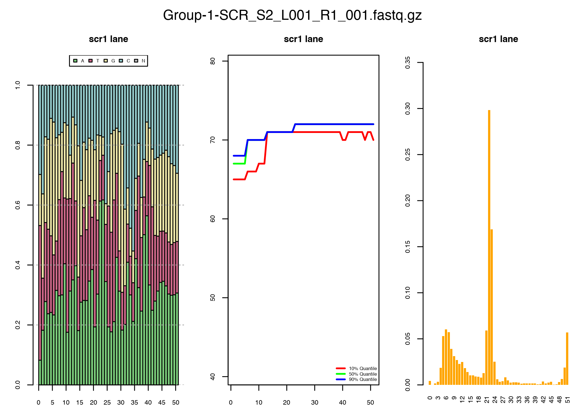<!-- -->

               ## [1] "Processing Reaper Results for: Group-1-WT_S1_L001_R1_001.fastq.gz  lane"

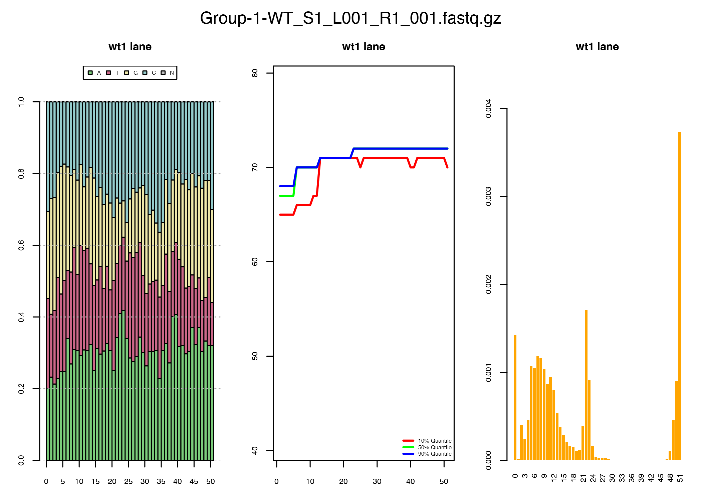<!-- -->

               ## [1] "Processing Reaper Results for: Group-2-SCR_S4_L001_R1_001.fastq.gz  lane"

<!-- -->

               ## [1] "Processing Reaper Results for: Group-2-WT_S3_L001_R1_001.fastq.gz  lane"

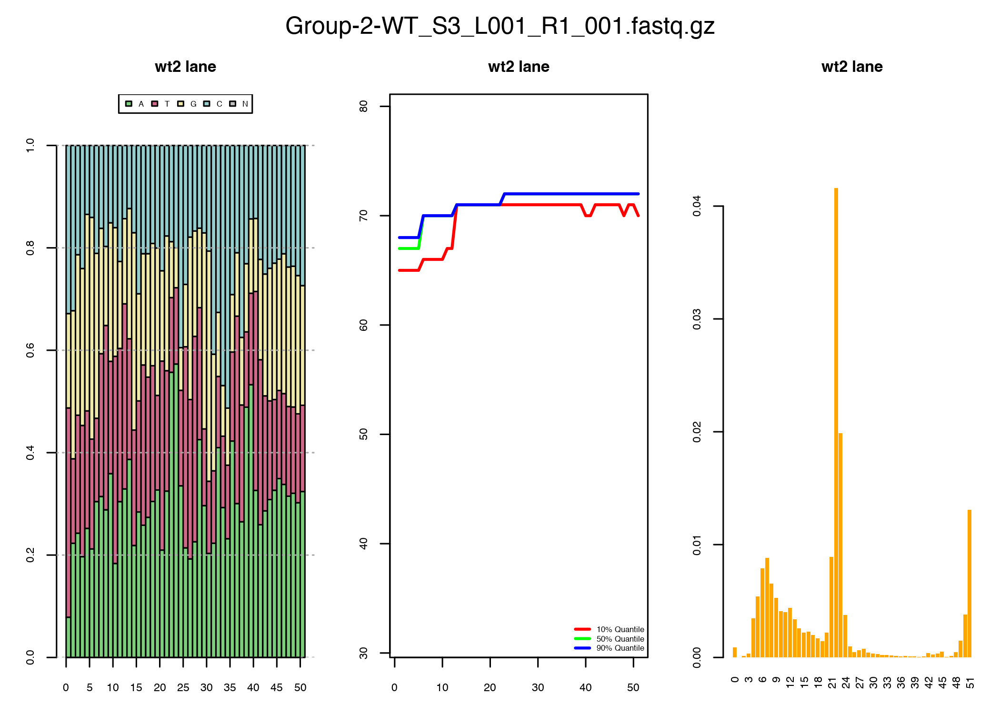<!-- -->

               ## [1] "Processing Reaper Results for: Group-3-SCR_S6_L001_R1_001.fastq.gz  lane"

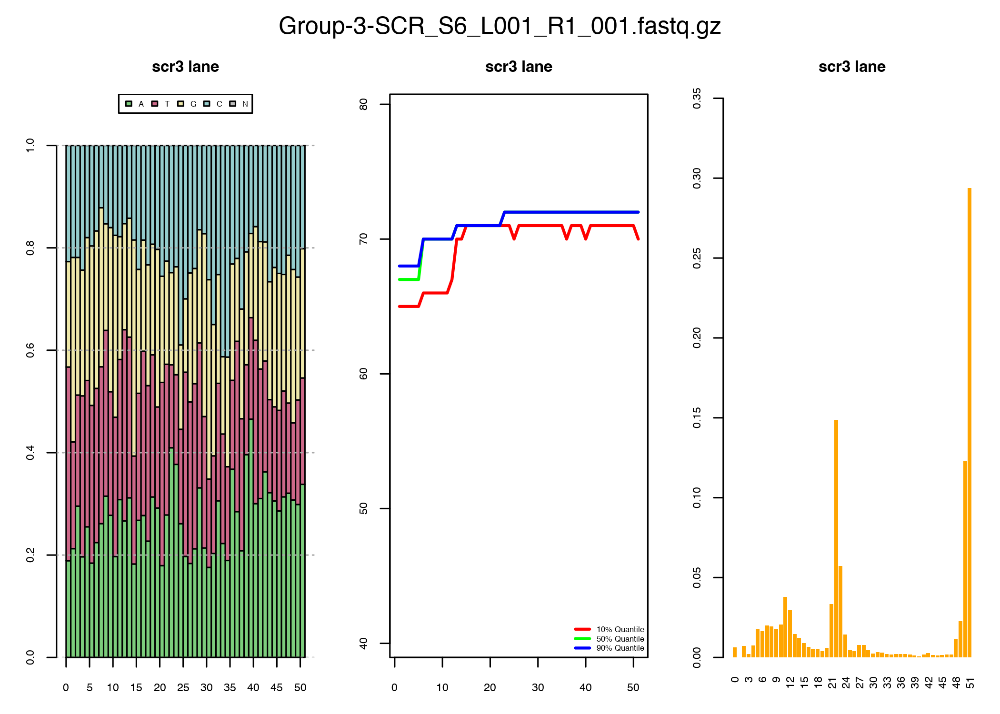<!-- -->

               ## [1] "Processing Reaper Results for: Group-3-WT_S5_L001_R1_001.fastq.gz  lane"

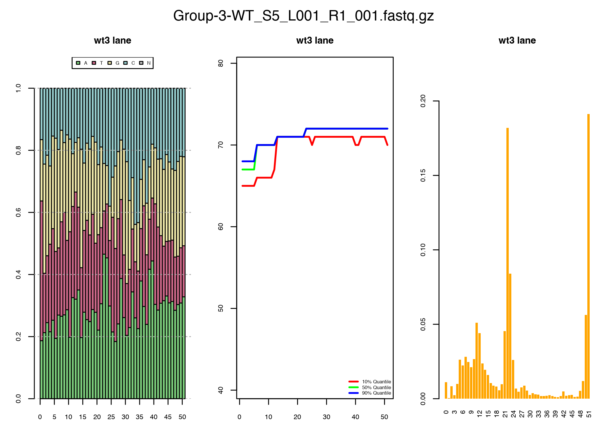<!-- -->

               ## [1] "Processing Reaper Results for: Group-4-SCR_S8_L001_R1_001.fastq.gz  lane"

<!-- -->

               ## [1] "Processing Reaper Results for: Group-4-WT_S7_L001_R1_001.fastq.gz  lane"

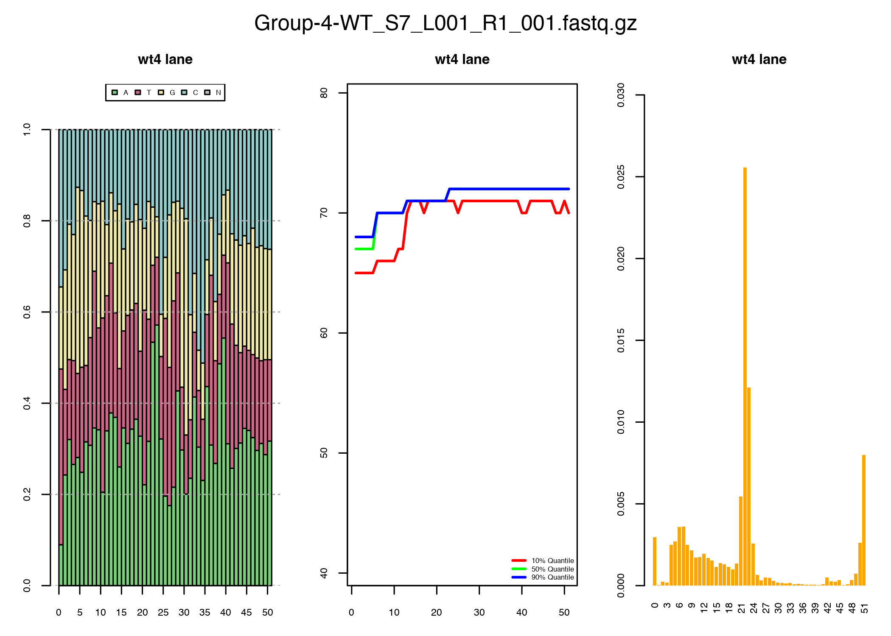<!-- -->

               ## [1] "Processing Reaper Results for: Group-5-SCR_S10_L001_R1_001.fastq.gz  lane"

<!-- -->

               ## [1] "Processing Reaper Results for: Group-5-WT_S9_L001_R1_001.fastq.gz  lane"

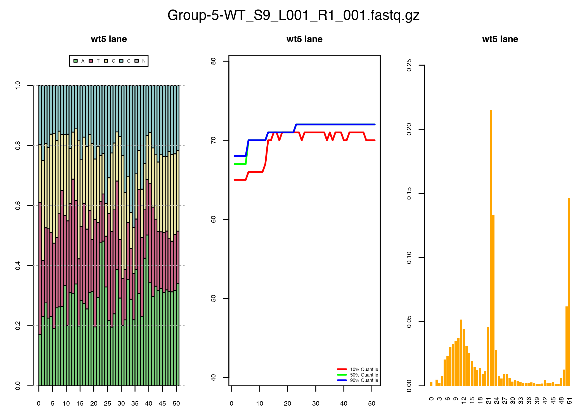<!-- -->

               ## [1] "Processing Reaper Results for: Group-6-SCR_S12_L001_R1_001.fastq.gz  lane"

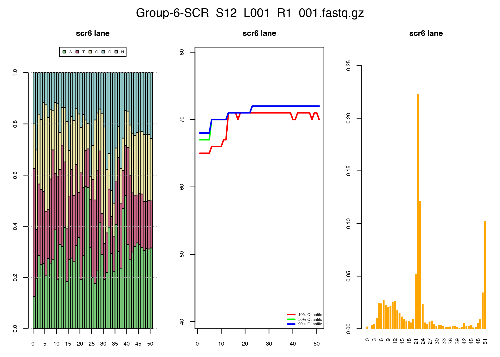<!-- -->

               ## [1] "Processing Reaper Results for: Group-6-WT_S11_L001_R1_001.fastq.gz  lane"

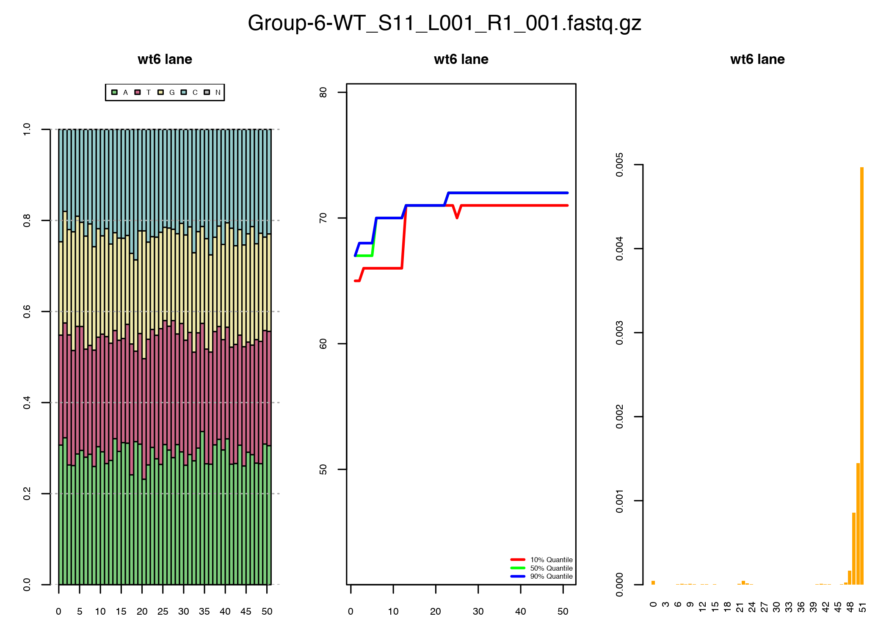<!-- -->

## SmallRNA Read Quality Control

Lets also make a nice PDF of the results and explore the QC metrics for
the data

``` r
pdf("reaper.pdf",width=12)
reaperQC(pdata)
```

               ## [1] "Processing Reaper Results for: Group-1-SCR_S2_L001_R1_001.fastq.gz  lane"

               ## [1] "Processing Reaper Results for: Group-1-WT_S1_L001_R1_001.fastq.gz  lane"

               ## [1] "Processing Reaper Results for: Group-2-SCR_S4_L001_R1_001.fastq.gz  lane"

               ## [1] "Processing Reaper Results for: Group-2-WT_S3_L001_R1_001.fastq.gz  lane"

               ## [1] "Processing Reaper Results for: Group-3-SCR_S6_L001_R1_001.fastq.gz  lane"

               ## [1] "Processing Reaper Results for: Group-3-WT_S5_L001_R1_001.fastq.gz  lane"

               ## [1] "Processing Reaper Results for: Group-4-SCR_S8_L001_R1_001.fastq.gz  lane"

               ## [1] "Processing Reaper Results for: Group-4-WT_S7_L001_R1_001.fastq.gz  lane"

               ## [1] "Processing Reaper Results for: Group-5-SCR_S10_L001_R1_001.fastq.gz  lane"

               ## [1] "Processing Reaper Results for: Group-5-WT_S9_L001_R1_001.fastq.gz  lane"

               ## [1] "Processing Reaper Results for: Group-6-SCR_S12_L001_R1_001.fastq.gz  lane"

               ## [1] "Processing Reaper Results for: Group-6-WT_S11_L001_R1_001.fastq.gz  lane"

``` r
dev.off()
```

               ## png 
               ##   2

You should get one plot back for each lane processed.

## Mapping Cleaned Reads to MicroRNAs

This has been done for you, just like shown in the previous practical.
The results are stored in a file called mircounts.txt.

# Analysis of the smallRNA count data

## Experiment Setup

All data were pre-processed using *minion* to identify and check
adapters, *reaper* to trim adapter sequences followed by *tally* to
deduplicate reads while maintaining depth information. Subsequent to
this all reads passed through mapping against all miRBase (Release 22)
precursor sequences for Mouse. Reads were summed across paired end
sequences for the same read pair. Finally reads are loaded into R for
final analysis.

For this analysis, we will get you started with some basic setup for
DESeq2.

## Preparation

Lets prepare some colour schemes for heatmaps and sample colours

``` r
hmcol = colorRampPalette(brewer.pal(9, "GnBu"))(100)
spectral <- colorRampPalette(rev(brewer.pal(11, "Spectral")), space="Lab")(100)
```

# Main Analysis

## Count Loading

We can now load all the count data

``` r
mircounts <- read.table("mircounts.txt",header=TRUE,row.names=1)
```

Lets set up the count matrix column names and make a list of genotype
conditions

``` r
conds=as.factor(as.character(pdata$genotype))
conds
```

               ##  [1] scr scr scr scr scr scr wt  wt  wt  wt  wt  wt 
               ## Levels: scr wt

## Count Preparation & Normalisation

We are now ready to create a DESeq object from the counts table.

``` r
#Lets Load the Counts First
coldata = as.data.frame(t(t(conds)))
rownames(coldata)=colnames(mircounts)
colnames(coldata)='treatment'
dds <- DESeqDataSetFromMatrix(countData = mircounts, colData = coldata, design = ~ treatment)
```

We are ready to normalise the data, but first we should look at the
number of sequenced reads per sample. There are some stark differences
across the samples.

``` r
cond_colours = brewer.pal(2,"Set2")[conds]
```

               ## Warning in brewer.pal(2, "Set2"): minimal value for n is 3, returning requested palette with 3 different levels

``` r
names(cond_colours)=pdata$genotype

barplot(apply(mircounts,2,sum), las=2,col=cond_colours,main="Pre Normalised Counts",cex.names=0.4)
legend("topright",levels((conds)),cex=0.6,fill=cond_colours[levels(conds)])
```

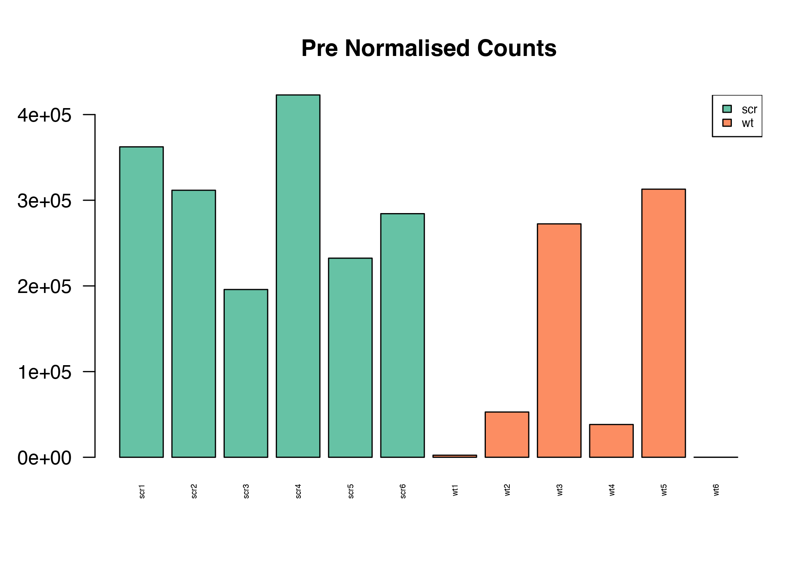<!-- -->

## DESeq2 Data loading and normalisation

``` r
dds <- estimateSizeFactors(dds)
dds <- estimateDispersions(dds)
```

               ## gene-wise dispersion estimates

               ## mean-dispersion relationship

               ## final dispersion estimates

``` r
plotDispEsts(dds)
```

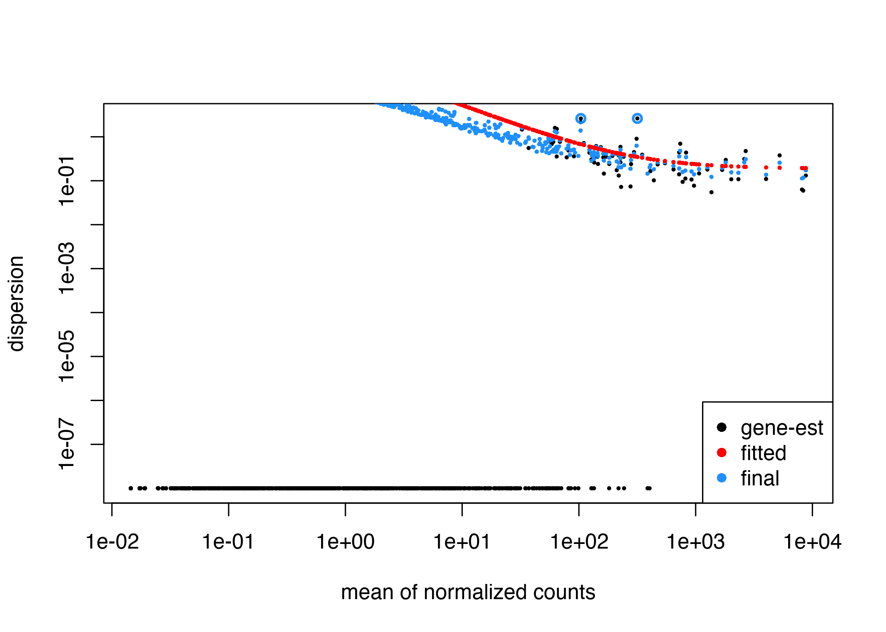<!-- -->

``` r
normcounts <- counts(dds, normalized=TRUE)
rawcounts=counts(dds,normalized=FALSE)
log2counts=log2(normcounts+1)


barplot(apply(normcounts,2,sum), las=2,col=cond_colours,main="Post-Normalised Counts",cex.names=0.4)
legend("topright",levels((conds)),cex=0.6,fill=cond_colours[levels(conds)])
```

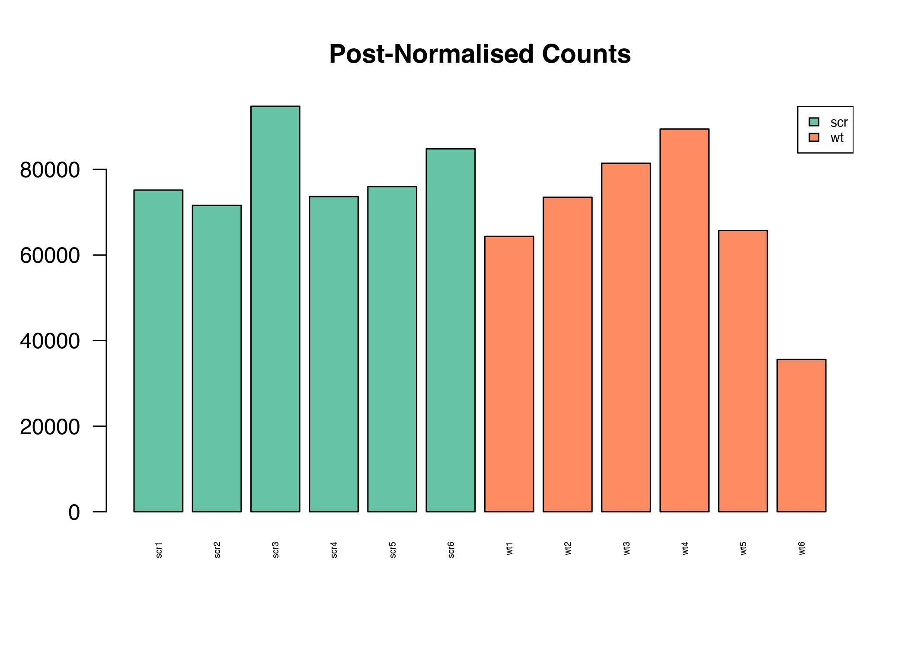<!-- -->

# Completing the Analysis

You should continue to analyse the data using the previous practical as
inspiration and copying and modifying code blocks.

We want to do the following

- Check the basic QC of the samples.
- This could be barplots, heatmaps, PCA or tSNE plots etc.
- Remove any samples that seem to be big outliers, remember to remove
  from both *mircounts* and *pdata* so that things are consistent.
- Once cleaned up, renormalise the samples with DESeq2 and replot your
  QC metrics to see the improvement.
- After this you probably want to run the same statistical test as last
  time, i.e. scr vs wt and create a statistical list of hits.
- Make a volcano plot and save your result table to a file.
<!--
# Removing bad samples

``` r
#mircounts=mircounts[,c(1,2,3,4,5,6,9,11)]
#pdata=pdata[c(1,2,3,4,5,6,9,11),]
conds=as.factor(as.character(pdata$genotype))
cond_colours = brewer.pal(2,"Set2")[conds]
```

               ## Warning in brewer.pal(2, "Set2"): minimal value for n is 3, returning requested palette with 3 different levels

``` r
names(cond_colours)=pdata$genotype

coldata = as.data.frame(t(t(conds)))
rownames(coldata)=colnames(mircounts)
colnames(coldata)='treatment'
dds <- DESeqDataSetFromMatrix(countData = mircounts, colData = coldata, design = ~ treatment)
dds <- estimateSizeFactors(dds)
dds <- estimateDispersions(dds)
```

               ## gene-wise dispersion estimates

               ## mean-dispersion relationship

               ## final dispersion estimates

``` r
plotDispEsts(dds)
```


``` r
normcounts <- counts(dds, normalized=TRUE)
rawcounts=counts(dds,normalized=FALSE)
log2counts=log2(normcounts+1)
```

``` r
pca2=prcomp(t(normcounts),center=TRUE)

plot(pca2$x, col=cond_colours,  pch=19, cex=2, main="Sample to Sample PCA (VST)")
text(pca2$x, as.vector(colnames(mircounts)), pos=3, cex=0.4)
```

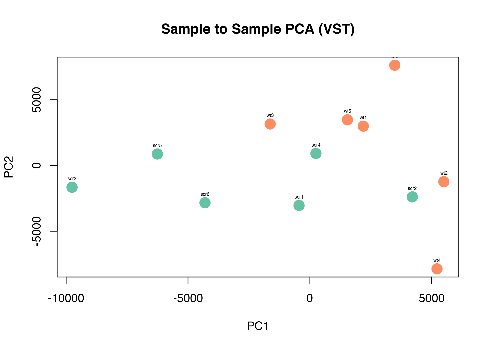

``` r
heatmap.2(cor(log2counts),trace="none",col=hmcol,main="Sample to Sample Correlation (Log2 Counts)",cexRow=0.5,cexCol=0.5,RowSideColors=cond_colours, margins=c(9,7))
```

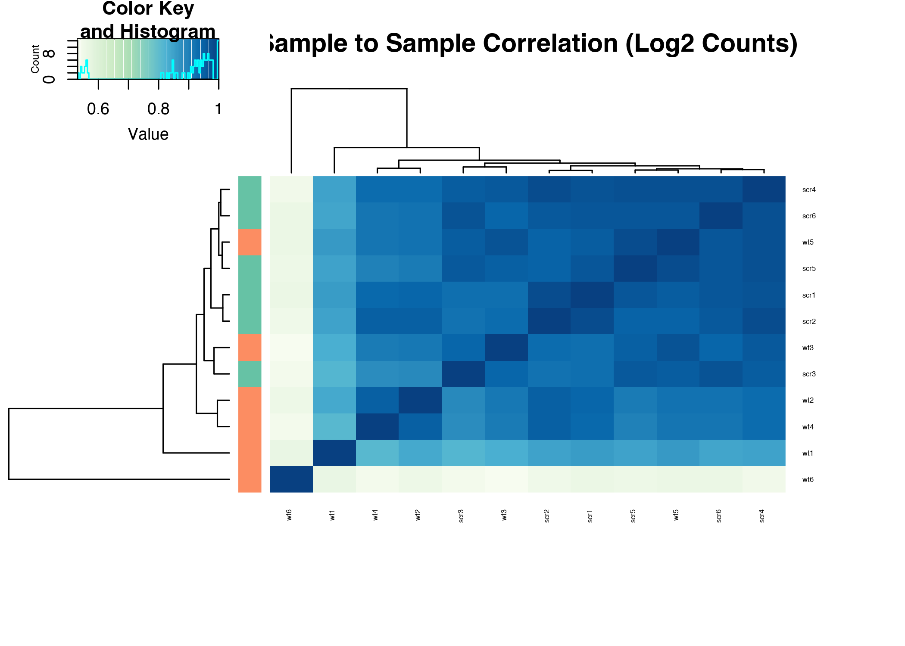

``` r
library(Rtsne)
```

               ## Warning: package 'Rtsne' was built under R version 4.1.2

``` r
tsne <- Rtsne(t(normcounts), perplexity = 1, check_duplicates = FALSE)
tsne.df <- data.frame(tsne.1 = tsne$Y[,1], tsne.2 = tsne$Y[,2])

ggplot(data = tsne.df, aes(tsne.1, tsne.2)) + 
  geom_point(size = 6, pch = 20, colour = cond_colours) +
  geom_text(size = 2, vjust=2, aes(label=colnames(normcounts))) +
  scale_alpha_discrete(range = c(0.5, 1)) +
  theme_minimal() +
  ylab("tSNE 1") +
  xlab("tSNE 2") 
```

               ## Warning: Using alpha for a discrete variable is not advised.

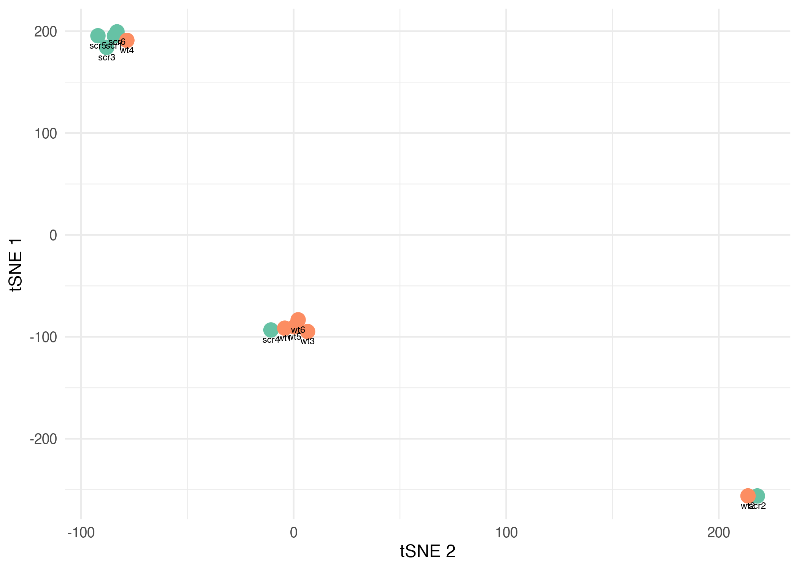

``` r
top10=apply(mircounts,1,sum)[1:10]
top10[11]=sum(apply(mircounts,1,sum)[11:nrow(mircounts)])
names(top10)[11]="other"
pie(top10,col=brewer.pal(11,"Set3"),main="Top10 microRNAs")
```

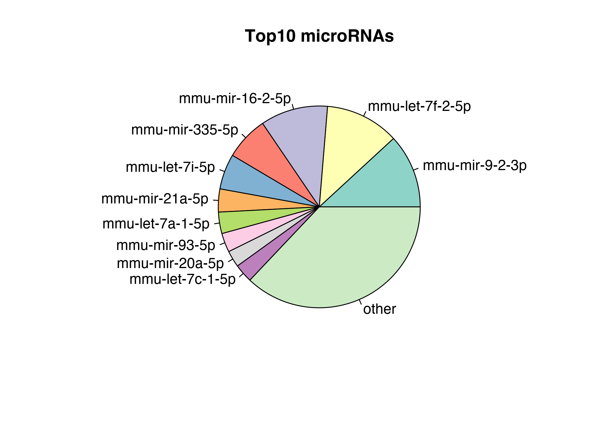

``` r
barplot(t(log2counts[rownames(mircounts)[grep("mir-29[a-z]",rownames(mircounts))],]),beside=T,las=2,cex.names=0.5,col=cond_colours,main="miR-29 levels (VST)")
legend("topright",rownames(pdata),fill=cond_colours,cex=0.4)
```

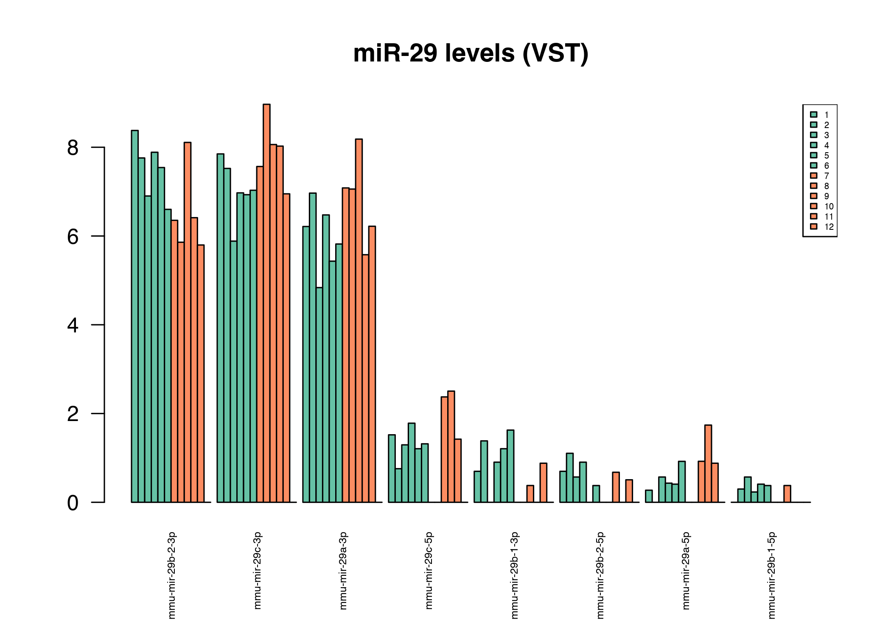

``` r
p_threshold=0.05
lfc_threshold=0.75

cds <- nbinomWaldTest(dds)

res=results(cds,contrast=c("treatment","wt","scr"))
res <- res[order(res$padj),]
res
```

               ## log2 fold change (MLE): treatment wt vs scr 
               ## Wald test p-value: treatment wt vs scr 
               ## DataFrame with 1024 rows and 6 columns
               ##                    baseMean log2FoldChange     lfcSE        stat      pvalue
               ##                   <numeric>      <numeric> <numeric>   <numeric>   <numeric>
               ## mmu-mir-196b-5p     32.5368      -4.297252  1.153420    -3.72566 0.000194805
               ## mmu-mir-9-2-3p    8783.8914      -0.671943  0.351322    -1.91261 0.055797400
               ## mmu-let-7f-2-5p   8340.3988      -0.607566  0.291524    -2.08410 0.037150952
               ## mmu-let-7i-5p     4010.3227      -0.658204  0.317788    -2.07120 0.038339871
               ## mmu-mir-125b-1-5p 1686.4068       0.826251  0.378916     2.18056 0.029215681
               ## ...                     ...            ...       ...         ...         ...
               ## mmu-mir-190b-5p     8.72582    -0.02326330  1.207107 -0.01927195    0.984624
               ## mmu-mir-188-5p      6.91172    -0.02134537  1.379703 -0.01547099    0.987656
               ## mmu-mir-24-2-3p   129.70922    -0.00759471  0.540723 -0.01404548    0.988794
               ## mmu-mir-107-3p     34.75595     0.00715818  0.763410  0.00937659    0.992519
               ## mmu-mir-450b-5p     7.96729    -0.00234344  1.355198 -0.00172923    0.998620
               ##                        padj
               ##                   <numeric>
               ## mmu-mir-196b-5p    0.199480
               ## mmu-mir-9-2-3p     0.294233
               ## mmu-let-7f-2-5p    0.294233
               ## mmu-let-7i-5p      0.294233
               ## mmu-mir-125b-1-5p  0.294233
               ## ...                     ...
               ## mmu-mir-190b-5p    0.988485
               ## mmu-mir-188-5p     0.990558
               ## mmu-mir-24-2-3p    0.990729
               ## mmu-mir-107-3p     0.993489
               ## mmu-mir-450b-5p    0.998620

``` r
sig = rownames(res[(abs(res$log2FoldChange) > lfc_threshold) & (res$padj < p_threshold) & !is.na(res$padj),])

plot(res$log2FoldChange,-log(res$padj,10),ylab="-log10(Adjusted P)",xlab="Log2 FoldChange",main=paste("Volcano Plot","WT v Scr"),pch=19,cex=0.4)      
points(res[sig,"log2FoldChange"],-log(res[sig,"padj"],10),pch=19,cex=0.4,col="red")
text(res[sig[1:10],"log2FoldChange"],-log(res[sig[1:10],"padj"],10),pch=19,cex=0.4,pos=2,labels = rownames(res[sig[1:10],]))

abline(h=-log10(p_threshold),lty=3)
abline(v=-lfc_threshold,lty=3)
abline(v=lfc_threshold,lty=3) 
```

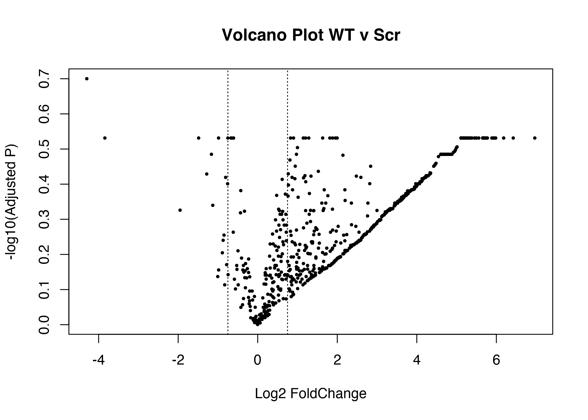

``` r
write.table(cbind(as.matrix(counts(dds,normalized=T)[rownames(res),]),as.matrix(res)),"mouse_results.txt",quote=F,sep="\t")
```
-->
