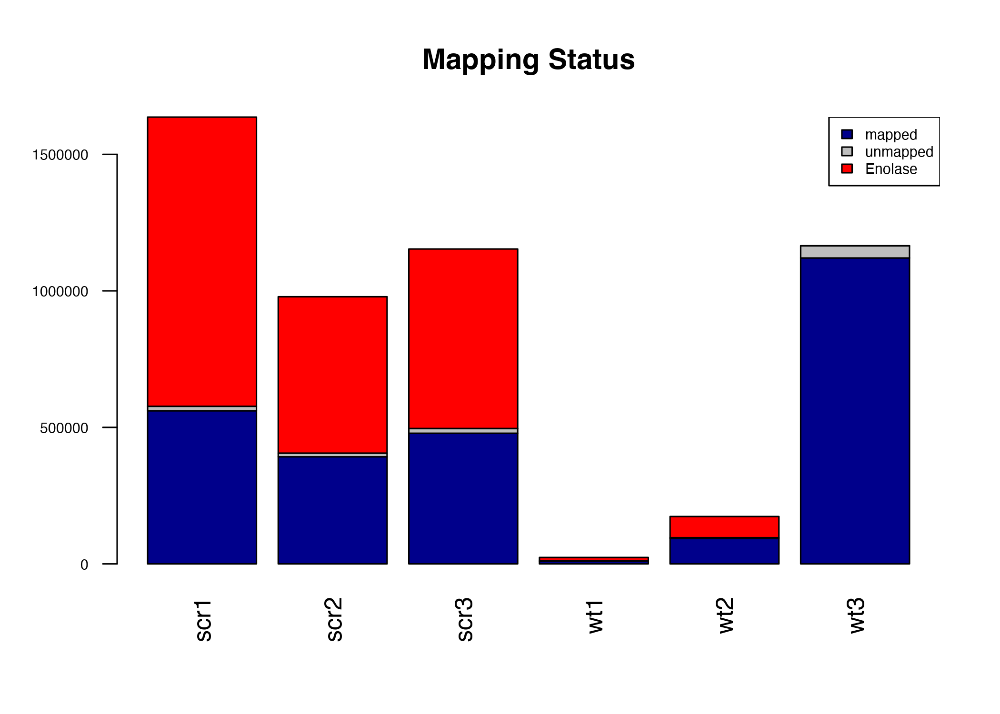
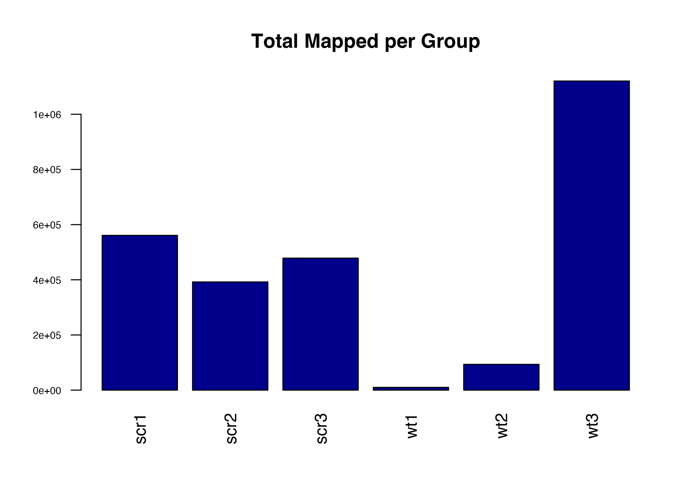
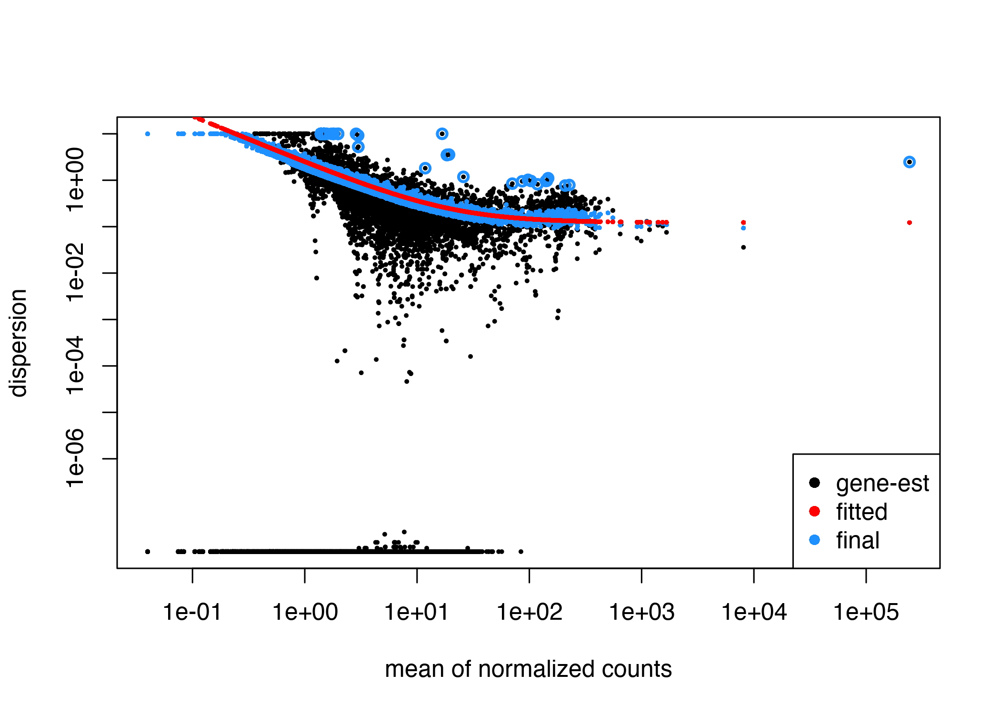
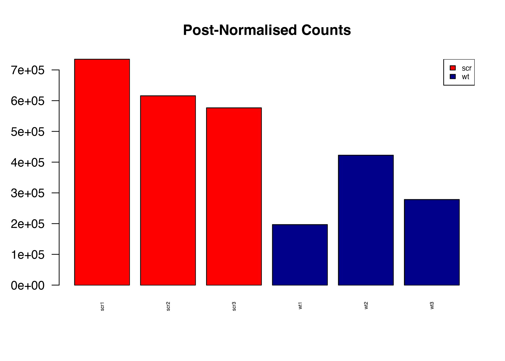
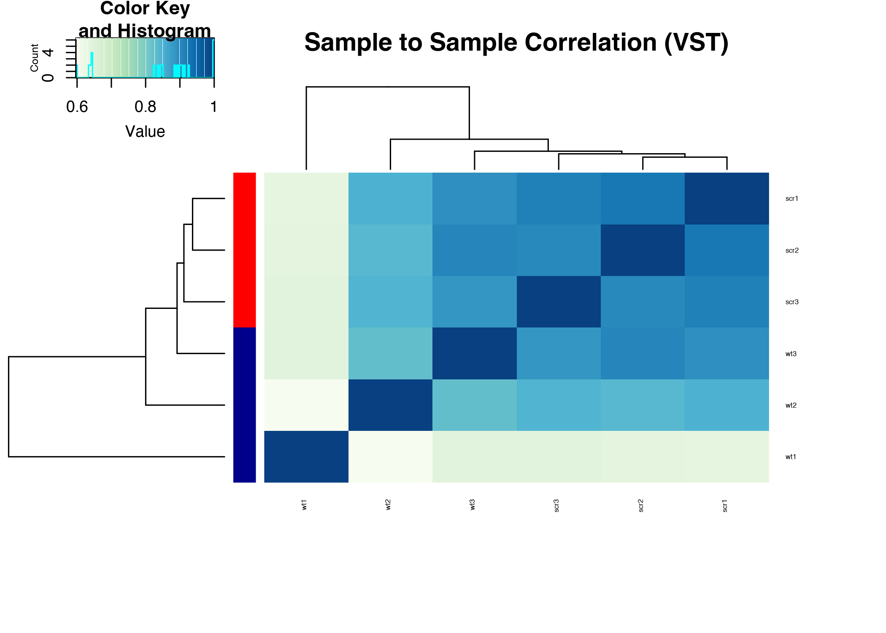
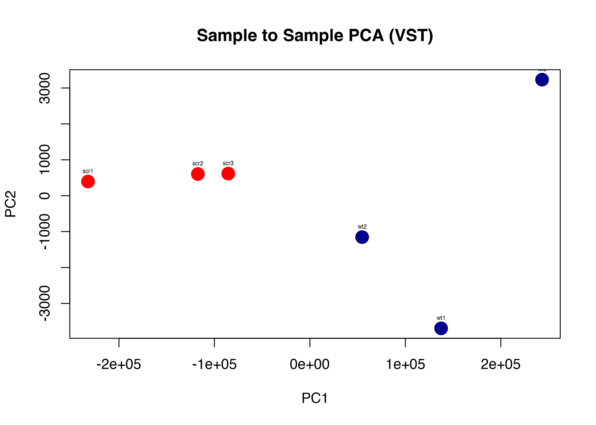
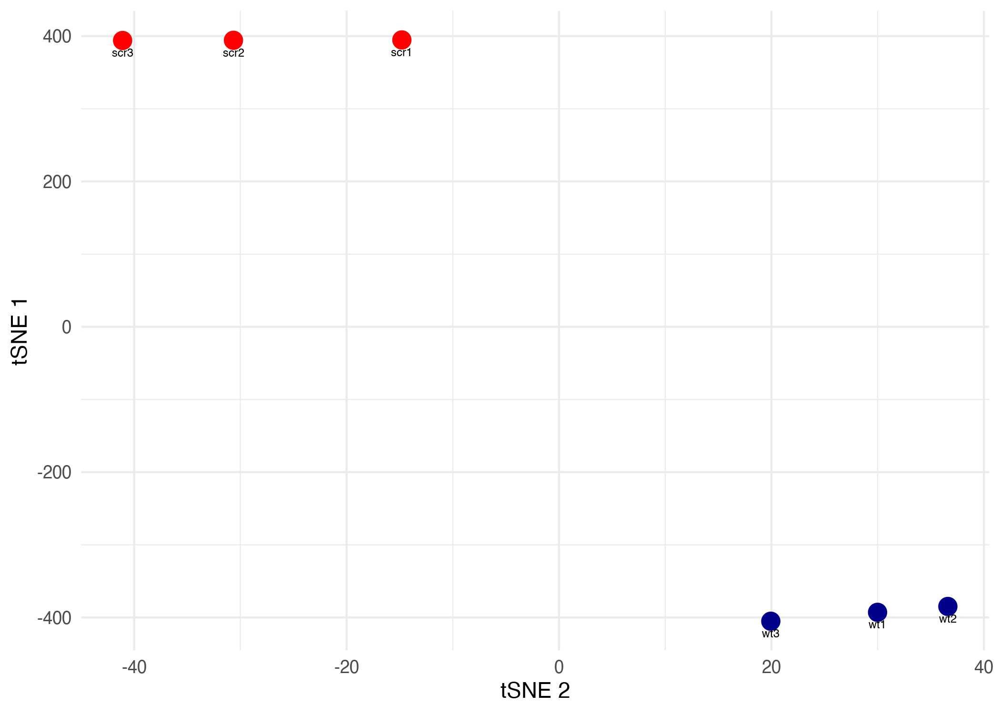
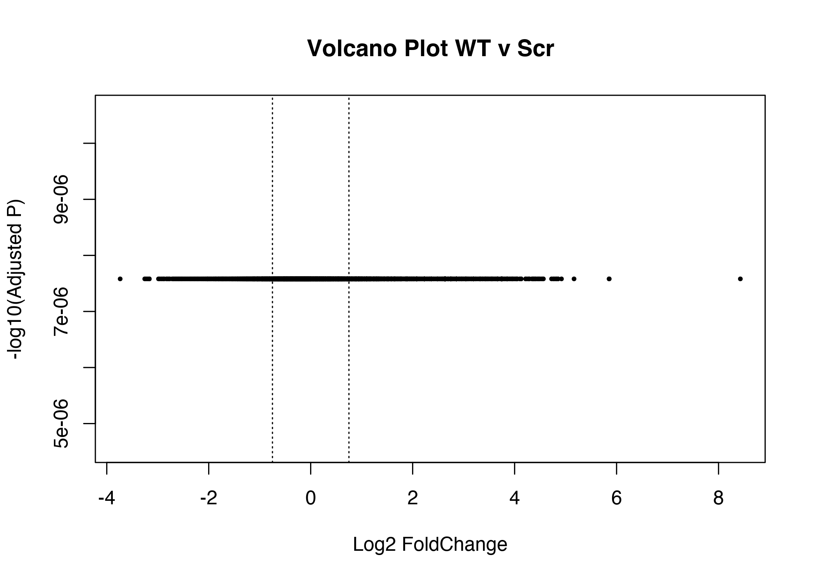

Nanopore Direct RNA Seq - Practical 2
================
Anton Enright & Jack Monahan
'28 June, 2023'

- <a href="#analysis-of-nanopore-direct-rna-counts"
  id="toc-analysis-of-nanopore-direct-rna-counts">Analysis of Nanopore
  Direct RNA counts</a>
- <a href="#analysis-of-reads---basic-qc-of-sequencing-runs"
  id="toc-analysis-of-reads---basic-qc-of-sequencing-runs">Analysis of
  Reads - Basic QC of sequencing runs</a>
- <a href="#mapping-of-reads" id="toc-mapping-of-reads">Mapping of
  Reads</a>
- <a href="#genome-mapping" id="toc-genome-mapping">Genome Mapping</a>
- <a href="#igv" id="toc-igv">IGV</a>
- <a href="#creating-counts" id="toc-creating-counts">Creating counts</a>
- <a href="#count-level-analysis" id="toc-count-level-analysis">Count
  Level Analysis</a>
- <a href="#statistical-analysis"
  id="toc-statistical-analysis">Statistical Analysis</a>

# Analysis of Nanopore Direct RNA counts

First we should change directory to where the data is

``` r
setwd("~/Desktop/course_data/direct_rna")
list.files()
```

               ##  [1] "combine.pl"            "direct_rna_counts.txt" "fast5"                
               ##  [4] "fastq"                 "mouse_genome"          "scr1_genome.bam"      
               ##  [7] "scr1.counts.txt"       "scr1drna.bam"          "scr2_genome.bam"      
               ## [10] "scr2.counts.txt"       "scr2drna.bam"          "scr3_genome.bam"      
               ## [13] "scr3.counts.txt"       "scr3drna.bam"          "summaries"            
               ## [16] "test.bam"              "wt1_genome.bam"        "wt1.counts.txt"       
               ## [19] "wt1drna.bam"           "wt2_genome.bam"        "wt2.counts.txt"       
               ## [22] "wt2drna.bam"           "wt3_genome.bam"        "wt3.counts.txt"       
               ## [25] "wt3drna.bam"

# Analysis of Reads - Basic QC of sequencing runs

Will will use the PycoQC tool to make a QC summary for each set of
Nanopore reads by group

    pycoQC -f summaries/group_1_summary.txt -o group_1_summary.html
    pycoQC -f summaries/group_2_summary.txt -o group_2_summary.html
    pycoQC -f summaries/group_3_summary.txt -o group_3_summary.html
    pycoQC -f summaries/group_4_summary.txt -o group_4_summary.html
    pycoQC -f summaries/group_5_summary.txt -o group_5_summary.html
    pycoQC -f summaries/group_6_summary.txt -o group_6_summary.html

# Mapping of Reads

We will map reads directly to the transcriptome first to obtain accurate
count data. Because we are mapping to cDNA we don’t need to account for
splicing and run minimap2 in the *map-ont* mode for long noisy reads.
The reference data was obtained from Ensembl FTP. We use samtools to
convert the text output (SAM) to a more efficient binary format (BAM)
and also sort the BAM files to create efficient result files.

The mapping mode is *-ax map-ont* and we ask for two CPUs per job *-t
2*. We use *samtools* to help formatting the BAM files.

    minimap2 -ax map-ont -L -t 2 mouse_genome/Mus_musculus.GRCm39.cdna.all.fa.gz fastq/scr1drna.fq.gz | samtools view -bh | samtools sort -o scr1drna.bam
    minimap2 -ax map-ont -L -t 2 mouse_genome/Mus_musculus.GRCm39.cdna.all.fa.gz fastq/scr2drna.fq.gz | samtools view -bh | samtools sort -o scr2drna.bam
    minimap2 -ax map-ont -L -t 2 mouse_genome/Mus_musculus.GRCm39.cdna.all.fa.gz fastq/scr3drna.fq.gz | samtools view -bh | samtools sort -o scr3drna.bam

    minimap2 -ax map-ont -L -t 2 mouse_genome/Mus_musculus.GRCm39.cdna.all.fa.gz fastq/wt1drna.fq.gz | samtools view -bh | samtools sort -o wt1drna.bam
    minimap2 -ax map-ont -L -t 2 mouse_genome/Mus_musculus.GRCm39.cdna.all.fa.gz fastq/wt2drna.fq.gz | samtools view -bh | samtools sort -o wt2drna.bam
    minimap2 -ax map-ont -L -t 2 mouse_genome/Mus_musculus.GRCm39.cdna.all.fa.gz fastq/wt3drna.fq.gz | samtools view -bh | samtools sort -o wt3drna.bam

``` bash
samtools view wt1drna.bam | head
```

               ## 75a04b81-fe89-4aae-b45d-c7bcc466fb95  0   ENSMUST00000082392.1    1   60  63S19M1I13M1D6M1D10M1I3M1I5M1D11M1I5M1D8M1D6M2I10M1I14M1I24M1D7M1I15M1D5M1I19M2D10M1D6M2D12M1D7M3D3M1I6M1D4M1I17M1I4M2D31M1D13M1D24M1I16M1I15M2I11M2D36M1D3M2D23M2D8M2I10M1D7M1D73M2D4M1D7M1D8M1D4M1D8M1D13M1I4M1D22M1D15M1D2M1D1M1D5M1I3M1I12M1I18M1D18M1D5M4D4M1D3M2D1M1D22M4D12M2D2M2D1M1D45M1I41M3D24M1D9M1D12M2D5M2D6M3D5M3D5M3D12M66S *   0   0   AGAGCCAGGAAATTGCGTAAGACTTAAAACTCTGTTCCGGAGGTCCAAATCCTTTCCCTAATAGTGTTTTTTATTAATATCCTTAACACTCCTCGTCCCATTTAATCGCCATAAGCACTTCCAACATTAGTAGAAACGCAAATCTTAGGTACATCTACAACTACGAAAAAGGCCCTAACATTTGTTGGTCCATACGGCATTTTACATCATTTCGCAGACGCCATAAAATATTTCATATATGATCAAATACGCCTCAACAACCTTATATCTATTTATTATTGTCCTACCTCATTTCACATAGCTACTAAGTCTATGAGTTCTCCCTCAATACCACACCCATTAATTAATTTAAACCTGAGATTTTATTTATTCAGCATTCTTTAGCCTATCAGTACTACTCCATTCTATGATTCAGGATGAGCCTCATCAATTCCAAATACACTATTCAGAGCTTTACGAGCCGCAGCCCAAACAATTCATGAAGTAACCATAGCTATTATCTTCATCAGTTTTCTATTAATAATGGATCTACTTTCTACAAACACTTATTACAACCCAAGAACACATATGATTACTTCTGCCAGCCTGACCAACAGCCATAATGATCATCTCATCCTAGCGATAAAACCAGGCCCTTTCGACCTGTATAGAGGAGAATCAGAATTAGTAACAGGTTTAACGTAGAATCGATCGGCACCATTTCGCGTTATTCTTTTATAGCAGAGTACACTATATTATTTTAATAAACGCCTAATATTTCTCAGGACCCCTATACTATATCAATCAGAACTCTACTACATTCATAATAGAAGCACTACTACTATCATCAACATTCCTATGGATCTCGAGCATCTTATCCACGCTTCCGTTACGATCAACTTATACATCTATGAAAAAACTTCTTACCCCTATACTAGCATATGTATGTGACATTTCTACCAATTACAGGAGTACCATACATATAAAAAAATCTCCTCCATCCATCCCGTCATCTTATATTCATTATCATATCCCAACCTATTCCTCAAAT  +65%,2(,2:>CD11<792E=56<:9@10,%$$$&'0.'&%%&$%./+&*%&'''24&37:=94:%*0'>,/,6<987;+))&(,))2/3,1--*(46804-59=7/*)*)%(&)*$%&&''&%%%4884-511117576++/(+'$45:68:.(*),<<;L:@7=<;BL:91-%(;<???>>:0631=?>@>*840>;55-,))'(&&)&&##%;;@7632))578.6*/%)'')30,079+*09(:7((0;3))0.)((+%33==)$23812<9?=<7-./02((*%(+/'($(('(5&',,,60>65)+&0;846,$(44)%(22311//,)),344341.49;:98<10,%%&$2&9=-..4)8842$&+#$%&%10;30+$'/*&4681'+--+*540.(7287@444=64EC9?<<:A5+,3;5%),123&32*'(526**3416605,=;;806.-)$-*1,/31198;35244442'-,+,''421$$&.41,.**)./4/58%$.0/3.11+895988*'*))+%-,/*.9.,43,'))1('321)9<&?8A;@6779)+48:*&2.5)105(*3-686'(&&%,6=::/9<;999)&%+).-/()*%$%##$$/4((')&)).01)3453;8334-*$',8+(-43<7:9=:;/';5;5275-,5*))())38265%&'&%&-&30422-018554$5517&4=7542,*)%$'/,342169&(*++,2+444,777/./12++(5(+-*37;86(024-<@>:=4=50.*/005:686*)*%%&+#$$'4-+'&'9+:14&($)+1+-29G>:><4-*((+*17$2.4428:%%167<0/3'-(32&%1<42AF;=9::<<7=5..%05798<<7;%86719:..$$#)('+*',55..(%$%.+*)%&-065)*6=884.1*5$31-10)))$&%,+7873''*0%%#&'+,(('&&%'#$&&)+('%'%'(')*)*$(/)+,,.#22,'(&('%$'+)'(-''+*$''4*2++7:)4  NM:i:141    ms:i:1061   AS:i:1032   nn:i:0  tp:A:P  cm:i:26 s1:i:232    s2:i:0  de:f:0.1159 rl:i:0
               ## 439b37c1-5a0b-4e1e-a68a-f45bbf629a7c  0   ENSMUST00000082392.1    3   60  1611S17M1D9M1D2M1D16M1I22M4D7M1I4M5D9M2I14M2D17M2D35M1D14M1D33M3D4M1D8M3D23M1D14M3D5M1I9M1I21M1I2M1I10M1D14M1D6M1D6M2D11M1I12M1D25M1I12M1D31M1I3M1I14M1D6M1I8M3D8M3D17M2D15M2I30M1D17M1I28M1D2M1D17M1D41M3D4M1D1M1D4M1I25M3I17M1D40M4D3M1D3M2D10M3D15M1D4M3I17M1D6M2D4M1D5M2I21M2D5M1D5M1D5M2D6M2D5M1D26M1D14M6S    *   0   0   TTGGTCCCTACACAAATAATTATACTATTATAAATCAAACATTTATCCTACTAAAAGTATTGAGAAAGAAATTCGTACATTAGGAGCTATAGAACTGGTACCTCGCAAGGGAAAGATGAAAGACTAATTAAGTAAGAACAAGCAAAGATTAAAACCTTGTACCTTTGCAATGAACTAACTAGAAAACTTCTAACTAAAAGAATTACAGCTAGAAAAACCCGGCAACCAAACGAGCTACCTAAAAACAATTTTATGAATCATCGTCTATGTGGCAAATAGTGAGAAGATCTTTAGGTAGAGGTGAAAAAGCCTAACGAGCTCGATGATAGCAAAATTCCCAAAATGAATTTAAGTTCAATTTTAAACTTAATAAAAACAACAAATCAAAAGTAAGTTTAGATATATAATCAGCAGAGGACAGCTCTTCTGGAACGGAAAAACTTCTTAATAGTGAATAATTAACAAACAGCTTATATTTAGGCCTAAAAGCAGCCACCAATAAAGAAAGCGTACCGATTCATAAAATTTCAATTAATTCCATAATTTACACCAACTTAATCTTAAAATTGGGTTAATCTATAACTTTATAGATGCAACACTGTTAGTATGAGTATACAAGAATTTCCAAATTCTCCAGGCAACGCGTAACAACTCGGATATCATTGCTAGTTAATCAGACTATAGGCAATAATACACTATAAATAATCCTTCCTATATTCTGTTAACCCAACACCGGAATGCCTAAAGGGAAAGATCCAAAAGATAAAAGGAACTCGGCAAACAAGAACCCCCGCCTGTACCAAAACATCTCTAGCATTACAAGTATTAAGAGGCACTGCCTGCCCAGTGACTAAAGTCTTAACGGCACGGATCCTGACATTGCAAAGGTAGCATAATCACTTTGTTCTAATTAGGGACTAGCTTGAACGGCATTTAATAAGGGTCCAACTGTCTTTATCTTTAATCAGTGAAATTGACTCTTCAGTGAAGAGGCTGAAATATAAATAATAAGACGAGCAGACCTCATGGAGCTTAAATTATATATCTTATCTAACTTAATTTATTAAACCTAATGGCCCAAAACTATAGTATATAAGTTTGGTATTTTAGTTGAGGGTGACATGGAGAAATAAAAAAATCCTCCGAAATGATTATAACCAAGACTTACCTGATTTAGTAAAATCAACATTTTGACCCAGATATATTTGATCAACGGACAAAGTTACCCTAGGGATAACAGCGCAATCCTATTTCAAAGAGTCATATCGACAATTAGGGTTTACGACTCGATGTTGGATTATAGGACATCCCAATGGTGTAGAAGCTATTAAACTAGTTCGTTTGGTTCAACGATTAAAGTCCTACGTGATTTGAGTTCAGACAAGAGCAATCCAGGTCGGTACATATTTATTTACGATCTTCCAGTACGAAAGGACAAGAGAGAAATAGAGCCACTTACAAATAAGCGCTTTCAACTTAATTTATGAAATAAAATCTAAATAAAATATACGACACCCTCTATCAAGAGAAGGTTATATATAGGGTGGCAGAGCCAGGAAATTGCGTAAGACTTAAAACTCTGTACCCCTGGAGGTCCAAATCTCCCTAATAGTTCTTTATTAATATCCAACACTCCTGTCCCATTCTAATCGCCATTAGCCTTCCTAACATTAGTGGATAAATTTCTAGGTACAACTACGTGAAAAGGCCCTAACTGTTGGTCCATACGGCATTACAACACTTTGCAGACGCCATAAAATTATTCATTAAGAACCAATACGCCTTCAACAACCTATATATCCTTATTTATTAGTCCTACCTATCACCACTAGCATTAAGTCTATGAGTTCCCTACCAATACCACCATTAAACTAATTTAAAACCTAGGGATCTTATTTATCTTCTAGCAACATCAGCCTATCAGTTTATCCATTTATGATTGATGAGCCTCAAAACTCCAAATATCACTATTCGGAGTTTTACGAGCCGCAAGCCCAAACAAATCATACGAAGTAACCATAGCTATTATCCTTCATATTCAGTTTTATTAATAATAGACACCTACTCACAAACACTTACAACCCAAGAACACATGAACATTTTTGCCATAGCCTGACCCATAGCCATAATATGATTTATTCAACCCTAGCAGAAACAAAACCGGGCCCCCTTCGACCTGACAGAAGAAATCAGAATTAGTATCAGGTTTAACGTAGAATACGCAGCCGGCCCATTCGCGTTATTCATTGAAGTACCATTAACATTATTCTAATAAACGCCCCTCTAACAACTATTATCTTCTAGGACCCCTATACTATATCAATCTACCAGAACTCTACTTTATTCAATGGAAGCTCTACTATCATTTATATCCTTTCATGGATCCGAGCATCTTGCCACGTCCGTACGAACTTATTTTATCTCTCTTCTATGAAAACTTCTACCCTATCTAGCTATGTCGTGACATATTTCTTTACCAATTTTTCAGCGGGAGTACCATACTGC   $'&#$&0.$%(:@<<)7;>8;9.%&05.<=,;>0:14)&%"'+*40,,%$%0>?CE7492?<::=4E=>??=>32:.-*&'033;5./9).,133)(%411%$..&&53==B=G5;C=CBB@@;>=.*'286600-)04??(.=9=7;?7;@>?:08D7889366337476:?A:7BD:>B=@=@A8%2$**(&0-/;D7>>5,)/;&&.=::<@;<,.%$$#)&*;CBD28?B63-75;8B>665=>;3.=9>744)(((417,:<?59:9>7005289@=3?A4A:$,3;:76?;;=86;9:7:@I4;+,2.,8<>16%2+&5-6+;-((($+*3799822-9>75.1.;79><?@<?.6867704*)*39@:;5234;:,/1::7@7<>@5823899)$$&-*).644289*00=:;;.1&&2,581A=:75><=<@,%$%1>7:,*7/3<7/4560*:979;.210()"%(*&*2346'-036548;4+.336546..;8@KM>9*-%&()))0.1.>@C:;:<;:><::>0;<9337936532-'+,..'0:80,1220,%/2/00;A;?D@@>3<=:4-($%=98>86:4;/0:8:;64+**787;<'%'&73;:38.)158&/,%%%7:7725;93))'58553)+8<855*&++/1/&.$$1.7042<=.8@8<1675(((89+6;538=710%2565$)$$,+<<)$*),<7;E763400<<<:2;2;C1701844:754/.C=A,*%../;94666IV;8:7(-->;:><@:9@595/8775494)'+$%/56:;44,+-$,87:114369H96696-/-))/664753/7445*'+++,09<896/&'(47;21*&$2/<;%&662*&$%2+@CMHC,691++:92&)($2A9-%$38<:<97;;:88%'%+.69;8)%.$%)./'%,:/3;=8<:7,B=4-*,+32%-,/4'/.+5/9;;(<>>4'*$-01(5(;>O6;1:1>AC<:@2<55'82366C??<9+(%<<=<(*%#%-+<?39:<@@C+90,6:+*.00.%0&$$0376648:,8=89,%1)*+<:75)67880<9%,-5%469<:044;/.%&',(&)0/6.$-87==90$&3*<<5;*=89<:;8)8)(*/7532/274:36(3322'25.*&$$'(),,5%(:4;>@A70320/,+1,0//629<8:;06).$++$+(+07@;<8&+061?%)4+72233*/0/08?851;?6.;A=28913;>6>?72(304*870?=:6@:652(1.583*+59A><D;5383**(235.,&&%/4?@;?=B;::5==<8>/:;&$$%+-52000*/40.?600%98?4&54=6:=+>/9@0=?-'769;?855923*..-;@7:07<>54)0511#&'(26'854'3=A?=0#&&4<7>9:<7)(':+015B><$<?=?.963;=71))$%#+//'(02<.-0,$&$)89:99=1.>=B8@=$9>??1<4888/8=@<2.9531++,(,*%$)05+'&:38,'*++71+1$3$*''-,/&$(6;98<9;75FD7=,,7211B760BC8?;?1#%-,-$%353'&$/./>=>?=.5(&1623:85')*2%*/44788;.?35/.-/?4-+%%%++,(((8)6==9?<B<?@?4&-3)).14:<?;=B>-73,8)441100$',1,22&05(<3&$$&*11$4241*+('&/24997;9892+0.+.*+-&))'(&%'%$&+:?:83(5-,;??:A146*)((*(985310%**+/05,70.+((%$'*/./'-'(%3.12906$*3#%&&,*%***/+&$),//;=9*&;84B:9)97<8;>'/154')24/02**+'+11165'&&53%50:6=68701;306&)%+.2+)573&++#%/52100'(%*1.71)/-6990+)$*/./)6793:'$*&1'+'-7:5<;((',+--)(,%$&*/56*$'+/-3&',,5931.'$$%%25679<8$36640-+*(*(%$*+8748?=>>;=B@CA6<73:('20-'&'2*1'08/,+'%)($'5(+(('$$$%')/48<12)(%$&(,,68&37551-,++3+%&%%'+&&&0.''3969:>;70..,)/./,-//,,963/.7206>976=-3>85+)-8-9=:&&&))4498811;416::8=89745+(*42%0(==<A<1<8=B3692167-1//.4+6-//)(%'#'%(/-1/3;7A7477:41()%'0,++2-5**'''..,/.04609*,42-=C@4/+11/0'.&$$&&(8;46=1+'$&&---00-13((0349:/(4244+#%%0612<6;:4434.+)$*0%00.++:<92/$)15@8776/%)4&%((0-)+((/:5>:00034824(4*%'8<82$%&$2)11-)))(*,''''2%&$&%),+191)66343+5%977<777,&::9&29A:($#&48:88.30&&('''/-2.60-'$%)2(%--<395--/6''%+&   NM:i:147    ms:i:1043   AS:i:1004   nn:i:0  tp:A:P  cm:i:21 s1:i:201    s2:i:0  de:f:0.1153 SA:Z:ENSMUST00000179797.3,1,+,605S418M12D1482S,33,88;   rl:i:0
               ## 31d4a907-7ce8-45f4-a99b-f8349758fecd  0   ENSMUST00000082392.1    12  60  15M1I23M3I31M1D5M5D42M1D47M1D7M4D2M1I3M1D47M1D18M1D6M7D9M1D15M2D11M1D1M2D5M2I19M2I9M1D72M1I1M2I19M4D19M2I10M1D12M4D17M1D31M2D27M3D22M1I27M1D50M1I31M1I14M1I18M2I9M4D14M2D18M3D2M1D17M2I16M2D1M1D5M1D3M1I17M1D5M2D17M1D6M1I7M5D9M2D5M3D15M1I15M71S   *   0   0   TAATATCCTATCACTACCTCGACCCCATTCTAATCGCCATATTAGCCTTCCTAACATTAGTAGAACGCAAAATTCAGGTACAACTACGAAAAGGCCCTAACATTGTTGGTCCATACGGCATTTACAACCATTTGCAGACGCCATAAAATTATTTATAAAAGAACCAAACGCCCTCATATCCTATATCCTTATTTATTATTGCACCTACCCTATCACTCACACTAGCATCAGTTTATGAGTTCCCCAGCTTTCCATTAATTATTTAAACCTCAGGATCATTTATTTTGACATCTTTAGCCTATCAGTTTACTCCTTATTTTATGACCGGATGAGCCTCAAACTCCAAATACTCACTATTCGGAGCTTTACGAGCCGTAGCCCAAACAATTTCATATGCAGGAGTAACCATAGCTATTATCTATCGGTTCTATTAATAAAACAAGTTCATTCCTCTACAAACACTACAACCCAAGAACACAATGATTACTTCTGCCAGCCTGACCCATAGCCAATATGATTTATCTCAACCCTAGCAGAAAACATGGGCCCCTTCGACCTGTTCAGAAGGAGAATCAGAATTAGTATCAGGTTTAACGTAGAATACGCAAATGGCCCATTCGCGTTATTCTTTATAGCAGGAGTACACTAACATTATTCTAATAAACGCCCTTAACAACTATTATCTTTCCAAGGACCCCTATACTATATATCAATCAGAACTCTACTCATTATTTCATAATAGAAGCACATTATCATCAACATTCCTTTATGGATCCGAGCATCAACACGTTCTCGTTACGATCAACTTATGTTCTTATGAAAAAAACTTCTACCCTAATCATTAGCGTATGTGACATTTCACCAAATTTTACAGCGGGGAGTACCACCATATAAATCCCCACACACATCCACCATACATCACATATACCAACATCTTCATCTATCCCACCCCAACCCCCAAT  147/;-:?88'/82/''&%++$(488<17:66:-75:0$*%)')*/+)*310,+),,:7<*328:87->A=><+&..-210'#&,--./21+43.2/0&%%#'643.0-:74>;+.,*5:;3+(*)''/++*)(1@;>22577('.6(6<@>'?<;82.A1::7010''*-524(&'%)06:96;:5586<@8?;=>98)$%%,.4)-40-23'*)(,.84%$**-'+'%%*%(*14:9<7*8)(%$$*%$+-&&2;:9E<3.5>>=3/*($%21.$%+595;3('%#'(%%1*:597$$$4-6./2211($0$$'&.')3567%(*&1591&/6706?A:6*029:65).143B>0)*%1,3%%(''/./31,*,1/)99AEF8:?98678372)%-/0117-/3>F?<=<06/54)'*+$,,&91#%%29;9474887681-,11)%++&$$%)=64(%%-,/,(*88$=7751(*&(,31.%$''5(335;=&*065-/,/0.+2+&236+374&%'+&&&&+'-9/40,,:45864&$('*),4685973==653*%(',-++3:>?@60B;A@=5736:)'//.77/+)))*>2;;1=736.$#$0./.64++343/91>..*5,:9@4,1-/$6;7-1/-)'''&&98/*'(210<@=84595%.1410,'90/0@8%+(-$($/1364/517:?33=@1(+%01892-86<9,&1)),'%%',/+6859<;;8'9,=8)&%"%/55(+,++&&',.,,''&*+52/0)216966$%&%&*..)&('((5>06.2:,-0+)70-#)&%,%%172478;4404-*1-33/-'%))$%)50,*08:886/,-)%'&$(897%2-)''*0/..144?4>86(%575)$&(&('+/0-"$#&&'$$)*#&-++$%%&$#$$../%-6.&&'(&%%$'%*$$$*+%#+)(.&$()/-&12'  NM:i:136    ms:i:1154   AS:i:1104   nn:i:0  tp:A:P  cm:i:48 s1:i:350    s2:i:0  de:f:0.0971 rl:i:0
               ## 601dfba8-8022-4743-9da4-3fe80a5dff31  0   ENSMUST00000082392.1    12  60  18M1D16M1D7M1D5M1I2M1I11M2I2M1D4M1D5M1I2M1D50M7D25M1I55M6D19M2D5M1I23M2D1M1D16M1I16M1D13M1D15M2D26M1D4M1D14M2I102M3I16M1I6M1D50M1D7M1I4M1I4M1D17M1I65M1I32M1D4M1D3M2D2M1I12M2D5M1I27M1D3M1D22M1D14M2D21M1I8M1D4M2D2M1D13M2I13M2D6M2I5M1D5M4D25M3D8M3D2M2I12M1D8M74S *   0   0   TAATATCCTAACACTCCTGTCCCCATCTTAATCGCTTAGCCTCCTATACTATTAGTAGAACGTGCAAATTTAGGAGTCTTACAACTACGAAAAGGCCCTAACATTGTTGGTCCATACGGCATTTCACTACAGACGCCATAAAATTATCTCTATAAAGAACCAATACGCCTTTCAACAACCTCTATATCCTTATTTATTATTGCACCCACACTCACACTAGCATTAAGTATGAGGCTCTCCCACCGATACCACACCCTATTAATTTAAACCTAGAGGATTTTATTTATTTTGCAACATCTAGCCATCAGTTTACTCCATTATGATTAGGATGAGCCTCAAACTCCAGCATCACTATTTGGAGCTTTTTACGAGCCGTAGCCCAAACAATTTCATATGAAGTAACCATAGCTATTATCCTTTTATCAGTTCTATTAATAAATGGATCCTACTCTCTACAAACACTTATTCATACATCCCAAGAACACAATATGATACTTCTGCCAGCCTGACCCATAGCACTAATATGATTTATCTCAACCCTAAAGAAACAAAACTCGGGCCCCTTCGACCTGACAGAAAGGAGAATCAGAATTAGTATCAGGTTTTAACGTAGAATACGCTGTCGGCCCATCCGCGTTATTCTTTTATAGCAGAGTACACTAACATTATTCTAATAACGCCTCATTCTATTATCTTCAGGACTCCCTATACTATATCAATTTACCAGAACATATCAACTAACTTCATAATAGAAGTCTACTACTATCATATACTCCTATGGATCCGAGCACTTTTATACCGCTCGTACGATCAACTTATCTACATCTTCTATGAAAACTTCTTCTACCCTATAGCATTATGTATGTGACATATTTCACCAATTTCATGGTAGGAGTACCACATATATAAAAATACCCTCCATACCCATATACATCCCTTATTTATATTCATAACATTTCATCCATATCCTATTCCTTTCAAT  .652?;;790417541%%(+*51.&%&*376,&%%&)067'&.'%''%%&&13:7*4300-.+)*177..(-&#,1.&'&'1100@:<6:<=B332)420>9;5821('%<79:-(42/5%'1-%%$&#'476<6=A44=?>?A9=4#'&**,*(819$7&&&(0&64)5/0)*+,(''-).887,0*5*<<=://58;832*&)/,%$(('+&0''100=81*2:4)$&(&%&#&$%/1(*/(%+322:+<667)//45527&;=9=6$%(*+77>1+,7:56?=((&()+11.0+339.;1')&(,2++,.;776140759//8=<932*+.393:::8*$38/..'$$$%&,&&*%<=B/+)($&121652136,&'.7?A;9=,1=<>.'216:291.,++9>=@@?9:..)(5841:<<)*2%*95567-958%(*%&-,.933/.=,1;8@;8685:558*)))%'(%*23(?6?94*)%$%&(/0($%*+$..43+4,'22)31-*)$&+%%'584A;4;1,.81.89865;458,=57*('3400)*.&65:4804://(,/3628<00-/('13;@=?89:@<-423349=7625&-,0+0:758:5,842++$-+*-*-,,462//7=<64%(3/8>>@<87:861))%%011+++46%2)/11+6=9576,*0*&$'&+380)'%%&,$'%$.0315?0/0,/27356,))((*?9<84('$%)-37<1..9:3((69;4@9>7)%(/2.89=@<55*'*%$'$$#$+.+31'-495>5+/3((7,&&'$%%,'5.823)&'&&),-5+-,432+'4'-,.09<)$(/+%%2$,&3622+,952*+-244766-;8;:;,$53(&$'14.)'%#&''&*(..21552(%'%%&'$((&%%(*((**%)&%&#&-'#($%$,%*-1''(+,1424&-+1*0''(%)((***)'##$$')%)'%.*($%&//.  NM:i:125    ms:i:1178   AS:i:1144   nn:i:0  tp:A:P  cm:i:43 s1:i:372    s2:i:0  de:f:0.0982 rl:i:0
               ## 62c804d3-05c7-4ee2-89aa-98f5dcecb08b  0   ENSMUST00000082392.1    12  60  10M4D7M1D20M1I34M4D13M1I3M1D19M3D9M1D4M1D11M2D12M1D19M2D7M1I26M4D17M1D54M1I7M2I5M1D26M2I6M1D8M1I13M1I19M1D4M1I6M1I6M1I1M2D11M1D48M1D9M1D3M1D30M1I1M2D15M2I8M1I40M1D26M3D49M1I10M2D8M3I5M2D22M1D19M2D35M2D1M1D20M3D12M1D8M4I7M1D19M2D1M1D27M1D6M1D5M1D21M2D4M2D7M1I4M6D6M3D16M57S    *   0   0   TAATATCCTATCCTCGTCCCATTCTAATCGCCATAGCACCACCTAACATTAGTAGAACGCAAAATCTTAGGGTACAACTACGAAAGAGGCCTAACATTGTTGGTCCATGCATCTTACATCATCGCAGACGCCAAAATCATTTATAAAGAACCAATACGCCCTTACAACATCCTATATCCTTATCTATTATTGCACCTTATCACTCACACTAGCATCAGTCTATGAGTTCCCCTACCAATACCACACCCATTAATTAATCTAAACCTAGAGGATTTTTCATCTATTTAGCAACATCTAGCCTATCGGTTTACACTCCATCTATGATCCAGGATGAGCCTCAAAACTCCAAATACTCACTATCGGAAGCTTTCACGAGCACAGCCCAAACAATTCATATGAAGTAACCATAGCTATTATCCTTTTATCAGTTCTATTAATAATGGATCCACTACCACAAACACTCGTTACAACCCAAGAACATCATGACTACTTCTGCCATAGCCTGACACCATTGCCATAATATGATTTATCTCAACCCTAGCAGATACAATCAGGCCCCCTTCGACCTGACAGAAGAATCAGAATTAGTATCAGGGTTTAACGTAGAATACGCCGATGGCCCATTTCGCGTTATTTTATAGCGAAAGAGTACTAACATTATTCTAATAAACGCCTAACAACTATTATCTTCAGGACACCTATACTATATCAATTTACCAGAACTCTTTATTAACTTCATAATAGAAGTTCTACTATCATAACATTCCTTTATATGGATCAAGCATCTTATCCACGCTCATACGATCATTTTATACATCTTTTATGAAAAACTTCTACCCTATCATTAGCATTATGTATGACATTTCTTCTAGCTACAGCAGTACCACCATACATAGCTCCTACCCCACATACCCATTTATTCATACATCTTTATCCTATCCACACATCCCAA    -:;=A;8220%'%',,-;;>=3**26;,77930',.1''&$--/54311.63(532445)671-0&&189<<1+')($%&)46..1$/0.4876<:;0&+8;8A7>58:945%&&/1'$$$*-.501(:6;%-/5(5)-8313527B6A@?*.37H<;,20,+$&+./.&0/9:3=>;:/63/&033/&51.0&&2&/:898<3*661/3.1+$+$$/'%'*,87>53%3>43475321*)09:'79973>7'837+**7:991'*&)$00@A'-.(%%)%48/-,,++(&'&,(8C767;B>2-*4%%%%$#*,..&%050587%/132021/()(%(22..-A8*-0*-7++,-,:=66+%320,.&%&675091$$)&-3180//$%+2242/87@C5:<<<;2-')*$*&+-3+013-'..(&3-)%'%-1:54;=<42451*+/,#&$*,=??7/)'#%)$#++**+51>7873'(/773/%('('2%))64/*0;67:633*//.)')&8889<.%,21*.(.*,453003&2723565**/68*%&//.-75/(.,)/=09:39>5'@7<<9708015-,007*-21>=0:868848=<><3;@13*+(%3.5-5102232436:68.1::;=84&()5388+,,&'''''=434,4981>D?1(6,&%***$0867;@7$'&/+-3/*$&&'((%'5</'.0:::28%,4(7*)'%%'%&&(2%%%15341//,:;;741%(((&,0/)*%1112/7$.%%%$%&))(53$$66;3.(''(),1/43-('&4&87;::4-+14:77:60**6(/4448:A@B157060332-*&(&&+(2+&'))069+'9;5&/(2%(*(),($--,('&,)+***$-*%'#$$&','$*($#'),.#$"$#&.+)'&*%('**-+--0'(*)+-$%.-&'("%$((%%+%-%    NM:i:136    ms:i:1127   AS:i:1086   nn:i:0  tp:A:P  cm:i:27 s1:i:242    s2:i:0  de:f:0.1024 rl:i:0
               ## c0c90cee-5518-4b96-9774-57b5bccd3d2e  0   ENSMUST00000082392.1    12  60  42M1I3M1D13M1D10M1D19M1D37M1D25M1D4M1I17M2D28M1D11M1I35M2D6M1D31M1D8M1D10M2D11M1I32M2I11M2D45M1D3M1D25M1D9M1D11M2I34M2D9M2I18M1I44M1D29M1I4M1I7M1D39M2D15M1D1M1D4M1I31M1D4M1D4M1D19M2D14M1I4M2D15M1D12M2D4M2D45M4D10M1D6M1D11M4D5M2D12M4D2M3D15M2D8M82S *   0   0   TAATATCCTAACACTCCTCGTCCCCATTCTAATCGCCGCAGCACCTCTATTATTAGTAGATGCAAAATCTAGGGTACATACAACTACGAAGGGCCCTACTATTGTTGGTCCATACGGCATCTCACATCATTTGCAGACGCCATAAAATTAACATCTAAAGAACCGGCATGCCTCAACAACCTTTATATCCTTATTTATTATGGTCCTACCCTTATCACTCACACTAGCATTAAGTCTATGAGTTCCCACCAATTTACACCCATTAATTAATTTAAACCAAGGGATCTATTTATTTAGCAACAAAGCCTATCAGTTTTACTCCATTCTATGATTAGGATGAGCCTCATCAATTCCAAATACACTATTCGGAGCTTTACGAGCCGTATCCCAAACAATTTCATATGGGTATCATAGCTATTATCCTTTTATCAGTCTATTAATAATGGATCCTACTCTCTCTACAAACACTTATTACAACCCAAGAACACATGACTACTTCTCTGCCAGCCTGACCCATAAGCACTGATATGATTTATCTCAACCCTAGCAGAAACAAACAAGGCCCCTTCGACCTGACAGAAGGAGAATCAGAAATTAAGTATCAGGTTTAACGTAGAATACGCGGCAGGCCCAACCGCGTTATTTTATAGCAGAGTACCATCATTTATTCTAATAAACGCCCTAACAACTATTATTTCCAGGACCCTATACTATATCAATTTCAGAACATTACTCATATTATTCATAATGGAAGCTTACTACTATCATATATCTATGGATCCGAGCATCTTATCCACGCTTCCTATACGATCAACTTATCTTTTATGAAAAACTTCTACCCCTATAGCAATGTATGTGACATCACCAATTCTTACAGCAAGTACCATACATCAAGATCCCTACCCCATACATCCCATATCATCATCCATACATCTTCAACCTATCCCTCCTACCAACACCAATAATAC    05302481&10/730()(..0/86886;17111/.))#$$,(++5*&,-*))3;;-*24<)$#-00%3#,53,(2*'%%$(,+,*:<4396338-)'%'$('5-1543;;B=A(9.*<:7&'%*-.'10,-''1?=>?9>593<??09+1&&&*%(13:4<=2*'%&+))/43..22'%%1*'1+*(+/33:;4'()'--(%$(+&/-055%*4./.,(369961:78447496*,<<95-..+16&*6%'''#$.1*,21./6;028<61)7=9967'78<=&&$45?2B;<))))')'&.'##.5)77,,12@2000660004)01-&&&17869>=A?A:C4%%&7:556/0)&-)'77;:91'-'0*+81--55:1(%%(-+189?784:=540),0)*$,+)+$5<7D?CA?==A29,.:2/;>8893)79<-;<9;@988;/&*%%*%$$-0&,2>;987)2&--2*&2865::3<-8::5,2574$/-,*-&%&''373/+155)'+0/.&&)*$$()(.475=<+?D:88A=@9>(%<:3;5;5418-,,-=975585'+68::555)1,+'''#,23853938,(&+&80==&45231)'&&%($945''$-(-%%*%))*1+&%&**.1540;2+297;97:7<00.2&&&$&)'))25(347/?=?6598.(2015-3>05;;3&)%+-+2979862399750)0575-)&3:36*+)*+(%(,*%('44.:7>4=<=64:=<5//.(1/3<??++*0+)'&$'%)(0.'($%.''-$/-;=5(;63-1.&($%2'(2,24+'''0'(%(.%.015::>/.-+531$&34343',(&(&+.*1-+*/'&&($#)122-.#&%(*+.''%#),,30(#%%+((%'$$&-&$#'0))$&$'('+-+&&$(,/+.(,39.+#%%-)*%#-..2''&'.--('##')&'((.')*%*)'$$    NM:i:132    ms:i:1078   AS:i:1054   nn:i:0  tp:A:P  cm:i:42 s1:i:366    s2:i:0  de:f:0.1148 rl:i:0
               ## 2b6680d2-c5b1-455f-adaf-55133cc67e3a  0   ENSMUST00000082392.1    12  60  13M2I5M1D11M1I40M1I52M1D5M1D4M1D22M2I20M2D47M2D36M1I14M1D24M1I41M1I2M1I12M1I12M1D14M1D11M2I41M1D64M2D9M2D14M2I28M1D9M1I8M1D18M3D19M1D19M3I41M4D67M2D35M1D14M3I9M1D15M1D23M3D6M1D8M2D9M1D20M2D13M2D5M1I3M3D14M5S *   0   0   TAATATCCTAACACTCTCCTATCCCCATTCTAAATCGCCATAGCCTTCCTAACATTAGTAGAACGCAAAATCTTTAGGGTACATACAACTACGAAAAGGCCTTAACATTGTTGGTCCATACGGCATTTACATCATTGCAGACGCCATAAAATTATTTCTATAAAAGAACCAATACGCCTTCATATCCTCTATATCCTTATTTATTATCGATCCTACCCTATCACTCACTAGCATTAAGTACATGAGTTCCCCTTTCGACACTTACACCCATTAATTATTTAAACCTAGGGATTTTATTTATTTTTAGCAACATCTAGCCTATCAGTTTACTCCATTTTATGATTCTAGGATGAGCCTCAAAACTCCAAATATCACTATTCGGAGCTTACGAGCCGTAAAGCCCAAACAATTTCATATGAAGTAACCATAGCTATTATCCTTCATCAGTTCTATTAATAAATGGATCCTACTCTCTACAAACACTTATTACAACCCAAGAACACATGATTACTTGCCAGCCTGACCCATATAGCCATAATATGATTTATCTCAACCCAGCAGAAACAAAACCGGGCCCCTTCGACCTGTCAGAAGAATCAGAATTAGTATCAGGTTTAACGTAGAATACGCCGTAGCCGGCCCATTCGCGTTATTCTTTATAGCAGAGTACACTATATTCTAATAAACGCCCTAACAACTATTATCTTCCAAGGACCCCTATACTATATCAATTTACCAGAACTACTCAACTAACTTCATAATGGAAGCTCTACTACATTATCATATTTCCTCATATGGATACAGCATCTTATCCACGTTCCGTTACGATCAACTTATACATCAACGAAAAACTTTACCCCTAAACTAGCATTACGTATGTGACATTTCTTTACCAATTCACAAGCAGTACCACCATACAAGAAT    )5<6><<;::82620$'1%%$&%0699/B7<99$32()/)$687$95571011160:8+/1:@65;;:=)8+$%'---(48?8/-//.20',5906B979;-032/34<+0664=61)+.240;>?0(.137:8+/*+<9=@954%%-07,:894*)',1//2<K27411/(+/)268%?50%7288(%/33*/-:8>;<;>>3/..$$$&,+655566<0/.-.(,,997;%()'/.,'%%,+61:019765%%$#%%')/122$%.-11:<7067+06;662'+-6;<6)>2:@C:8$,24+(46888-).)&)37+&4<6@570@??<=666/%85@6>/,&'777D;*/A6;;87711,..187)-(&.20==,$$&$->62,436=@50/33'''2.49:;:::292213&1:CS?:?=8<04:7<64/9)(0/02.7623;7'3/.46:<48:)/:86+35;80)%*-..4>><<765?390+-353'6)/5364(',,0+286*)219>?-96>;,++361&+,+0*&+3;1*28:3(/0/)37;=1(%&'$8284,6;>=>=5,.&116*8?92:;1'0$%&&*/.402/::=B>4A6B@:7386;>67993;.0;95:2+(&#$$'$(859+<::89937C:E:8*>.?A<+:6?>@;>93.-)')$+7(89;4?AC:8:5''))'+**001:=6--'&/+:55::85-7;:%%;>-+,0120*,,5.<9:7'&$),)(&%.*((-7643=82'$==;-.%8247&&&&?><54%-'%(./&$&&%-88660-03153*5)71%0,85(55<,0'*98?>:52.-==<))*'))($6;?@3///1-+/13;71$$#.0:,&('+$',,),2843/-&%+-)+).7::*&#%(%*+(60132/&123*#$%%((''    NM:i:98 ms:i:1327   AS:i:1304   nn:i:0  tp:A:P  cm:i:49 s1:i:362    s2:i:0  de:f:0.0777 rl:i:0
               ## 2647da96-7dcc-4ae0-af38-e81c4bd90c34  0   ENSMUST00000082392.1    12  3   18M1D9M1D9M1I10M1D22M1I4M2D1M1D21M3D13M1D7M1I11M2D19M2I12M1I8M68S   *   0   0   TAATATCCTAACACTCCTGTCCCCATTTAATCGCCATTAGCCTTCCTATATTAGTAGAACGCAAAATCTCTAGGAGTACAACTACGAAAAGGCCCTATTGTTGGTCCATCAGCATTCTTATTACCATTCAGACGCCATAAAATTATTTATATAAAAGAACCAAATACGCCTTAAAATCCCTACCCCACATCCCTACCATACCATCTTATATCCATACACAACCCCTCTATCCTCAAAT  ,473><13,&$',-*)+'&-$3110)',,,-..3-,,/+44./+5(&'%#'1/-.61.*--/6::'8&$&$,+-$*))&,+(%.3.112,+,/2+(,-+'&031?7./-&(0,0((#&$&&'$'&'(''&(6;006./33,+4.0-%)%-23012B4905(,0$3+(),./*122-,./1%$((*%$%#%(20('**%()),)%$%&&*&)***-%$"$%#%&&%$$'((01$$('%$  NM:i:23 ms:i:214    AS:i:210    nn:i:0  tp:A:P  cm:i:3  s1:i:43 s2:i:0  de:f:0.1017 rl:i:0
               ## 6e60621e-dbfa-460c-8bba-6092fe3baa99  0   ENSMUST00000082392.1    12  60  13M1D24M1I4M2D4M3D8M1D21M1D40M3D3M1D35M1D12M1D15M1I20M2D3M1D31M1D11M6D34M1I68M1I14M2D29M2I22M1D8M1D9M1D9M1D1M2D32M2D27M2I4M2D10M1I1M1I9M1D28M1I17M2I2M1I26M1D1M1D22M2D5M1I51M1D23M2D7M2D1M1D3M1I7M2D19M2I17M2D1M2D14M1I13M2I17M7D3M1D27M1D13M6D3M2D8M3D21M5S    *   0   0   TAATATCCTATCAACCTCGTCCCCATTCTAATCGCCATTAGCACCTATTAGTAGATGCAAAATTTTTAGGTACATCGATTACGAAAAAGGCCTAACATTGTTGGTCCATACGGCATACATCATTTGCAGACGCCATAAAATTATTTATAAAAGATCAATACGCCCTCAACAACCTTTATACACCTTATTTATTATTGCACCCTCATCACTCACACTAGCATTAAGTCTATGAGTTCCCTACCAATACCATTAATTAATTTAAACCTAGGGATTCTATTTATTTTTAGCAACATCTAGCCTATCAGTTTACTCCATTTTATGATCAGGATGAGCCTCAAACTCCAAATACTTCACTATTCGGAGCTACGAGCCGTAGCCCAAACAATTTCATATGCGAAGTAACCATAGCTATTATCCTTCATCAGTCTATTAATAATGGATCCACTCTACAAACACTTATTACAACCCAAGAACACATGATTATTTCTGCCTGCCTGACCCATAAAGCCAATATGATTTCATTATCAACTCGGCAGAAACAAAACAAGGCCCCTTCGACACTGACAGAAGGAGAATCAAAGAAATCAGTATCAGGGTTTAACGTAGAAATCAGCCGGCCCATTCGCGTTATTTTATAAGCAGAGTACACTAACATTATTCTAATAAACGCCCTAACAACTATTATCTTCTAGGACCCCTATACTATATCAATATCAGATTACTTCAACTATTCATAATAGAAGCTCTACATTACTATCATTTATATACAGACACAAGCATCTTCATCCACGTCACCGTTTTACGATCAACTTATACATGAAAAACTTCTTACCCTAAACACTAGCATATGTATGTGTCATTTCAATTTTTGCAGGAGTACCACCATACATAAAAAT    %++)%+4341(()()&$/.0+:9997)3584/+*+&$'.,00%&//3$*//.60/&%47<>+=%)(*5225-,,$$$#$4:A498<;:53875)'''&826::7<8++.*'2/2/1%++'-./)&(-;:>:6:;''6<>::9<2*152556>(0%',-5AA671+4'%,/32/,&*396'%$379=;>7:.>@B:=:/('2(+$11.:9+&&(++:26656/3B971:;54:7<*;;40/6043+%&43::9'7<95-6<;997/;=<::634$33?AB=60(')348'$)+-/;;'6)*5859;=::6=-0&&'-(2265080??=D@>??>2,49-)692+,-&.%/1&%$$%&*)')''052&3336674<2.+*6:>?:>>/;863$'*$$(-7::(&&%%,@:<9:8A/0/--5)-1*-3.&&$&.1146:/@>8-&'$#%$%'-7<=:4-/3/7/*+10043%9678410.+24&%$%)8%**3'$.&,+,'*-''+(&&(/*89;3*757(,$$-*1).0,+$%&#&415(()69//'$+,1165&781374%+688:;<651/>67;,&$$8667-3&)61601366681189:80646-(%&**04,)99::9623.-0*(%-+1873434*)11<%%2*%/..//52.'%&)(*59&1054'')$&&#'10//)5%++&$>;;4602-:@A66C@1,.)01-$$'30:&1%&./.))(,/*<7+*:<<6:883%++0,/05@;;H@@572'&'+'')'6621)(&6/7;6,*312/27B42(('(&&/+*)(10*'''%&.;<5./1)026;1321)*7*68:;7;../.*5<:6)()56)*+)4$++,0&&*1''*'$#()&,,444???/74.+$%%')'&&(%    NM:i:142    ms:i:1089   AS:i:1048   nn:i:0  tp:A:P  cm:i:44 s1:i:341    s2:i:0  de:f:0.1104 rl:i:0
               ## 92262c89-8801-446f-85b1-f7f39c95d316  0   ENSMUST00000082392.1    12  60  10M4D4M1D4M1I21M3D17M1D17M4D4M1D34M6D2M1D42M2D35M2D3M1D2M1D15M1D2M2D11M2D3M1I6M1D20M1D7M1I6M1I21M1D5M2I19M1I19M1I5M1D14M2D13M1I16M3D19M1D5M1D2M1D9M1D10M1I1M2I15M2D5M1I12M2D33M1I11M2I27M1D18M1I1M1I21M1D29M1I15M1I26M1I26M2D1M1D4M1D21M2I18M3D13M3D2M1D1M1D15M1I51M1D2M1D12M1I7M6D19M2D8M1I8M1I26M3S   *   0   0   TAATATCCTATCCTGCCCTCCATTCTAATCGTCATAGCCTTAACATTAGTAGAACGCAAATTTCGGGGTACATATACGAAAGGCCCTAACATTGTTGGTCCATACGGCATTTCATTGCAGACGCCATAAAATTATTTATAAAAGAACCAATACGCCTCAACAACCTCTATATCCTTATTTATTATTGCACCCTCATACTCACACTAGCATTAGTATGAGTTCCCACCAAATACCTTTCCATTAATTAATTTAAACAAGGGACTTTTATCTTATTTTAGCATCATCTAGCCAACAGTTTTTACTCCATTATGTTTTCGAGGATGAGCCTCAAACTCCAAAATATCACTATTCGGAGCTACGAGCCGTAGCACCAAACAATTTCATATGTAACCATAGCTATTATCCTTCATAGTCTATTAATAATGGATCCTCATTCACTTTACAAACACTTTACATATCCAAGAACACATGATTACTTCTGCCAGCCTGACCCATAGCCATAAATATGATTTATCTCTCAACCCTAGCAGAAACAAACCGGGCCCCTTCGACCTGACAGAGAGGGAGAATCAGAATTAGTATCAGGTTTAACGTAGAATACGCAGCCAGCCCATTTCGCGTTATTCTTTCATAGCAGAGTACACTAACATTATTCTAAATAAACGCCCTAACAACTATTATCTCAGGACCCTATACTATATCAATTTACCTCAGAACTCTACTCAACTATCATAATGGAAGCACATATCATCAACATTCCTTATGGATTCGAGCATCTTATCCACGCTTCCGTTACGATCAACTTATACATCACACGAAAAAACTTCTCTACCCCTAGCATTATGTATGTGACATTTCTTTCACCAATTTCTTCAAGCAGGAGTACCACCATACATAAGC    '/.0/)+,%'#&&%%&*+$(((-3-8:80&&%,''(++(%3-,,,-1+*$1/4>:6:.8<145($3**-$$#$%%+,5:9?54494.77630=;:>>:<1*))*462719'''&)++8<84-046''9::3343.&,,0)*.=28930./1)*27)&%+'(&%%-$'*,99)(*$+.0.-/&&'/1/21063*$,(/14266''%%&&(*'(,.,.024/'0-(&+,12&0&'%%$$5124=>2;<951*;>//.&--/-0$20)'(-$3:;5=-1;5./+%$%$0757*$$%035<7.++*,'0/,&%&&)+%%&&#13B>:?<58?:?//(&$1371&6('133::541513:15%%2-5/,,(',(%..9<>.99<.69>;8)(24432(*901./.53/)),401)/23$/510585;<-54;9%5+,+&)%#)*%,-29>@99/0%$"%%&-(13(56<A92--)..'13347,33:67558>:42(''&4874//4:.=?=8CC1958/&(089<;A6;A?9;3:('&,--0((-,5894-3337<9<;7:4121:20/+&4'>:677130%%33&%%659*&666)6499+)3323%#%%#((1321'&++1377621)..0)..'%(68;5>4952100-0289;=(69;%9@;;5+-9,-422304;?.68/&%&433*(129>@55@=13;44=5-''-%$%728=.(()++(-+('4036318;;/(-+5&),*+%)53531*)(,/'%%)+-<<>8/08=>B66')',*&).61)9=8<22(-,4:<8300*35.01/%%$$%&4;A@>2-/9/%('('3.54*<8:43/.725:7'*763&*&&$+$'*/28751('$&$%$%%'%40179*1C4=:8(#$$'(&&%    NM:i:129    ms:i:1152   AS:i:1114   nn:i:0  tp:A:P  cm:i:36 s1:i:333    s2:i:0  de:f:0.0986 rl:i:0

# Genome Mapping

Typically genome browsers are useful to explore our sequences and see
how they align to transcripts. However genome-browsers require data
mapped to the entire mouse genome. So we will also generate BAM files
with a full splice-aware mapping of our direct RNA sequences to the
mouse genome. Minimap2 will run in the splicing mode for this (*-ax
splice*).

    minimap2 -ax splice -uf -k 14 -L -t 4 mouse_genome/Mus_musculus.GRCm39.dna_rm.primary_assembly.fa.gz fastq/scr1drna.fq.gz | samtools view -bh -F 2308 | samtools sort -o scr1_genome.bam
    minimap2 -ax splice -uf -k 14 -L -t 4 mouse_genome/Mus_musculus.GRCm39.dna_rm.primary_assembly.fa.gz fastq/scr2drna.fq.gz | samtools view -bh -F 2308 | samtools sort -o scr2_genome.bam
    minimap2 -ax splice -uf -k 14 -L -t 4 mouse_genome/Mus_musculus.GRCm39.dna_rm.primary_assembly.fa.gz fastq/scr3drna.fq.gz | samtools view -bh -F 2308 | samtools sort -o scr3_genome.bam

    minimap2 -ax splice -uf -k 14 -L -t 4 mouse_genome/Mus_musculus.GRCm39.dna_rm.primary_assembly.fa.gz fastq/wt1drna.fq.gz | samtools view -bh -F 2308 | samtools sort -o wt1_genome.bam
    minimap2 -ax splice -uf -k 14 -L -t 4 mouse_genome/Mus_musculus.GRCm39.dna_rm.primary_assembly.fa.gz fastq/wt2drna.fq.gz | samtools view -bh -F 2308 | samtools sort -o wt2_genome.bam
    minimap2 -ax splice -uf -k 14 -L -t 4 mouse_genome/Mus_musculus.GRCm39.dna_rm.primary_assembly.fa.gz fastq/wt3drna.fq.gz | samtools view -bh -F 2308 | samtools sort -o wt3_genome.bam

# IGV

We will now use the Integrated Genome Viewer (IGV) from the Broad
Institute (MIT) to look at our samples. Start up IGV from your desktop
and then make sure the mouse genome is selected. We will then load in
the BAM files one at a time and explore.

# Creating counts

    samtools view wt1drna.bam | cut -f 3 | uniq -c | sort -k1n > wt1.counts.txt
    samtools view wt2drna.bam | cut -f 3 | uniq -c | sort -k1n > wt2.counts.txt
    samtools view wt3drna.bam | cut -f 3 | uniq -c | sort -k1n > wt3.counts.txt

    samtools view scr1drna.bam | cut -f 3 | uniq -c | sort -k1n > scr1.counts.txt
    samtools view scr2drna.bam | cut -f 3 | uniq -c | sort -k1n > scr2.counts.txt
    samtools view scr3drna.bam | cut -f 3 | uniq -c | sort -k1n > scr3.counts.txt

# Count Level Analysis

``` r
# Load in the combined count tables
drna_counts = read.table("direct_rna_counts.txt",header=TRUE,row.names=1)
head(drna_counts)
```

               ##                           scr1.counts.txt scr2.counts.txt scr3.counts.txt
               ## Enolase_ENO2_YHR174W_mRNA         1059297          572812          657494
               ## unmapped_read_mouse                 16252           13428           17400
               ## ENSMUST00000179797.3                 5120            2816            4458
               ## ENSMUST00000082408.1                 3955            2006            3441
               ## ENSMUST00000189941.2                 3955            2006            3441
               ## ENSMUST00000082405.1                 3278            1771            2896
               ##                           wt1.counts.txt wt2.counts.txt wt3.counts.txt
               ## Enolase_ENO2_YHR174W_mRNA          12645          77369            144
               ## unmapped_read_mouse                  851           2578          44464
               ## ENSMUST00000179797.3                  85            601           6352
               ## ENSMUST00000082408.1                 100            679           8316
               ## ENSMUST00000189941.2                 100            679           8315
               ## ENSMUST00000082405.1                 108            509           9383

``` r
# Remove '.counts.txt" from the end of the column names with gsub
colnames(drna_counts)=gsub(".counts.txt","",colnames(drna_counts))

# Generate counts for different categories
enolase=drna_counts["Enolase_ENO2_YHR174W_mRNA",]
unmapped=drna_counts["unmapped_read_mouse",]
mapped = apply(drna_counts[3:nrow(drna_counts),],2,sum)

# Plot the combined information as a stacked barplot
barplot(as.matrix(rbind(mapped,unmapped,enolase)),col=c("darkblue","grey","red"),las=2,cex.axis=0.6,main="Mapping Status")
legend("topright",legend = c("mapped","unmapped","Enolase"),fill=c("darkblue","grey","red"),cex=0.6)
```

<!-- -->

``` r
barplot(mapped,col="darkblue",las=2,cex.axis=0.6,main="Total Mapped per Group")
```

<!-- -->

``` r
library(DESeq2)
```

               ## Loading required package: S4Vectors

               ## Warning: package 'S4Vectors' was built under R version 4.1.3

               ## Loading required package: stats4

               ## Loading required package: BiocGenerics

               ## 
               ## Attaching package: 'BiocGenerics'

               ## The following objects are masked from 'package:stats':
               ## 
               ##     IQR, mad, sd, var, xtabs

               ## The following objects are masked from 'package:base':
               ## 
               ##     anyDuplicated, append, as.data.frame, basename, cbind, colnames,
               ##     dirname, do.call, duplicated, eval, evalq, Filter, Find, get, grep,
               ##     grepl, intersect, is.unsorted, lapply, Map, mapply, match, mget,
               ##     order, paste, pmax, pmax.int, pmin, pmin.int, Position, rank,
               ##     rbind, Reduce, rownames, sapply, setdiff, sort, table, tapply,
               ##     union, unique, unsplit, which.max, which.min

               ## 
               ## Attaching package: 'S4Vectors'

               ## The following objects are masked from 'package:base':
               ## 
               ##     expand.grid, I, unname

               ## Loading required package: IRanges

               ## Loading required package: GenomicRanges

               ## Warning: package 'GenomicRanges' was built under R version 4.1.2

               ## Loading required package: GenomeInfoDb

               ## Warning: package 'GenomeInfoDb' was built under R version 4.1.2

               ## Loading required package: SummarizedExperiment

               ## Loading required package: MatrixGenerics

               ## Loading required package: matrixStats

               ## Warning: package 'matrixStats' was built under R version 4.1.2

               ## 
               ## Attaching package: 'MatrixGenerics'

               ## The following objects are masked from 'package:matrixStats':
               ## 
               ##     colAlls, colAnyNAs, colAnys, colAvgsPerRowSet, colCollapse,
               ##     colCounts, colCummaxs, colCummins, colCumprods, colCumsums,
               ##     colDiffs, colIQRDiffs, colIQRs, colLogSumExps, colMadDiffs,
               ##     colMads, colMaxs, colMeans2, colMedians, colMins, colOrderStats,
               ##     colProds, colQuantiles, colRanges, colRanks, colSdDiffs, colSds,
               ##     colSums2, colTabulates, colVarDiffs, colVars, colWeightedMads,
               ##     colWeightedMeans, colWeightedMedians, colWeightedSds,
               ##     colWeightedVars, rowAlls, rowAnyNAs, rowAnys, rowAvgsPerColSet,
               ##     rowCollapse, rowCounts, rowCummaxs, rowCummins, rowCumprods,
               ##     rowCumsums, rowDiffs, rowIQRDiffs, rowIQRs, rowLogSumExps,
               ##     rowMadDiffs, rowMads, rowMaxs, rowMeans2, rowMedians, rowMins,
               ##     rowOrderStats, rowProds, rowQuantiles, rowRanges, rowRanks,
               ##     rowSdDiffs, rowSds, rowSums2, rowTabulates, rowVarDiffs, rowVars,
               ##     rowWeightedMads, rowWeightedMeans, rowWeightedMedians,
               ##     rowWeightedSds, rowWeightedVars

               ## Loading required package: Biobase

               ## Welcome to Bioconductor
               ## 
               ##     Vignettes contain introductory material; view with
               ##     'browseVignettes()'. To cite Bioconductor, see
               ##     'citation("Biobase")', and for packages 'citation("pkgname")'.

               ## 
               ## Attaching package: 'Biobase'

               ## The following object is masked from 'package:MatrixGenerics':
               ## 
               ##     rowMedians

               ## The following objects are masked from 'package:matrixStats':
               ## 
               ##     anyMissing, rowMedians

``` r
library(RColorBrewer)
```

               ## Warning: package 'RColorBrewer' was built under R version 4.1.2

``` r
library(gplots)
```

               ## Warning: package 'gplots' was built under R version 4.1.2

               ## 
               ## Attaching package: 'gplots'

               ## The following object is masked from 'package:IRanges':
               ## 
               ##     space

               ## The following object is masked from 'package:S4Vectors':
               ## 
               ##     space

               ## The following object is masked from 'package:stats':
               ## 
               ##     lowess

``` r
conds=c("scr","scr","scr","wt","wt","wt")
coldata = as.data.frame(conds)
rownames(coldata)=colnames(drna_counts)
colnames(coldata)='treatment'
coldata
```

               ##      treatment
               ## scr1       scr
               ## scr2       scr
               ## scr3       scr
               ## wt1         wt
               ## wt2         wt
               ## wt3         wt

``` r
dds <- DESeqDataSetFromMatrix(countData = drna_counts, colData = coldata, design = ~ treatment)
```

               ## Warning in DESeqDataSet(se, design = design, ignoreRank): some variables in
               ## design formula are characters, converting to factors

``` r
dds <- estimateSizeFactors(dds)
dds <- estimateDispersions(dds)
```

               ## gene-wise dispersion estimates

               ## mean-dispersion relationship

               ## final dispersion estimates

``` r
plotDispEsts(dds)
```

<!-- -->

``` r
normcounts <- counts(dds, normalized=TRUE)
rawcounts=counts(dds,normalized=FALSE)
log2counts=log2(normcounts+1)
vsd <- varianceStabilizingTransformation(dds)
vstcounts <- assay(vsd)
vstcounts <- vstcounts[order(apply(vstcounts,1,sum),decreasing =TRUE),]

hmcol = colorRampPalette(brewer.pal(9, "GnBu"))(100)


barplot(apply(normcounts,2,sum), las=2,col=c("red","red","red","darkblue","darkblue","darkblue"),main="Post-Normalised Counts",cex.names=0.4)
legend("topright",levels(as.factor(conds)),cex=0.6,fill=c("red","darkblue"))
```

<!-- -->

``` r
heatmap.2(cor(vstcounts),trace="none",col=hmcol,main="Sample to Sample Correlation (VST)",cexRow=0.5,cexCol=0.5,RowSideColors=c("red","red","red","darkblue","darkblue","darkblue"),margins=c(9,7))
```

<!-- -->

``` r
pca2=prcomp(t(normcounts),center=TRUE)
plot(pca2$x, col=c("red","red","red","darkblue","darkblue","darkblue"),  pch=19, cex=2, main="Sample to Sample PCA (VST)")
text(pca2$x, as.vector(colnames(drna_counts)), pos=3, cex=0.4)
```

<!-- -->

``` r
library(Rtsne)
```

               ## Warning: package 'Rtsne' was built under R version 4.1.2

``` r
library(ggplot2)
```

               ## Warning: package 'ggplot2' was built under R version 4.1.2

``` r
tsne <- Rtsne(t(normcounts), perplexity = 1, check_duplicates = FALSE)
tsne.df <- data.frame(tsne.1 = tsne$Y[,1], tsne.2 = tsne$Y[,2])

ggplot(data = tsne.df, aes(tsne.1, tsne.2)) + 
  geom_point(size = 6, pch = 20, colour = c("red","red","red","darkblue","darkblue","darkblue")) +
  geom_text(size = 2, vjust=2, aes(label=colnames(vstcounts))) +
  scale_alpha_discrete(range = c(0.5, 1)) +
  theme_minimal() +
  ylab("tSNE 1") +
  xlab("tSNE 2") 
```

               ## Warning: Using alpha for a discrete variable is not advised.

<!-- -->

# Statistical Analysis

``` r
p_threshold=0.05
lfc_threshold=0.75

cds <- nbinomWaldTest(dds)

res=results(cds,contrast=c("treatment","wt","scr"))
res <- res[order(res$padj),]
res
```

               ## log2 fold change (MLE): treatment wt vs scr 
               ## Wald test p-value: treatment wt vs scr 
               ## DataFrame with 44553 rows and 6 columns
               ##                             baseMean log2FoldChange     lfcSE       stat
               ##                            <numeric>      <numeric> <numeric>  <numeric>
               ## Enolase_ENO2_YHR174W_mRNA  243213.79     -1.9848527  1.851374  -1.072097
               ## unmapped_read_mouse          8079.79     -0.0242150  0.359813  -0.067299
               ## ENSMUST00000179797.3         1665.70     -0.7603533  0.393321  -1.933164
               ## ENSMUST00000082408.1         1539.61     -0.0789293  0.405298  -0.194744
               ## ENSMUST00000189941.2         1539.57     -0.0790063  0.405287  -0.194939
               ## ...                              ...            ...       ...        ...
               ## ENSMUST00000150688.2       0.0398378      2.6209716   4.03060  0.6502690
               ## ENSMUST00000110897.8       0.1049123      1.3300815   4.03416  0.3297047
               ## ENSMUST00000207243.2       0.0748371      1.3300815   4.03416  0.3297047
               ## ENSMUST00000172595.2       0.0833351      1.3300815   4.03416  0.3297047
               ## ENSMUST00000217340.3      11.8273816     -0.0419845   1.65257 -0.0254055
               ##                              pvalue      padj
               ##                           <numeric> <numeric>
               ## Enolase_ENO2_YHR174W_mRNA  0.283676  0.999983
               ## unmapped_read_mouse        0.946344  0.999983
               ## ENSMUST00000179797.3       0.053216  0.999983
               ## ENSMUST00000082408.1       0.845594  0.999983
               ## ENSMUST00000189941.2       0.845440  0.999983
               ## ...                             ...       ...
               ## ENSMUST00000150688.2       0.515518  0.999983
               ## ENSMUST00000110897.8       0.741623  0.999983
               ## ENSMUST00000207243.2       0.741623  0.999983
               ## ENSMUST00000172595.2       0.741623  0.999983
               ## ENSMUST00000217340.3             NA        NA

``` r
sig = rownames(res[(abs(res$log2FoldChange) > lfc_threshold) & (res$padj < p_threshold) & !is.na(res$padj),])

plot(res$log2FoldChange,-log(res$padj,10),ylab="-log10(Adjusted P)",xlab="Log2 FoldChange",main=paste("Volcano Plot","WT v Scr"),pch=19,cex=0.4)      
points(res[sig,"log2FoldChange"],-log(res[sig,"padj"],10),pch=19,cex=0.4,col="red")
abline(h=-log10(p_threshold),lty=3)
abline(v=-lfc_threshold,lty=3)
abline(v=lfc_threshold,lty=3)   
```

<!-- -->
