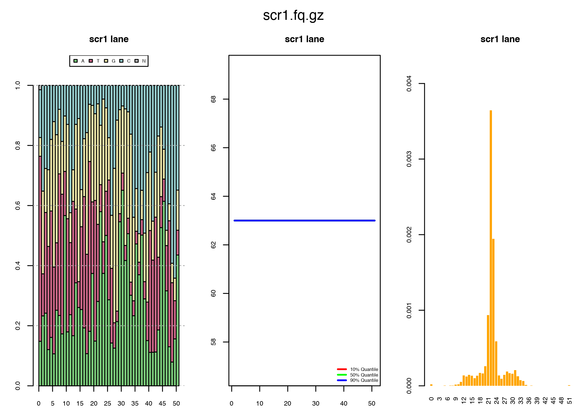
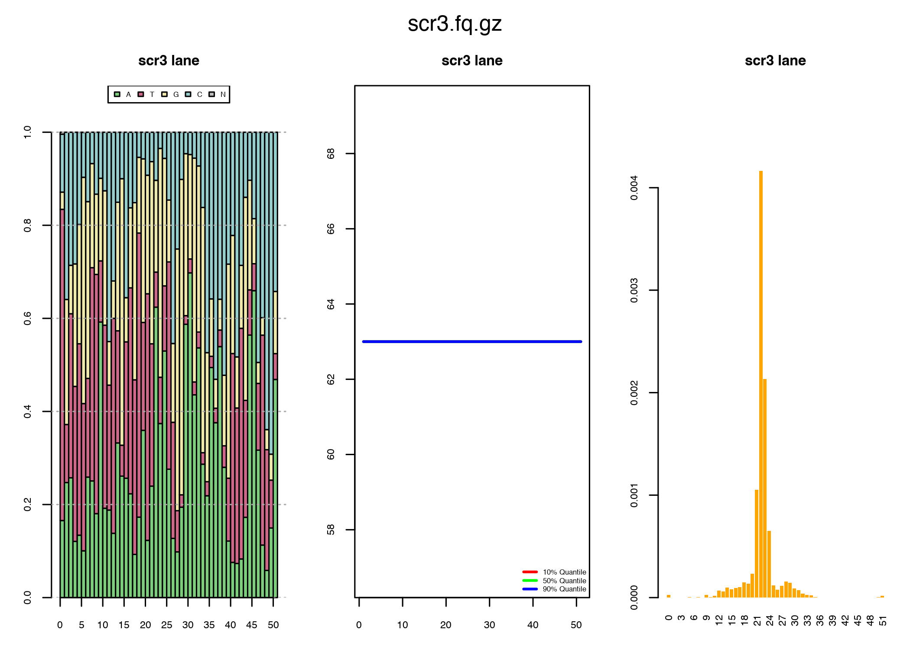

Small RNA Seq - Practical 1
================
Anton Enright & Stephanie Wenlock
'26 June, 2023'

- <a href="#analysis-of-smallrna-seq-datasets"
  id="toc-analysis-of-smallrna-seq-datasets">Analysis of smallRNA Seq
  datasets</a>
  - <a href="#the-fastq-file-format" id="toc-the-fastq-file-format">The
    Fastq file format</a>
  - <a href="#smallrna-read-quality-control"
    id="toc-smallrna-read-quality-control">SmallRNA Read Quality Control</a>
  - <a href="#running-the-mapping" id="toc-running-the-mapping">Running the
    Mapping</a>
  - <a href="#sam-output" id="toc-sam-output">SAM Output</a>
  - <a href="#getting-counts-from-the-mapping"
    id="toc-getting-counts-from-the-mapping">Getting Counts from the
    Mapping</a>

# Analysis of smallRNA Seq datasets

In this practical we will be taking 6 samples of Illumina small RNA
Sequencing data from the Bitetti *et al* paper from Alena Shkumatava’s
lab. In this experiment we have smallRNAs harvested from 3 wildtype
samples and 3 scrambled lncRNA binding site samples in mouse ESCs. We
are looking for differential expression of miR-29 family microRNAs which
should be binding to the site and being modified.

It is important for next-gen sequence analysis to know the exact
architecture of your sequencing reads including the 5’ sequencing
adapters and the sequences of barcoding tags and which samples each
refers to

For our course data, the read architecture is as follows:

| **5’ adpt** | genomic RNA                                | **3’ adpt** |
|-------------|--------------------------------------------|-------------|
| \<5p———-\>  | **NNNNNNNNNNNNNNNNNNNNNNNNNNNNNNNNNNNNNN** | \<———3p\>   |

Since miRNAs are shorter than the average length of a Solexa read
(35-80nt), we will usually sequence through a microRNA sequence into the
3’ adapter sequence. This needs to be detected and cleaned from our
reads before they can be mapped. Additionally, each sequence will need
to be sorted according to which barcode is present at the 5’ end of the
read into appropriate sample files.

Usually small RNA sequencing results in millions of reads for
processing. The vast majority of tools for dealing with this kind of
data require large amounts of memory and significant computing
resources. However, on this course we will be testing a new ultra-fast
read processor from the Enright lab, called **Reaper** which will be
available in BioConductor shortly.

------------------------------------------------------------------------

## The Fastq file format

Most sequencing results can be obtained in a format called *fastq*,
reflecting that they are *fasta* files with *quality* scores. These
files contain the actual nucleotide bases for every sequence as well as
a quality score which reflects how sure we are that each base is
actually the correct one.

The quality score is usually given by a *Phred* score, which is related
logarithmically to the probability of making an error when base calling.
The following table describes this:

| Phred score | Probability that the base is incorrect | Precision of the base |
|-------------|----------------------------------------|-----------------------|
| 10          | 1 in 10                                | 90 %                  |
| 20          | 1 in 100                               | 99 %                  |
| 30          | 1 in 1000                              | 99.9 %                |
| 40          | 1 in 10000                             | 99.99 %               |

Getting back to our fastq file, the first few lines look like this:

    @GAII06_0003:3:1:1040:19544#0/1
    CCAAAGTGCTGGAATCACAGGCGTGAGCTACCTCGCCTGGCCTGAATTATT
    +
    bb__Zbb^^^]Z_]]aT]`^TbbYb^_`T_cc`aac^Y\`b`\`L]_]\YX</tt> 

The first line is the identifier (starting with \*@\*), the second the
sequence. The third is an extra spacer line (which sometimes also has
the identifier repeated). The fourth are *ascii* encoded quality scores,
where each *letter* represents a different number.

This is the standard *ascii* table that was used to encode these
numbers:

           0 nul    1 soh    2 stx    3 etx    4 eot    5 enq    6 ack    7 bel
           8 bs     9 ht    10 nl    11 vt    12 np    13 cr    14 so    15 si
          16 dle   17 dc1   18 dc2   19 dc3   20 dc4   21 nak   22 syn   23 etb
          24 can   25 em    26 sub   27 esc   28 fs    29 gs    30 rs    31 us
          32 sp    33  !    34  "    35  #    36  $    37  %    38  &    39  '
          40  (    41  )    42  *    43  +    44  ,    45  -    46  .    47  /
          48  0    49  1    50  2    51  3    52  4    53  5    54  6    55  7
          56  8    57  9    58  :    59  ;    60  <    61  =    62  >    63  ?
          64  @    65  A    66  B    67  C    68  D    69  E    70  F    71  G
          72  H    73  I    74  J    75  K    76  L    77  M    78  N    79  O
          80  P    81  Q    82  R    83  S    84  T    85  U    86  V    87  W
          88  X    89  Y    90  Z    91  [    92  \    93  ]    94  ^    95  _
          96  `    97  a    98  b    99  c   100  d   101  e   102  f   103  g
         104  h   105  i   106  j   107  k   108  l   109  m   110  n   111  o
         112  p   113  q   114  r   115  s   116  t   117  u   118  v   119  w
         120  x   121  y   122  z 

From this table, we can see that the very frequent quality score “b”
actually represents a numerical value of 98. One small detail: since the
first 0-32 ascii codes represent strange things (e.g. bell, new line,
backspace) we cannot use them for encoding. Thus, in order to encode
real quality scores (0-40) we first need to shift the quality scores to
avoid these strange characters. Unfortunately, there are two current
standards, one which shifts the quality scores by adding 33, another by
adding 64. The file we’ll be using has been shifted by 64. This means
that “b” actually represents the quality score of 34 (98 - 64).

Some *ascii* characters are unprintable so the entire table is shifted
by 33 giving a final lookup table as follows, where each symbol
represents a unique quality score.

         0      !        1      "        2      #        3      $        4      %        5      &        6      '
         7      (        8      )        9      *       10      +       11      ,       12      -       13      .       14      /
        15      0       16      1       17      2       18      3       19      4       20      5       21      6       22      7
        23      8       24      9       25      :       26      ;       27      <       28      =       29      >       30      ?
        31      @       32      A       33      B       34      C       35      D       36      E       37      F       38      G
        39      H       40      I       41      J       42      K       43      L       44      M       45      N       46      O
        47      P       48      Q       49      R       50      S       51      T       52      U       53      V       54      W
        55      X       56      Y       57      Z       58      [       59      \       60      ]       61      ^       62      _
        63      `       64      a       65      b       66      c       67      d       68      e       69      f       70      g
        71      h       72      i       73      j       74      k       75      l       76      m       77      n       78      o
        79      p       80      q       81      r       82      s       83      t       84      u       85      v       86      w
        87      x       88      y       89      z

------------------------------------------------------------------------

\##Adapter Stripping for smallRNAs using *Reaper*

The module is available [here](../data/Reaper_1.5.tar.gz) If you want to
install this in your own R at home.

Lets install the module manually. Please open up a new terminal window.

    cd ~/Desktop/course_data/smallrna
    R CMD INSTALL Reaper_1.5.tar.gz 

This will install the module into R manually.

    * installing to library \u2018/home/user/R/x86_64-pc-linux-gnu-library/3.4\u2019
    * installing *source* package \u2018Reaper\u2019 ...
    ** libs
    gcc -std=gnu99 -I/BGA2017/R-3.4.0/lib64/R/include -DNDEBUG   -I/usr/local/include  -D_USE_KNETFILE -D_FILE_OFFSET_BITS=64 -DBUILD_R_BINDINGS -fpic  -g -O2  -c reaper.c -o reaper.o
    gcc -std=gnu99 -I/BGA2017/R-3.4.0/lib64/R/include -DNDEBUG   -I/usr/local/include  -D_USE_KNETFILE -D_FILE_OFFSET_BITS=64 -DBUILD_R_BINDINGS -fpic  -g -O2  -c sw.c -o sw.o
    gcc -std=gnu99 -I/BGA2017/R-3.4.0/lib64/R/include -DNDEBUG   -I/usr/local/include  -D_USE_KNETFILE -D_FILE_OFFSET_BITS=64 -DBUILD_R_BINDINGS -fpic  -g -O2  -c slib.c -o slib.o
    gcc -std=gnu99 -I/BGA2017/R-3.4.0/lib64/R/include -DNDEBUG   -I/usr/local/include  -D_USE_KNETFILE -D_FILE_OFFSET_BITS=64 -DBUILD_R_BINDINGS -fpic  -g -O2  -c table.c -o table.o
    gcc -std=gnu99 -I/BGA2017/R-3.4.0/lib64/R/include -DNDEBUG   -I/usr/local/include  -D_USE_KNETFILE -D_FILE_OFFSET_BITS=64 -DBUILD_R_BINDINGS -fpic  -g -O2  -c trint.c -o trint.o

The fastq files, pdata file and mircounts file are also
[available](../data/) but preinstalled on these machines.

``` r
library(Reaper)
library(gplots)
```

               ## Warning: package 'gplots' was built under R version 4.1.2

``` r
library(RColorBrewer)
```

               ## Warning: package 'RColorBrewer' was built under R version 4.1.2

Now we will set our working directory to where the solexa FASTQ files
(zipped) are stored

``` r
setwd("~/Desktop/course_data/smallrna")
list.files()
```

               ## [1] "mouse.fasta" "pdata.txt"   "scr1.fq.gz"  "scr2.fq.gz"  "scr3.fq.gz" 
               ## [6] "wt1.fq.gz"   "wt2.fq.gz"   "wt3.fq.gz"

Hopefully, you will see a compressed FASTQ txt file for each of the 4
lanes

It is important that we also load information for reaper that tells it
the following:

- Which FASTQ files are present.
- Which Barcode sequences correspond to which sample names.
- What 5’ and 3’ sequencing adapters were used in library generation.

You should see a sample table loaded into R:

``` r
pdata <- read.table("pdata.txt",header=TRUE,check.names=FALSE)
pdata
```

               ##   samplename   filename genotype                  3p-ad tabu
               ## 1       scr1 scr1.fq.gz      mut AGATCGGAAGAGCACACGTCTG   NA
               ## 2       scr2 scr2.fq.gz      mut AGATCGGAAGAGCACACGTCTG   NA
               ## 3       scr3 scr3.fq.gz      mut AGATCGGAAGAGCACACGTCTG   NA
               ## 4        wt1  wt1.fq.gz       wt AGATCGGAAGAGCACACGTCTG   NA
               ## 5        wt2  wt2.fq.gz       wt AGATCGGAAGAGCACACGTCTG   NA
               ## 6        wt3  wt3.fq.gz       wt AGATCGGAAGAGCACACGTCTG   NA

Next we will start the Reaper algorithm. It will perform the following
functions on all the lanes we have provided:

- Splitting up reads according to provided barcodes
- Detection of 3’ or 5’ adapter contamination using Smith-Waterman local
  alignment
- Detection of low-complexity sequences, such as Poly-As or Poly-Ns
- Quality score thresholding and trimming if required
- Collapsing of reads according to depth in a summary FASTA result file
  per barcode per lane.
- Generation of Quality Control plots for assessing sequencing quality

Reaper is started by passing it our samples table and telling it which
“mode” to run in, in this case the mode is set to: **no-bc**.

``` r
# For the sake of time we'll only run on the first 100000 reads
reaper(pdata,"no-bc",c("do"="10000"));

# This is the command to do all reads
# reaper(pdata,"no-bc"); We comment it out here
```

Cleaning many millions of reads will take some time, the method
processes around 2M-4M reads per minute.

    [1] "Starting Reaper for file: scr1.fq.gz"
              fastq            geom            meta        basename 
       "scr1.fq.gz"         "no-bc" "metadata1.txt"             "1" 
    Passing to reaper: dummy-internal --R -fastq scr1.fq.gz -geom no-bc -meta metadata1.txt -basename 1

    ---
    mRpm   million reads per minute
    mNpm   million nucleotides per minute
    mCps   million alignment cells per second
    lint   total removed reads (per 10K), sum of columns to the left
    25K reads per dot, 1M reads per line  seconds  mr mRpm mNpm mCps {error qc  low  len  NNN tabu nobc cflr  cfl lint   OK} per 10K
    ........................................   14   1  4.4  222   92    0    0    0    0    0    0    0    0    0    0 10000
    ........................................   14   2  4.4  223   92    0    0    0    0    0    0    0    0    0    0 10000
    ........................................   14   3  4.4  223   92    0    0    0    0    0    0    0    0    0    0 10000
    ................................
    [1] "Starting Tally for file scr1.fq.gz and barcode: lane"
    Passing to tally: dummy-internal --R --with-quality -zip-factor 1 -i 1.lane.clean.gz -o 1.lane.clean.uniq.gz

    discarded_unmatched=0
    discarded_alien=0
    discarded_length=0
    discarded_trint=0
    error_quality=0
    passed_unique=299150
    passed_total=3811691
    num_records=3811691

Reaper is designed to be fast and memory-efficient so it should run on
any machine with 500MB of RAM or more. The time taken to complete the
run depends on how fast the processors in your machine are.

Let’s take a look at the Quality Control Metrics generated

``` r
reaperQC(pdata)
```

<!-- --><!-- --><!-- --><!-- --><!-- --><!-- -->

               ## [1] "Processing Reaper Results for: scr1.fq.gz  lane"
               ## [1] "Processing Reaper Results for: scr2.fq.gz  lane"
               ## [1] "Processing Reaper Results for: scr3.fq.gz  lane"
               ## [1] "Processing Reaper Results for: wt1.fq.gz  lane"
               ## [1] "Processing Reaper Results for: wt2.fq.gz  lane"
               ## [1] "Processing Reaper Results for: wt3.fq.gz  lane"

## SmallRNA Read Quality Control

Lets also make a nice PDF of the results and explore the QC metrics for
the data

``` r
pdf("reaper.pdf",width=12)
reaperQC(pdata)
dev.off()
```

               ## [1] "Processing Reaper Results for: scr1.fq.gz  lane"
               ## [1] "Processing Reaper Results for: scr2.fq.gz  lane"
               ## [1] "Processing Reaper Results for: scr3.fq.gz  lane"
               ## [1] "Processing Reaper Results for: wt1.fq.gz  lane"
               ## [1] "Processing Reaper Results for: wt2.fq.gz  lane"
               ## [1] "Processing Reaper Results for: wt3.fq.gz  lane"
               ## png 
               ##   2

You should get one plot back for each lane processed.

Here is a list of files generated during the Reaper run

    1.lane.report.input.nt
    1.lane.report.clean.nt
    1.lane.report.clean.len
    1.lane.report.input.q
    1.sumstat
    1.lane.clean.gz
    1.lint.gz
    1.lane.clean.uniq.gz
    metadata2.txt
    2.lane.report.input.nt
    2.lane.report.clean.nt
    2.lane.report.clean.len
    2.lane.report.input.q
    2.sumstat
    2.lane.clean.gz
    2.lint.gz
    2.lane.clean.uniq.gz
    metadata3.txt
    3.lane.report.input.nt
    3.lane.report.clean.nt
    3.lane.report.clean.len
    3.lane.report.input.q
    3.sumstat
    3.lane.clean.gz
    3.lint.gz
    3.lane.clean.uniq.gz
    metadata4.txt
    4.lane.report.input.nt
    4.lane.report.clean.nt
    4.lane.report.clean.len
    4.lane.report.input.q
    4.sumstat
    4.lane.clean.gz
    4.lint.gz
    4.lane.clean.uniq.gz
    metadata5.txt
    5.lane.report.input.nt
    5.lane.report.clean.nt
    5.lane.report.clean.len
    5.lane.report.input.q
    5.sumstat
    5.lane.clean.gz
    5.lint.gz
    5.lane.clean.uniq.gz
    metadata6.txt
    6.lane.report.input.nt
    6.lane.report.clean.nt
    6.lane.report.clean.len
    6.lane.report.input.q
    6.sumstat
    6.lane.clean.gz
    6.lint.gz
    6.lane.clean.uniq.gz

\##Mapping Cleaned Reads to MicroRNAs

We will now use **Bowtie2** a fast read mapper to quickly map our
cleaned reads against all known mouse microRNAs.

First we need to build an index to search against. This index was
downloaded from miRBase and contains sequences for all mouse microRNAs.

This should be super fast. The command from bowtie2 to build an index is
*bowtie2-build*.

``` bash
bowtie2-build -o 3 -t 5 mouse.fasta mouse_mirs
```

               ## Settings:
               ##   Output files: "mouse_mirs.*.bt2"
               ##   Line rate: 6 (line is 64 bytes)
               ##   Lines per side: 1 (side is 64 bytes)
               ##   Offset rate: 3 (one in 8)
               ##   FTable chars: 5
               ##   Strings: unpacked
               ##   Max bucket size: default
               ##   Max bucket size, sqrt multiplier: default
               ##   Max bucket size, len divisor: 4
               ##   Difference-cover sample period: 1024
               ##   Endianness: little
               ##   Actual local endianness: little
               ##   Sanity checking: disabled
               ##   Assertions: disabled
               ##   Random seed: 0
               ##   Sizeofs: void*:8, int:4, long:8, size_t:8
               ## Input files DNA, FASTA:
               ##   mouse.fasta
               ## Building a SMALL index
               ## Reading reference sizes
               ##   Time reading reference sizes: 00:00:00
               ## Calculating joined length
               ## Writing header
               ## Reserving space for joined string
               ## Joining reference sequences
               ##   Time to join reference sequences: 00:00:00
               ## bmax according to bmaxDivN setting: 10832
               ## Using parameters --bmax 8124 --dcv 1024
               ##   Doing ahead-of-time memory usage test
               ##   Passed!  Constructing with these parameters: --bmax 8124 --dcv 1024
               ## Constructing suffix-array element generator
               ## Building DifferenceCoverSample
               ##   Building sPrime
               ##   Building sPrimeOrder
               ##   V-Sorting samples
               ##   V-Sorting samples time: 00:00:00
               ##   Allocating rank array
               ##   Ranking v-sort output
               ##   Ranking v-sort output time: 00:00:00
               ##   Invoking Larsson-Sadakane on ranks
               ##   Invoking Larsson-Sadakane on ranks time: 00:00:00
               ##   Sanity-checking and returning
               ## Building samples
               ## Reserving space for 12 sample suffixes
               ## Generating random suffixes
               ## QSorting 12 sample offsets, eliminating duplicates
               ## QSorting sample offsets, eliminating duplicates time: 00:00:00
               ## Multikey QSorting 12 samples
               ##   (Using difference cover)
               ##   Multikey QSorting samples time: 00:00:00
               ## Calculating bucket sizes
               ## Splitting and merging
               ##   Splitting and merging time: 00:00:00
               ## Split 1, merged 6; iterating...
               ## Splitting and merging
               ##   Splitting and merging time: 00:00:00
               ## Avg bucket size: 5415.5 (target: 8123)
               ## Converting suffix-array elements to index image
               ## Allocating ftab, absorbFtab
               ## Entering Ebwt loop
               ## Getting block 1 of 8
               ##   Reserving size (8124) for bucket 1
               ##   Calculating Z arrays for bucket 1
               ##   Entering block accumulator loop for bucket 1:
               ##   bucket 1: 10%
               ##   bucket 1: 20%
               ##   bucket 1: 30%
               ##   bucket 1: 40%
               ##   bucket 1: 50%
               ##   bucket 1: 60%
               ##   bucket 1: 70%
               ##   bucket 1: 80%
               ##   bucket 1: 90%
               ##   bucket 1: 100%
               ##   Sorting block of length 5996 for bucket 1
               ##   (Using difference cover)
               ##   Sorting block time: 00:00:00
               ## Returning block of 5997 for bucket 1
               ## Getting block 2 of 8
               ##   Reserving size (8124) for bucket 2
               ##   Calculating Z arrays for bucket 2
               ##   Entering block accumulator loop for bucket 2:
               ##   bucket 2: 10%
               ##   bucket 2: 20%
               ##   bucket 2: 30%
               ##   bucket 2: 40%
               ##   bucket 2: 50%
               ##   bucket 2: 60%
               ##   bucket 2: 70%
               ##   bucket 2: 80%
               ##   bucket 2: 90%
               ##   bucket 2: 100%
               ##   Sorting block of length 2747 for bucket 2
               ##   (Using difference cover)
               ##   Sorting block time: 00:00:00
               ## Returning block of 2748 for bucket 2
               ## Getting block 3 of 8
               ##   Reserving size (8124) for bucket 3
               ##   Calculating Z arrays for bucket 3
               ##   Entering block accumulator loop for bucket 3:
               ##   bucket 3: 10%
               ##   bucket 3: 20%
               ##   bucket 3: 30%
               ##   bucket 3: 40%
               ##   bucket 3: 50%
               ##   bucket 3: 60%
               ##   bucket 3: 70%
               ##   bucket 3: 80%
               ##   bucket 3: 90%
               ##   bucket 3: 100%
               ##   Sorting block of length 6100 for bucket 3
               ##   (Using difference cover)
               ##   Sorting block time: 00:00:00
               ## Returning block of 6101 for bucket 3
               ## Getting block 4 of 8
               ##   Reserving size (8124) for bucket 4
               ##   Calculating Z arrays for bucket 4
               ##   Entering block accumulator loop for bucket 4:
               ##   bucket 4: 10%
               ##   bucket 4: 20%
               ##   bucket 4: 30%
               ##   bucket 4: 40%
               ##   bucket 4: 50%
               ##   bucket 4: 60%
               ##   bucket 4: 70%
               ##   bucket 4: 80%
               ##   bucket 4: 90%
               ##   bucket 4: 100%
               ##   Sorting block of length 4871 for bucket 4
               ##   (Using difference cover)
               ##   Sorting block time: 00:00:00
               ## Returning block of 4872 for bucket 4
               ## Getting block 5 of 8
               ##   Reserving size (8124) for bucket 5
               ##   Calculating Z arrays for bucket 5
               ##   Entering block accumulator loop for bucket 5:
               ##   bucket 5: 10%
               ##   bucket 5: 20%
               ##   bucket 5: 30%
               ##   bucket 5: 40%
               ##   bucket 5: 50%
               ##   bucket 5: 60%
               ##   bucket 5: 70%
               ##   bucket 5: 80%
               ##   bucket 5: 90%
               ##   bucket 5: 100%
               ##   Sorting block of length 6277 for bucket 5
               ##   (Using difference cover)
               ##   Sorting block time: 00:00:00
               ## Returning block of 6278 for bucket 5
               ## Getting block 6 of 8
               ##   Reserving size (8124) for bucket 6
               ##   Calculating Z arrays for bucket 6
               ##   Entering block accumulator loop for bucket 6:
               ##   bucket 6: 10%
               ##   bucket 6: 20%
               ##   bucket 6: 30%
               ##   bucket 6: 40%
               ##   bucket 6: 50%
               ##   bucket 6: 60%
               ##   bucket 6: 70%
               ##   bucket 6: 80%
               ##   bucket 6: 90%
               ##   bucket 6: 100%
               ##   Sorting block of length 4023 for bucket 6
               ##   (Using difference cover)
               ##   Sorting block time: 00:00:00
               ## Returning block of 4024 for bucket 6
               ## Getting block 7 of 8
               ##   Reserving size (8124) for bucket 7
               ##   Calculating Z arrays for bucket 7
               ##   Entering block accumulator loop for bucket 7:
               ##   bucket 7: 10%
               ##   bucket 7: 20%
               ##   bucket 7: 30%
               ##   bucket 7: 40%
               ##   bucket 7: 50%
               ##   bucket 7: 60%
               ##   bucket 7: 70%
               ##   bucket 7: 80%
               ##   bucket 7: 90%
               ##   bucket 7: 100%
               ##   Sorting block of length 8080 for bucket 7
               ##   (Using difference cover)
               ##   Sorting block time: 00:00:00
               ## Returning block of 8081 for bucket 7
               ## Getting block 8 of 8
               ##   Reserving size (8124) for bucket 8
               ##   Calculating Z arrays for bucket 8
               ##   Entering block accumulator loop for bucket 8:
               ##   bucket 8: 10%
               ##   bucket 8: 20%
               ##   bucket 8: 30%
               ##   bucket 8: 40%
               ##   bucket 8: 50%
               ##   bucket 8: 60%
               ##   bucket 8: 70%
               ##   bucket 8: 80%
               ##   bucket 8: 90%
               ##   bucket 8: 100%
               ##   Sorting block of length 5230 for bucket 8
               ##   (Using difference cover)
               ##   Sorting block time: 00:00:00
               ## Returning block of 5231 for bucket 8
               ## Exited Ebwt loop
               ## fchr[A]: 0
               ## fchr[C]: 9464
               ## fchr[G]: 19929
               ## fchr[T]: 31926
               ## fchr[$]: 43331
               ## Exiting Ebwt::buildToDisk()
               ## Returning from initFromVector
               ## Wrote 80589 bytes to primary EBWT file: mouse_mirs.1.bt2.tmp
               ## Wrote 21672 bytes to secondary EBWT file: mouse_mirs.2.bt2.tmp
               ## Re-opening _in1 and _in2 as input streams
               ## Returning from Ebwt constructor
               ## Headers:
               ##     len: 43331
               ##     bwtLen: 43332
               ##     sz: 10833
               ##     bwtSz: 10833
               ##     lineRate: 6
               ##     offRate: 3
               ##     offMask: 0xfffffff8
               ##     ftabChars: 5
               ##     eftabLen: 10
               ##     eftabSz: 40
               ##     ftabLen: 1025
               ##     ftabSz: 4100
               ##     offsLen: 5417
               ##     offsSz: 21668
               ##     lineSz: 64
               ##     sideSz: 64
               ##     sideBwtSz: 48
               ##     sideBwtLen: 192
               ##     numSides: 226
               ##     numLines: 226
               ##     ebwtTotLen: 14464
               ##     ebwtTotSz: 14464
               ##     color: 0
               ##     reverse: 0
               ## Total time for call to driver() for forward index: 00:00:00
               ## Reading reference sizes
               ##   Time reading reference sizes: 00:00:00
               ## Calculating joined length
               ## Writing header
               ## Reserving space for joined string
               ## Joining reference sequences
               ##   Time to join reference sequences: 00:00:00
               ##   Time to reverse reference sequence: 00:00:00
               ## bmax according to bmaxDivN setting: 10832
               ## Using parameters --bmax 8124 --dcv 1024
               ##   Doing ahead-of-time memory usage test
               ##   Passed!  Constructing with these parameters: --bmax 8124 --dcv 1024
               ## Constructing suffix-array element generator
               ## Building DifferenceCoverSample
               ##   Building sPrime
               ##   Building sPrimeOrder
               ##   V-Sorting samples
               ##   V-Sorting samples time: 00:00:00
               ##   Allocating rank array
               ##   Ranking v-sort output
               ##   Ranking v-sort output time: 00:00:00
               ##   Invoking Larsson-Sadakane on ranks
               ##   Invoking Larsson-Sadakane on ranks time: 00:00:00
               ##   Sanity-checking and returning
               ## Building samples
               ## Reserving space for 12 sample suffixes
               ## Generating random suffixes
               ## QSorting 12 sample offsets, eliminating duplicates
               ## QSorting sample offsets, eliminating duplicates time: 00:00:00
               ## Multikey QSorting 12 samples
               ##   (Using difference cover)
               ##   Multikey QSorting samples time: 00:00:00
               ## Calculating bucket sizes
               ## Splitting and merging
               ##   Splitting and merging time: 00:00:00
               ## Split 1, merged 5; iterating...
               ## Splitting and merging
               ##   Splitting and merging time: 00:00:00
               ## Avg bucket size: 5415.5 (target: 8123)
               ## Converting suffix-array elements to index image
               ## Allocating ftab, absorbFtab
               ## Entering Ebwt loop
               ## Getting block 1 of 8
               ##   Reserving size (8124) for bucket 1
               ##   Calculating Z arrays for bucket 1
               ##   Entering block accumulator loop for bucket 1:
               ##   bucket 1: 10%
               ##   bucket 1: 20%
               ##   bucket 1: 30%
               ##   bucket 1: 40%
               ##   bucket 1: 50%
               ##   bucket 1: 60%
               ##   bucket 1: 70%
               ##   bucket 1: 80%
               ##   bucket 1: 90%
               ##   bucket 1: 100%
               ##   Sorting block of length 4401 for bucket 1
               ##   (Using difference cover)
               ##   Sorting block time: 00:00:00
               ## Returning block of 4402 for bucket 1
               ## Getting block 2 of 8
               ##   Reserving size (8124) for bucket 2
               ##   Calculating Z arrays for bucket 2
               ##   Entering block accumulator loop for bucket 2:
               ##   bucket 2: 10%
               ##   bucket 2: 20%
               ##   bucket 2: 30%
               ##   bucket 2: 40%
               ##   bucket 2: 50%
               ##   bucket 2: 60%
               ##   bucket 2: 70%
               ##   bucket 2: 80%
               ##   bucket 2: 90%
               ##   bucket 2: 100%
               ##   Sorting block of length 5766 for bucket 2
               ##   (Using difference cover)
               ##   Sorting block time: 00:00:00
               ## Returning block of 5767 for bucket 2
               ## Getting block 3 of 8
               ##   Reserving size (8124) for bucket 3
               ##   Calculating Z arrays for bucket 3
               ##   Entering block accumulator loop for bucket 3:
               ##   bucket 3: 10%
               ##   bucket 3: 20%
               ##   bucket 3: 30%
               ##   bucket 3: 40%
               ##   bucket 3: 50%
               ##   bucket 3: 60%
               ##   bucket 3: 70%
               ##   bucket 3: 80%
               ##   bucket 3: 90%
               ##   bucket 3: 100%
               ##   Sorting block of length 3646 for bucket 3
               ##   (Using difference cover)
               ##   Sorting block time: 00:00:00
               ## Returning block of 3647 for bucket 3
               ## Getting block 4 of 8
               ##   Reserving size (8124) for bucket 4
               ##   Calculating Z arrays for bucket 4
               ##   Entering block accumulator loop for bucket 4:
               ##   bucket 4: 10%
               ##   bucket 4: 20%
               ##   bucket 4: 30%
               ##   bucket 4: 40%
               ##   bucket 4: 50%
               ##   bucket 4: 60%
               ##   bucket 4: 70%
               ##   bucket 4: 80%
               ##   bucket 4: 90%
               ##   bucket 4: 100%
               ##   Sorting block of length 8026 for bucket 4
               ##   (Using difference cover)
               ##   Sorting block time: 00:00:00
               ## Returning block of 8027 for bucket 4
               ## Getting block 5 of 8
               ##   Reserving size (8124) for bucket 5
               ##   Calculating Z arrays for bucket 5
               ##   Entering block accumulator loop for bucket 5:
               ##   bucket 5: 10%
               ##   bucket 5: 20%
               ##   bucket 5: 30%
               ##   bucket 5: 40%
               ##   bucket 5: 50%
               ##   bucket 5: 60%
               ##   bucket 5: 70%
               ##   bucket 5: 80%
               ##   bucket 5: 90%
               ##   bucket 5: 100%
               ##   Sorting block of length 5144 for bucket 5
               ##   (Using difference cover)
               ##   Sorting block time: 00:00:00
               ## Returning block of 5145 for bucket 5
               ## Getting block 6 of 8
               ##   Reserving size (8124) for bucket 6
               ##   Calculating Z arrays for bucket 6
               ##   Entering block accumulator loop for bucket 6:
               ##   bucket 6: 10%
               ##   bucket 6: 20%
               ##   bucket 6: 30%
               ##   bucket 6: 40%
               ##   bucket 6: 50%
               ##   bucket 6: 60%
               ##   bucket 6: 70%
               ##   bucket 6: 80%
               ##   bucket 6: 90%
               ##   bucket 6: 100%
               ##   Sorting block of length 8004 for bucket 6
               ##   (Using difference cover)
               ##   Sorting block time: 00:00:00
               ## Returning block of 8005 for bucket 6
               ## Getting block 7 of 8
               ##   Reserving size (8124) for bucket 7
               ##   Calculating Z arrays for bucket 7
               ##   Entering block accumulator loop for bucket 7:
               ##   bucket 7: 10%
               ##   bucket 7: 20%
               ##   bucket 7: 30%
               ##   bucket 7: 40%
               ##   bucket 7: 50%
               ##   bucket 7: 60%
               ##   bucket 7: 70%
               ##   bucket 7: 80%
               ##   bucket 7: 90%
               ##   bucket 7: 100%
               ##   Sorting block of length 5854 for bucket 7
               ##   (Using difference cover)
               ##   Sorting block time: 00:00:00
               ## Returning block of 5855 for bucket 7
               ## Getting block 8 of 8
               ##   Reserving size (8124) for bucket 8
               ##   Calculating Z arrays for bucket 8
               ##   Entering block accumulator loop for bucket 8:
               ##   bucket 8: 10%
               ##   bucket 8: 20%
               ##   bucket 8: 30%
               ##   bucket 8: 40%
               ##   bucket 8: 50%
               ##   bucket 8: 60%
               ##   bucket 8: 70%
               ##   bucket 8: 80%
               ##   bucket 8: 90%
               ##   bucket 8: 100%
               ##   Sorting block of length 2483 for bucket 8
               ##   (Using difference cover)
               ##   Sorting block time: 00:00:00
               ## Returning block of 2484 for bucket 8
               ## Exited Ebwt loop
               ## fchr[A]: 0
               ## fchr[C]: 9464
               ## fchr[G]: 19929
               ## fchr[T]: 31926
               ## fchr[$]: 43331
               ## Exiting Ebwt::buildToDisk()
               ## Returning from initFromVector
               ## Wrote 80589 bytes to primary EBWT file: mouse_mirs.rev.1.bt2.tmp
               ## Wrote 21672 bytes to secondary EBWT file: mouse_mirs.rev.2.bt2.tmp
               ## Re-opening _in1 and _in2 as input streams
               ## Returning from Ebwt constructor
               ## Headers:
               ##     len: 43331
               ##     bwtLen: 43332
               ##     sz: 10833
               ##     bwtSz: 10833
               ##     lineRate: 6
               ##     offRate: 3
               ##     offMask: 0xfffffff8
               ##     ftabChars: 5
               ##     eftabLen: 10
               ##     eftabSz: 40
               ##     ftabLen: 1025
               ##     ftabSz: 4100
               ##     offsLen: 5417
               ##     offsSz: 21668
               ##     lineSz: 64
               ##     sideSz: 64
               ##     sideBwtSz: 48
               ##     sideBwtLen: 192
               ##     numSides: 226
               ##     numLines: 226
               ##     ebwtTotLen: 14464
               ##     ebwtTotSz: 14464
               ##     color: 0
               ##     reverse: 1
               ## Total time for backward call to driver() for mirror index: 00:00:00
               ## Renaming mouse_mirs.3.bt2.tmp to mouse_mirs.3.bt2
               ## Renaming mouse_mirs.4.bt2.tmp to mouse_mirs.4.bt2
               ## Renaming mouse_mirs.1.bt2.tmp to mouse_mirs.1.bt2
               ## Renaming mouse_mirs.2.bt2.tmp to mouse_mirs.2.bt2
               ## Renaming mouse_mirs.rev.1.bt2.tmp to mouse_mirs.rev.1.bt2
               ## Renaming mouse_mirs.rev.2.bt2.tmp to mouse_mirs.rev.2.bt2

## Running the Mapping

We now run *bowtie2* giving it our premade mouse microRNA index file *-x
mouse* and our cleaned FASTQ file *-U file.fq.gz*. We want to run the
mapping only on the forward strand so will use the *–norc* command. We
remove header information and quality checking for these FASTQs because
the quality scores have been lost. We store the output in a Serial
Alignment Format (SAM) file.

This will run outside of R/Rstudio as if we had typed it into a
command-line.

``` bash
bowtie2 -x mouse_mirs -U 1.lane.clean.gz -N 1 --norc --no-unal --no-head --ignore-quals --quiet -t > scr1.sam
bowtie2 -x mouse_mirs -U 2.lane.clean.gz -N 1 --norc --no-unal --no-head --ignore-quals --quiet -t > scr2.sam
bowtie2 -x mouse_mirs -U 3.lane.clean.gz -N 1 --norc --no-unal --no-head --ignore-quals --quiet -t > scr3.sam

bowtie2 -x mouse_mirs -U 4.lane.clean.gz -N 1 --norc --no-unal --no-head --ignore-quals --quiet -t > wt1.sam
bowtie2 -x mouse_mirs -U 5.lane.clean.gz -N 1 --norc --no-unal --no-head --ignore-quals --quiet -t > wt2.sam
bowtie2 -x mouse_mirs -U 6.lane.clean.gz -N 1 --norc --no-unal --no-head --ignore-quals --quiet -t > wt3.sam
```

               ## Time loading reference: 00:00:00
               ## Time loading forward index: 00:00:00
               ## Time loading mirror index: 00:00:00
               ## Multiseed full-index search: 00:00:00
               ## Time searching: 00:00:00
               ## Overall time: 00:00:00
               ## Time loading reference: 00:00:00
               ## Time loading forward index: 00:00:00
               ## Time loading mirror index: 00:00:00
               ## Multiseed full-index search: 00:00:01
               ## Time searching: 00:00:01
               ## Overall time: 00:00:01
               ## Time loading reference: 00:00:00
               ## Time loading forward index: 00:00:00
               ## Time loading mirror index: 00:00:00
               ## Multiseed full-index search: 00:00:00
               ## Time searching: 00:00:00
               ## Overall time: 00:00:00
               ## Time loading reference: 00:00:00
               ## Time loading forward index: 00:00:00
               ## Time loading mirror index: 00:00:00
               ## Multiseed full-index search: 00:00:00
               ## Time searching: 00:00:00
               ## Overall time: 00:00:00
               ## Time loading reference: 00:00:00
               ## Time loading forward index: 00:00:00
               ## Time loading mirror index: 00:00:00
               ## Multiseed full-index search: 00:00:00
               ## Time searching: 00:00:00
               ## Overall time: 00:00:00
               ## Time loading reference: 00:00:00
               ## Time loading forward index: 00:00:00
               ## Time loading mirror index: 00:00:00
               ## Multiseed full-index search: 00:00:00
               ## Time searching: 00:00:00
               ## Overall time: 00:00:00

## SAM Output

This is the raw output in the SAM file. You can see we have an entry for
each mapped read. The third column is the microRNA hit.

``` bash
head wt1.sam
```

               ## SRR5519775.2.1    0   mmu-miR-12192-5p    3   42  12M *   0   0   NGGGGTATAGCT    ????????????    AS:i:-1 XN:i:0  XM:i:1  XO:i:0  XG:i:0  NM:i:1  MD:Z:0T11   YT:Z:UU
               ## SRR5519775.3.1    0   mmu-let-7f-5p   1   42  22M *   0   0   NGAGGTAGTAGATTGTATAGTT  ??????????????????????  AS:i:-1 XN:i:0  XM:i:1  XO:i:0  XG:i:0  NM:i:1  MD:Z:0T21   YT:Z:UU
               ## SRR5519775.6.1    0   mmu-let-7i-5p   1   42  21M *   0   0   NGAGGTAGTAGTTTGTGCTGT   ?????????????????????   AS:i:-1 XN:i:0  XM:i:1  XO:i:0  XG:i:0  NM:i:1  MD:Z:0T20   YT:Z:UU
               ## SRR5519775.8.1    0   mmu-miR-99a-5p  1   42  22M *   0   0   NACCCGTAGATCCGATCTTGTG  ??????????????????????  AS:i:-1 XN:i:0  XM:i:1  XO:i:0  XG:i:0  NM:i:1  MD:Z:0A21   YT:Z:UU
               ## SRR5519775.11.1   0   mmu-miR-9-5p    1   42  22M *   0   0   NCTTTGGTTATCTAGCTGTATG  ??????????????????????  AS:i:-1 XN:i:0  XM:i:1  XO:i:0  XG:i:0  NM:i:1  MD:Z:0T21   YT:Z:UU
               ## SRR5519775.12.1   0   mmu-miR-9-5p    1   42  22M *   0   0   NCTTTGGTTATCTAGCTGTATG  ??????????????????????  AS:i:-1 XN:i:0  XM:i:1  XO:i:0  XG:i:0  NM:i:1  MD:Z:0T21   YT:Z:UU
               ## SRR5519775.25.1   0   mmu-let-7i-5p   1   34  22M *   0   0   TGAGGTAGTAGTTTGTGCTGTT  ??????????????????????  AS:i:0  XS:i:-6 XN:i:0  XM:i:0  XO:i:0  XG:i:0  NM:i:0  MD:Z:22 YT:Z:UU
               ## SRR5519775.26.1   0   mmu-let-7i-5p   1   34  22M *   0   0   TGAGGTAGTAGTTTGTGCTGTT  ??????????????????????  AS:i:0  XS:i:-6 XN:i:0  XM:i:0  XO:i:0  XG:i:0  NM:i:0  MD:Z:22 YT:Z:UU
               ## SRR5519775.28.1   0   mmu-miR-148a-3p 1   42  22M *   0   0   TCAGTGCACTACAGAACTTTGT  ??????????????????????  AS:i:0  XN:i:0  XM:i:0  XO:i:0  XG:i:0  NM:i:0  MD:Z:22 YT:Z:UU
               ## SRR5519775.31.1   0   mmu-let-7g-5p   1   42  22M *   0   0   TGAGGTAGTAGTTTGTACAGTT  ??????????????????????  AS:i:0  XN:i:0  XM:i:0  XO:i:0  XG:i:0  NM:i:0  MD:Z:22 YT:Z:UU

## Getting Counts from the Mapping

Here we will use the command line to quickly turn the SAM into a simple
count table. This is achieved using the *\|* pipe symbol. This allows
commands to be chained together in linux and macintosh computers so that
the output of one command is passed as input to the next.

We will quickly scan the sam files and find the microRNA. The *cat*
command simply prints out the contents of the file and passes this to
the *cut* command which extracts the third column (-f 3). We sort the
microRNA hits with the *sort* command and count the unique entries
present using the *uniq* command with the -c option.

A final numeric sort produces the final sorted count table for each
file.

``` bash
cat wt1.sam|cut -f 3 | sort | uniq -c  | sort -k1nr > wt1.counts.txt
cat wt2.sam|cut -f 3 | sort | uniq -c  | sort -k1nr > wt2.counts.txt
cat wt3.sam|cut -f 3 | sort | uniq -c  | sort -k1nr > wt3.counts.txt

cat scr1.sam|cut -f 3 | sort | uniq -c  | sort -k1nr > scr1.counts.txt
cat scr2.sam|cut -f 3 | sort | uniq -c  | sort -k1nr > scr2.counts.txt
cat scr3.sam|cut -f 3 | sort | uniq -c  | sort -k1nr > scr3.counts.txt
```

Let’s now peek at the top hits in each file using the *head* command:

``` bash
head *.counts.txt
```

               ## ==> scr1.counts.txt <==
               ## 2233 mmu-miR-9-5p
               ##  437 mmu-miR-99a-5p
               ##  433 mmu-let-7i-5p
               ##  301 mmu-miR-148a-3p
               ##  279 mmu-let-7f-5p
               ##  261 mmu-miR-10a-5p
               ##  183 mmu-let-7g-5p
               ##  179 mmu-miR-10b-5p
               ##  121 mmu-miR-99b-5p
               ##  117 mmu-miR-100-5p
               ## 
               ## ==> scr2.counts.txt <==
               ## 2053 mmu-miR-9-5p
               ##  421 mmu-let-7i-5p
               ##  379 mmu-miR-99a-5p
               ##  341 mmu-miR-10a-5p
               ##  340 mmu-let-7f-5p
               ##  293 mmu-miR-148a-3p
               ##  148 mmu-let-7g-5p
               ##  147 mmu-miR-10b-5p
               ##  123 mmu-let-7c-5p
               ##  108 mmu-miR-99b-5p
               ## 
               ## ==> scr3.counts.txt <==
               ## 2367 mmu-miR-9-5p
               ##  608 mmu-miR-10a-5p
               ##  546 mmu-let-7i-5p
               ##  488 mmu-miR-99a-5p
               ##  362 mmu-let-7f-5p
               ##  320 mmu-miR-148a-3p
               ##  268 mmu-miR-10b-5p
               ##  207 mmu-let-7g-5p
               ##  155 mmu-let-7c-5p
               ##  109 mmu-miR-9-3p
               ## 
               ## ==> wt1.counts.txt <==
               ## 1577 mmu-miR-9-5p
               ##  535 mmu-let-7f-5p
               ##  507 mmu-let-7i-5p
               ##  374 mmu-miR-148a-3p
               ##  325 mmu-miR-99a-5p
               ##  319 mmu-let-7g-5p
               ##  250 mmu-miR-10a-5p
               ##  158 mmu-let-7c-5p
               ##  137 mmu-miR-99b-5p
               ##  112 mmu-miR-26a-5p
               ## 
               ## ==> wt2.counts.txt <==
               ## 1648 mmu-miR-9-5p
               ##  642 mmu-miR-148a-3p
               ##  464 mmu-let-7i-5p
               ##  402 mmu-let-7f-5p
               ##  304 mmu-miR-99a-5p
               ##  237 mmu-let-7g-5p
               ##  107 mmu-miR-100-5p
               ##   95 mmu-miR-10a-5p
               ##   95 mmu-miR-21a-5p
               ##   94 mmu-miR-99b-5p
               ## 
               ## ==> wt3.counts.txt <==
               ## 1705 mmu-miR-9-5p
               ##  562 mmu-let-7i-5p
               ##  535 mmu-miR-148a-3p
               ##  449 mmu-let-7f-5p
               ##  351 mmu-miR-99a-5p
               ##  197 mmu-miR-100-5p
               ##  196 mmu-let-7g-5p
               ##  155 mmu-miR-99b-5p
               ##  104 mmu-miR-6406
               ##   98 mmu-let-7c-5p
