Small RNA Seq - Practical 2
================
Anton Enright & Jack Monahan
'27 June, 2023'

- <a href="#differential-expression-of-smallrna-counts-with-deseq2"
  id="toc-differential-expression-of-smallrna-counts-with-deseq2">Differential
  Expression of smallRNA counts with DESeq2</a>
- <a href="#experiment-setup" id="toc-experiment-setup">Experiment
  Setup</a>
  - <a href="#preparation" id="toc-preparation">Preparation</a>
- <a href="#mouse-analysis" id="toc-mouse-analysis">Mouse Analysis</a>
  - <a href="#count-loading" id="toc-count-loading">Count Loading</a>
  - <a href="#count-preparation--normalisation"
    id="toc-count-preparation--normalisation">Count Preparation &amp;
    Normalisation</a>
  - <a href="#post-normalisation-qc" id="toc-post-normalisation-qc">Post
    Normalisation QC</a>
- <a href="#tsne-analysis" id="toc-tsne-analysis">tSNE Analysis</a>
- <a href="#statistical-analysis"
  id="toc-statistical-analysis">Statistical Analysis</a>
  - <a href="#scatter-plot" id="toc-scatter-plot">Scatter Plot</a>
  - <a href="#result-output-to-text-file"
    id="toc-result-output-to-text-file">Result output to text file</a>

# Differential Expression of smallRNA counts with DESeq2

First we should change directory to where the data is

``` r
setwd("~/Desktop/course_data/smallrna")
```

# Experiment Setup

All data were pre-processed using *minion* to identify and check
adapters, *reaper* to trim adapter sequences followed by *tally* to
deduplicate reads while maintaining depth information. Subsequent to
this all reads passed through the *ChimiRa* pipeline against all miRBase
(Release 22) precursor sequences for Mouse. Reads were summed across
paired end sequences for the same read pair. Finally reads are loaded
into R for final analysis.

This is the sample description file used for the analyses below.

| **Name** | **File**           | **Barcodes** | **3p_ad**        |
|----------|--------------------|--------------|------------------|
| wt1      | A638S1.R1.fastq.gz | no_barcode   | AGATCGGAAGAGCACA |
| wt2      | A638S2.R1.fastq.gz | no_barcode   | AGATCGGAAGAGCACA |
| wt3      | A638S3.R1.fastq.gz | no_barcode   | AGATCGGAAGAGCACA |
| mt1      | A638S4.R1.fastq.gz | no_barcode   | AGATCGGAAGAGCACA |
| mt2      | A638S5.R1.fastq.gz | no_barcode   | AGATCGGAAGAGCACA |
| mt3      | A638S6.R1.fastq.gz | no_barcode   | AGATCGGAAGAGCACA |

## Preparation

We first load the R/BioConductor libraries that we need.

``` r
library(RColorBrewer)
library(gplots)
library(DESeq2)
library(reshape2)
library(ggplot2)
library(Rtsne)
hmcol = colorRampPalette(brewer.pal(9, "GnBu"))(100)
spectral <- colorRampPalette(rev(brewer.pal(11, "Spectral")), space="Lab")(100)
```

# Mouse Analysis

## Count Loading

We can now load all the count data

``` r
mircounts <- read.table("mircounts.txt",header=TRUE,row.names=1)
mircounts=mircounts[-nrow(mircounts),]
```

As well as the pdata, which contains information on each sample.

``` r
pdata <- read.table("pdata.txt",header=TRUE,row.names=1)
colnames(mircounts)=rownames(pdata)
conds=as.factor(as.character(pdata$genotype))
```

## Count Preparation & Normalisation

We are now ready to create a DESeq object from the counts table.

``` r
#Lets Load the Counts First
coldata = as.data.frame(t(t(conds)))
rownames(coldata)=colnames(mircounts)
colnames(coldata)='treatment'
dds <- DESeqDataSetFromMatrix(countData = mircounts, colData = coldata, design = ~ treatment)
```

We are ready to normalise the data, but first we should look at the
number of sequenced reads per sample. There are some stark differences
across the samples.

``` r
cond_colours = c("#E41A1C","#377EB8")[as.factor(conds)]
names(cond_colours)=conds

group_colours = brewer.pal(length(rownames(pdata)),"Accent")[as.factor(rownames(pdata))]
names(group_colours)=rownames(pdata)

barplot(apply(mircounts,2,sum), las=2,col=cond_colours,main="Pre Normalised Counts",cex.names=0.4)
legend("topright",levels((conds)),cex=0.6,fill=cond_colours[levels(conds)])
```

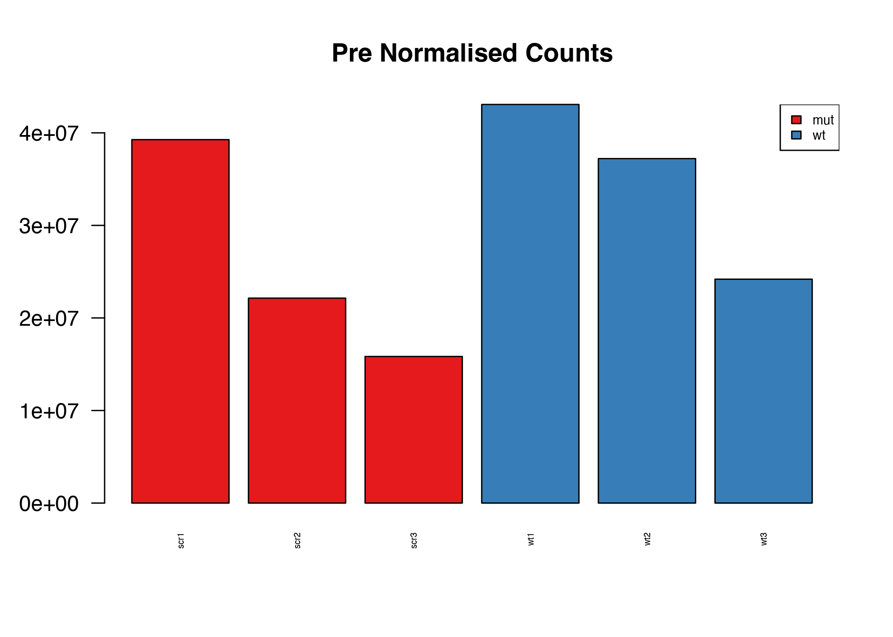<!-- -->

We will also estimate the negative binomial dispersion of the data.

``` r
dds <- estimateSizeFactors(dds)
dds <- estimateDispersions(dds)
plotDispEsts(dds)
```

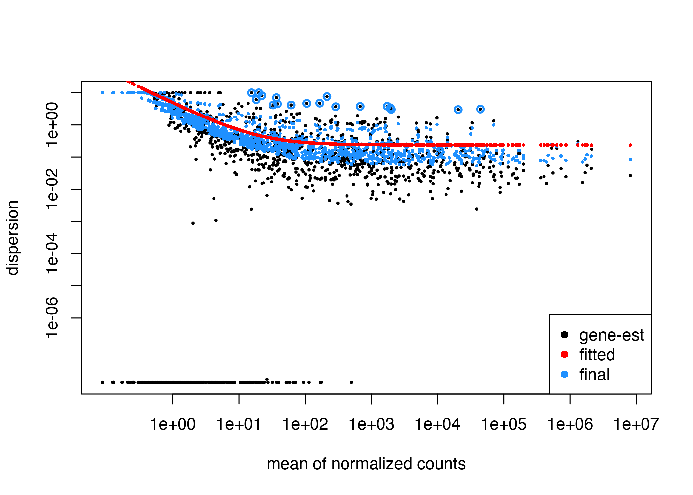<!-- -->

## Post Normalisation QC

Now we can normalise and plot the counts again. The data look much
improved.

``` r
normcounts <- counts(dds, normalized=TRUE)
rawcounts=counts(dds,normalized=FALSE)
log2counts=log2(normcounts+1)


barplot(apply(normcounts,2,sum), las=2,col=cond_colours,main="Post-Normalised Counts",cex.names=0.4)
legend("topright",levels((conds)),cex=0.6,fill=cond_colours[levels(conds)])
```

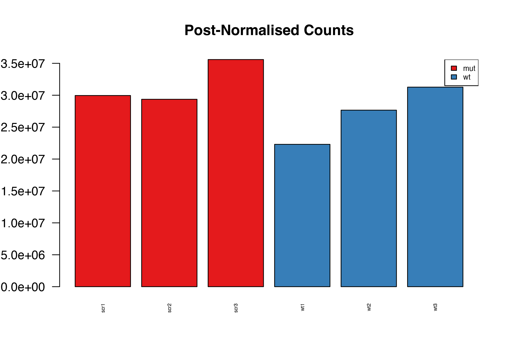<!-- -->

We will apply the Variance Stabilising Transformation (VST) it’s better
than log2 for counts.

``` r
vsd <- varianceStabilizingTransformation(dds)
vstcounts <- assay(vsd)
vstcounts <- vstcounts[order(apply(vstcounts,1,sum),decreasing =TRUE),]
```

As an additional QC step we can calculate the sample-to-sample Pearson
correlations and plot them in a heatmap.

``` r
heatmap.2(cor(rawcounts),trace="none",col=hmcol,main="Sample to Sample Correlation (Raw Counts)",cexRow=0.5,cexCol=0.5,RowSideColors=cond_colours, margins=c(9,7))
```

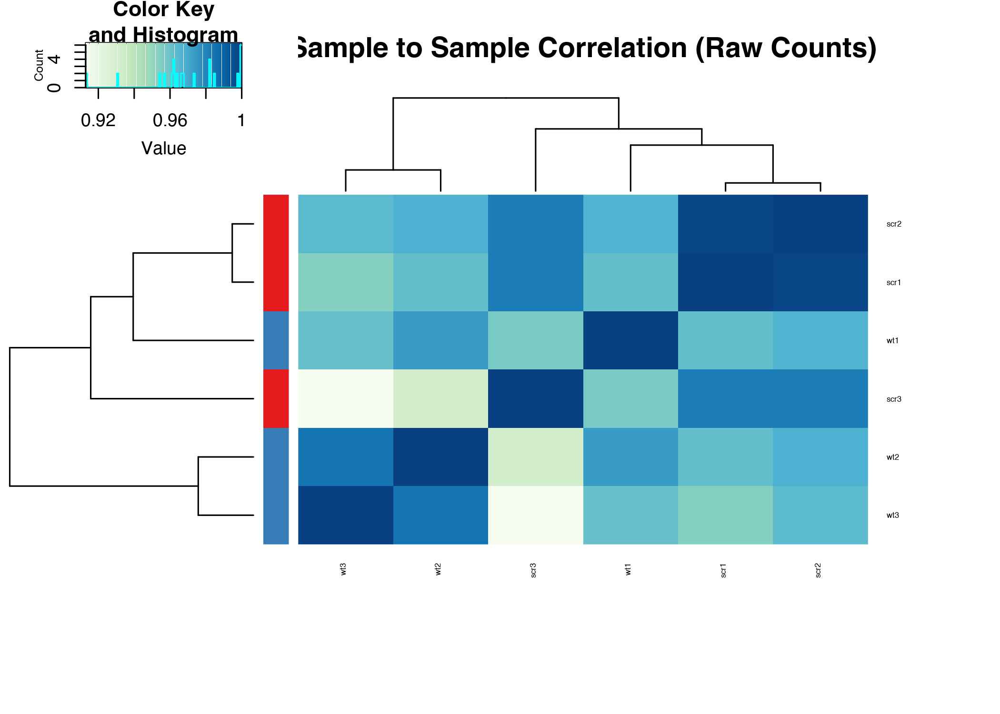<!-- -->

``` r
heatmap.2(cor(vstcounts),trace="none",col=hmcol,main="Sample to Sample Correlation (VST)",cexRow=0.5,cexCol=0.5,RowSideColors=cond_colours,margins=c(9,7))
```

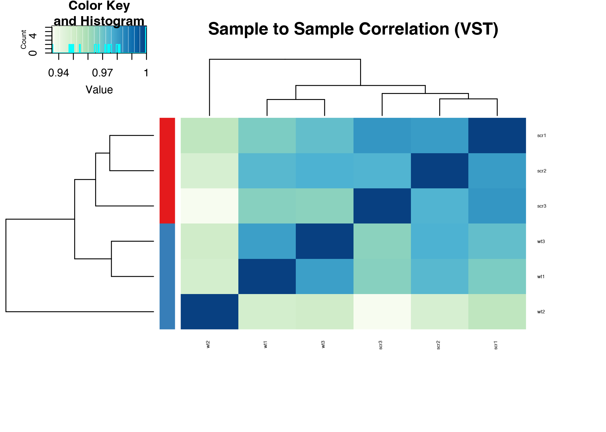<!-- --> \#
Principal Componenet Analysis PCA of the first two Principal Components.

``` r
pca2=prcomp(t(normcounts),center=TRUE)

plot(pca2$x, col=cond_colours,  pch=19, cex=2, main="Sample to Sample PCA (VST)")
text(pca2$x, as.vector(colnames(mircounts)), pos=3, cex=0.4)
```

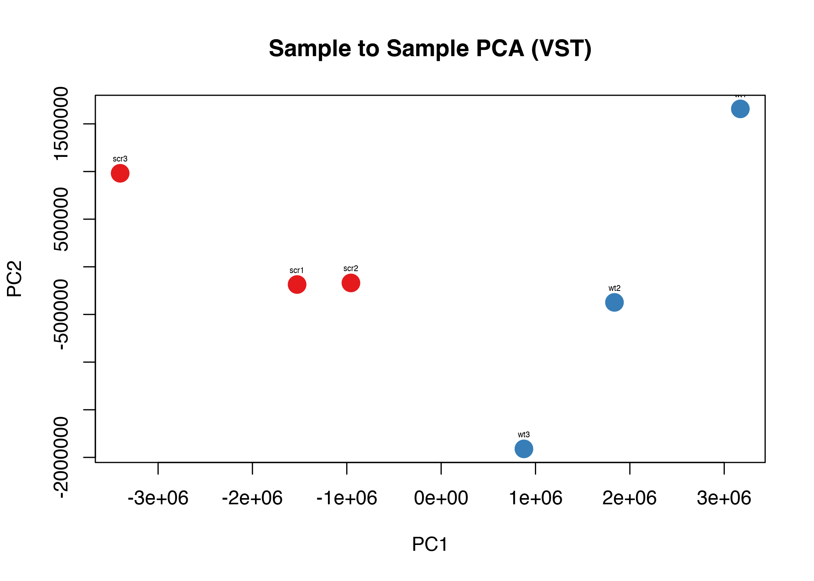<!-- -->

We see a nice separation between the wildtype and scrambled samples.

Let’s now look at the other principal components

``` r
par(mfrow=c(1,3))
plot(pca2$x, col=cond_colours,  pch=19, cex=2, main="Sample to Sample PCA (VST)")
text(pca2$x, as.vector(colnames(mircounts)), pos=3, cex=0.4)
plot(pca2$x[,1],pca2$x[,3], col=cond_colours,  pch=19, cex=2, main="Sample to Sample PCA (VST)",ylab="PC3",xlab="PC1")
text(pca2$x[,1],pca2$x[,3], as.vector(colnames(mircounts)), pos=3, cex=0.4)
plot(pca2$x[,2],pca2$x[,3], col=cond_colours,  pch=19, cex=2, main="Sample to Sample PCA (VST)",ylab="PC3",xlab="PC2")
text(pca2$x[,2],pca2$x[,3], as.vector(colnames(mircounts)), pos=3, cex=0.4)
```

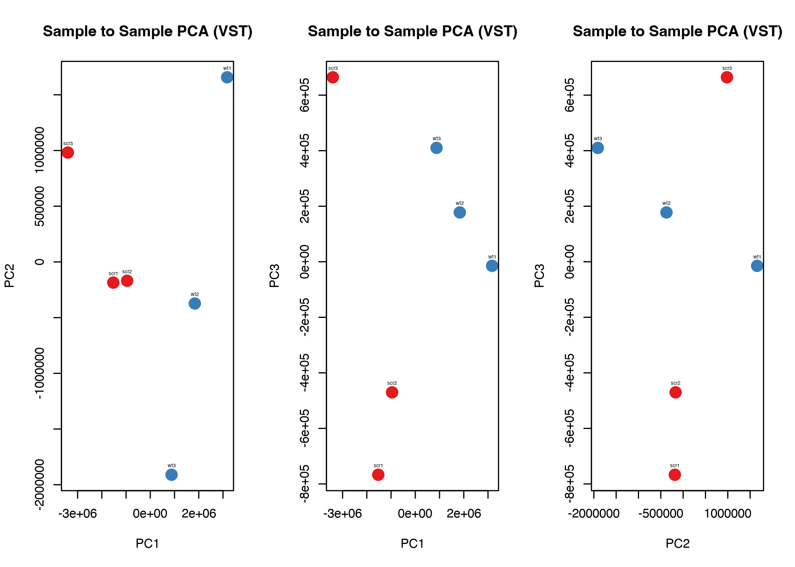<!-- -->

# tSNE Analysis

t-Stochastic Neighbour Embedding (tSNE) is a *trendy* new type of
multidimensional scaling approach akin to a PCA.

``` r
tsne <- Rtsne(t(normcounts), perplexity = 1, check_duplicates = FALSE)
tsne.df <- data.frame(tsne.1 = tsne$Y[,1], tsne.2 = tsne$Y[,2])

ggplot(data = tsne.df, aes(tsne.1, tsne.2)) + 
  geom_point(size = 6, pch = 20, colour = cond_colours) +
  geom_text(size = 2, vjust=2, aes(label=colnames(vstcounts))) +
  scale_alpha_discrete(range = c(0.5, 1)) +
  theme_minimal() +
  ylab("tSNE 1") +
  xlab("tSNE 2") 
```

               ## Warning: Using alpha for a discrete variable is not advised.

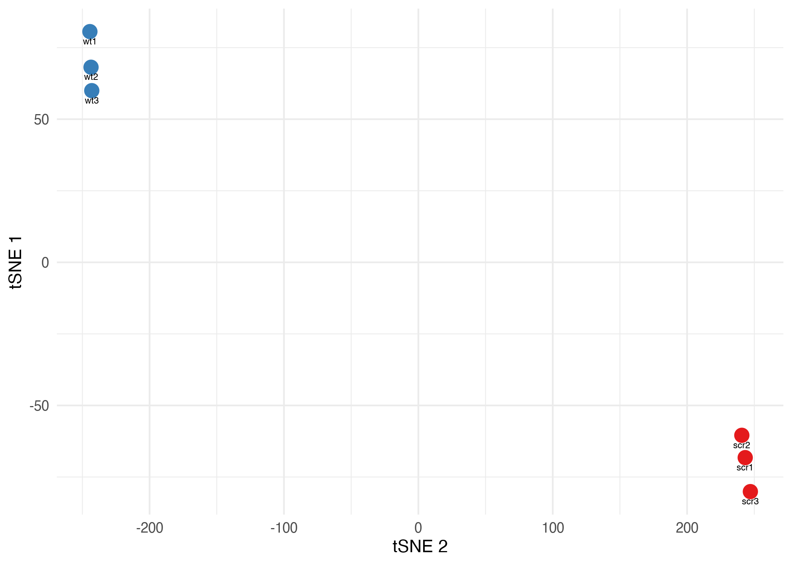<!-- --> \##
Initial Biological Analysis of the data Here are the top10 microRNAs.

``` r
top10=apply(mircounts,1,sum)[1:10]
top10[11]=sum(apply(mircounts,1,sum)[11:nrow(mircounts)])
names(top10)[11]="other"
pie(top10,col=brewer.pal(11,"Set3"),main="Top10 microRNAs")
```

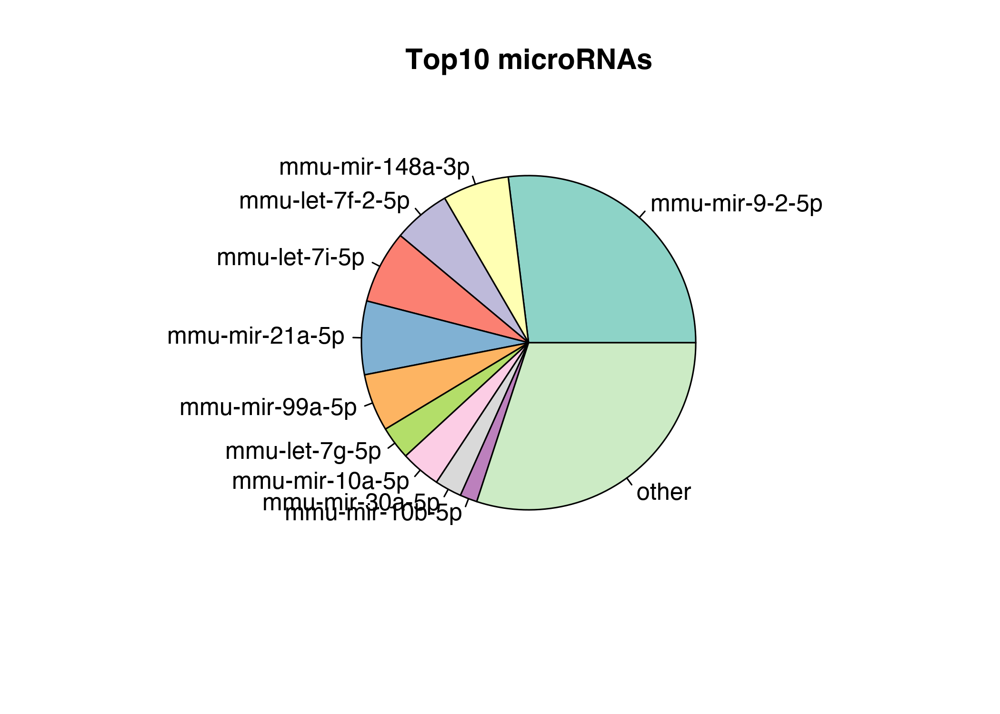<!-- -->

This is the expression of the top10 microRNAs sample to sample.

``` r
heatmap.2(vstcounts[names(top10)[1:10],],col=hmcol,trace="none",cexCol=0.4,cexRow=0.6,ColSideColors=cond_colours)
```

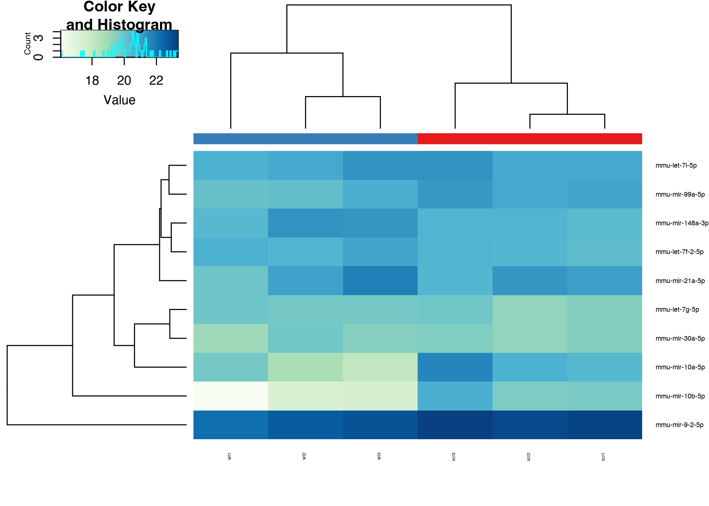<!-- -->

This is the expression of the miR-29 families of microRNAs sample to
sample.

``` r
heatmap.2(vstcounts[rownames(mircounts)[grep("mir-29[a-z]",rownames(mircounts))],],col=hmcol,trace="none",cexCol=0.4,cexRow=0.6,ColSideColors=cond_colours)
```

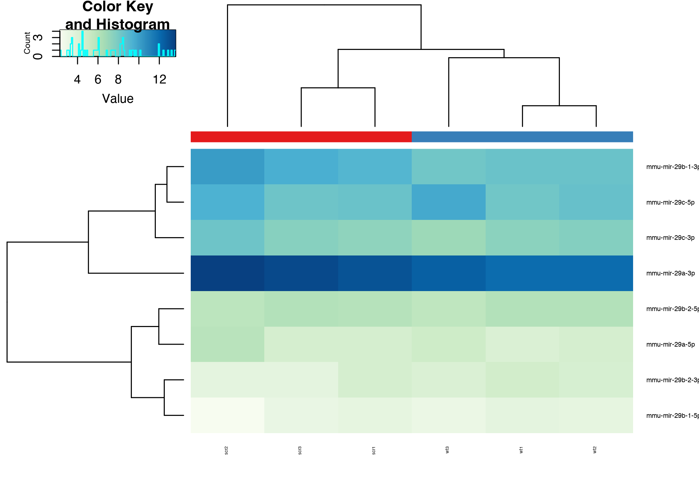<!-- -->

``` r
barplot(t(vstcounts[rownames(mircounts)[grep("mir-29[a-z]",rownames(mircounts))],]),beside=T,las=2,cex.names=0.5,col=cond_colours,main="miR-29 levels (VST)")
legend("topright",rownames(pdata),fill=cond_colours,cex=0.4)
```

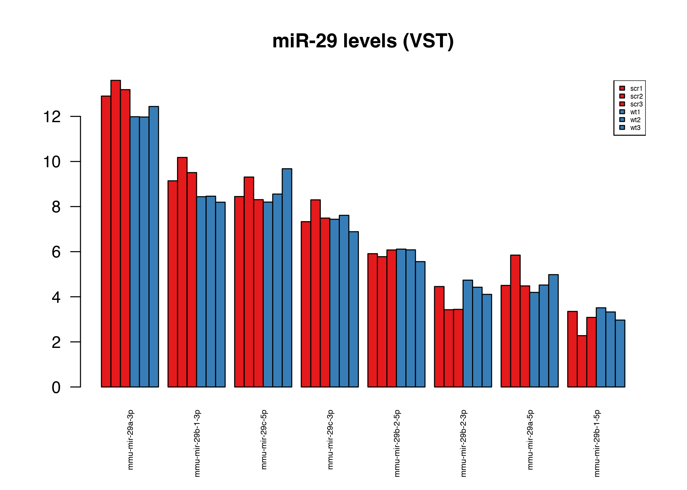<!-- -->

# Statistical Analysis

Run the statistical contrast on the count data

``` r
p_threshold=0.05
lfc_threshold=0.75

cds <- nbinomWaldTest(dds)

res=results(cds,contrast=c("treatment","wt","mut"))
res <- res[order(res$padj),]
res

sig = rownames(res[(abs(res$log2FoldChange) > lfc_threshold) & (res$padj < p_threshold) & !is.na(res$padj),])
```

               ## log2 fold change (MLE): treatment wt vs mut 
               ## Wald test p-value: treatment wt vs mut 
               ## DataFrame with 1471 rows and 6 columns
               ##                    baseMean log2FoldChange     lfcSE       stat      pvalue
               ##                   <numeric>      <numeric> <numeric>  <numeric>   <numeric>
               ## mmu-mir-708-5p      370.219       -4.09179  0.550151   -7.43758 1.02545e-13
               ## mmu-mir-219-2-3p   2508.843       -3.87281  0.665087   -5.82302 5.77953e-09
               ## mmu-mir-204-5p      595.616        3.90067  0.673945    5.78781 7.13103e-09
               ## mmu-mir-219-2-5p     89.544       -2.63649  0.469427   -5.61641 1.94964e-08
               ## mmu-mir-10b-5p   632527.447       -3.00551  0.545888   -5.50574 3.67629e-08
               ## ...                     ...            ...       ...        ...         ...
               ## mmu-mir-875-3p      0.12716      -1.632772   4.07146 -0.4010284    0.688399
               ## mmu-mir-882-5p      0.22105      -1.812671   4.06557 -0.4458588    0.655699
               ## mmu-mir-489-5p      0.08632       0.203470   4.07646  0.0499134    0.960191
               ## mmu-mir-804-3p      0.21020       0.970437   4.04133  0.2401282    0.810231
               ## mmu-mir-142-5p      0.12716      -1.632772   4.07146 -0.4010284    0.688399
               ##                         padj
               ##                    <numeric>
               ## mmu-mir-708-5p   9.20853e-11
               ## mmu-mir-219-2-3p 2.13456e-06
               ## mmu-mir-204-5p   2.13456e-06
               ## mmu-mir-219-2-5p 4.37693e-06
               ## mmu-mir-10b-5p   6.60261e-06
               ## ...                      ...
               ## mmu-mir-875-3p            NA
               ## mmu-mir-882-5p            NA
               ## mmu-mir-489-5p            NA
               ## mmu-mir-804-3p            NA
               ## mmu-mir-142-5p            NA


Volcanoplots of Significant Hits

``` r
plot(res$log2FoldChange,-log(res$padj,10),ylab="-log10(Adjusted P)",xlab="Log2 FoldChange",main=paste("Volcano Plot","WT v Scr\nmir-29 in green\nsig. in red"),pch=19,cex=0.4)      
points(res[sig,"log2FoldChange"],-log(res[sig,"padj"],10),pch=19,cex=0.4,col="red")
text(res[sig[1:10],"log2FoldChange"],-log(res[sig[1:10],"padj"],10),pch=19,cex=0.4,pos=2,labels = rownames(res[sig[1:10],]))
points(res[rownames(mircounts)[grep("mir-29[a-z]",rownames(mircounts))],"log2FoldChange"],-log(res[rownames(mircounts)[grep("mir-29[a-z]",rownames(mircounts))],"padj"],10),pch=19,cex=0.6,col="green")
text(res[rownames(mircounts)[grep("mir-29[a-z]",rownames(mircounts))],"log2FoldChange"],-log(res[rownames(mircounts)[grep("mir-29[a-z]",rownames(mircounts))],"padj"],10),pch=19,cex=0.4,pos=2,labels =rownames(mircounts)[grep("mir-29[a-z]",rownames(mircounts))])
abline(h=-log10(p_threshold),lty=3)
abline(v=-lfc_threshold,lty=3)
abline(v=lfc_threshold,lty=3)   
```

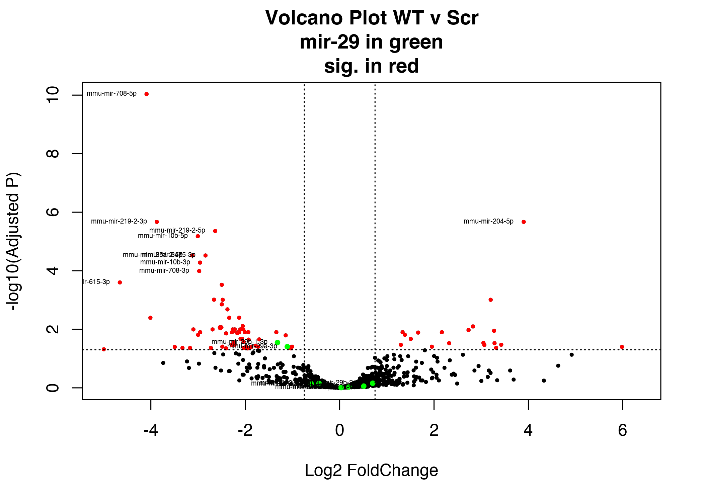<!-- -->

## Scatter Plot

``` r
wt_median = apply(vstcounts[,pdata$genotype == "wt"],1,median)
mt_median = apply(vstcounts[,pdata$genotype == "mut"],1,median)
plot(wt_median,mt_median,cex=0.4,pch=19,col="darkblue")
points(wt_median[grep("mir-29[a-z]",rownames(vstcounts))],mt_median[grep("mir-29[a-z]",rownames(vstcounts))],cex=0.4,pch=19,col="green")
points(wt_median[sig],mt_median[sig],cex=1,col="red")
text(wt_median[grep("mir-29[a-z]",rownames(vstcounts))],mt_median[grep("mir-29[a-z]",rownames(vstcounts))],cex=0.4,pos=3,labels=rownames(vstcounts)[grep("mir-29[a-z]",rownames(vstcounts))])
abline(a=0,b=1,lty=2,col="red")
```

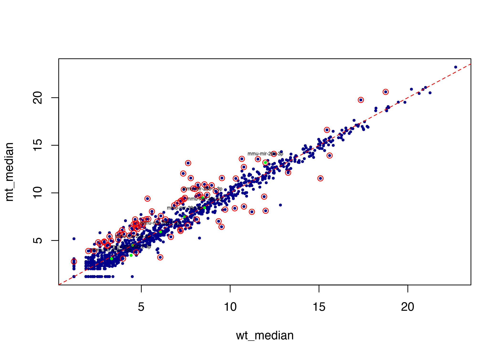<!-- -->

Heatmap of significant hits.

``` r
heatmap.2(vstcounts[sig,],trace="none",ColSideColors = cond_colours,col=hmcol,margins=c(5,5),cexRow=0.5,cexCol=0.6,labCol=paste(rownames(pdata),pdata$SampleName,sep="\n"),main="Significant Hits Heatmap (VST)")
```

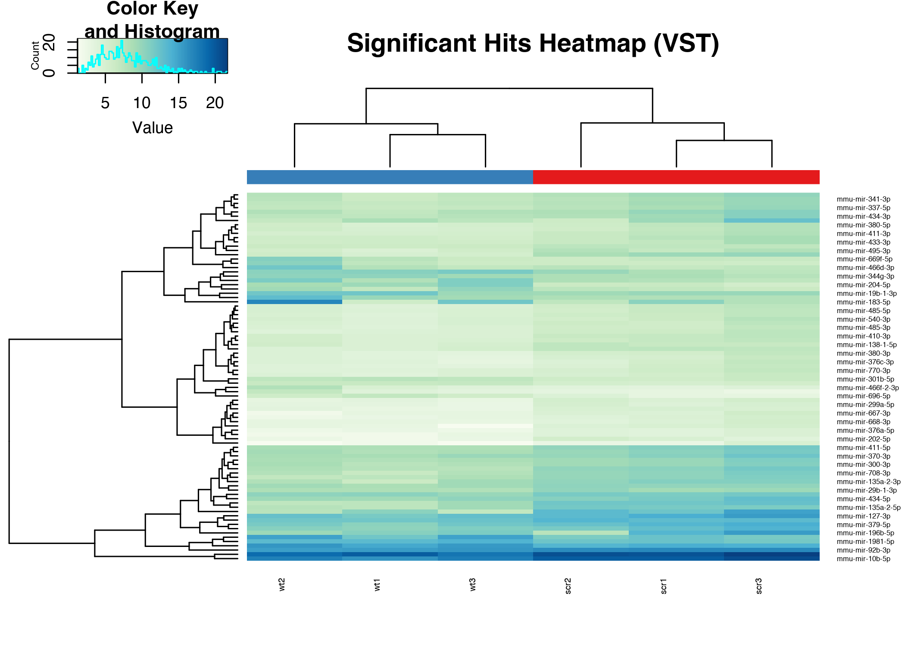<!-- -->

## Result output to text file

Let’s output the final results table with normalised expression values
and stats listed

``` r
write.table(cbind(as.matrix(counts(dds,normalized=T)[rownames(res),]),as.matrix(res)),"mouse_results.txt",quote=F,sep="\t")
```
