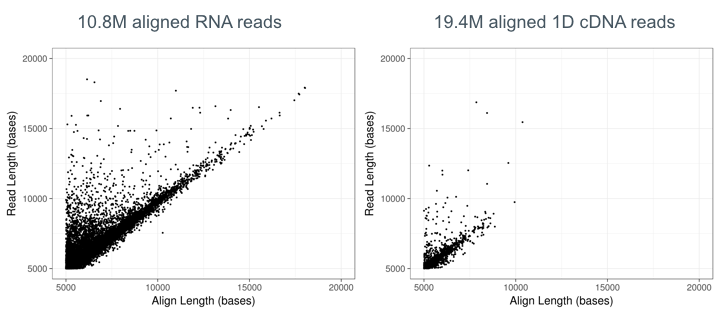
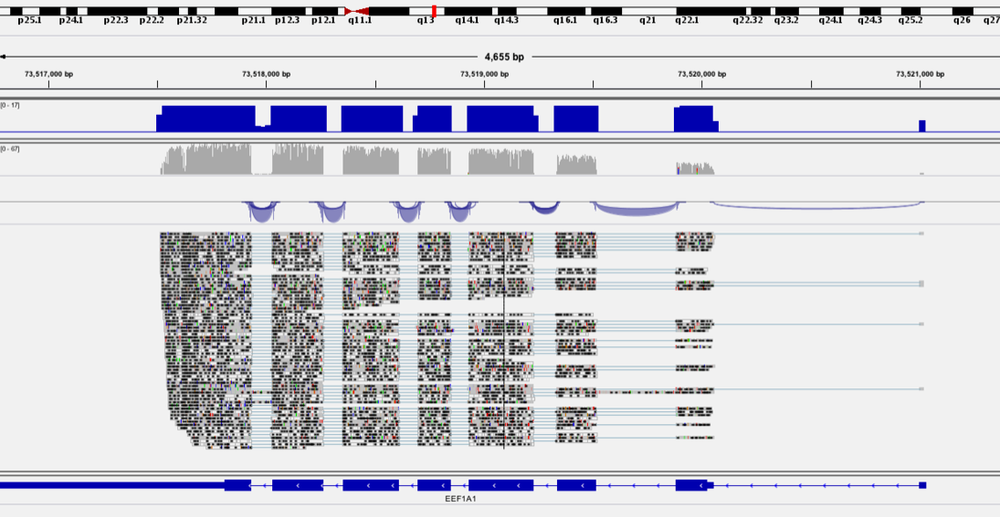
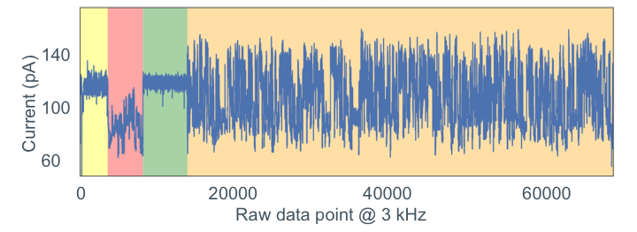
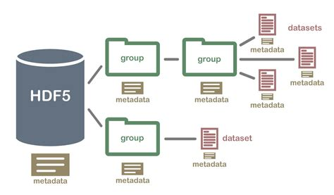
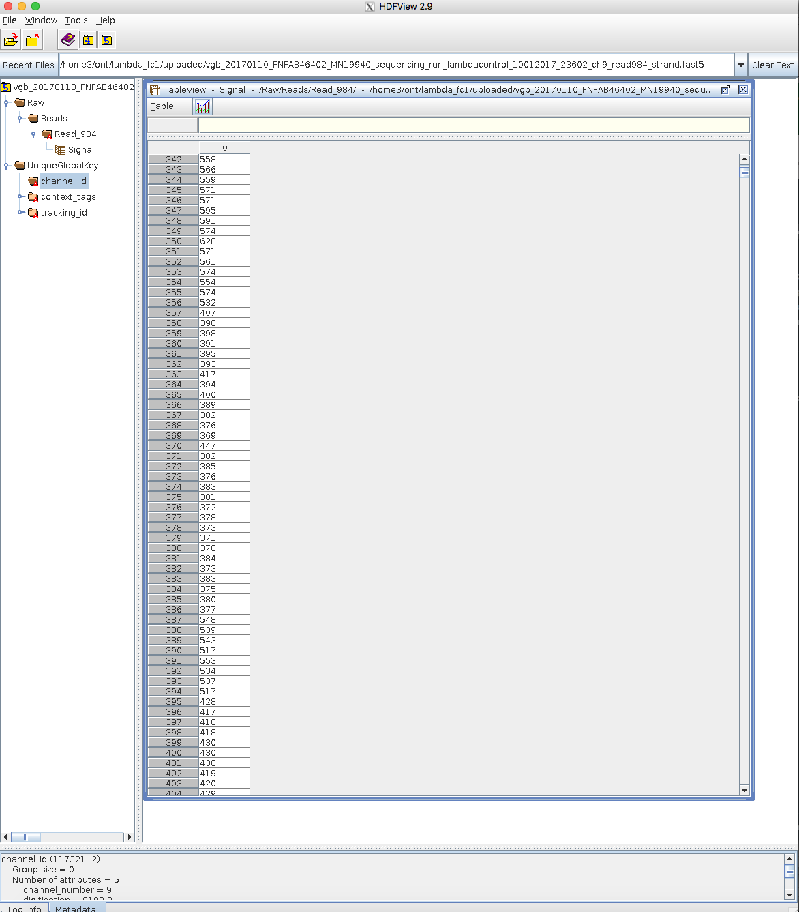
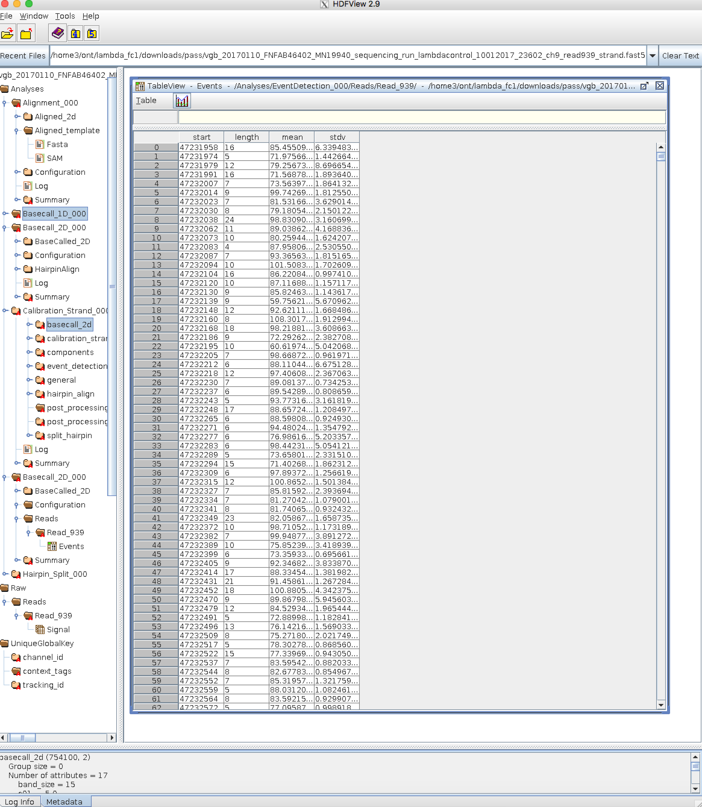
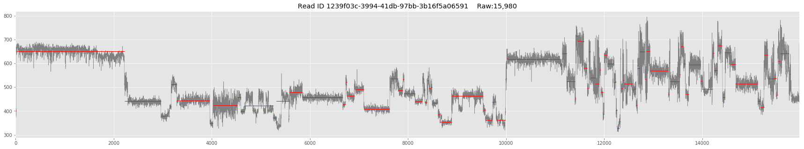
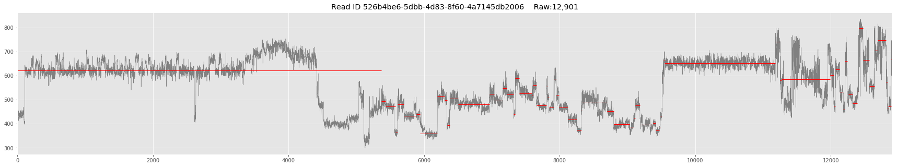
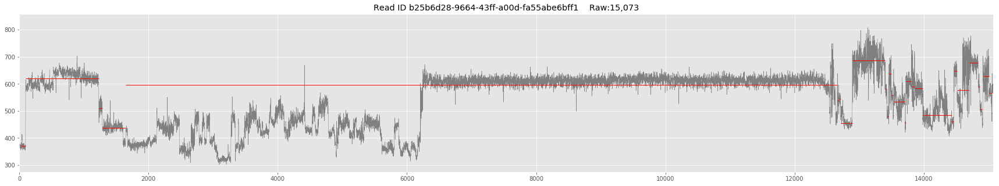

# Nanopore Direct RNA sequencing analysis

Adrien Leger, EMBL-EBI

26th June 2018


## Why and where to use dRNA-Seq

#### Cons

- Lower yield than cDNA seq => 500Mb to 1.5Gb per flowcell 
- Slighly higher error ~ 11%
- Requires a massive quantity of polyA+ RNA (or of a specific target)


#### Pros

- Library preparation much simpler, fewer steps => less biaised

- Longer reads than cDNA

   

- Better exons connectivity



* PolyAs can be detected and measured (hopefully)

  

* (Some) RNA modifications can modify the signal

  

   


## ONT Fast5 file format

MINKnow generates files containing the raw intensity signal in [HDF5 format](https://support.hdfgroup.org/HDF5/). Each read is contained in a single file.




Files can be explored using **HDFview**

**Fast5 containing raw data only**



**Fast5 after basecalling with Albacore (or live basecalling with MINKnow)**




**Example of raw signal**








## Useful tools for dRNA-Seq ONT analysis

### Basecalling

* **Albacore** (available to ONT community)
* Guppy = GPU accelerated version of Albacore (available to developer contract with ONT)
* [Chiron](https://github.com/haotianteng/chiron) = Community alternative

See basecaller comparison => https://github.com/rrwick/Basecalling-comparison

### Quality control

* [NanoPack](https://github.com/wdecoster/nanopack) = Suite of tools to QC and process raw ONT data
* [pycoQC](https://github.com/a-slide/pycoQC) = ONT data QC for Jupyter Notebook

### RNA alignment

* [**Minimap2** ](https://github.com/lh3/minimap2)
* [STAR](https://github.com/alexdobin/STAR)
* Transcriptome based aligner => Kallisto or Salmon

### Read Polishing

* [Nanopolish event align](https://nanopolish.readthedocs.io/en/latest/)
* [Tombo resquiggle](https://nanoporetech.github.io/tombo/)

### DNA/RNA modification detection

* [Tombo detect_modifications](https://nanoporetech.github.io/tombo/)
* [Nanopolish call-methylation](https://nanopolish.readthedocs.io/en/latest/quickstart_call_methylation.html)

Exhaustive list of tools => https://docs.google.com/spreadsheets/d/15LWXg0mUeNOHVthl8JRX-FzJ9w8jrWogS4YhDcxyAfI/edit#gid=0


# Mini-Practical

1. Get you data !

   ```bash
   cd ~/Desktop/course_data/nanopore_dRNA_Seq/datasets/
   ```

   ```
   tar xvf {YOUR-SAMPLE}.tar.gz
   ```
   

2. Inspect reads with the HDFView GUI

   ```bash
   hdfview
   ```

     

3. Basecall your data with Albacore

   ```bash
   cd ~/Desktop/course_data/nanopore_dRNA_Seq/analyses/
   ```

   ```bash
   read_fast5_basecaller.py --help
   
   read_fast5_basecaller.py --list_workflows
   
   read_fast5_basecaller.py -r -t 8 -f {FLOWCELL} -k {KIT} -o fastq -q 0  -i ../datasets/{YOUR-SAMPLE} -s ./
   ```

   *Flowcell and Kit information can be found in the fast5 files*

   *With your sample data it should take around 10 mins*

   


4. QC the basecalled files with NanoPack

   https://github.com/wdecoster/Nanopack

   * Install Nanopack first

   ```bash
   pip3 install NanoPack --user
   ```

   * Run Nanoplot and NanoStat

   ```bash
   NanoPlot --summary sequencing_summary.txt --loglength -o summary-plots-log-transformed
   ```

   *Results are in summary-plots-log-transformed*

   ```bash
   NanoStat --summary sequencing_summary.txt --readtype 1D
   ```

   *Results are sent to standard output*

   

5. Align reads against the transcriptome or the genome with Minimap2

https://github.com/lh3/minimap2

*Spliced alignment against genome*

```bash
minimap2 -ax splice -uf -k 14 -L -t 8 ../references/{Homo_sapiens/Saccharomyces_cerevisiae}_genome.fa.gz ./workspace/pass/{FASTQ_FILE} | samtools view -bh -F 2308 | samtools sort -o reads.bam
```

   *Unspliced alignment against transcriptome*

```bash
minimap2 -ax map-ont -L -t 8 ../references/{Homo_sapiens/Saccharomyces_cerevisiae}_transcriptome.fa.gz ./workspace/pass/{FASTQ_FILE} | samtools view -bh -F 2308 | samtools sort -o reads.bam
```


6. Visualise aligned reads with IGV

   https://software.broadinstitute.org/software/igv/download

   *Index reads first for visualization*

```bash
samtools index reads.bam
```

