Nanopore Direct RNA Seq - Practical 2
================
Anton Enright & Jack Monahan & Adrien Leger
'28 June, 2018'

-   [Analysis of Nanopore Direct RNA counts](#analysis-of-nanopore-direct-rna-counts)
-   [Direct RNA Seq Discussion](#direct-rna-seq-discussion)
    -   [Preparation](#preparation)
    -   [Yeast Analysis](#yeast-analysis)
        -   [Setup of counts and DESeq objects](#setup-of-counts-and-deseq-objects)
        -   [Initial QC of samples](#initial-qc-of-samples)
        -   [Normalisation and model fitting](#normalisation-and-model-fitting)
        -   [Post Normalisation QC](#post-normalisation-qc)
        -   [Yeast Statistics](#yeast-statistics)
    -   [Human Data Analysis](#human-data-analysis)
        -   [Initial QC of counts](#initial-qc-of-counts)
        -   [Normalisation and Statistics](#normalisation-and-statistics)
        -   [Post Normalisation QC](#post-normalisation-qc-1)
        -   [Comparison Nanopore to Illumina](#comparison-nanopore-to-illumina)
        -   [Human Statistics](#human-statistics)

Analysis of Nanopore Direct RNA counts
======================================

First we should change directory to where the data is

``` r
setwd("~/Desktop/course_data/wtac_nanopore_drna_2018")
```

Direct RNA Seq Discussion
=========================

We have 4 yeast datasets, with 2 wildtypes and 2 knockouts for an RNA methylation enzyme. We also have two Human datasets from MCF7 which are wildtype.

We want to look for differential expression between wt and knockout in the yeast samples. For the Human samples we want to compare to our existing illumina data from the mRNASeq practical.

| **Sample** | **Species** | **Description** |
|------------|-------------|-----------------|
| s1         | yeast       | wt              |
| s2         | yeast       | wt              |
| s3         | yeast       | ko              |
| s4         | yeast       | ko              |
| ----       | ----        | --------        |
| s5         | human       | MCF7 wt Line    |
| s6         | human       | MCF7 wt Line    |

Preparation
-----------

We first load the R/BioConductor libraries that we need.

``` r
library(RColorBrewer)
library(gplots)
library(DESeq2)
hmcol = colorRampPalette(brewer.pal(9, "GnBu"))(100)
```

Yeast Analysis
--------------

We will first look at the yeast data. We will load the count data first. We then set up conditions in an array.

``` r
yeast_counts = read.table("yeast_trans_counts.txt",header=T,row.names=1)
#yeast_annot = read.table("yeast_annot.txt",row.names=1)

yeast_conds=as.factor(c("wt","wt","t5d","t5d"))
```

### Setup of counts and DESeq objects

We now setup the condition information for DESeq2.

``` r
coldata = as.data.frame(yeast_conds)
rownames(coldata)=colnames(yeast_counts)
colnames(coldata)='genotype'
dds <- DESeqDataSetFromMatrix(countData = yeast_counts, colData = coldata, design = ~ genotype)
```

Now we will make some colours per condition and plot the counts yielded.

``` r
cond_colours = brewer.pal(length(levels(yeast_conds)),"Set2")[yeast_conds]
```

               ## Warning in brewer.pal(length(levels(yeast_conds)), "Set2"): minimal value for n is 3, returning requested palette with 3 different levels

``` r
names(cond_colours)=yeast_conds

barplot(apply(yeast_counts,2,sum), las=2,col=cond_colours,main="Pre Normalised Counts",cex.names=0.4)
legend("topright",levels((yeast_conds)),cex=0.6,fill=cond_colours[levels(yeast_conds)])
```

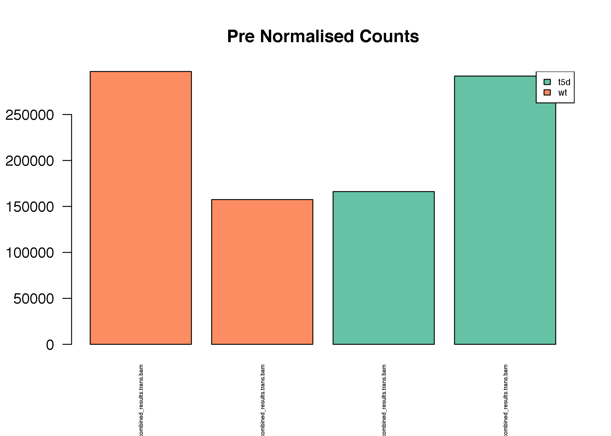

### Initial QC of samples

We have probably got a lot of the control standard sequenced (ENOLASE 1 - Gene YHR174W)

``` r
barplot(as.numeric(yeast_counts["YHR174W",]/sum(yeast_counts[,1])),col=cond_colours,xlab="Enolase",ylab="% of Reads")
```

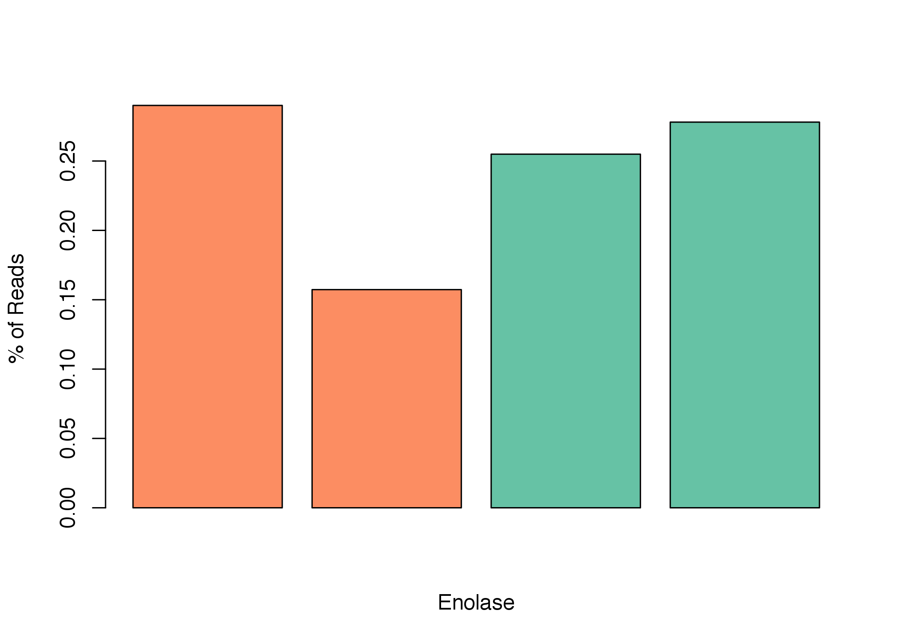

Lets Remove the Enolase to not contaminate our counts.

``` r
yeast_counts=yeast_counts[rownames(yeast_counts)!= "YHR174W",]
```

### Normalisation and model fitting

Now we can build a DESeq2 Dataset.

``` r
dds <- DESeqDataSetFromMatrix(countData = yeast_counts, colData = coldata, design = ~ genotype)
barplot(apply(yeast_counts,2,sum), las=2,col=cond_colours,main="Pre Normalised Counts",cex.names=0.4)
legend("topright",levels((yeast_conds)),cex=0.6,fill=cond_colours[levels(yeast_conds)])
```

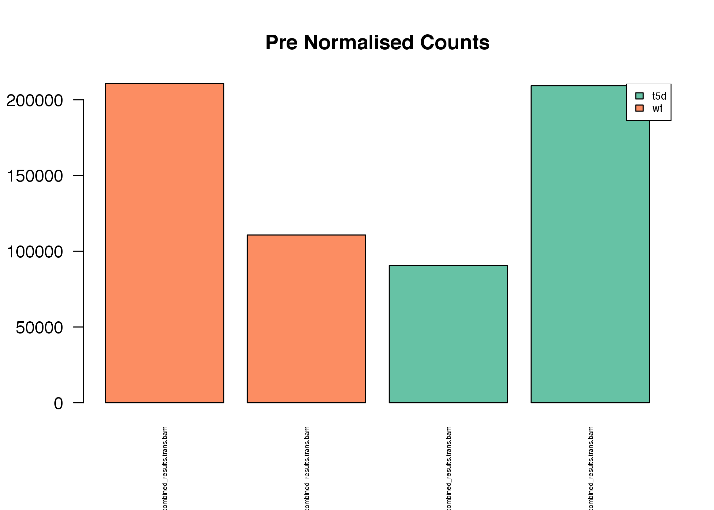

``` r
dds <- estimateSizeFactors(dds)
dds <- estimateDispersions(dds)
```

               ## gene-wise dispersion estimates

               ## mean-dispersion relationship

               ## final dispersion estimates

``` r
plotDispEsts(dds)
```

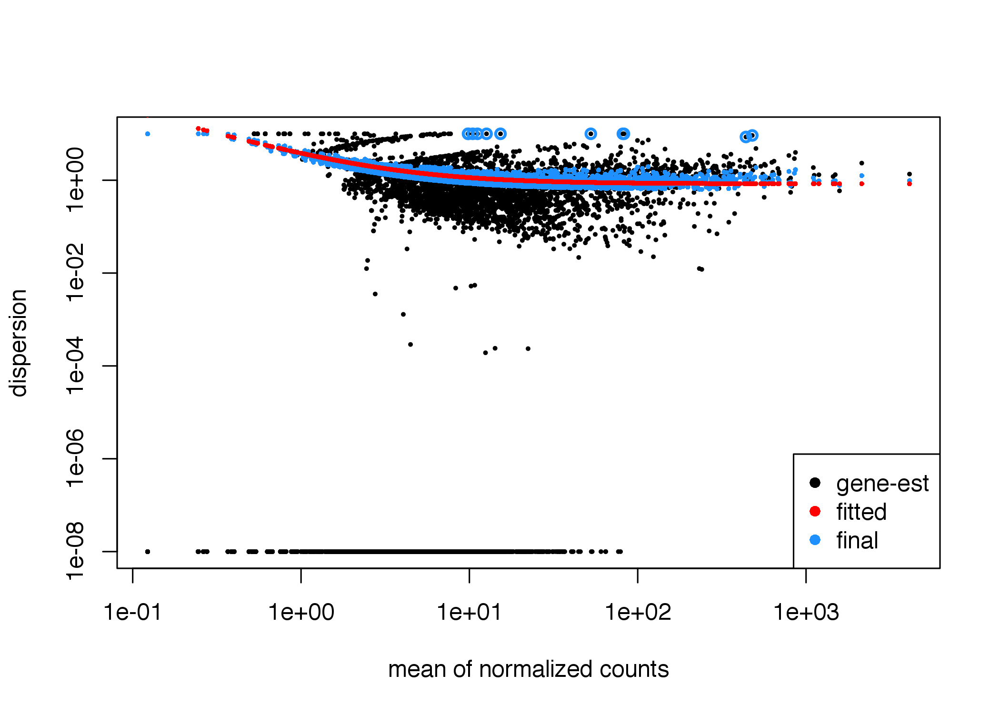

### Post Normalisation QC

``` r
normcounts <- counts(dds, normalized=TRUE)
rawcounts=counts(dds,normalized=FALSE)
log2counts=log2(normcounts+1)

barplot(apply(normcounts,2,sum), las=2,col=cond_colours,main="Post-Normalised Counts",cex.names=0.4)
legend("topright",levels((yeast_conds)),cex=0.6,fill=cond_colours[levels(yeast_conds)])
```

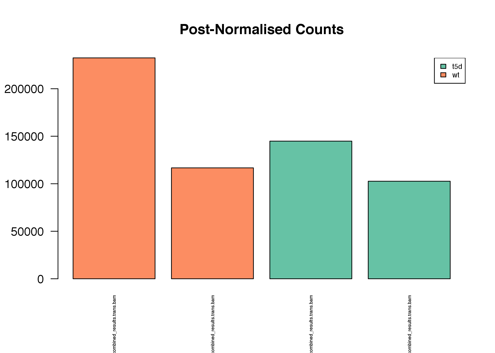 Stabilise the counts for visualisation.

``` r
vsd <- varianceStabilizingTransformation(dds)
vstcounts <- assay(vsd)
vstcounts <- vstcounts[order(apply(vstcounts,1,sum),decreasing =TRUE),]
```

And make some heatmaps

``` r
heatmap.2(cor(rawcounts),trace="none",col=hmcol,main="Sample to Sample Correlation (Raw Counts)",cexRow=0.5,cexCol=0.5,RowSideColors=cond_colours, margins=c(9,7))
```

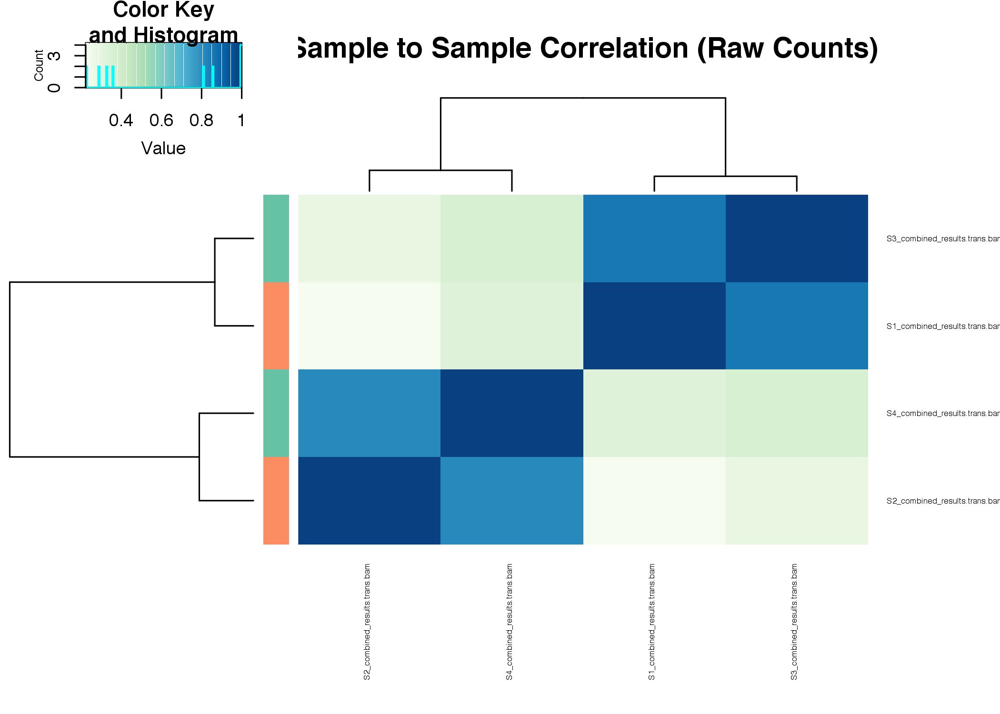

``` r
heatmap.2(cor(vstcounts),trace="none",col=hmcol,main="Sample to Sample Correlation (VST)",cexRow=0.5,cexCol=0.5,RowSideColors=cond_colours,margins=c(9,7))
```

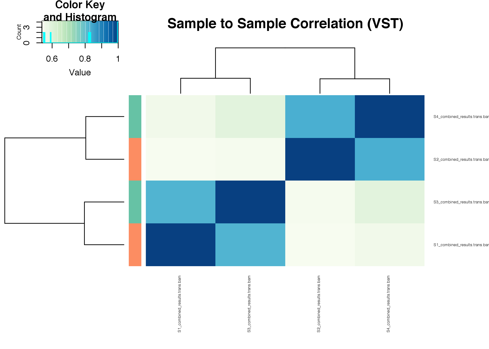 Lets PCA the data and see if wt and mutant are separated properly

``` r
pca2=prcomp(t(vstcounts),center=TRUE)

plot(pca2$x, col=cond_colours,  pch=19, cex=2, main="Sample to Sample PCA (VST)")
text(pca2$x, as.vector(colnames(vstcounts)), pos=3, cex=0.4)
```

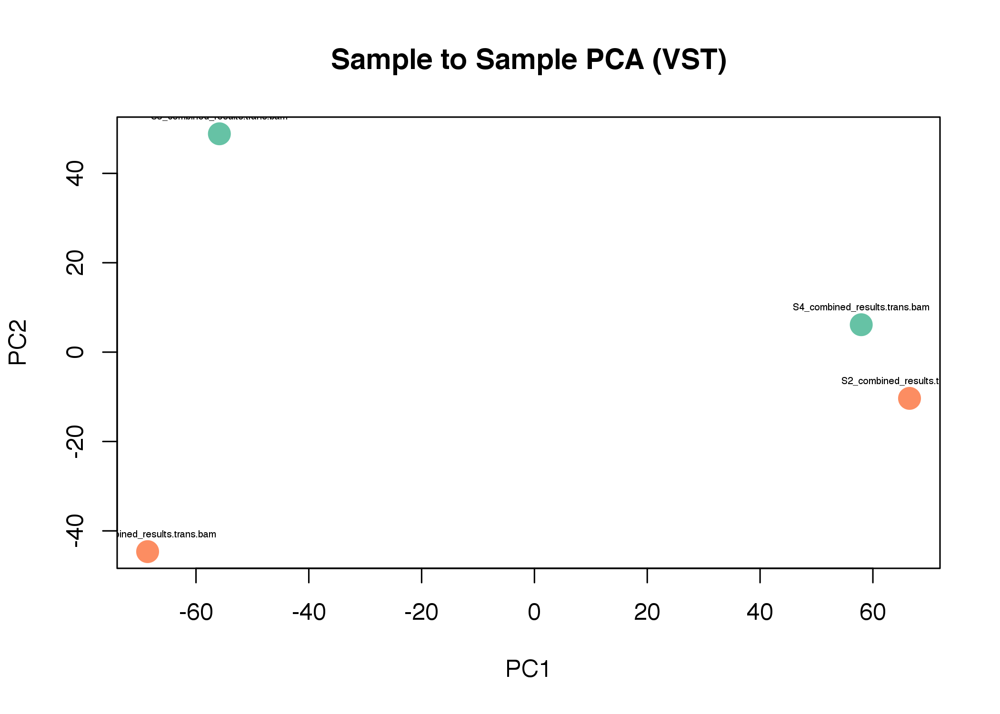

### Yeast Statistics

Can we find any differentials ? The data are perhaps too noisy.....

``` r
p_threshold=0.05
lfc_threshold=0.75

cds <- nbinomWaldTest(dds)

res=results(cds,contrast=c("genotype","wt","t5d"))
res <- res[order(res$padj),]
res
```

               ## log2 fold change (MAP): genotype wt vs t5d 
               ## Wald test p-value: genotype wt vs t5d 
               ## DataFrame with 6158 rows and 6 columns
               ##          baseMean log2FoldChange     lfcSE       stat    pvalue      padj
               ##         <numeric>      <numeric> <numeric>  <numeric> <numeric> <numeric>
               ## Q0050   0.2633860     0.11828062 0.3680057  0.3214098 0.7478999 0.9996786
               ## Q0065   0.1226180    -0.07810001 0.3679788 -0.2122405 0.8319194 0.9996786
               ## Q0075   0.1226180    -0.07810001 0.3679788 -0.2122405 0.8319194 0.9996786
               ## Q0130   0.1226180    -0.07810001 0.3679788 -0.2122405 0.8319194 0.9996786
               ## Q0160   0.4001357    -0.10210077 0.3759429 -0.2715858 0.7859405 0.9996786
               ## ...           ...            ...       ...        ...       ...       ...
               ## YPR199C 7.3297029     -0.3724083 0.7005455 -0.5315975 0.5950048 0.9996786
               ## YPR200C 0.2452359     -0.1397720 0.3695296 -0.3782429 0.7052502 0.9996786
               ## YPR201W 2.1853692     -0.4433921 0.6335451 -0.6998589 0.4840154 0.9996786
               ## YPR202W 1.7852334     -0.3196565 0.6128173 -0.5216179 0.6019364 0.9996786
               ## YPR204W 7.3135546      0.2078271 0.6978484  0.2978112 0.7658472 0.9996786

``` r
sig = rownames(res[(abs(res$log2FoldChange) > lfc_threshold) & (res$padj < p_threshold) & !is.na(res$padj),])
```

Volcanoplot of the results... Nothing is significant

``` r
plot(res$log2FoldChange,-log(res$padj,10),ylab="-log10(Adjusted P)",xlab="Log2 FoldChange",main=paste("Volcano Plot sig. in red"),pch=19,cex=0.4)      
points(res[sig,"log2FoldChange"],-log(res[sig,"padj"],10),pch=19,cex=0.4,col="red")
text(res[sig[1:10],"log2FoldChange"],-log(res[sig[1:10],"padj"],10),pch=19,cex=0.4,pos=2,labels = rownames(res[sig[1:10],]))
abline(h=-log10(p_threshold),lty=3)
abline(v=-lfc_threshold,lty=3)
abline(v=lfc_threshold,lty=3) 
```

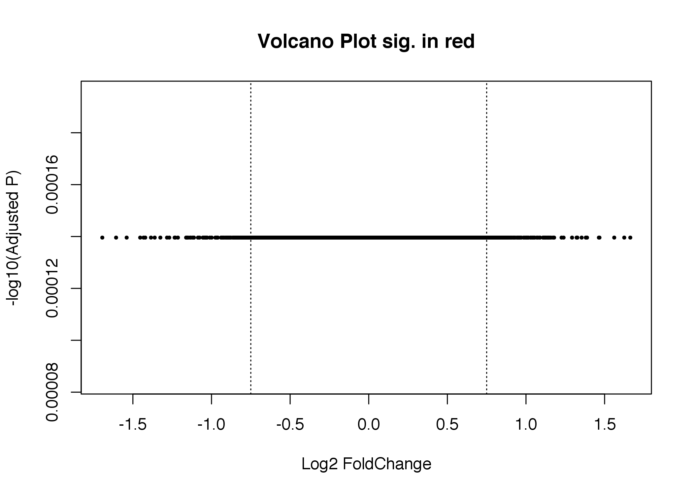

``` r
wt_median = apply(vstcounts[,yeast_conds == "wt"],1,median)
mt_median = apply(vstcounts[,yeast_conds == "t5d"],1,median)
plot(wt_median,mt_median,cex=0.4,pch=19,col="darkblue")
abline(a=0,b=1,lty=2,col="red")
```

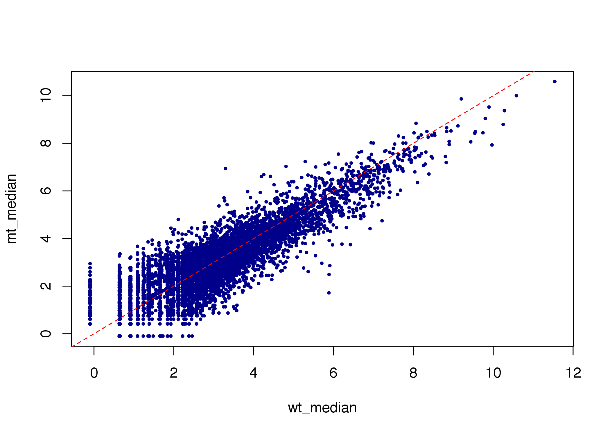

Human Data Analysis
-------------------

``` r
human_counts = read.table("combined_counts.txt",header=T,row.names=1)

human_conds=as.factor(c("illumina","illumina","nano","nano"))

#Lets Load the Counts First
coldata = as.data.frame(human_conds)
rownames(coldata)=colnames(human_counts)
colnames(coldata)='genotype'
dds <- DESeqDataSetFromMatrix(countData = human_counts, colData = coldata, design = ~ genotype)

cond_colours = brewer.pal(length(levels(yeast_conds)),"Set2")[human_conds]
```

               ## Warning in brewer.pal(length(levels(yeast_conds)), "Set2"): minimal value for n is 3, returning requested palette with 3 different levels

``` r
names(cond_colours)=human_conds
```

### Initial QC of counts

``` r
barplot(apply(human_counts,2,sum), las=2,col=cond_colours,main="Pre Normalised Counts",cex.names=0.4)
legend("topright",levels((human_conds)),cex=0.6,fill=cond_colours[levels(human_conds)])
```

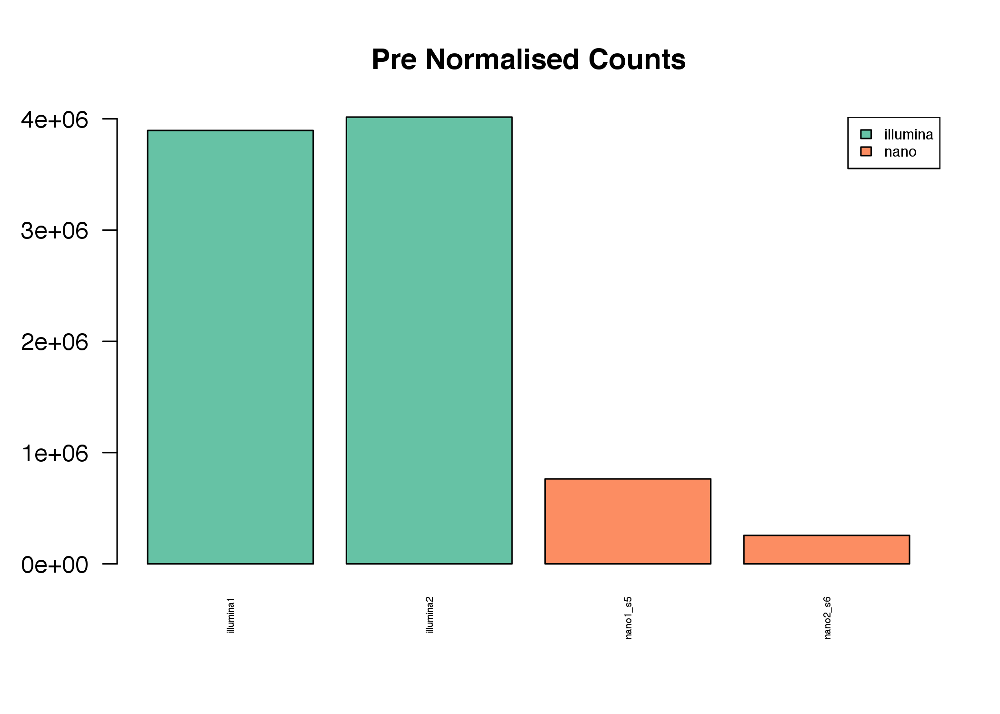

### Normalisation and Statistics

Fit the DESeq neg. binomial model to the data

``` r
dds <- estimateSizeFactors(dds)
dds <- estimateDispersions(dds)
```

               ## gene-wise dispersion estimates

               ## mean-dispersion relationship

               ## final dispersion estimates

``` r
plotDispEsts(dds)
```

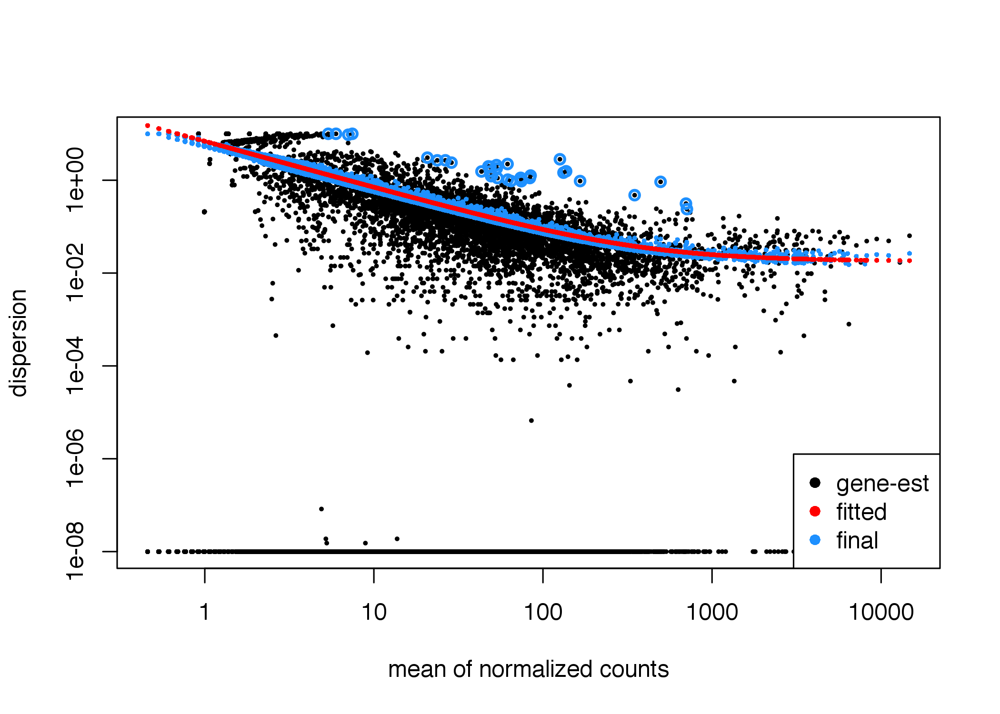

### Post Normalisation QC

Lets see the effect of normalisation and compute some VST stabilised counts for visualisation.

``` r
normcounts <- counts(dds, normalized=TRUE)
rawcounts=counts(dds,normalized=FALSE)
log2counts=log2(normcounts+1)

vsd <- varianceStabilizingTransformation(dds)
vstcounts <- assay(vsd)
vstcounts <- vstcounts[order(apply(vstcounts,1,sum),decreasing =TRUE),]


barplot(apply(normcounts,2,sum), las=2,col=cond_colours,main="Post-Normalised Counts",cex.names=0.4)
legend("topright",levels((human_conds)),cex=0.6,fill=cond_colours[levels(human_conds)])
```

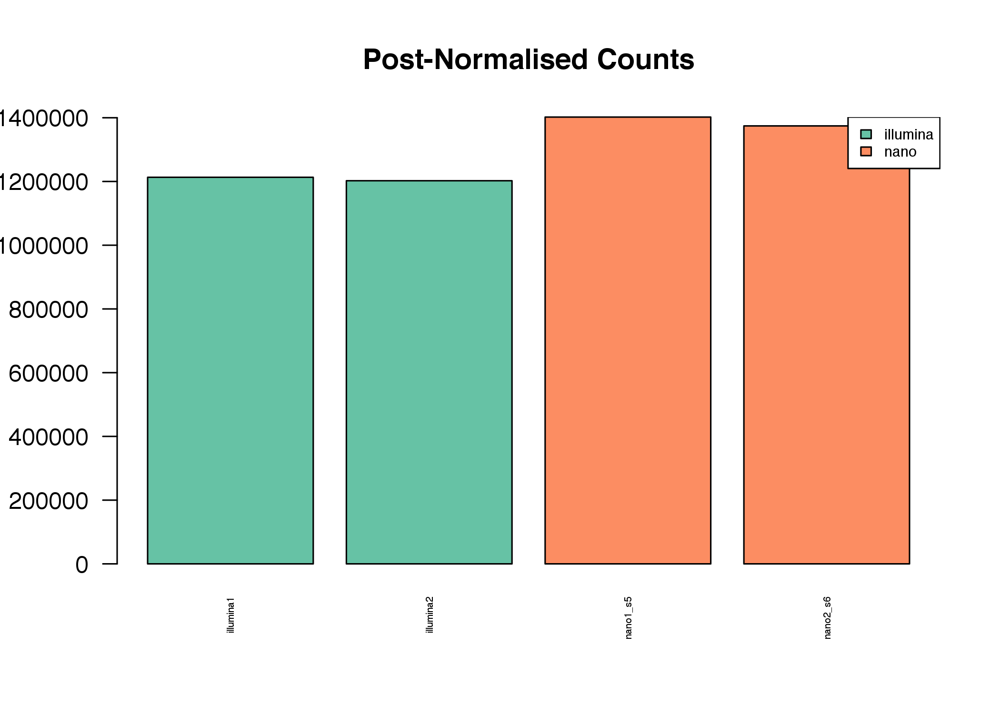

### Comparison Nanopore to Illumina

Lets compare the replicates of the illumina vs each other and likewise for the nanopore results

``` r
par(mfrow=c(2,1))
plot(vstcounts[,"nano1_s5"],vstcounts[,"nano2_s6"],cex=0.4,pch=19,col="darkblue",main="Nanopore")
abline(a=0,b=1,lty=2,col="red")
plot(vstcounts[,"illumina1"],vstcounts[,"illumina2"],cex=0.4,pch=19,col="darkblue",main="Illumina")
abline(a=0,b=1,lty=2,col="red")
```

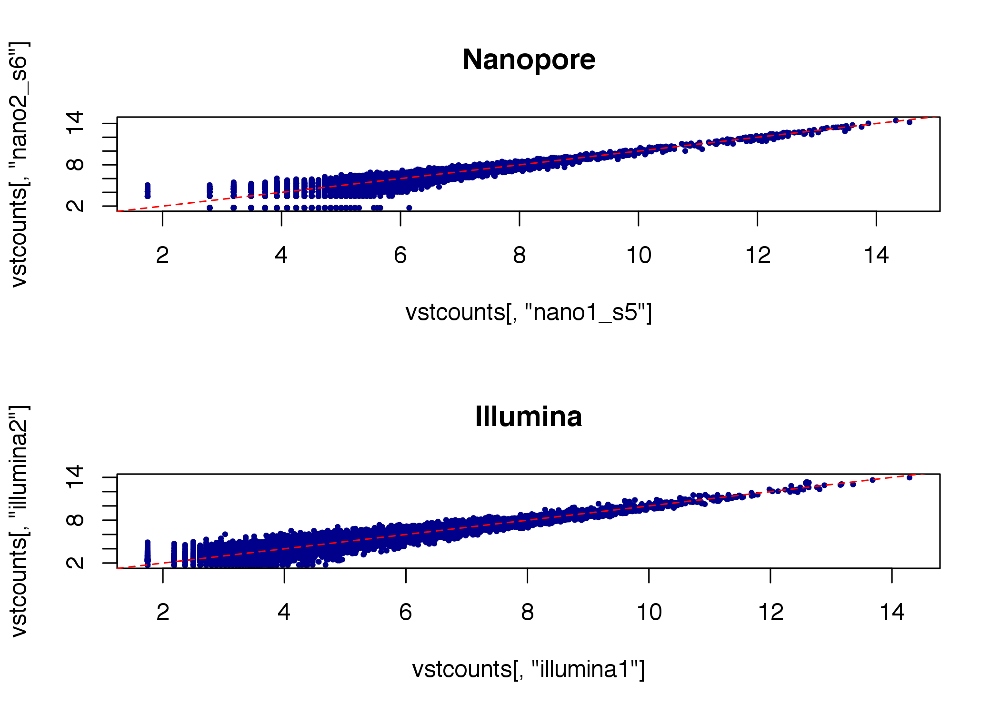

``` r
par(mfrow=c(1,1))
```

Now lets see the correlation between the illumina and nanopore reads.

``` r
illumina_median = apply(vstcounts[,human_conds == "illumina"],1,median)
nano_median = apply(vstcounts[,human_conds == "nano"],1,median)
plot(illumina_median,nano_median,cex=0.4,pch=19,col="darkblue")
abline(a=0,b=1,lty=2,col="red")
```

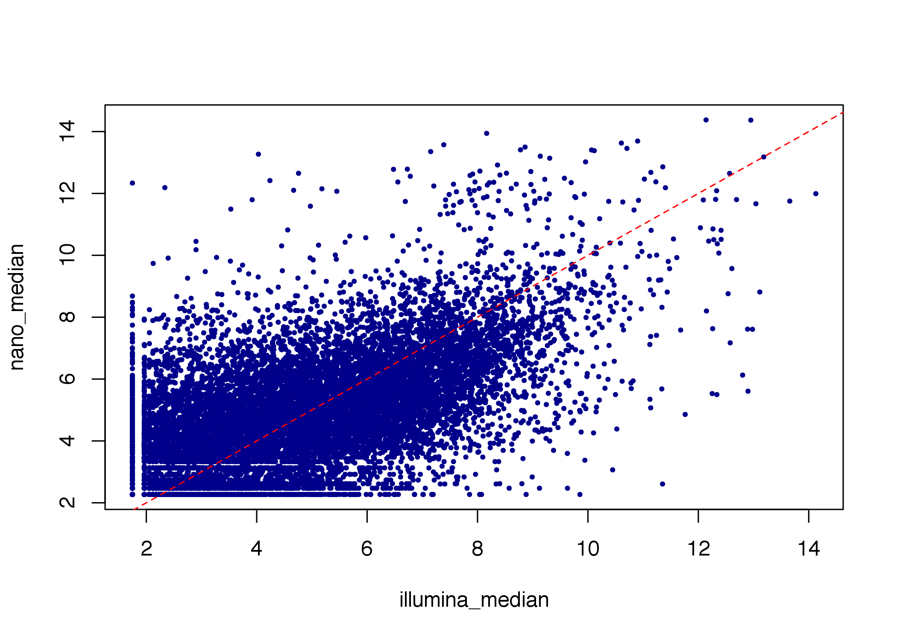

Now lets see explore the correlation and fit.

``` r
# work out pearson correlation
correlation=cor(illumina_median,nano_median)

# Replot
illumina_median = apply(vstcounts[,human_conds == "illumina"],1,median)
nano_median = apply(vstcounts[,human_conds == "nano"],1,median)
plot(illumina_median,nano_median,cex=0.4,pch=19,col="darkblue",main=paste("Cor:",correlation))
abline(a=0,b=1,lty=2,col="red")

# Fit a linear model
abline(lm(illumina_median ~ nano_median),col="orange",lwd=2)

# Fit a smooth spline model
lines(smooth.spline(illumina_median,nano_median),col="purple",lwd=2)
```

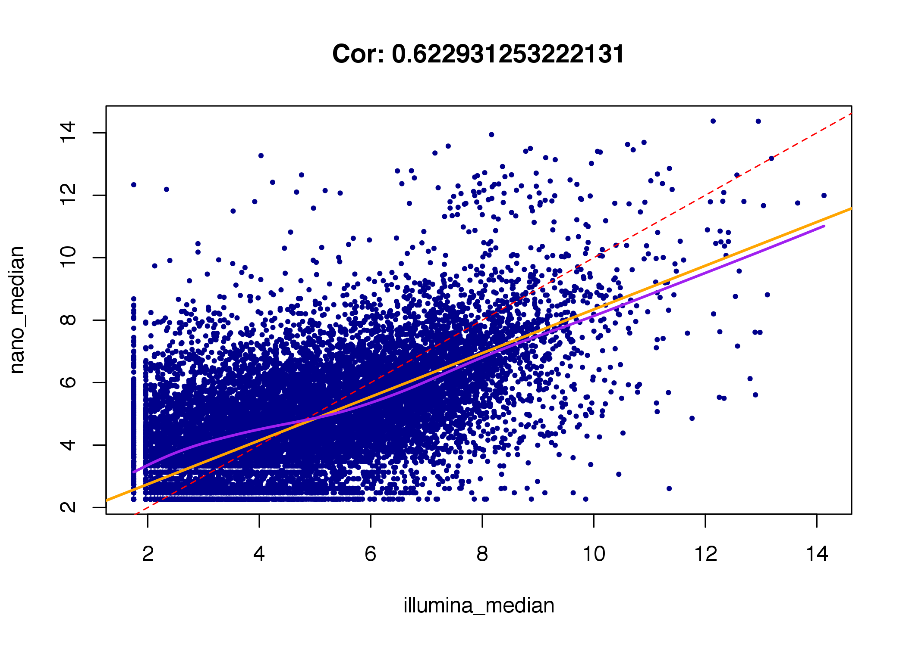

### Human Statistics

This is a pretty meaningless comparison as the samples are too different.

``` r
p_threshold=0.05
lfc_threshold=0.75

cds <- nbinomWaldTest(dds)

res=results(cds,contrast=c("genotype","illumina","nano"))
res <- res[order(res$padj),]
res
```

               ## log2 fold change (MAP): genotype illumina vs nano 
               ## Wald test p-value: genotype illumina vs nano 
               ## DataFrame with 13002 rows and 6 columns
               ##                  baseMean log2FoldChange     lfcSE       stat
               ##                 <numeric>      <numeric> <numeric>  <numeric>
               ## ENSG00000265681  4950.508      -9.829610 0.2667523  -36.84920
               ## ENSG00000124614  2736.892      -8.700058 0.2500591  -34.79201
               ## ENSG00000241343  2205.695      -7.806570 0.2369482  -32.94632
               ## ENSG00000140988  6188.184      -6.231663 0.1893163  -32.91668
               ## ENSG00000167996  3225.472      -8.196499 0.2529435  -32.40446
               ## ...                   ...            ...       ...        ...
               ## ENSG00000278594 0.5338718      -1.251646  2.043157 -0.6126040
               ## ENSG00000278677 0.5338718      -1.251646  2.043157 -0.6126040
               ## ENSG00000279718 0.5338718      -1.251646  2.043157 -0.6126040
               ## ENSG00000280893 0.4590192      -1.953745  2.034683 -0.9602209
               ## ENSG00000283016 0.5338718      -1.251646  2.043157 -0.6126040
               ##                        pvalue          padj
               ##                     <numeric>     <numeric>
               ## ENSG00000265681 3.011723e-297 3.710443e-293
               ## ENSG00000124614 3.212504e-265 1.978902e-261
               ## ENSG00000241343 4.776366e-238 1.961494e-234
               ## ENSG00000140988 1.268730e-237 3.907688e-234
               ## ENSG00000167996 2.374867e-230 5.851673e-227
               ## ...                       ...           ...
               ## ENSG00000278594     0.5401382            NA
               ## ENSG00000278677     0.5401382            NA
               ## ENSG00000279718     0.5401382            NA
               ## ENSG00000280893     0.3369440            NA
               ## ENSG00000283016     0.5401382            NA

``` r
sig = rownames(res[(abs(res$log2FoldChange) > lfc_threshold) & (res$padj < p_threshold) & !is.na(res$padj),])
```

Volcanoplot of results

``` r
plot(res$log2FoldChange,-log(res$padj,10),ylab="-log10(Adjusted P)",xlab="Log2 FoldChange",main=paste("Volcano Plot","sig. in red"),pch=19,cex=0.4)      
points(res[sig,"log2FoldChange"],-log(res[sig,"padj"],10),pch=19,cex=0.4,col="red")
text(res[sig[1:10],"log2FoldChange"],-log(res[sig[1:10],"padj"],10),pch=19,cex=0.4,pos=2,labels = rownames(res[sig[1:10],]))
abline(h=-log10(p_threshold),lty=3)
abline(v=-lfc_threshold,lty=3)
abline(v=lfc_threshold,lty=3)
```

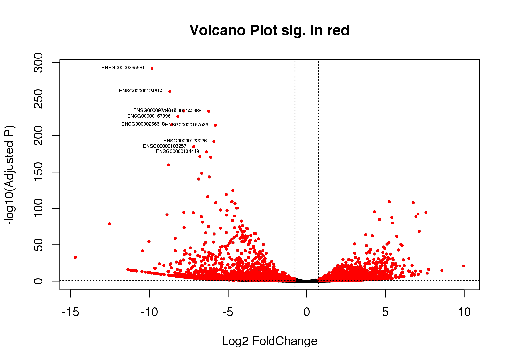
