# Nanopore Direct RNA sequencing analysis

Jack Monahan & Anton Enright, EMBL-EBI

27th June 2019


## Why and where to use dRNA-Seq

#### Cons

- Lower yield than cDNA seq => 500Mb to 1.5Gb per flowcell 
- Slighly higher error ~ 11%
- Requires a massive quantity of polyA+ RNA (or of a specific target)


#### Pros

- Library preparation much simpler, fewer steps => less biaised

- Longer reads than cDNA

  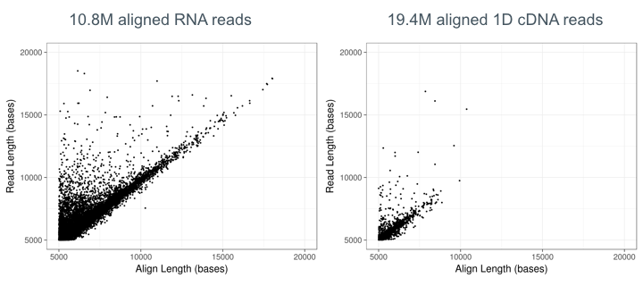 

- Better exon connectivity

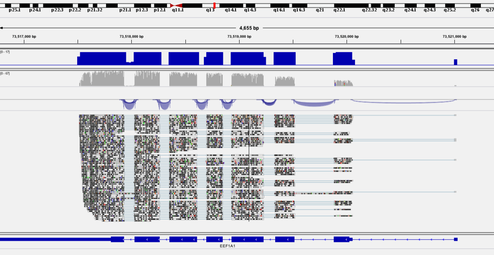

* PolyAs can be detected and measured (hopefully)

  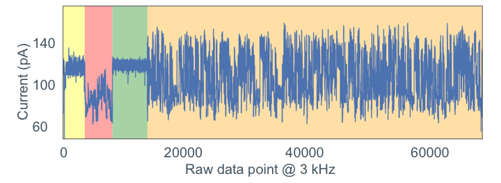

* (Some) RNA modifications can modify the signal

  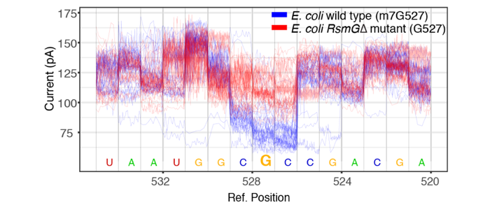

   


## ONT multiFast5/Fast5 file format

MINKnow generates files containing the raw intensity signal in [HDF5 format](https://support.hdfgroup.org/HDF5/). The latest Fast5 format contains multiple reads per file.

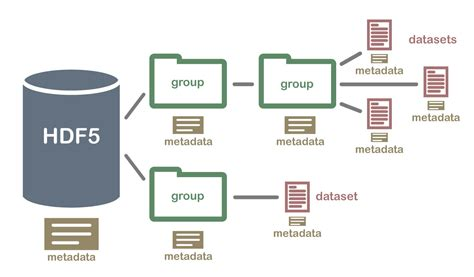


Files can be explored using **HDFview**

**Multifast5 containing raw data only**


**Example of raw signal**

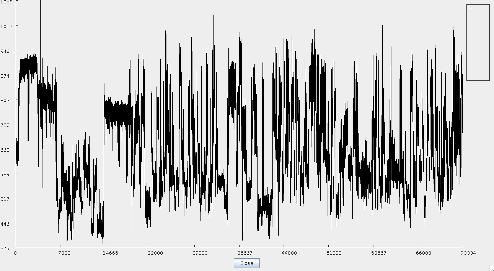

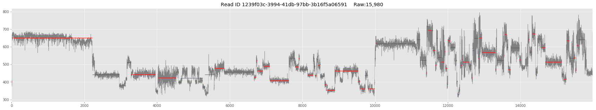

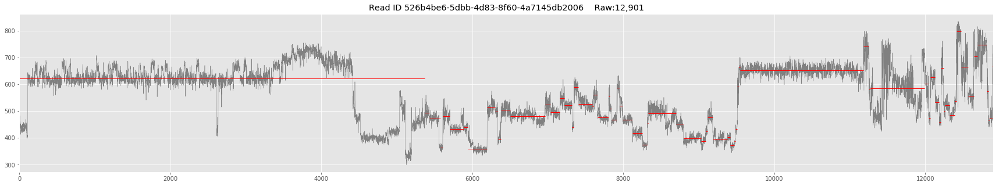

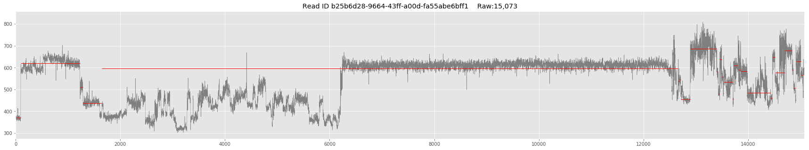


## Useful tools for dRNA-Seq ONT analysis

### Basecalling

* ~~Albacore~~ (development ceased)
* Guppy (available to ONT community) 
* [Scrappie](https://github.com/nanoporetech/scrappie)
* [Flappie](https://github.com/nanoporetech/flappie)  = Flip-flop basecaller, for DNA and cDNA
* [Chiron](https://github.com/haotianteng/chiron) = Community alternative

See basecaller comparison => https://github.com/rrwick/Basecalling-comparison

### Quality control

* [pycoQC](https://github.com/a-slide/pycoQC) = ONT data QC from sequencing summary file
* [NanoPack](https://github.com/wdecoster/nanopack) = Suite of tools to QC and process raw ONT data

### RNA alignment

* [**Minimap2** ](https://github.com/lh3/minimap2)
* [LAST](http://last.cbrc.jp)
* [Exonerate](https://www.ebi.ac.uk/about/vertebrate-genomics/software/exonerate)
* [STAR](https://github.com/alexdobin/STAR)

### Read Polishing

* [Nanopolish event align](https://nanopolish.readthedocs.io/en/latest/)
* [Tombo resquiggle](https://nanoporetech.github.io/tombo/)

### DNA/RNA modification detection
* Nanopolish
* [Tombo detect_modifications](https://nanoporetech.github.io/tombo/)
* [Nanopolish call-methylation](https://nanopolish.readthedocs.io/en/latest/quickstart_call_methylation.html)

# Sample QC

Poly-A+ selection: `RNA was extracted using TRIzol reagent and poly-A+ RNA was isolated from 50ug of total RNA using Dynabeads Oligo(dT)25.`

The eluted poly-A+ RNA concentration was quantified by Qubit and RNA quality was assessed with the TapeStation System.

The RNA Integrity Number (RIN), a quality measurement from Agilent, is presented as a value between 1 and 10, where 10 represent the highest quality RNA sample.

| Sample # | Name | Type | Concentration (ng/uL) |        RIN        |
|:--------:|------|------|:---------------------:|:-----------------:|
|     1    |  C1  |  wt  |          1961         |        8.6        |
|     2    |  C3  |  wt  |          2100         |        8.8        |
|     3    |  C7  |  wt  |          2026         |        8.2        |
|     5    |  C8  |  scr |          1400         | TapeStation error |
|     6    |  C18 |  scr |          1800         |        8.3        |
|     7    |  C29 |  scr |          2000         |        7.8        |

  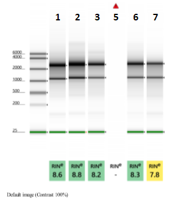 

The TapeStation Software can display the results as electropherogram images to visualise the gel bands.

- Sample 2 (RIN = 8.8):

  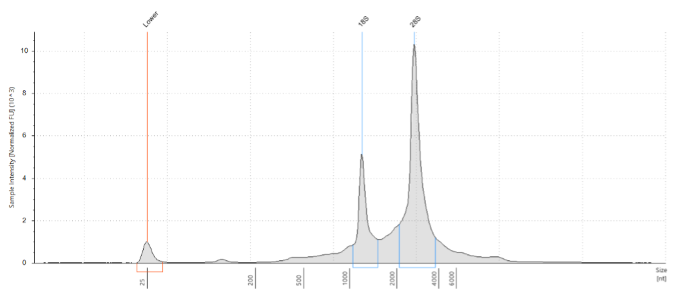 

- Sample 7 (RIN = 7.8) - note the lower 28S:18S ratio:

  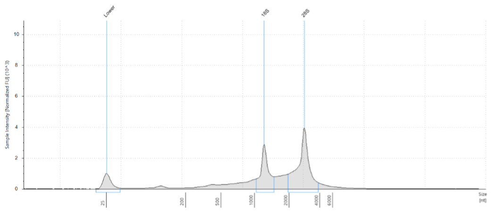 

Overall (apart from Sample 5 which just requires another TapeStation run), our RNA samples have not been degraded and can proceed to library preparation.

# Mini-Practical

1. Get your data !

   ```bash
   cd ~/Desktop/course_data/nanopore_dRNA_Seq/datasets/
   ```

   ```
   tar xvf ${Sample}.tar.gz
   ```

2. Inspect reads with the HDFView GUI

   ```
   cd ~/Desktop/course_data/nanopore_dRNA_Seq/datasets/
   ```

   ```bash
   hdfview
   ```

     

3. Basecall your data with Albacore

   ```bash
   cd ~/Desktop/course_data/nanopore_dRNA_Seq/
  
   ```

   ```bash
   ./ont-guppy-cpu/bin/guppy_basecaller --help
   
   ./ont-guppy-cpu/bin/guppy_basecaller --print_workflows
   
   ./ont-guppy-cpu/bin/guppy_basecaller -i wt1 -s wt1_basecalls --flowcell FLO-MIN106 --kit SQK-RNA002 -q 0 --enable_trimming true --trim_strategy rna --reverse_sequence true --pt_scaling --qscore_filtering 0
   
   ./ont-guppy-cpu/bin/guppy_basecaller -i wt1 -s scr1_basecalls --flowcell FLO-MIN106 --kit SQK-RNA002 -q 0 --enable_trimming true --trim_strategy rna --reverse_sequence true --pt_scaling --qscore_filtering 0
   
   ```

   *Flowcell and Kit information can be found in the fast5 files*

   *With your sample data it should take around 10 mins*
   


4. QC the basecalled files with pycoQC

   https://github.com/a-slide/pycoQC

   ```bash
   pycoQC -f guppy/${Sample}/sequencing_summary.txt -o ${Sample}.pycoQC.html
   ```
   

5. Align reads against the transcriptome or the genome with Minimap2

   https://github.com/lh3/minimap2

   Merge reads
   
   ```bash
   cat guppy/${Sample}/pass/*.fastq > ${Sample}.fastq
   ```

   *Spliced alignment against genome*
   
   ```bash
   minimap2 -ax splice -uf -k 14 -L -t 8 ../references/Mus_musculus_genome.fa.gz ${Sample}.fastq | samtools view -bh -F 2308 | samtools sort -o reads.bam
   ```

    *Unspliced alignment against transcriptome*

   ```bash
   minimap2 -ax map-ont -L -t 8 ../references/Mus_musculus_transcriptome.fa.gz ${Sample}.fastq | samtools view -bh -F 2308 | samtools sort -o transcriptome.bam
   ```

   

6. Visualise genome-aligned reads with IGV

   https://software.broadinstitute.org/software/igv/download

   *Index reads first for visualization*

   ```bash
   samtools index reads.bam
   ```

7. Generate transcript counts with Salmon

   ```bash
   salmon quant --noErrorModel -p 4 -t ../references/Mus_musculus_transcriptome.fa.gz -l U -a transcriptome.bam  -o salmon/$Sample
   ```

8. Inspect transcript counts

   ```bash
   less salmon/$Sample/quant.sf
   ```


