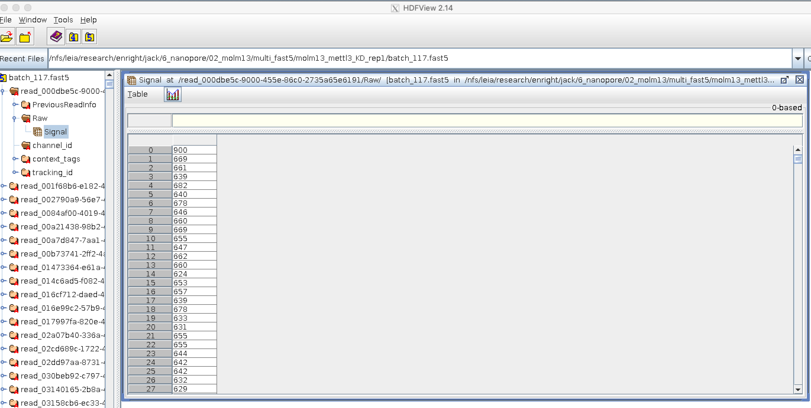

# Nanopore Direct RNA sequencing analysis

Jack Monahan & Adrien Leger, EMBL-EBI

26th June 2019


## Why and where to use dRNA-Seq

#### Cons

- Lower yield than cDNA seq => 500Mb to 1.5Gb per flowcell 
- Slighly higher error ~ 11%
- Requires a massive quantity of polyA+ RNA (or of a specific target)


#### Pros

- Library preparation much simpler, fewer steps => less biaised

- Longer reads than cDNA

   

- Better exons connectivity


* PolyAs can be detected and measured (hopefully)

  

* (Some) RNA modifications can modify the signal

  

   


## ONT multiFast5/Fast5 file format

MINKnow generates files containing the raw intensity signal in [HDF5 format](https://support.hdfgroup.org/HDF5/). Each read is contained in a single file.


Files can be explored using **HDFview**

**Multifast5 containing raw data only**




**Example of raw signal**


## Useful tools for dRNA-Seq ONT analysis

### Basecalling

* Albacore (available to ONT community, development ceased)
* Guppy (available to ONT community) 
* [Scrappie](https://github.com/nanoporetech/scrappie)
* [Flappie](https://github.com/nanoporetech/flappie)  = Flip-flop basecaller, for DNA and cDNA
* [Chiron](https://github.com/haotianteng/chiron) = Community alternative

See basecaller comparison => https://github.com/rrwick/Basecalling-comparison

### Quality control

* [pycoQC](https://github.com/a-slide/pycoQC) = ONT data QC from sequencing summary file
* [NanoPack](https://github.com/wdecoster/nanopack) = Suite of tools to QC and process raw ONT data

### RNA alignment

* [**Minimap2** ](https://github.com/lh3/minimap2)
* [LAST](http://last.cbrc.jp)
* [STAR](https://github.com/alexdobin/STAR)

### Read Polishing

* [Nanopolish event align](https://nanopolish.readthedocs.io/en/latest/)
* [Tombo resquiggle](https://nanoporetech.github.io/tombo/)

### DNA/RNA modification detection

* [Tombo detect_modifications](https://nanoporetech.github.io/tombo/)
* [Nanopolish call-methylation](https://nanopolish.readthedocs.io/en/latest/quickstart_call_methylation.html)


# Mini-Practical

1. Get you data !

   ```bash
   cd ~/Desktop/course_data/nanopore_dRNA_Seq/datasets/
   ```

   ```
   tar xvf {YOUR-SAMPLE}.tar.gz
   ```

   Your samples are derived from mouse X, you'll need to download the reference transcriptome and genomes first 

   ```
   cd ~/Desktop/course_data/nanopore_dRNA_Seq/references/
   ```

   ```bash
   wget ftp://ftp.ebi.ac.uk/pub/databases/gencode/Gencode_mouse/release_21/gencode.vM21.transcripts.fa.gz -o Mus_musculus_transcriptome.fa.gz 
   ```

   ```bash
   wget ftp://ftp.ebi.ac.uk/pub/databases/gencode/Gencode_mouse/release_M21/GRCm38.primary_assembly.genome.fa.gz -o Mus_musculus_genome.fa.gz
   ```

   

2. Inspect reads with the HDFView GUI

   ```
   cd ~/Desktop/course_data/nanopore_dRNA_Seq/datasets/
   ```

   ```bash
   hdfview
   ```

     

3. Basecall your data with Albacore

   ```bash
   cd ~/Desktop/course_data/nanopore_dRNA_Seq/analyses/
   ```

   ```bash
   guppy_basecaller --help
   
   guppy_basecaller --print_workflows
   
   guppy_basecaller --num_callers 2 --flowcell ${FLOWCELL} --kit ${KIT} --reverse_sequence true --qscore_filtering 0 -q 0 --enable_trimming true -i ../datasets/{YOUR-SAMPLE} -s guppy/{YOUR-SAMPLE}
   ```

   *Flowcell and Kit information can be found in the fast5 files*

   *With your sample data it should take around 10 mins*
   


4. QC the basecalled files with pycoQC

   https://github.com/a-slide/pycoQC

   * Install Nanopack first

   ```bash
   pip3 install pycoQC --user
   ```

   ```bash
   pycoQC -f guppy/{YOUR-SAMPLE}/sequencing_summary.txt -o {YOUR-SAMPLE}.pycoQC.html
   ```
   

5. Align reads against the transcriptome or the genome with Minimap2

   https://github.com/lh3/minimap2

   Merge reads
   ```bash
   cat guppy/{YOUR-SAMPLE}/pass/*.fastq > {YOUR-SAMPLE}.fastq
   ```

   *Spliced alignment against genome*
   ```bash
   minimap2 -ax splice -uf -k 14 -L -t 8 ../references/Mus_musculus_genome.fa.gz {YOUR-SAMPLE}.fastq | samtools view -bh -F 2308 | samtools sort -o transcipts.bam
   ```

    *Unspliced alignment against transcriptome*

   ```bash
   minimap2 -ax map-ont -L -t 8 ../references/Mus_musculus_transcriptome.fa.gz {YOUR-SAMPLE}.fastq | samtools view -bh -F 2308 | samtools sort -o reads.bam
   ```

   

6. Visualise aligned reads with IGV

   https://software.broadinstitute.org/software/igv/download

   *Index reads first for visualization*

   ```bash
   samtools index reads.bam
   ```

   
