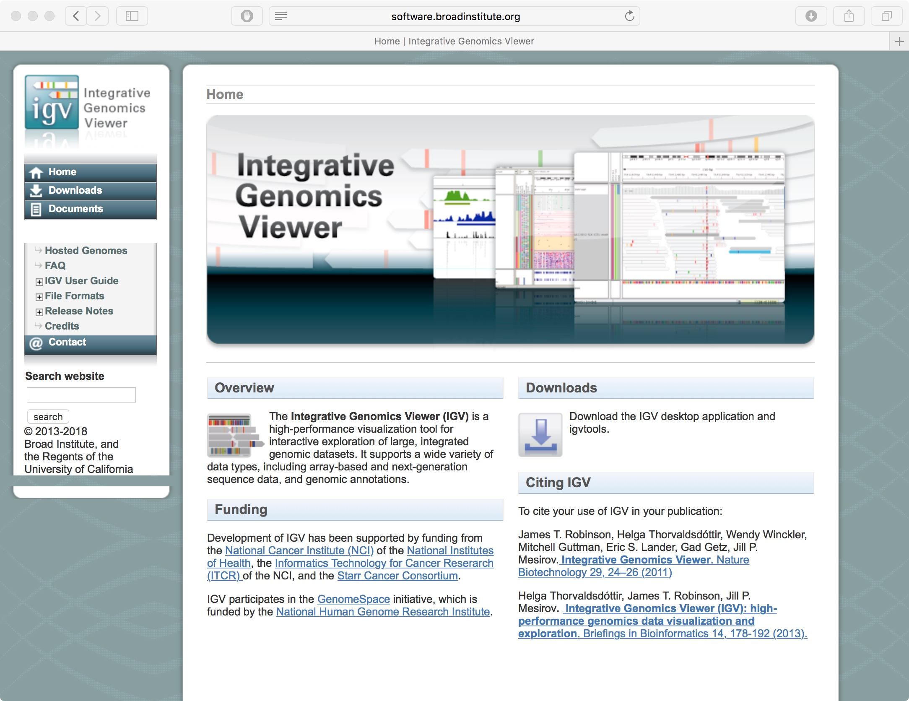

# Nanopore Direct RNA IGV Browsing

Anton Enright, Jack Monahan & Adrien Leger
Universty of Cambridge & EMBL-EBI

27th June 2018

## About IGV

The Integrative Genomics Viewer (IGV) is a high-performance visualization tool for interactive exploration of large, integrated genomic datasets. It supports a wide variety of data types, including array-based and next-generation sequence data, and genomic annotations.

It's from the Broad Institute and the website is [here](https://software.broadinstitute.org/software/igv/)

### Pros

- Simple and fast to use
- Freely available
- Well supported
   

### Using IGV

We need a few things to use IGV

- BAM files *.bam* of our mapped reads (sorted), this is produced by minimap2 and samtools
- BAM Index files *.bai*, these are rapid index files to load the BAMs efficiently
- Tiled Data Files *.tdf*, these are precomputed coverage profiles, genome wide

We can generate the BAI and TDF files using IGV tools directly within IGV

For this dataset we have made the following files:

sample|file|type
------|----|----
S1|S1_combined_results.genome.bam| BAM Mappings from minimap2
S1|S1_combined_results.genome.bam.bai| BAM INDEX
S1|S1_combined_results.genome.bam.tdf| Tiled Data File
S2|S2_combined_results.genome.bam| BAM Mappings from minimap2
S2|S2_combined_results.genome.bam.bai| BAM INDEX
S2|S2_combined_results.genome.bam.tdf| Tiled Data File
S3|S3_combined_results.genome.bam| BAM Mappings from minimap2
S3|S3_combined_results.genome.bam.bai| BAM INDEX
S3|S3_combined_results.genome.bam.tdf| Tiled Data File
S4|S4_combined_results.genome.bam| BAM Mappings from minimap2
S4|S4_combined_results.genome.bam.bai| BAM INDEX
S4|S4_combined_results.genome.bam.tdf| Tiled Data File
S5|S5_combined_results.genome.bam| BAM Mappings from minimap2
S5|S5_combined_results.genome.bam.bai| BAM INDEX
S5|S5_combined_results.genome.bam.tdf| Tiled Data File
S6|S6_combined_results.genome.bam| BAM Mappings from minimap2
S6|S6_combined_results.genome.bam.bai| BAM INDEX
S6|S6_combined_results.genome.bam.tdf| Tiled Data File

   
## Starting IGV

To launch IGV use the following Link to launch Java with 2Gb Memory
 - [http://data.broadinstitute.org/igv/projects/2.4/igv24_lm.jnlp](http://data.broadinstitute.org/igv/projects/2.4/igv24_lm.jnlp)
 
On a Macintosh or Windows, you may have to play with Java security settings to get it to launch correctly, or you can download a local version.
 
## Reference Genome

As reads are mapped to a known reference:
  -*GSM552910*, Saccharomyces cerevisea (Ensembl)
  -*hg38* Homo Sapiens (Ensembl)
  
You need to ensure the correct genome is selected when using IGV. You can load your own genomes and gene models directly into the program.
