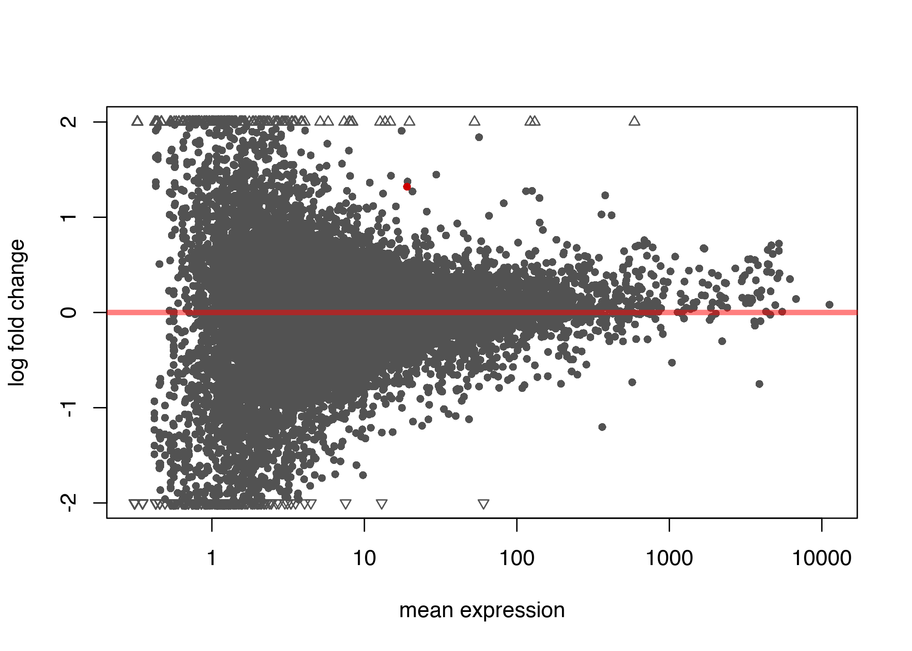
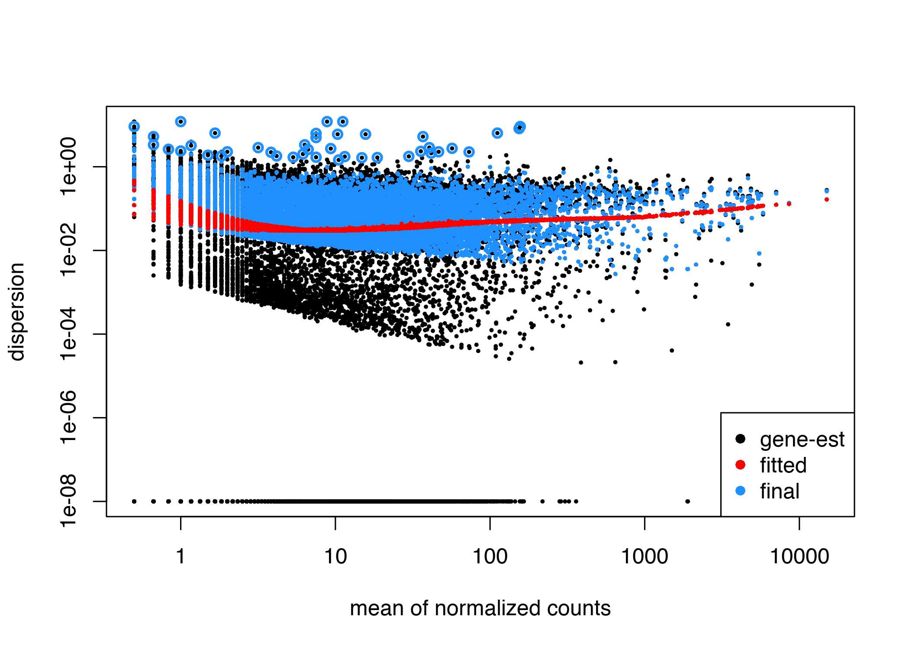

Nanopore Direct RNA Seq - Practical 2
================
Anton Enright & Jack Monahan

27 June, 2019

# Analysis of Nanopore Direct RNA counts

First we should change directory to where the data is

``` r
setwd("~/Desktop/course_data/nanopore_dRNA_Seq")
```

# Direct RNA Seq Discussion

We have 6 mouse datasets, with 3 wildtypes and 3 scrambled

We want to look for any differential gene expression (DGE) and
differential transcript usage (DTU) between them.

## Preparation

We first load the R/BioConductor libraries that we need.

``` r
suppressMessages(library(ggplot2)) # for plotting
suppressMessages(library(gplots)) # for plotting
suppressMessages(library(dplyr))
suppressMessages(library(tidyr))

suppressMessages(library(RColorBrewer))

suppressMessages(library(GenomicFeatures)) #to create txdb from gtf

suppressMessages(library(tximport)) #import salmon counts
suppressMessages(library(readr)) #speeds up tximport

suppressMessages(library(DRIMSeq)) #for DTU
suppressMessages(library(DEXSeq)) #for DTU
suppressMessages(library(stageR)) #for DTU

suppressMessages(library(DESeq2)) #for DGE
```

Modified from
<https://github.com/nanoporetech/pipeline-transcriptome-de> &

<https://f1000research.com/articles/7-952/v3>

``` r
colData = read.delim("pdata.txt", stringsAsFactors = F)
colData$condition = as.factor(colData$condition)
rownames(colData) = colData$sample_id
samples = colData$sample_id
conds = colData$condition

# Transcript counts from Salmon
nanopore_counts = read.table("nanopore_drna_counts.txt", row.names = 1,header= TRUE)

#Transcript annotation
annotation_file = "references/mm10.96.gtf"
#trans2gene = read.table("references/mm10.96.transcripts2genes.txt", header =F)

hmcol = colorRampPalette(brewer.pal(9, "GnBu"))(100)
cond_colours = brewer.pal(length(levels(conds)),"Set2")[conds]
names(cond_colours)=conds
```

# Make txdb from gencode transcript annotation gtf

``` r
txdb = makeTxDbFromGFF(annotation_file, dataSource="Ensembl")
saveDb(txdb, "references/mm10.96.annotation.sqlite")
```

# Load txdb and generate Ensembl transcript id to gene id table

``` r
txdb = loadDb("references/mm10.96.annotation.sqlite")
cols = c("TXNAME", "GENEID")
tx2gene = select(txdb, keys(txdb,"TXNAME"), columns=cols, keytype="TXNAME")
```

``` r
#Strip version numbers from transcript ids
tx2gene$TXNAME = sapply(strsplit(tx2gene$TXNAME, ".", fixed = T), "[[", 1)
#Strip version numbers from gene ids
tx2gene$GENEID = sapply(strsplit(tx2gene$GENEID, ".", fixed = T), "[[", 1)

enolase_ids  = c("ENSMUSG00000004267","ENSMUSG00000048029","ENSMUSG00000060600","ENSMUSG00000063524")
#Remove Enolase
tx2gene = tx2gene[!(tx2gene$GENEID %in% enolase_ids),]
```

## Filter transcripts
``` r
#Filter out unexpressed transcripts
keep_feature = rowSums(nanopore_counts) > 0
transcript_counts = nanopore_counts[keep_feature,]
transcript_counts = as.data.frame(transcript_counts)

#Filter transcript counts with DRIMSeq
#Make data.frame with the gene ID, the feature (transcript) ID, and then columns for each of the samples
transcript_counts$TXNAME = rownames(transcript_counts)
transcript_counts = merge(tx2gene, transcript_counts, by = "TXNAME")
colnames(transcript_counts)[c(1,2)] = c("feature_id","gene_id")

d = dmDSdata(counts=transcript_counts, samples=colData)
counts_unfiltered = counts(d)

# DRIMSeq filter parameters
min_samps_gene_expr = 2 # or 3 normally
min_samps_feature_expr = 1
min_gene_expr = 10 
min_feature_expr =  3

d = dmFilter(d, min_samps_gene_expr = min_samps_gene_expr, min_samps_feature_expr = min_samps_feature_expr, min_gene_expr = min_gene_expr, min_feature_expr = min_feature_expr)
counts_filtered = counts(d)
```
# Sample QC

``` r
#Get gene counts from transcript counts using gather function from tidyr
gene_counts = counts_unfiltered %>% dplyr::select(c(1, 3:ncol(counts_unfiltered)))  %>% group_by(gene_id) %>% summarise_all(list(sum)) %>% data.frame()

#Set the gene id as the rowname
rownames(gene_counts) = gene_counts$gene_id
gene_counts$gene_id = NULL
gene_counts = as.matrix(gene_counts)

#Filter out unexpressed genes
keep_feature = rowSums(gene_counts) > 0
gene_counts = gene_counts[keep_feature,]

#DESeq2 dds object from matrix of gene counts
dds = DESeqDataSetFromMatrix(gene_counts, colData = colData, design = ~condition)

#Filter out unexpressed genes
keep_feature = rowSums(counts(dds)) > 0
dds = dds[keep_feature,]

#Normal DESeq2 DGE analysis from here...

#Normalisation
dds = estimateSizeFactors(dds)
dds = estimateDispersions(dds)

```

## Sample QC
``` r
#Dispersion plot
plotDispEsts(dds,main='Dispersion Plot')

vsd = varianceStabilizingTransformation(dds)
vstMat = assay(vsd)

#Heat map
heatmap.2(cor(assay(vsd)),trace='none',main='Sample Correlation Variance Stabilised',col=hmcol,cexRow=0.6,cexCol=0.6)

#PCA
pca = prcomp(t(vstMat))

pca.df = pca$x
# Percentage explained by each component
percentages <- round(pca$sdev^2 / sum(pca$sdev^2) * 100)[1:3]
percentages <- paste(paste0(colnames(pca.df), ":"),  paste0(as.character(percentages), "%"), "variance", sep=" ")
pca.df = data.frame(pca.df, Condition = dds$condition, Sample = colnames(dds))

#Plot PCA
#1 vs. 2
ggplot(pca.df,aes(x=PC1,y=PC2, colour = Condition, label = Sample)) + geom_point(size = 4) +
        geom_text(aes(label=Sample),hjust=0, vjust=0) +
        theme_minimal() +
        theme(legend.position="bottom",  legend.box = "vertical") +
        xlab(percentages[1]) + ylab(percentages[2])
#1 vs. 3
ggplot(pca.df,aes(x=PC1,y=PC3, colour = Condition, label = Sample)) + geom_point(size = 4) +
        geom_text(aes(label=Sample),hjust=0, vjust=0) +
        theme_minimal() +
        theme(legend.position="bottom",  legend.box = "vertical") +
        xlab(percentages[1]) + ylab(percentages[2])
```

# wt3 & scr2 look like outliers, these 2 samples had the lowest counts.
# Remove these from the nanopore_counts and repeat the analysis.

``` r
#Remove dodgy samples wt3 & scr2
#nanopore_counts = nanopore_counts[,-c(3,5)]

```

# Analysis of Differential Transcript Usage

## DEXSeq (for differential exon usage)
``` r
design = model.matrix(~condition, data=DRIMSeq::samples(d))

sample.data = DRIMSeq::samples(d)
trans_counts.data = round(as.matrix(counts_filtered[,-c(1:2)]))
dxd = DEXSeqDataSet(countData=trans_counts.data, sampleData=sample.data, design= ~sample + exon + condition:exon, featureID=counts(d)$feature_id, groupID=counts(d)$gene_id)
```

``` r
dxd = estimateSizeFactors(dxd)
dxd = estimateDispersions(dxd)
#dxd = estimateDispersions(dxd, fitType='local')

#Test for differential exon usage
dxd = testForDEU(dxd, reducedModel=~sample + exon)
dxd = estimateExonFoldChanges( dxd, fitExpToVar="condition")

```

``` r
dxr = DEXSeqResults(dxd, independentFiltering=FALSE)

plotMA(dxr, cex=0.8, alpha=0.05) 
```

<!-- -->

``` r
plotDispEsts(dxd)
```

<!-- -->

## stageR analysis on differential transcript usage results
### stage-wise method for controlling the gene-level false discovery rate in differential transcript usage
``` r

qval = perGeneQValue(dxr) 
dxr.g = data.frame(gene=names(qval), qval)
dxr.g = dxr.g[order(dxr.g$qval),]

dxr = as.data.frame(dxr[,c("featureID", "groupID", "pvalue")])
dxr = dxr[order(dxr$pvalue),]

write.table(dxr.g, file="analyses/results_dtu_gene.txt", sep="\t", quote = F)
write.table(dxr, file="analyses/results_dtu_transcript.txt", sep="\t", quote = F)

# stageR analysis on differential transcript usage results
pConfirmation = matrix(dxr$pvalue, ncol=1)
dimnames(pConfirmation) = list(dxr$featureID, "transcript")
pScreen = qval
tx2gene = as.data.frame(dxr[,c("featureID", "groupID")])

stageRObj = stageRTx(pScreen=pScreen, pConfirmation=pConfirmation, pScreenAdjusted=TRUE, tx2gene=tx2gene)
# note: the choice of 0.05 here means you can *only* threshold at 5% overall false discovery rate (OFDR) later
stageRObj = stageWiseAdjustment(stageRObj, method="dtu", alpha=0.05)
suppressWarnings({dex.padj = getAdjustedPValues(stageRObj, order=FALSE, onlySignificantGenes=FALSE)})

write.table(dex.padj, file="analyses/results_dtu_stageR.txt", sep="\t", quote = F)
```

## Plot DTU
``` r
# stageR results:
stageR = dex.padj
names(stageR) = c("gene_id", "transcript_id", "p_transcript", "p_gene")

# Read filtered counts:
counts = counts_filtered
names(counts)[2] = "transcript_id"

# Join counts and stageR results:
df = merge(counts, stageR, by = c("gene_id", "transcript_id"))
df = df[order(df$p_gene),]

#Drop columns
scols = setdiff(names(df),c("gene_id", "transcript_id", "p_gene", "p_transcript"))

# Normalise counts by the library size (i.e. the total counts per sample)
for(sc in scols){
    df[sc] = df[sc] / sum(df[sc])
}

# Melt data frame:
tdf = df %>% gather(key='sample', value='norm_count',-gene_id, -transcript_id, -p_gene, -p_transcript)

# Add sample group column:
sampleToGroup = function(x){
    return(colData[x,]$condition)
}

tdf$group = sampleToGroup(tdf$sample)

# Filter for significant genes:
sig_level = 0.05
genes = as.character(tdf[which(tdf$p_gene < sig_level),]$gene_id)
genes = unique(genes)

pdf("analyses/dtu_plots.pdf")

for(gene in genes){
    gdf = tdf[which(tdf$gene_id==gene),]
    p_gene = unique(gdf$p_gene)
    p = ggplot(gdf, aes(x=transcript_id, y=norm_count)) + geom_bar(stat="identity", aes(fill=sample), position="dodge")
    p = p + facet_wrap(~ group) + coord_flip()
    p = p + ggtitle(paste(gene," : p_value=", p_gene, sep=""))
    print(p)
}

dev.off()
```

# Analysis of Differential Gene Expression

``` r
#Get gene counts from transcript counts using gather function from tidyr
gene_counts = counts_unfiltered %>% dplyr::select(c(1, 3:ncol(counts_unfiltered)))  %>% group_by(gene_id) %>% summarise_all(list(sum)) %>% data.frame()
```

``` r
#Set the gene id a s the rowname
rownames(gene_counts) = gene_counts$gene_id
gene_counts$gene_id = NULL
gene_counts = as.matrix(gene_counts)

#Filter out unexpressed genes
keep_feature = rowSums(gene_counts) > 0
gene_counts = gene_counts[keep_feature,]

#DESeq2 dds object from matrix of gene counts
dds = DESeqDataSetFromMatrix(gene_counts, colData = colData, design = ~condition)

#Filter out unexpressed genes
keep_feature = rowSums(counts(dds)) > 0
dds = dds[keep_feature,]

#Normal DESeq2 DGE analysis from here...

#Normalisation
dds = estimateSizeFactors(dds)
dds = estimateDispersions(dds)

```

## Sample QC
``` r
#Dispersion plot
plotDispEsts(dds,main='Dispersion Plot')

vsd = varianceStabilizingTransformation(dds)
vstMat = assay(vsd)

#Heat map
heatmap.2(cor(assay(vsd)),trace='none',main='Sample Correlation Variance Stabilised',col=hmcol,cexRow=0.6,cexCol=0.6)

#PCA
pca = prcomp(t(vstMat))

pca.df = pca$x
# Percentage explained by each component
percentages <- round(pca$sdev^2 / sum(pca$sdev^2) * 100)[1:3]
percentages <- paste(paste0(colnames(pca.df), ":"),  paste0(as.character(percentages), "%"), "variance", sep=" ")
pca.df = data.frame(pca.df, Condition = dds$condition, Sample = colnames(dds))

#Plot PCA
#1 vs. 2
ggplot(pca.df,aes(x=PC1,y=PC2, colour = Condition, label = Sample)) + geom_point(size = 4) +
        geom_text(aes(label=Sample),hjust=0, vjust=0) +
        theme_minimal() +
        theme(legend.position="bottom",  legend.box = "vertical") +
        xlab(percentages[1]) + ylab(percentages[2])
#1 vs. 3
ggplot(pca.df,aes(x=PC1,y=PC3, colour = Condition, label = Sample)) + geom_point(size = 4) +
        geom_text(aes(label=Sample),hjust=0, vjust=0) +
        theme_minimal() +
        theme(legend.position="bottom",  legend.box = "vertical") +
        xlab(percentages[1]) + ylab(percentages[2])
```

``` r

exprs = t(vstMat)
exprs = as.data.frame(exprs)
exprs$condition = dds$condition
exprs$sample= colnames(dds)

#Boxplot of Hoxc6 expression
#Hoxc6 = ENSMUSG00000001661
ggplot(exprs, aes(x = sample, y =  ENSMUSG00000001661, fill = condition)) +
        geom_boxplot() +
        xlab("Condition") +
        ylab("Hoxc6 Expression (VST)") 

```
## Differentially Expressed Genes
``` r

# New Negative Binomial test
dds = nbinomWaldTest(dds)

logfc.threshold = log2(2)

#Differential Gene Expression
res = DESeq2::results(dds, contrast=c('condition', 'wt', 'scr'))
res = as.data.frame(res)
#Remove rows with NA values i.e. those that are 'incomplete'
res = res[complete.cases(res),] 
res = res[order(-res$log2FoldChange),]
res$Diff.Exprs = ifelse(res$padj <= 0.05 & res$log2FoldChange >=logfc.threshold, "Control+", ifelse(res$padj <= 0.05 & res$log2FoldChange <= -logfc.threshold, "Scramble+", "unchanged"))


#Significant genes
sig = res[res$padj <= 0.05,]
sig$Diff.Exprs = ifelse(sig$log2FoldChange >= logfc.threshold, "Control+", ifelse(sig$log2FoldChange <= -logfc.threshold, "Scramble+", "unchanged"))

#Significantly differentially expressed genes
sig.de = sig[sig$Diff.Exprs != "unchanged",]

print(sig.de)

res$gene_id = rownames(res)
write.table(res,  file = "differential_expression.deseq2.txt", quote = F, row.names = F )

```

## Volcano Plot
``` r

ggplot(res, aes(log2FoldChange, -log10(padj))) +
	geom_point(aes(col=Diff.Exprs)) +
	scale_color_manual(limits = c("Scramble+","unchanged","Control+"), labels = c("Scrambled", "unchanged", "Control"), values=c("red","grey", "blue"), guide_legend(title="Differential\nExpression")) + 
	geom_hline(yintercept = -log(0.05,10), linetype = 2, size = 1) +
	geom_vline(xintercept = c(-(logfc.threshold),logfc.threshold), linetype = 2, size = 1) +
	theme_classic()

```

